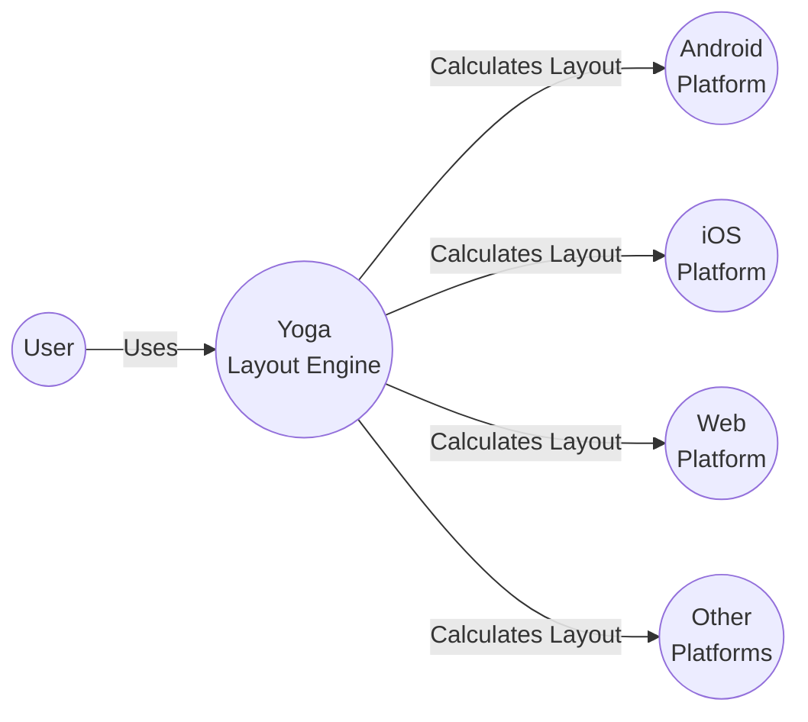
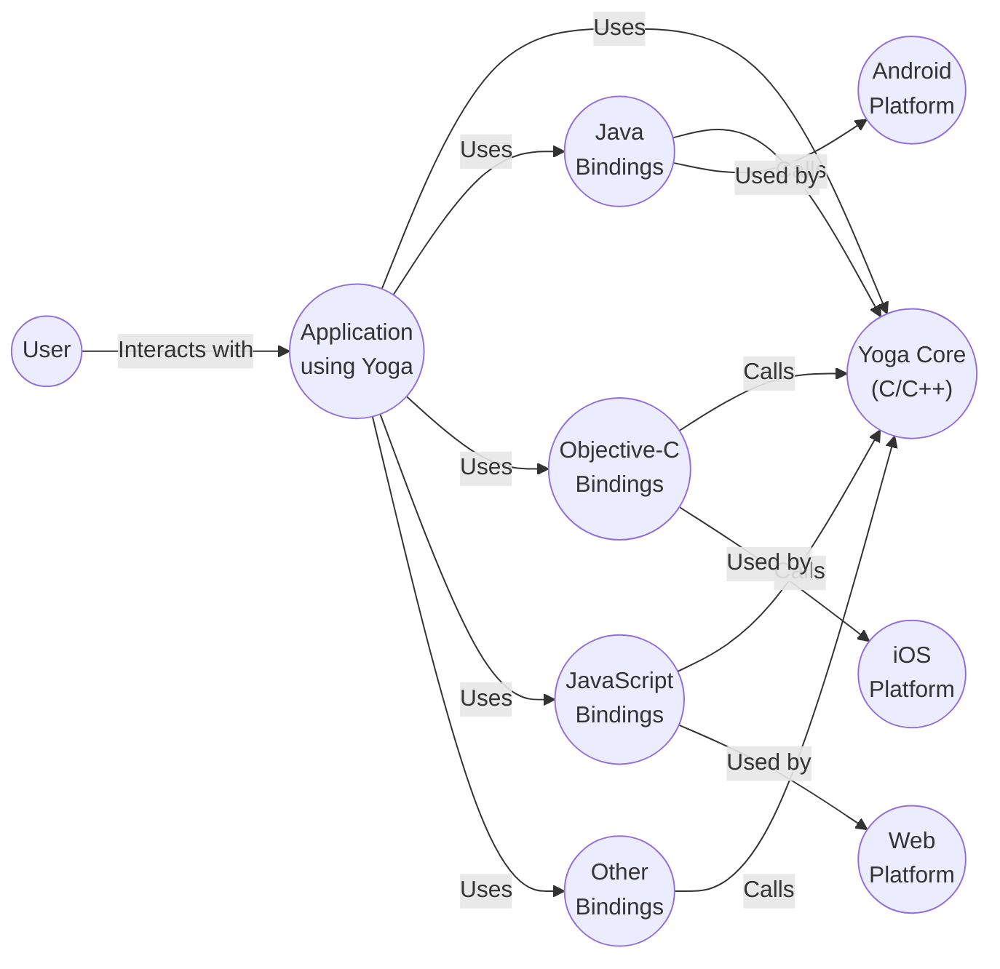
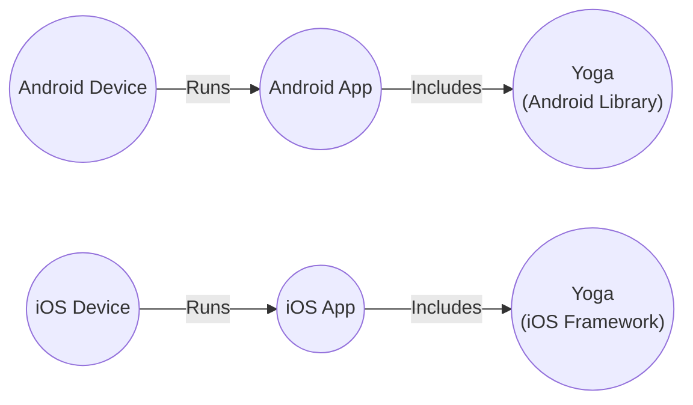
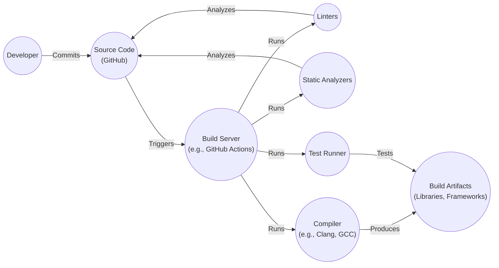

# BUSINESS POSTURE

Business Priorities and Goals:

*   Provide a cross-platform layout engine that simplifies UI development across different platforms (Android, iOS, Web, etc.).
*   Enable developers to create consistent and predictable layouts regardless of the underlying platform.
*   Offer a flexible and performant layout system that can handle complex UI designs.
*   Maintain a high level of compatibility with different rendering engines and frameworks.
*   Foster a strong open-source community and encourage contributions.

Business Risks:

*   Inconsistent layout rendering across different platforms, leading to a degraded user experience.
*   Performance bottlenecks in the layout engine, causing slow UI rendering and responsiveness.
*   Security vulnerabilities that could be exploited to compromise the application or user data.
*   Lack of adoption by developers due to complexity or compatibility issues.
*   Difficulty in maintaining the project and keeping up with evolving platform requirements.

# SECURITY POSTURE

Existing Security Controls:

*   security control: Code Reviews: The project is hosted on GitHub, which provides built-in code review tools. Pull requests are used to review and merge code changes. (Described in GitHub's pull request workflow).
*   security control: Static Analysis: The project likely uses linters and static analysis tools to identify potential code quality and security issues. (Inferred from the presence of configuration files like `.clang-format` and `.editorconfig`).
*   security control: Community Reporting: Security vulnerabilities can be reported by the community through GitHub's issue tracker. (Inferred from the open-source nature of the project).

Accepted Risks:

*   accepted risk: The project is a layout engine and does not directly handle sensitive user data. The primary security concern is preventing vulnerabilities that could lead to denial-of-service or arbitrary code execution within the context of the application using Yoga.
*   accepted risk: The project relies on external rendering engines (e.g., on Android, iOS, and web browsers) for the final display of the UI. Security vulnerabilities in these rendering engines are outside the direct control of the Yoga project.

Recommended Security Controls:

*   security control: Fuzz Testing: Implement fuzz testing to identify potential crashes or vulnerabilities due to unexpected input.
*   security control: Dependency Management: Regularly review and update dependencies to address known vulnerabilities.
*   security control: Security Policy: Create a `SECURITY.md` file in the repository to clearly outline the security policy and vulnerability reporting process.

Security Requirements:

*   Authentication: Not directly applicable, as Yoga is a layout engine and does not handle user authentication.
*   Authorization: Not directly applicable.
*   Input Validation:
    *   The layout engine should handle invalid or unexpected input gracefully, without crashing or exhibiting undefined behavior.
    *   Input values (e.g., dimensions, flex properties) should be validated to prevent potential integer overflows or other numerical errors.
*   Cryptography: Not directly applicable, as Yoga is a layout engine and does not handle cryptographic operations.

# DESIGN

## C4 CONTEXT

Element Descriptions:

*   Element:
    *   Name: User
    *   Type: Person
    *   Description: A person interacting with an application that uses Yoga for layout.
    *   Responsibilities: Interacts with the UI of the application.
    *   Security controls: None (handled by the application using Yoga).

*   Element:
    *   Name: Yoga Layout Engine
    *   Type: Software System
    *   Description: The core Yoga library that calculates layout based on a set of layout properties.
    *   Responsibilities: Calculate layout positions and sizes for UI elements.
    *   Security controls: Input validation, fuzz testing (recommended).

*   Element:
    *   Name: Android Platform
    *   Type: Software System
    *   Description: The Android operating system and its UI framework.
    *   Responsibilities: Render the UI based on the layout calculated by Yoga.
    *   Security controls: Android platform security features.

*   Element:
    *   Name: iOS Platform
    *   Type: Software System
    *   Description: The iOS operating system and its UI framework.
    *   Responsibilities: Render the UI based on the layout calculated by Yoga.
    *   Security controls: iOS platform security features.

*   Element:
    *   Name: Web Platform
    *   Type: Software System
    *   Description: Web browsers and their rendering engines.
    *   Responsibilities: Render the UI based on the layout calculated by Yoga.
    *   Security controls: Web browser security features.

*   Element:
    *   Name: Other Platforms
    *   Type: Software System
    *   Description: Other platforms that Yoga supports (e.g., game engines, desktop UI frameworks).
    *   Responsibilities: Render the UI based on the layout calculated by Yoga.
    *   Security controls: Platform-specific security features.

## C4 CONTAINER

Element Descriptions:

*   Element:
    *   Name: User
    *   Type: Person
    *   Description: A person interacting with an application that uses Yoga for layout.
    *   Responsibilities: Interacts with the UI of the application.
    *   Security controls: None (handled by the application).

*   Element:
    *   Name: Application using Yoga
    *   Type: Software System
    *   Description: An application that integrates Yoga for layout calculations.
    *   Responsibilities: Manages application logic and UI rendering.
    *   Security controls: Application-specific security controls.

*   Element:
    *   Name: Yoga Core (C/C++)
    *   Type: Container
    *   Description: The core layout engine implemented in C/C++.
    *   Responsibilities: Calculate layout positions and sizes for UI elements.
    *   Security controls: Input validation, fuzz testing (recommended).

*   Element:
    *   Name: Java Bindings
    *   Type: Container
    *   Description: Java bindings for interacting with the Yoga Core.
    *   Responsibilities: Provide a Java API for using Yoga.
    *   Security controls: Standard Java security practices.

*   Element:
    *   Name: Objective-C Bindings
    *   Type: Container
    *   Description: Objective-C bindings for interacting with the Yoga Core.
    *   Responsibilities: Provide an Objective-C API for using Yoga.
    *   Security controls: Standard Objective-C security practices.

*   Element:
    *   Name: JavaScript Bindings
    *   Type: Container
    *   Description: JavaScript bindings for interacting with the Yoga Core.
    *   Responsibilities: Provide a JavaScript API for using Yoga.
    *   Security controls: Standard JavaScript security practices.

*   Element:
    *   Name: Other Bindings
    *   Type: Container
    *   Description: Bindings for other languages and platforms.
    *   Responsibilities: Provide an API for using Yoga in the respective language/platform.
    *   Security controls: Language/platform-specific security practices.

*   Element:
    *   Name: Android Platform
    *   Type: Software System
    *   Description: The Android operating system.
    *   Responsibilities: Rendering UI.
    *   Security controls: Android platform security features.

*   Element:
    *   Name: iOS Platform
    *   Type: Software System
    *   Description: The iOS operating system.
    *   Responsibilities: Rendering UI.
    *   Security controls: iOS platform security features.

*   Element:
    *   Name: Web Platform
    *   Type: Software System
    *   Description: Web browsers.
    *   Responsibilities: Rendering UI.
    *   Security controls: Web browser security features.

## DEPLOYMENT

Possible deployment solutions:

1.  Embedded within native mobile applications (Android and iOS).
2.  Integrated into web applications via JavaScript bindings (e.g., used by React Native Web).
3.  Used in cross-platform frameworks (e.g., React Native, Flutter).
4.  Integrated into game engines or other custom rendering environments.

Chosen deployment solution (example: Embedded within native mobile applications):

Element Descriptions:

*   Element:
    *   Name: Android Device
    *   Type: Device
    *   Description: A physical or virtual Android device.
    *   Responsibilities: Run Android applications.
    *   Security controls: Android operating system security features.

*   Element:
    *   Name: iOS Device
    *   Type: Device
    *   Description: A physical or virtual iOS device.
    *   Responsibilities: Run iOS applications.
    *   Security controls: iOS operating system security features.

*   Element:
    *   Name: Android App
    *   Type: Software System
    *   Description: An Android application that uses Yoga for layout.
    *   Responsibilities: Provide application functionality and UI.
    *   Security controls: Application-specific security controls, Android platform security.

*   Element:
    *   Name: iOS App
    *   Type: Software System
    *   Description: An iOS application that uses Yoga for layout.
    *   Responsibilities: Provide application functionality and UI.
    *   Security controls: Application-specific security controls, iOS platform security.

*   Element:
    *   Name: Yoga (Android Library)
    *   Type: Library
    *   Description: The Yoga library compiled for Android.
    *   Responsibilities: Calculate layout.
    *   Security controls: Input validation, fuzz testing (recommended).

*   Element:
    *   Name: Yoga (iOS Framework)
    *   Type: Framework
    *   Description: The Yoga library compiled as an iOS framework.
    *   Responsibilities: Calculate layout.
    *   Security controls: Input validation, fuzz testing (recommended).

## BUILD

Build Process Description:

1.  Developers commit code changes to the GitHub repository.
2.  A build server (e.g., GitHub Actions, Jenkins) is triggered by the commit.
3.  The build server runs linters (e.g., clang-format) to check for code style consistency.
4.  Static analyzers are run to identify potential code quality and security issues.
5.  The compiler (e.g., Clang for C/C++, Gradle for Android, Xcode for iOS) compiles the source code.
6.  The test runner executes unit tests and integration tests to verify the correctness of the code.
7.  Build artifacts (libraries, frameworks) are produced.

Security Controls in Build Process:

*   security control: Linting: Enforces code style and helps prevent common coding errors.
*   security control: Static Analysis: Detects potential vulnerabilities and code quality issues.
*   security control: Automated Testing: Ensures code correctness and helps prevent regressions.
*   security control: Build Automation: Provides a consistent and reproducible build process.
*   security control: Dependency Management (recommended): Regularly review and update dependencies to address known vulnerabilities. Use tools like Dependabot (for GitHub) or similar.

# RISK ASSESSMENT

Critical Business Processes:

*   UI layout calculation: The core function of Yoga is to calculate UI layouts accurately and efficiently. Any disruption to this process would directly impact applications using Yoga.

Data Protection:

*   Yoga itself does not directly handle sensitive user data. The primary concern is the integrity of the layout calculations and preventing vulnerabilities that could be exploited within the context of an application using Yoga.
*   Data Sensitivity: Low (for Yoga itself). The sensitivity of data handled by applications *using* Yoga depends on those applications.

# QUESTIONS & ASSUMPTIONS

Questions:

*   Are there any specific performance benchmarks or targets that Yoga needs to meet?
*   What are the specific target platforms and versions that Yoga needs to support?
*   Are there any plans to integrate Yoga with specific UI frameworks or tools beyond the existing bindings?
*   What is the process for handling contributions and bug fixes from the community?
*   What level of backward compatibility is required for new releases of Yoga?

Assumptions:

*   BUSINESS POSTURE: The primary goal is to provide a reliable and performant layout engine. Security is important, but secondary to functionality and performance.
*   SECURITY POSTURE: The existing code review and static analysis practices are sufficient for the current risk level.
*   DESIGN: The provided C4 diagrams represent a reasonable high-level overview of the system architecture. The deployment model focuses on native mobile applications as a common use case. The build process assumes the use of common tools and practices for C/C++ development.