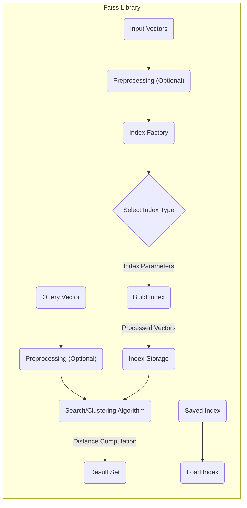

## Project Design Document: Faiss - A Library for Efficient Similarity Search and Clustering of Dense Vectors (Improved)

**1. Introduction**

This document provides an enhanced design overview of the Faiss library, a powerful tool for efficient similarity search and clustering of dense vectors. This detailed description of the system's architecture, components, and data flow is crucial for subsequent threat modeling activities, enabling a comprehensive assessment of potential security vulnerabilities and risks.

**1.1. Purpose**

The primary purpose of this document is to offer a clear, comprehensive, and improved description of the Faiss library's design. This document will serve as the foundational input for threat modeling exercises, facilitating the identification and analysis of potential security weaknesses within the library's functionality and its usage contexts.

**1.2. Scope**

This document encompasses the core architectural components, their interactions, and the data flow within the Faiss library. It focuses on the essential functionalities related to indexing, searching, and clustering dense vectors. While it provides a detailed overview, it does not delve into the fine-grained implementation specifics of individual algorithms or the low-level details of hardware interactions.

**1.3. Goals**

*   Clearly and comprehensively define the major components of the Faiss library, providing more context for each.
*   Describe the interactions and data flow between these components in a more detailed and sequential manner.
*   Identify key data inputs, outputs, and intermediate data transformations.
*   Provide a robust and well-articulated understanding of the system's functionality specifically for security analysis and threat modeling.

**2. System Overview**

Faiss is engineered to handle substantial datasets of high-dimensional vectors with high efficiency. It offers a diverse range of indexing techniques that enable rapid similarity searches and clustering operations. The library is primarily implemented in C++, providing performance, and offers Python bindings to enhance accessibility and ease of integration.

**3. Architectural Design**

The Faiss library can be conceptually decomposed into the following key components, each with a specific role:

*   **Input Vectors:** The foundational data upon which Faiss operates. These are typically dense vectors representing features, embeddings, or other numerical representations of data points.
*   **Index Factory:** A central component responsible for instantiating different types of indexes. It acts as a builder pattern, taking user-specified parameters and the characteristics of the input data to create an appropriate index structure.
*   **Index (Various Types):** The core data structure that organizes the indexed vectors to facilitate efficient similarity searching. Different index types employ distinct algorithms and data structures optimized for various trade-offs between speed, memory usage, and accuracy (e.g., "Flat", "IVF", "HNSW").
*   **Preprocessing Modules (Optional):** Components that can perform transformations on the input vectors before indexing, such as dimensionality reduction or normalization.
*   **Search/Clustering Algorithms:** The algorithmic implementations within each index type that perform the core operations of finding nearest neighbors (similarity search) or grouping similar vectors (clustering).
*   **Distance Computation Modules:**  The specific methods and implementations used to calculate the distance or similarity between vectors. These modules support various metrics (e.g., L2 distance, dot product, cosine similarity).
*   **Quantization Techniques (Optional):**  Algorithms used to compress vectors, reducing memory footprint and potentially accelerating distance computations, often with a trade-off in accuracy. Examples include scalar quantization and product quantization.
*   **GPU Support Modules (Optional):** Components that enable the offloading of computationally intensive tasks, such as distance calculations and search operations, to GPUs for significant performance gains.
*   **Persistence Layer:** Mechanisms for serializing and deserializing index data, allowing indexes to be saved to persistent storage (disk) and loaded back into memory.
*   **API (C++ and Python):** The programming interfaces through which users interact with the Faiss library, providing functions for indexing, searching, clustering, and managing indexes.

**4. Data Flow**

The typical data flow within Faiss involves a series of well-defined steps, starting with input vectors and culminating in search results or cluster assignments:

**Detailed Data Flow Description:**

1. **Input Vectors:** The process commences with a collection of dense vectors that require indexing for efficient search or clustering.
2. **Preprocessing (Optional):**  Input vectors may undergo optional preprocessing steps, such as normalization or dimensionality reduction, to optimize indexing or search performance.
3. **Index Factory:** The user specifies the desired index type and associated parameters (e.g., number of clusters for "IVF", connectivity parameters for "HNSW"). The Index Factory then creates an instance of the selected index type.
4. **Select Index Type:** Based on the user's configuration and the characteristics of the data, a specific index type is chosen. Each type employs a unique algorithm for organizing and searching the vectors.
5. **Build Index:** The chosen index type processes the (potentially preprocessed) input vectors and constructs the internal data structures necessary for efficient searching. This may involve partitioning the data space, building hierarchical structures, or applying quantization techniques.
6. **Index Storage:** The constructed index is stored in memory for fast access. Optionally, the index can be serialized and persisted to disk for later retrieval.
7. **Query Vector:** When a similarity search is performed, a query vector is provided as input.
8. **Preprocessing (Optional):** The query vector may also undergo the same preprocessing steps applied to the input vectors to ensure consistency.
9. **Search/Clustering Algorithm:** The appropriate search or clustering algorithm, specific to the chosen index type, is invoked. This algorithm leverages the index structure to efficiently find similar vectors or group vectors into clusters.
10. **Distance Computation:** The search or clustering algorithm utilizes the configured distance computation module to calculate the distances or similarities between the query vector and the indexed vectors.
11. **Result Set:** The algorithm returns a ranked list of the nearest neighbor vectors (for similarity search) or cluster assignments for each input vector (for clustering), based on the calculated distances.
12. **Load Index:** A previously saved index can be deserialized and loaded from disk back into memory, allowing for the reuse of pre-built indexes.

**5. Key Data Inputs and Outputs**

*   **Inputs:**
    *   Dense vectors (the primary data to be indexed and searched).
    *   Index parameters (configuration settings for index construction, such as index type, number of partitions, etc.).
    *   Query vectors (the vectors used to perform similarity searches).
    *   Saved index files (serialized index data loaded from persistent storage).
*   **Outputs:**
    *   Built index (in-memory representation of the indexed data, potentially also serialized to disk).
    *   Nearest neighbor vectors and their corresponding distances (results of similarity searches).
    *   Cluster assignments for each input vector (results of clustering operations).

**6. Security Considerations (Detailed)**

This section expands on the initial security considerations, providing more specific examples of potential threats and vulnerabilities.

*   **Data Confidentiality:** Protecting the confidentiality of input vectors and indexed data is paramount, especially when dealing with sensitive information. Potential threats include:
    *   Unauthorized access to the system's memory where the index is stored.
    *   Exposure of index files during storage or transfer.
    *   Information leakage through poorly secured APIs or logging mechanisms.
*   **Data Integrity:** Ensuring the integrity of the index and search results is crucial to prevent manipulation or corruption, which could lead to incorrect or biased outcomes. Potential threats include:
    *   Malicious modification of index files on disk.
    *   Memory corruption attacks targeting the index in memory.
    *   Tampering with the distance computation logic.
*   **Availability:** Maintaining the availability and reliable performance of the library is essential for dependent applications. Potential threats include:
    *   Denial-of-service attacks targeting the system running Faiss.
    *   Resource exhaustion due to inefficient algorithms or unoptimized configurations.
    *   Bugs or vulnerabilities leading to crashes or unexpected termination.
*   **Access Control:** While Faiss itself doesn't implement user authentication, the environment in which it operates must enforce access controls to protect the data and the library's functionality. Potential threats include:
    *   Unauthorized access to the server or container running Faiss.
    *   Lack of proper permissions on index files.
    *   Exposure of API endpoints without proper authentication.
*   **Dependency Management:** The security of Faiss is inherently linked to the security of its dependencies. Potential threats include:
    *   Vulnerabilities in third-party libraries used by Faiss.
    *   Compromised dependencies introduced through supply chain attacks.
    *   Outdated dependencies with known security flaws.
*   **Input Validation:** Robust validation of input vectors and parameters is critical to prevent unexpected behavior and potential vulnerabilities. Potential threats include:
    *   Buffer overflows due to excessively large input vectors.
    *   Injection attacks through maliciously crafted index parameters.
    *   Unexpected behavior caused by invalid or out-of-range parameter values.
*   **Serialization/Deserialization:** Security considerations related to saving and loading indexes from disk are vital to prevent the exploitation of vulnerabilities. Potential threats include:
    *   Deserialization of untrusted data leading to remote code execution.
    *   Manipulation of serialized index data to inject malicious content.
    *   Exposure of sensitive information stored within the serialized index.

**7. Assumptions and Constraints**

*   It is assumed that input vectors are pre-processed and formatted appropriately for Faiss before being passed to the library.
*   The performance characteristics of Faiss are dependent on the underlying hardware infrastructure on which it is deployed.
*   This document primarily focuses on the core functionalities of Faiss and does not cover specific deployment architectures or integrations with external systems in detail.
*   It is assumed that the environment in which Faiss is deployed has basic security measures in place, such as network firewalls.

**8. Future Considerations**

*   Development of more advanced security features, such as encryption for indexes stored in memory and on disk.
*   Implementation of mechanisms for verifying the integrity of loaded indexes.
*   Exploration of secure multi-party computation techniques for privacy-preserving similarity search.
*   Enhanced auditing and logging capabilities for security monitoring.
*   Further research into mitigating potential side-channel attacks.

This improved design document provides a more detailed and comprehensive understanding of the Faiss library's architecture and data flow. This enhanced information will be invaluable for conducting a more thorough and effective threat model, enabling the identification and mitigation of a wider range of potential security risks.