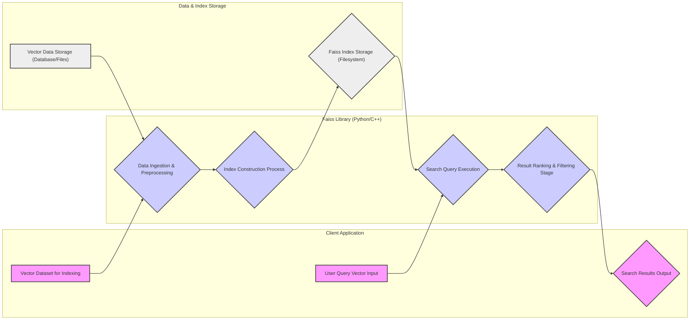

# Project Design Document: Faiss - Facebook AI Similarity Search

## 1. Project Overview

**Project Name:** Faiss (Facebook AI Similarity Search)

**Project Repository:** [https://github.com/facebookresearch/faiss](https://github.com/facebookresearch/faiss)

**Project Description:** Faiss is a high-performance library designed for efficient similarity search and clustering of dense vectors. It excels in handling large datasets, scaling to billions of vectors with dimensions ranging from dozens to hundreds. Primarily implemented in C++ with comprehensive Python/NumPy bindings, Faiss is suitable for both research exploration and production deployments where speed, memory efficiency, and scalability are paramount for large-scale vector search tasks.

**Purpose of this Document:** This document provides a detailed design overview of the Faiss library, specifically focusing on architectural aspects relevant to security and threat modeling. It delineates the system architecture, key components, data flow pathways, and underlying technology stack. The objective is to establish a robust foundation for conducting a comprehensive threat analysis, enabling the proactive identification and mitigation of potential security vulnerabilities. This document will serve as the primary input and reference point for subsequent threat modeling activities.

**Target Audience:** Security engineers, software developers, cloud architects, and individuals involved in threat modeling, security auditing, and risk assessment of systems that integrate and utilize the Faiss library.

## 2. Architecture Diagram

This diagram illustrates the high-level architecture of a system incorporating the Faiss library. It emphasizes the key components and their interactions from a security-centric perspective, highlighting trust boundaries and data flow paths.

```mermaid
graph LR
    subgraph "Client Application (User Space)"
        A["Client Application Interface"]
    end
    subgraph "Faiss Library (User Space)"
        B["Faiss Core (C++) Algorithms"]
        C["Python Bindings (API)"]
    end
    subgraph "Data & Index Storage (Environment Dependent)"
        D["Vector Database / Storage"]
        E["Faiss Index Filesystem / Storage"]
    end
    subgraph "System Dependencies (OS Level)"
        F["Optimized BLAS/LAPACK"]
        G["System Memory (RAM)"]
        H["Operating System (File I/O, etc.)"]
    end

    A --> C{"Python API Calls"}
    C --> B{"C++ Function Calls"}
    B --> D{"Vector Data Access (Read)"}
    B --> E{"Index Read/Write Operations"}
    B --> F{"Linear Algebra Computations"}
    B --> G{"Memory Allocation/Deallocation"}
    B --> H{"File System Access (Index Persistence)"}

    style A fill:#f9f,stroke:#333,stroke-width:2px
    style B fill:#ccf,stroke:#333,stroke-width:2px
    style C fill:#ccf,stroke:#333,stroke-width:2px
    style D fill:#eee,stroke:#333,stroke-width:2px
    style E fill:#eee,stroke:#333,stroke-width:2px
    style F fill:#ddd,stroke:#333,stroke-width:2px
    style G fill:#ddd,stroke:#333,stroke-width:2px
    style H fill:#ddd,stroke:#333,stroke-width:2px

    linkStyle 0,1,2,3,4,5,6,7 stroke:#333, stroke-width:1.5px;
```

## 3. Component Description

This section provides a detailed description of each component depicted in the architecture diagram, focusing on their functionalities and security-relevant aspects, including potential vulnerabilities and attack vectors.

### 3.1 Client Application Interface

*   **Description:** Represents the user-facing application or service that interacts with the Faiss library. This could be a web application, a command-line tool, a microservice, or any software component requiring similarity search capabilities.
*   **Functionality:**
    *   **Input Handling:** Receives user queries (e.g., query vectors, search parameters) and vector datasets for indexing.
    *   **API Interaction:** Communicates with the Faiss library through Python or C++ APIs to initiate indexing and search operations.
    *   **Result Processing:** Receives search results from Faiss and integrates them into the application's workflow.
    *   **Data Management:** Manages the storage and retrieval of vector data and potentially Faiss indexes, depending on the application's architecture.
*   **Security Considerations:**
    *   **Input Validation Vulnerabilities:**  Susceptible to injection attacks (e.g., command injection if processing user-provided file paths), cross-site scripting (XSS) if part of a web application, and format string vulnerabilities if user input is directly used in logging or string formatting without proper sanitization.
    *   **Authentication and Authorization:** Must implement robust authentication and authorization mechanisms to control access to Faiss functionalities and protect sensitive vector data. Lack of proper access control can lead to unauthorized data access or modification.
    *   **Session Management:** If the client application is stateful, secure session management is crucial to prevent session hijacking and unauthorized actions.
    *   **Error Handling & Information Disclosure:** Improper error handling can leak sensitive information (e.g., internal paths, database connection strings) to attackers. Error messages should be generic and not reveal implementation details.

### 3.2 Faiss Core (C++) Algorithms

*   **Description:** This is the heart of the Faiss library, containing the core C++ implementations of similarity search algorithms, indexing structures, and clustering methods. It is responsible for the computationally intensive tasks.
*   **Functionality:**
    *   **Index Construction:** Builds various index types (e.g., IVF, HNSW, Flat) from vector datasets, optimizing for different search speed and memory trade-offs.
    *   **Similarity Search Execution:** Performs efficient k-NN (k-Nearest Neighbors) and range searches on constructed indexes.
    *   **Clustering Algorithms:** Implements clustering algorithms for grouping similar vectors.
    *   **Vector Operations:** Provides optimized routines for vector manipulations and distance calculations.
    *   **Memory Management:** Handles dynamic memory allocation and deallocation for indexes and intermediate data structures.
    *   **Index Persistence (File I/O):** Offers functionality to save and load indexes to and from disk for persistence and faster startup.
*   **Security Considerations:**
    *   **Memory Safety Issues (C/C++ Vulnerabilities):**  Being written in C++, it is vulnerable to memory corruption issues such as buffer overflows (heap and stack), use-after-free, double-free, and memory leaks. These can be exploited for arbitrary code execution or denial of service.
    *   **Algorithmic Complexity Exploits (DoS):** Certain algorithms might have worst-case time or space complexity that can be exploited with crafted inputs to cause excessive resource consumption, leading to denial of service. For example, pathological cases for certain indexing algorithms could lead to very slow index building or search times.
    *   **Integer Overflows/Underflows:** Potential for integer overflows or underflows in distance calculations or index manipulations, which could lead to incorrect results or memory corruption.
    *   **Dependency Vulnerabilities:** Relies on external libraries like BLAS/LAPACK. Vulnerabilities in these dependencies can directly impact Faiss. It's crucial to use updated and patched versions of these libraries.
    *   **Unsafe Deserialization:** If index loading from disk is not handled carefully, vulnerabilities related to unsafe deserialization could arise if index files are tampered with.

### 3.3 Python Bindings (API)

*   **Description:** Provides Python wrappers around the core C++ Faiss library, enabling Python applications to leverage Faiss functionalities through a Pythonic API. Built using SWIG.
*   **Functionality:**
    *   **Python API Exposure:** Exposes C++ Faiss functionalities as Python classes and functions.
    *   **Data Type Conversion:** Handles seamless data type conversions between Python/NumPy data structures and C++ data types.
    *   **Simplified Integration:** Facilitates easy integration of Faiss into Python-based machine learning, data science, and other applications.
*   **Security Considerations:**
    *   **Binding Layer Vulnerabilities:**  Potential vulnerabilities in the SWIG-generated binding layer itself due to incorrect memory management or data handling during the Python-C++ interface.
    *   **Python Environment Security:** Security of the Python environment and its dependencies (NumPy, SWIG, etc.) is crucial. Compromised Python packages or vulnerabilities in the Python interpreter itself can affect Faiss-based applications.
    *   **API Misuse & Type Confusion:** Incorrect usage of the Python API by client applications, especially regarding data types and memory management, can lead to unexpected behavior, crashes, or even vulnerabilities.
    *   **Input Sanitization at Binding Layer:**  While input validation should primarily be in the client application, the binding layer should also perform basic checks to prevent obvious type mismatches or invalid data being passed to the C++ core.

### 3.4 Vector Database / Storage

*   **Description:** Represents the persistent storage mechanism for the raw vector data that is indexed and searched by Faiss. This could be a dedicated vector database, a relational database, object storage, or even in-memory storage for smaller datasets.
*   **Functionality:**
    *   **Vector Data Persistence:** Stores the vector data in a durable and scalable manner.
    *   **Data Retrieval:** Provides mechanisms for retrieving vector data for index building and potentially for search operations (depending on the indexing strategy).
    *   **Data Management:** Handles data updates, deletions, and versioning if required.
*   **Security Considerations:**
    *   **Data Confidentiality & Integrity:**  If vector data is sensitive (e.g., user embeddings, medical data), strong encryption at rest and in transit is essential. Data integrity mechanisms (checksums, digital signatures) should be in place to prevent unauthorized modification.
    *   **Access Control & Authorization:** Robust access control mechanisms are needed to restrict access to vector data based on the principle of least privilege. Role-Based Access Control (RBAC) or Attribute-Based Access Control (ABAC) should be considered.
    *   **Database Security Hardening:**  If using a database, standard database security hardening practices must be followed (e.g., strong passwords, regular patching, network segmentation, input validation at the database level).
    *   **Injection Attacks (SQL Injection, NoSQL Injection):** If interacting with a database using dynamically constructed queries, susceptible to injection attacks if input is not properly sanitized. Prepared statements or parameterized queries should be used.

### 3.5 Faiss Index Filesystem / Storage

*   **Description:** Represents the storage location for Faiss index files when index persistence is used. This is typically a filesystem (local or network-attached storage) but could also be object storage or a database capable of storing binary data.
*   **Functionality:**
    *   **Index Persistence:** Provides durable storage for Faiss indexes, allowing for index saving and loading.
    *   **Index Retrieval:** Enables loading pre-built indexes for faster application startup and reduced index build times.
*   **Security Considerations:**
    *   **Index Confidentiality & Integrity:** If the index itself contains sensitive information or if index integrity is critical for search accuracy, index files should be protected. Encryption at rest and integrity checks are recommended.
    *   **Access Control (Filesystem Permissions):**  File system permissions on index files must be correctly configured to prevent unauthorized access, modification, or deletion. Principle of least privilege should be applied.
    *   **Storage Security:** Security of the underlying storage infrastructure (filesystem, object storage) is paramount. Vulnerabilities in the storage system can compromise index files.
    *   **Path Traversal Vulnerabilities:** If file paths for index loading/saving are constructed from user inputs (less likely in typical Faiss usage but possible in custom integrations), path traversal vulnerabilities could allow attackers to access or overwrite arbitrary files. Input sanitization and path validation are necessary.

### 3.6 Optimized BLAS/LAPACK

*   **Description:** Faiss relies heavily on optimized BLAS (Basic Linear Algebra Subprograms) and LAPACK (Linear Algebra Package) libraries for high-performance linear algebra operations. Examples include OpenBLAS, Intel MKL, cuBLAS (for GPU Faiss).
*   **Functionality:**
    *   **Accelerated Linear Algebra:** Provides highly optimized routines for matrix and vector operations, significantly boosting the performance of Faiss algorithms.
*   **Security Considerations:**
    *   **Dependency Vulnerabilities:** BLAS/LAPACK libraries are complex software and may contain security vulnerabilities. It is crucial to use up-to-date and patched versions. Regularly monitor security advisories for these libraries.
    *   **Supply Chain Security:** Verify the source and integrity of BLAS/LAPACK libraries to prevent supply chain attacks. Use trusted repositories and checksum verification.
    *   **Configuration Issues:** Incorrect configuration of BLAS/LAPACK libraries or linking against untrusted or malicious implementations can introduce vulnerabilities.

### 3.7 System Memory (RAM)

*   **Description:** System memory (RAM) is used by Faiss for storing indexes, vector data (if loaded in memory), intermediate calculations, and program execution. Memory is a critical resource for Faiss performance.
*   **Functionality:**
    *   **Working Memory:** Provides the necessary memory space for Faiss operations.
*   **Security Considerations:**
    *   **Memory Exhaustion (DoS):**  Large indexes, unoptimized queries, or memory leaks can lead to excessive memory consumption, potentially causing system instability or denial of service. Resource limits and monitoring should be implemented.
    *   **Memory Leaks:** Memory leaks in Faiss or its dependencies can gradually consume system memory, eventually leading to performance degradation or crashes. Regular memory profiling and leak detection are important.
    *   **Sensitive Data in Memory:** Sensitive vector data or index information may reside in memory. For highly sensitive applications, consider memory encryption or secure memory allocation techniques if available and applicable.
    *   **Side-Channel Attacks (Cache Timing Attacks):** In some scenarios, if sensitive data is processed, cache timing attacks might be a theoretical concern, although practically less likely in typical Faiss usage.

### 3.8 Operating System (File I/O, etc.)

*   **Description:** The underlying operating system provides essential services for Faiss, including file I/O for index persistence, memory management, process management, and network communication (if Faiss is part of a networked service).
*   **Functionality:**
    *   **System Services:** Provides core functionalities required for Faiss execution.
*   **Security Considerations:**
    *   **OS Vulnerabilities:** Vulnerabilities in the operating system itself can indirectly affect Faiss. Keeping the OS patched and up-to-date is crucial.
    *   **File System Security:** File system security settings and permissions impact the security of Faiss index files and vector data stored on disk.
    *   **Process Isolation & Resource Limits:** OS-level process isolation and resource limits (e.g., cgroups, namespaces) can help contain the impact of potential vulnerabilities in Faiss and prevent resource exhaustion.
    *   **System Call Security:**  Restrict unnecessary system calls that Faiss processes can make to reduce the attack surface. System call filtering (seccomp) can be used.

## 4. Data Flow Diagram

This diagram illustrates the typical data flow within a system using Faiss, highlighting trust boundaries, data transformations, and potential points of interest for security analysis.



**Data Flow Description:**

1.  **Data Ingestion & Preprocessing (D):** Vector data (`B`) from the Client Application or Vector Data Storage (`H`) is ingested into the Faiss Library (`D`). This stage may involve preprocessing steps like normalization, dimensionality reduction, or data type conversions.
2.  **Index Construction Process (E):** The preprocessed vector data is used by Faiss algorithms to build an index (`E`). The constructed index is then persisted in Index Storage (`I`) if persistence is enabled.
3.  **Search Query Execution (F):** A user query vector (`A`) from the Client Application is received by the Faiss Library (`F`). The library utilizes the Faiss Index (`I`) to perform efficient similarity search operations.
4.  **Result Ranking & Filtering Stage (G):** The raw search results are processed in stage `G` to rank them based on similarity scores and apply any filtering criteria specified in the search query.
5.  **Search Results Output (C):** The ranked and filtered search results (`C`) are returned to the Client Application for further processing and presentation to the user.

**Trust Boundaries:**

*   **Client Application <-> Faiss Library:** This is a significant trust boundary. Data crossing this boundary (query vectors, indexing data, search parameters) should be carefully validated and sanitized by both the client and the Faiss library to prevent malicious inputs from exploiting vulnerabilities.
*   **Faiss Library <-> External Dependencies (BLAS/LAPACK, OS):** Faiss relies on external, potentially less controlled components. This represents a trust boundary where vulnerabilities in dependencies or misconfigurations can impact Faiss security.
*   **Faiss Library <-> Vector Data Storage/Index Storage:** Access control and data integrity are critical at this boundary. Unauthorized access or modification of vector data or indexes can compromise the system's security and functionality.

## 5. Technology Stack

*   **Core Library Implementation:** C++ (primarily C++11 and later)
*   **Python Bindings Generation:** Python, NumPy, SWIG (Simplified Wrapper and Interface Generator)
*   **Optimized Linear Algebra Dependencies:** BLAS, LAPACK (e.g., OpenBLAS, Intel MKL, cuBLAS - for GPU support)
*   **Build System & Configuration:** CMake (cross-platform build system)
*   **Supported Operating Systems:** Linux (various distributions), macOS, Windows
*   **Supported Hardware Architectures:** x86-64, ARM (various architectures), NVIDIA GPUs (CUDA enabled for GPU Faiss)
*   **Client Application Programming Languages:** Language agnostic - any language capable of interfacing with C++ (FFI, C API) or Python (Python API) can be used for client applications. Common choices include Python, Java, Go, C++, etc.

## 6. Security Considerations & Potential Threats

This section provides a more structured summary of key security considerations and potential threats for systems utilizing the Faiss library, categorized for clarity.

**6.1 Memory Safety & Code Vulnerabilities (C++ Core):**

*   **Threats:** Buffer overflows, heap overflows, stack overflows, use-after-free, double-free, memory leaks.
*   **Potential Impact:** Arbitrary code execution, denial of service, information disclosure.
*   **Mitigation:** Rigorous code reviews, static analysis tools (e.g., Coverity, SonarQube), dynamic analysis and fuzzing, AddressSanitizer/MemorySanitizer during development and testing.

**6.2 Input Validation & Injection Attacks:**

*   **Threats:** Maliciously crafted vectors, oversized vectors, invalid search parameters, format string vulnerabilities, path traversal (in index loading/saving), potential for injection attacks in client applications interacting with Faiss.
*   **Potential Impact:** Denial of service, arbitrary code execution (in format string cases), unauthorized file access, incorrect search results.
*   **Mitigation:** Strict input validation at the Client Application and within Faiss API (where feasible), input sanitization, use of safe APIs, avoid constructing file paths from user input directly, implement rate limiting to mitigate DoS from oversized inputs.

**6.3 Denial of Service (DoS):**

*   **Threats:** Algorithmic complexity exploits, memory exhaustion, excessive resource consumption due to large inputs or crafted queries, memory leaks.
*   **Potential Impact:** Service unavailability, performance degradation, system crashes.
*   **Mitigation:** Resource limits (memory limits, CPU quotas), rate limiting, input validation to reject overly large or complex inputs, monitoring resource usage, memory leak detection and prevention, choosing appropriate Faiss algorithms and index types for expected data scale and query patterns.

**6.4 Dependency Management & Supply Chain Security:**

*   **Threats:** Vulnerabilities in BLAS/LAPACK libraries, vulnerabilities in Python dependencies, compromised dependency packages (supply chain attacks).
*   **Potential Impact:** Arbitrary code execution, denial of service, data compromise.
*   **Mitigation:** Use dependency scanning tools, regularly update dependencies to patched versions, verify checksums of downloaded dependencies, use trusted package repositories, consider vendoring dependencies or using containerization to control the dependency environment.

**6.5 Data Confidentiality & Integrity:**

*   **Threats:** Unauthorized access to vector data and Faiss indexes, data breaches, data modification, loss of data integrity.
*   **Potential Impact:** Loss of sensitive information, compromised search results, reputational damage, compliance violations.
*   **Mitigation:** Encryption at rest and in transit for sensitive vector data and indexes, strong access control mechanisms (authentication, authorization), regular security audits, data integrity checks (checksums, digital signatures), secure storage practices.

**6.6 Access Control & Authorization:**

*   **Threats:** Insufficient access control to Faiss functionalities, vector data, and indexes, leading to unauthorized access and actions.
*   **Potential Impact:** Data breaches, unauthorized modification of indexes or data, denial of service.
*   **Mitigation:** Implement robust authentication and authorization mechanisms in the Client Application, enforce principle of least privilege, use Role-Based Access Control (RBAC) or Attribute-Based Access Control (ABAC), regularly review and update access control policies.

**6.7 Configuration & Deployment Security:**

*   **Threats:** Misconfigurations in the deployment environment (e.g., insecure file permissions, exposed services, weak network security), insecure default settings.
*   **Potential Impact:** Vulnerable system, easier exploitation of other vulnerabilities.
*   **Mitigation:** Security hardening of the deployment environment, secure configuration management, regular security audits of configurations, follow security best practices for OS and infrastructure, minimize exposed services, use network segmentation.

## 7. Threat Modeling Scope & Focus Areas

Based on this design document and the identified security considerations, the threat modeling exercise should specifically focus on:

*   **Input Data Validation & Sanitization:** Deep dive into the input validation mechanisms (or lack thereof) at the Faiss API level and in typical client application integration points. Analyze potential vulnerabilities related to handling malicious or malformed vector data and query parameters.
*   **Memory Safety Vulnerabilities in C++ Core:** Conduct a thorough analysis of potential memory safety issues within the core C++ Faiss library algorithms. Focus on areas involving complex memory management, string handling, and data structure manipulation.
*   **Denial of Service Attack Vectors:**  Specifically explore potential DoS attack vectors, including algorithmic complexity exploitation, memory exhaustion scenarios, and resource consumption vulnerabilities. Analyze the resilience of Faiss to large or crafted inputs designed to cause DoS.
*   **External Dependency Vulnerabilities:**  Assess the security posture of Faiss's external dependencies (BLAS/LAPACK, Python libraries). Identify known vulnerabilities and evaluate the risk of relying on these external components.
*   **Data Confidentiality and Integrity Threats:**  Analyze threats to the confidentiality and integrity of vector data and Faiss indexes throughout their lifecycle (storage, processing, transmission). Evaluate the effectiveness of existing or planned security controls for data protection.
*   **Access Control Weaknesses:**  Examine access control mechanisms surrounding Faiss functionalities, vector data storage, and index storage. Identify potential weaknesses that could lead to unauthorized access or actions.
*   **Index Persistence Security:**  Specifically analyze the security aspects of Faiss index persistence, including file system permissions, storage security, and potential vulnerabilities related to index file manipulation or unsafe deserialization.

This refined design document provides a more comprehensive and security-focused foundation for conducting a detailed threat modeling exercise for systems incorporating the Faiss library. The enhanced component descriptions, data flow analysis, and structured security considerations will enable a more targeted and effective threat identification and mitigation process.