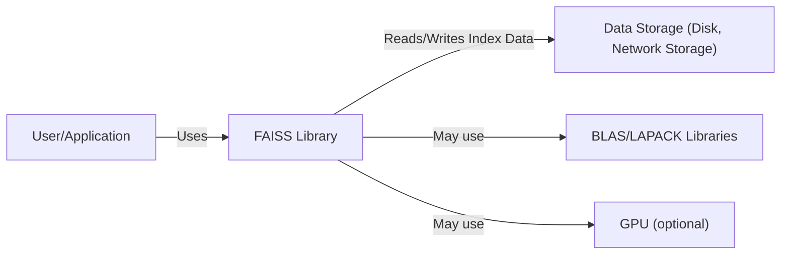
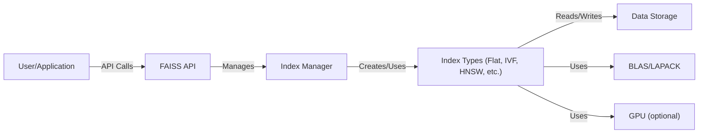
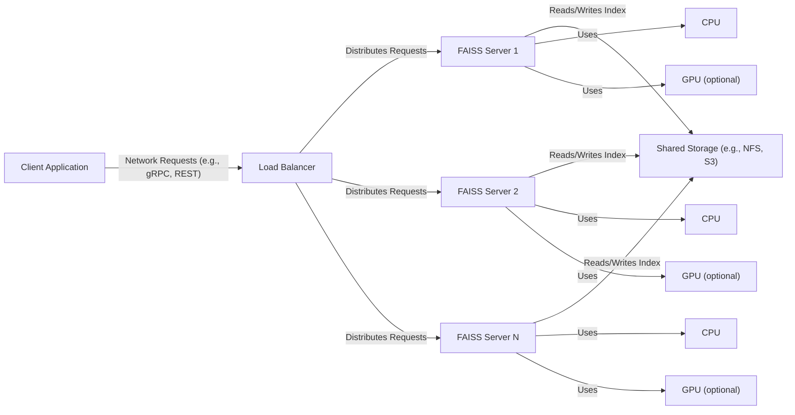
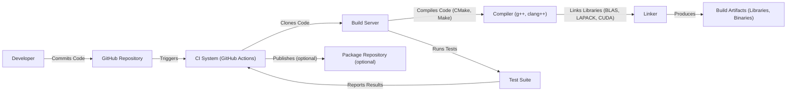

Okay, let's create a design document for the FAISS project, keeping in mind its purpose and potential security considerations.

# BUSINESS POSTURE

FAISS (Facebook AI Similarity Search) is a library for efficient similarity search and clustering of dense vectors.  It's designed to handle datasets of vectors that are so large they don't fit in RAM, and even datasets that don't fit on a single machine.  It's primarily used in machine learning applications, such as recommendation systems, image/video retrieval, and natural language processing.

Business Priorities:

*   Performance:  Fast similarity search and clustering are paramount.  The library must be highly optimized for speed.
*   Scalability:  Handle extremely large datasets, potentially distributed across multiple machines.
*   Accuracy:  Provide accurate results for similarity search and clustering.  False positives/negatives should be minimized.
*   Maintainability:  The codebase should be well-structured and easy to maintain and extend.
*   Open Source:  Foster community contributions and adoption.

Business Goals:

*   Enable large-scale similarity search applications at Facebook and in the broader research community.
*   Provide a state-of-the-art library that outperforms existing solutions.
*   Reduce the computational cost of similarity search.

Most Important Business Risks:

*   Performance Degradation:  Any changes that significantly slow down the search or clustering operations would be a major risk.
*   Inaccurate Results:  If the library produces incorrect results, it could lead to poor recommendations, incorrect classifications, or other undesirable outcomes in applications.
*   Data Corruption:  Loss or corruption of the index data would be a significant issue, potentially requiring a lengthy rebuild process.
*   Security Vulnerabilities: While not directly handling sensitive user data in the library itself, vulnerabilities could be exploited to cause denial of service, or potentially leak information about the indexed data (e.g., through timing attacks).
*   Lack of Adoption: If the library is not adopted by the community, its impact will be limited.

# SECURITY POSTURE

Existing Security Controls:

*   security control: Code Reviews: The GitHub repository indicates a pull request-based development process, suggesting that code reviews are performed. (Described in contribution guidelines).
*   security control: Testing: The repository includes a comprehensive test suite, including unit tests and integration tests. (Described in testing documentation).
*   security control: Static Analysis: While not explicitly mentioned, it's likely that some form of static analysis is used, given Facebook's general security practices. (Assumed).
*   security control: Fuzzing: The project mentions fuzzing as part of its testing strategy, which helps identify potential vulnerabilities. (Described in testing documentation).

Accepted Risks:

*   accepted risk: Denial of Service:  The library is inherently susceptible to denial-of-service attacks, as large or complex queries can consume significant resources.  Mitigation strategies (like resource limits) might be implemented at the application level, but the library itself doesn't inherently prevent this.
*   accepted risk: Timing Attacks:  Depending on the specific index types and search algorithms used, timing attacks might be possible to infer information about the indexed data. This is a common challenge in similarity search systems.
*   accepted risk: Input Validation: The library likely assumes that the input vectors are well-formed and of the correct dimensionality. Insufficient input validation could lead to crashes or unexpected behavior.

Recommended Security Controls:

*   security control: Enhanced Input Validation: Implement robust input validation to check for invalid vector sizes, NaN values, and other potential issues.
*   security control: Resource Limiting: Provide mechanisms to limit the resources (CPU, memory) consumed by a single query or operation, to mitigate denial-of-service risks.
*   security control: Consider adding support for secure multi-party computation (MPC) or homomorphic encryption if FAISS is to be used with highly sensitive data in the future. This is a long-term consideration.

Security Requirements:

*   Authentication: Not directly applicable to the library itself. Authentication would be handled by the application using FAISS.
*   Authorization: Not directly applicable to the library itself. Authorization would be handled by the application using FAISS.
*   Input Validation:
    *   The library should validate the dimensions of input vectors.
    *   The library should handle or reject NaN or infinite values appropriately.
    *   The library should validate parameters passed to its functions.
*   Cryptography:
    *   If data needs to be stored encrypted at rest, the application using FAISS should handle encryption/decryption. FAISS itself doesn't inherently require cryptography.
    *   If secure communication between distributed FAISS instances is required, standard cryptographic protocols (e.g., TLS) should be used.
*   Configuration:
    *   Provide secure defaults for all configurable parameters.
    *   Document all security-relevant configuration options.

# DESIGN

## C4 CONTEXT

Element Descriptions:

*   Element:
    *   Name: User/Application
    *   Type: External Entity (Person or System)
    *   Description: Represents the user or application that is utilizing the FAISS library for similarity search and clustering.
    *   Responsibilities:
        *   Provides input data (vectors) to FAISS.
        *   Formulates search queries.
        *   Processes the results returned by FAISS.
    *   Security controls:
        *   Authentication and authorization of users.
        *   Input validation and sanitization.
        *   Secure handling of sensitive data.

*   Element:
    *   Name: FAISS Library
    *   Type: Software System
    *   Description: The core FAISS library, providing functions for building indexes, searching, and clustering.
    *   Responsibilities:
        *   Building indexes from input vectors.
        *   Performing similarity searches.
        *   Clustering vectors.
        *   Managing index data.
    *   Security controls:
        *   Input validation.
        *   Resource limiting (recommended).

*   Element:
    *   Name: Data Storage (Disk, Network Storage)
    *   Type: External System
    *   Description: The storage system where the index data is persisted. This could be local disk, network-attached storage, or a distributed file system.
    *   Responsibilities:
        *   Storing and retrieving index data.
    *   Security controls:
        *   Access controls (e.g., file system permissions).
        *   Encryption at rest (if required).

*   Element:
    *   Name: BLAS/LAPACK Libraries
    *   Type: External Library
    *   Description: Linear algebra libraries used by FAISS for optimized matrix operations.
    *   Responsibilities:
        *   Performing efficient matrix computations.
    *   Security controls: Relies on the security of the BLAS/LAPACK implementation.

*   Element:
    *   Name: GPU (optional)
    *   Type: Hardware
    *   Description:  A Graphics Processing Unit, used for accelerating computations in some FAISS index types.
    *   Responsibilities:
        *   Accelerating similarity search and clustering operations.
    *   Security controls: Relies on the security of the GPU driver and hardware.

## C4 CONTAINER

Element Descriptions:

*   Element:
    *   Name: User/Application
    *   Type: External Entity
    *   Description:  Same as in the Context diagram.
    *   Responsibilities: Same as in the Context diagram.
    *   Security controls: Same as in the Context diagram.

*   Element:
    *   Name: FAISS API
    *   Type: API
    *   Description: The public interface of the FAISS library, providing functions for interacting with the library.
    *   Responsibilities:
        *   Exposing functions for building, searching, and managing indexes.
        *   Handling input validation.
    *   Security controls:
        *   Input validation.

*   Element:
    *   Name: Index Manager
    *   Type: Component
    *   Description:  A component responsible for managing the lifecycle of indexes, including creation, deletion, and serialization.
    *   Responsibilities:
        *   Creating new index instances.
        *   Loading and saving indexes from/to storage.
        *   Managing index metadata.
    *   Security controls:
        *   Internal consistency checks.

*   Element:
    *   Name: Index Types (Flat, IVF, HNSW, etc.)
    *   Type: Component
    *   Description:  A collection of different index types, each with its own implementation of search and clustering algorithms.  Examples include Flat (brute-force), IVF (Inverted File), HNSW (Hierarchical Navigable Small World), etc.
    *   Responsibilities:
        *   Implementing specific similarity search and clustering algorithms.
    *   Security controls:
        *   Algorithm-specific security considerations (e.g., resistance to timing attacks).

*   Element:
    *   Name: Data Storage
    *   Type: External System
    *   Description: Same as in the Context diagram.
    *   Responsibilities: Same as in the Context diagram.
    *   Security controls: Same as in the Context diagram.

*   Element:
    *   Name: BLAS/LAPACK Libraries
    *   Type: External Library
    *   Description: Same as in the Context diagram.
    *   Responsibilities: Same as in the Context diagram.
    *   Security controls: Same as in the Context diagram.

*   Element:
    *   Name: GPU (optional)
    *   Type: Hardware
    *   Description: Same as in the Context diagram.
    *   Responsibilities: Same as in the Context diagram.
    *   Security controls: Same as in the Context diagram.

## DEPLOYMENT

Possible Deployment Solutions:

1.  Standalone Library: FAISS can be used as a standalone library within a single application (e.g., a Python script or a C++ program).
2.  Client-Server Architecture: FAISS can be deployed as a service, with a server exposing an API for clients to submit search queries.
3.  Distributed Deployment: For very large datasets, FAISS can be deployed in a distributed manner, with multiple instances of the library working together.

Chosen Solution (Client-Server Architecture):

Element Descriptions:

*   Element:
    *   Name: Client Application
    *   Type: External System
    *   Description: An application that sends search queries to the FAISS server.
    *   Responsibilities:
        *   Formulating search queries.
        *   Sending requests to the server.
        *   Processing results.
    *   Security controls:
        *   Authentication and authorization of clients.
        *   Secure communication with the server (e.g., TLS).

*   Element:
    *   Name: Load Balancer
    *   Type: Infrastructure
    *   Description: Distributes incoming requests across multiple FAISS server instances.
    *   Responsibilities:
        *   Distributing load.
        *   Health checks.
    *   Security controls:
        *   TLS termination (if applicable).
        *   DDoS protection.

*   Element:
    *   Name: FAISS Server 1, Server 2, ..., Server N
    *   Type: Software System (Instance)
    *   Description:  An instance of the FAISS library running as a server, handling search requests.
    *   Responsibilities:
        *   Receiving and processing search requests.
        *   Accessing the index data.
        *   Returning results to the client.
    *   Security controls:
        *   Input validation.
        *   Resource limiting.
        *   Secure communication with clients (e.g., TLS).

*   Element:
    *   Name: Shared Storage (e.g., NFS, S3)
    *   Type: External System
    *   Description: A shared storage system where the index data is stored, accessible by all FAISS server instances.
    *   Responsibilities:
        *   Storing and retrieving index data.
    *   Security controls:
        *   Access controls.
        *   Encryption at rest.
        *   Data integrity checks.

*   Element:
    *   Name: CPU1, CPU2, ..., CPUN
    *   Type: Hardware
    *   Description: CPU of FAISS server.
    *   Responsibilities: Processing.
    *   Security controls: Hardware security.

*   Element:
    *   Name: GPU1, GPU2, ..., GPUN
    *   Type: Hardware
    *   Description: GPU of FAISS server.
    *   Responsibilities: Processing.
    *   Security controls: Hardware security.

## BUILD

The FAISS build process involves compiling C++ code, linking with necessary libraries (BLAS, LAPACK, potentially CUDA), and running tests.  It uses a CMake-based build system.

Security Controls in Build Process:

*   security control: Version Control (Git):  The source code is managed using Git, providing a history of changes and enabling auditing.
*   security control: CI/CD (GitHub Actions):  The build process is automated using GitHub Actions, ensuring consistency and reproducibility.
*   security control: Static Analysis (Likely):  While not explicitly mentioned, it's highly probable that static analysis tools are used as part of the CI process.
*   security control: Dependency Management: Dependencies are managed through CMake, allowing for tracking and updating of external libraries.
*   security control: Test Suite:  A comprehensive test suite is run as part of the build process, helping to identify bugs and regressions.
*   security control: Fuzzing: Fuzzing is used to test the robustness of the code against unexpected inputs.
*   security control: Compiler Warnings: The build process should be configured to treat compiler warnings as errors, ensuring that potential issues are addressed.

# RISK ASSESSMENT

Critical Business Processes:

*   Large-scale similarity search and clustering for various applications (recommendation systems, image retrieval, etc.).
*   Efficient processing of high-dimensional vector data.

Data We Are Trying to Protect:

*   Index Data: The primary data to protect is the index data itself. While the vectors themselves might not be inherently sensitive (depending on the application), the index structure could potentially leak information about the relationships between the vectors.
*   Sensitivity: The sensitivity of the index data depends on the application. If the vectors represent user data, the index data could be considered sensitive. If the vectors represent publicly available data, the index data might be less sensitive.

# QUESTIONS & ASSUMPTIONS

Questions:

*   Are there any specific compliance requirements (e.g., GDPR, CCPA) that need to be considered for applications using FAISS?
*   What are the expected query loads and latency requirements for typical use cases?
*   What are the specific mechanisms used for distributed deployments of FAISS?
*   Are there any plans to add support for secure multi-party computation or homomorphic encryption?
*   What are the specific static analysis tools used in the CI pipeline?
*   What is the process for reporting and addressing security vulnerabilities?

Assumptions:

*   BUSINESS POSTURE: We assume that performance and scalability are the top priorities for FAISS.
*   SECURITY POSTURE: We assume that basic security practices (code reviews, testing) are followed. We also assume that the library is not directly handling highly sensitive data, but the applications using it might.
*   DESIGN: We assume a client-server architecture for the deployment diagram, as it's a common pattern for serving machine learning models and libraries. We assume that GitHub Actions is used for CI/CD.