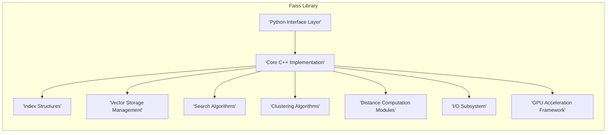
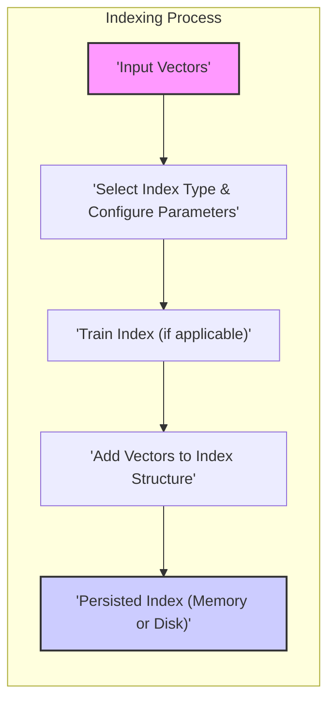
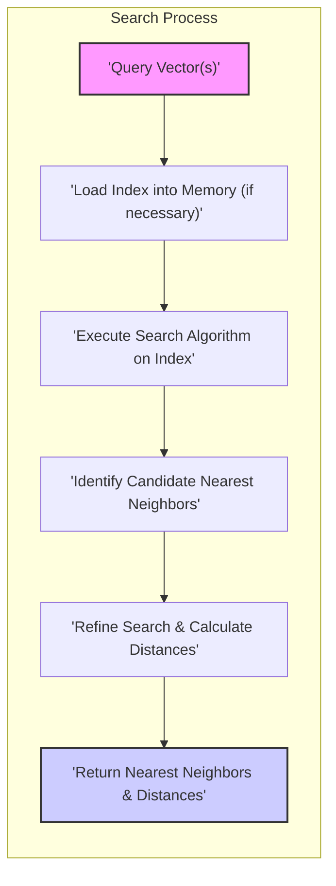

# Project Design Document: Faiss - A Library for Efficient Similarity Search and Clustering of Dense Vectors

**Version:** 1.1
**Date:** October 26, 2023
**Author:** AI Architecture Expert

## 1. Introduction

This document provides an enhanced design overview of the Faiss library, developed by Facebook AI Research. Faiss is a library engineered for high-performance similarity search and clustering of dense vectors. This document aims to offer a more detailed and comprehensive understanding of its architecture, components, and data flow, serving as a robust foundation for subsequent threat modeling activities.

### 1.1. Purpose

The primary purpose of this document is to articulate the design of the Faiss library with greater precision and depth. This enhanced document will serve as a critical input for threat modeling exercises, enabling a more thorough identification of potential security vulnerabilities and risks associated with the library's architecture and its various modes of usage.

### 1.2. Scope

This document expands upon the core architectural components and data flow within the Faiss library, providing more granular detail. It focuses on the logical structure, inter-component communication, and specific mechanisms employed by the system. The scope includes aspects directly relevant to understanding potential attack surfaces, data handling procedures, and operational nuances within Faiss.

### 1.3. Goals

*   Present a highly detailed and unambiguous description of the Faiss library's architecture.
*   Clearly delineate the key components, their specific responsibilities, and their interactions.
*   Illustrate the data flow within the library for both indexing and searching operations with greater clarity and precision.
*   Thoroughly describe external interfaces, including data formats and interaction protocols, and dependencies.
*   Serve as a definitive and comprehensive basis for identifying potential security threats and vulnerabilities, facilitating a more effective threat modeling process.

## 2. Overview

Faiss (Facebook AI Similarity Search) is a sophisticated library providing highly optimized algorithms for similarity search and clustering of dense vectors, particularly in scenarios where the dataset size exceeds available RAM. Faiss incorporates algorithms capable of searching within vector collections of virtually any scale, extending to billions of entries. Furthermore, it includes auxiliary code for performance evaluation, parameter optimization, and dataset manipulation.

Faiss is predominantly implemented in C++, emphasizing performance and efficiency, and offers a rich and user-friendly Python interface for broader accessibility. It leverages highly optimized numerical libraries and is designed to exploit multi-core CPUs and GPUs for significant computational acceleration.

## 3. Architecture

The Faiss library's architecture comprises several interconnected key components:

*   **Index Structures:** This is the central element of Faiss, encompassing a diverse range of data structures and algorithms meticulously designed to organize and store vector data for rapid and efficient similarity searching. Different index types cater to varying requirements, offering trade-offs between search speed, memory footprint, and accuracy. Specific examples include:
    *   `"IndexFlatL2"`: A straightforward brute-force index that calculates the exact L2 (Euclidean) distance between query and indexed vectors.
    *   `"IndexIVFFlat"`: An Inverted File index structure, which partitions the vector space and performs a flat (linear) search within the relevant partitions.
    *   `"IndexHNSW"`:  A Hierarchical Navigable Small World graph-based index, known for its excellent search performance and scalability.
    *   `"IndexPQ"`:  An index based on Product Quantization, a compression technique that reduces memory usage while maintaining reasonable search accuracy.
*   **Vector Storage Management:** Faiss provides flexible mechanisms for managing the storage of input vectors. This can involve in-memory storage for smaller datasets or memory-mapped files for handling datasets too large to fit into RAM, optimizing memory usage and access patterns.
*   **Search Algorithms:** These algorithms operate on the pre-built index structures to efficiently locate the nearest neighbors of a given query vector. The specific search algorithm employed is tightly coupled with the chosen index type, leveraging the index's organization for optimized searching.
*   **Clustering Algorithms:**  Faiss integrates algorithms for clustering input vectors, often employed as a crucial preprocessing step for certain indexing methods, such as the initial partitioning in `"IndexIVF"`. K-means is a commonly used clustering algorithm within Faiss.
*   **Distance Computation Modules:** Faiss incorporates highly optimized routines for calculating distances between vectors. These modules are fundamental to both indexing and searching, with support for common metrics like L2 distance (Euclidean distance) and dot product, often leveraging SIMD instructions for performance.
*   **Input/Output (I/O) Subsystem:**  Faiss provides robust functionalities for persisting and retrieving index structures and vector data. This includes saving indexes to disk for later use and loading pre-computed indexes, supporting various file formats.
*   **GPU Acceleration Framework:** A significant feature of Faiss is its ability to leverage GPUs using NVIDIA's CUDA. This involves managing data transfers between CPU and GPU memory and executing computationally intensive kernels on the GPU, leading to substantial performance improvements for many operations.
*   **Python Interface Layer:** A comprehensive and user-friendly Python API enables seamless interaction with Faiss functionalities from Python environments. This interface wraps the underlying C++ implementation, providing a convenient way to build indexes, perform searches, and manage data. It often utilizes libraries like NumPy for efficient array handling.
*   **Core C++ Implementation:** The foundational logic and core algorithms of Faiss are implemented in C++, emphasizing performance, low-level control, and efficient memory management. This core is designed for speed and forms the basis for the higher-level interfaces.

### 3.1. Component Diagram (Conceptual)

## 4. Data Flow

The primary data flows within Faiss are centered around the indexing process, where the search structure is built, and the search process, where queries are executed against the index.

### 4.1. Indexing Data Flow

*   **Input Vectors:** The indexing process begins with a collection of dense vectors that need to be organized for efficient searching. These vectors are typically represented as numerical arrays.
*   **Select Index Type & Configure Parameters:** The user chooses a specific index type (e.g., `"IndexHNSW"`, `"IndexPQ"`) based on the characteristics of the data and performance requirements. Parameters specific to the chosen index type are also configured (e.g., the number of neighbors for HNSW).
*   **Train Index (if applicable):** Certain index types, such as `"IndexIVF"`, require a training phase. This involves analyzing a representative subset of the input vectors (often using clustering algorithms like k-means) to learn the data distribution and optimize the index structure.
*   **Add Vectors to Index Structure:** The input vectors are added to the chosen index structure. This involves organizing the vectors according to the index's underlying algorithm, potentially involving quantization, graph construction, or inverted file creation.
*   **Persisted Index (Memory or Disk):** The resulting index structure is stored, either in memory for immediate use or persisted to disk for later loading. The storage format is specific to Faiss.

### 4.2. Search Data Flow

*   **Query Vector(s):** The search process is initiated with one or more query vectors for which the nearest neighbors within the indexed dataset need to be identified.
*   **Load Index into Memory (if necessary):** If the target index is not already resident in memory, it is loaded from its persistent storage (disk).
*   **Execute Search Algorithm on Index:** The appropriate search algorithm, corresponding to the index type, is executed. This involves traversing the index structure to identify potential nearest neighbors.
*   **Identify Candidate Nearest Neighbors:** Based on the index structure and the search algorithm, a set of candidate nearest neighbors is identified. This step often involves approximations to improve speed.
*   **Refine Search & Calculate Distances:** The distances between the query vector(s) and the candidate neighbors are precisely calculated using the configured distance metric (e.g., L2 distance). The candidate set is then refined to select the actual nearest neighbors.
*   **Return Nearest Neighbors & Distances:** The final output of the search process is a list of the nearest neighbor vectors from the index and their corresponding distances to the query vector(s).

## 5. External Interfaces

Faiss interacts with the external environment through well-defined interfaces:

*   **Python API:** This serves as the primary interaction point for most users, enabling the utilization of Faiss functionalities through Python scripts and applications.
    *   Input: Python objects, typically NumPy arrays, representing vectors, configuration parameters, and file paths.
    *   Output: Python objects containing search results (neighbor indices and distances), Faiss index objects, and status information.
*   **C++ API:** For scenarios demanding maximum performance or tight integration with existing C++ codebases, Faiss offers a native C++ API.
    *   Input: C++ data structures, such as `std::vector` and custom Faiss data structures, representing vectors, parameters, and memory locations.
    *   Output: C++ data structures containing search results, index objects, and error codes.
*   **File System Interface:** Faiss relies on the file system for crucial operations:
    *   Loading Index Structures: Reading serialized index data from disk files into memory.
    *   Saving Index Structures: Writing the in-memory representation of an index to disk for persistence.
    *   Loading Vector Data: Reading large datasets of vectors from files, often using memory-mapping techniques.
    *   Saving Vector Data: Writing vector data to files.
*   **GPU (CUDA) Interface:** When GPU acceleration is enabled, Faiss interacts directly with NVIDIA CUDA drivers and libraries:
    *   Data Transfer: Moving vector data and index structures between CPU and GPU memory.
    *   Kernel Execution: Launching and managing the execution of CUDA kernels on the GPU for parallelized computations.
*   **BLAS/LAPACK Libraries Interface:** Faiss leverages highly optimized Basic Linear Algebra Subprograms (BLAS) and Linear Algebra Package (LAPACK) libraries for fundamental numerical computations, such as dot products and matrix multiplications. These are often provided by system installations or optimized implementations like OpenBLAS or Intel MKL.

## 6. Security Considerations (Detailed for Threat Modeling)

This section provides a more detailed exploration of potential security considerations, intended to inform a comprehensive threat modeling process.

*   **Input Validation Vulnerabilities:**
    *   Maliciously crafted input vectors with extremely large or NaN values could lead to unexpected behavior or crashes in distance computations or indexing algorithms.
    *   Providing invalid or out-of-range parameters to Faiss functions (e.g., negative number of neighbors to search) could cause errors or potentially exploitable conditions.
    *   Insufficient validation of file paths provided for loading or saving indexes could lead to path traversal vulnerabilities, allowing access to unauthorized files.
*   **Data Storage Security Risks:**
    *   Index files stored on disk might contain sensitive information about the data distribution. Lack of proper access controls could allow unauthorized access and potential data leakage.
    *   If vector data is also stored on disk, it is susceptible to unauthorized access if not adequately protected (e.g., through encryption).
    *   Temporary files created by Faiss during index building or searching might contain sensitive data and should be securely handled and deleted.
*   **Memory Management Exploits:**
    *   Bugs in Faiss's C++ code related to memory allocation and deallocation could lead to buffer overflows, use-after-free vulnerabilities, or other memory corruption issues, potentially allowing for arbitrary code execution.
    *   Large memory allocations requested by a malicious user could lead to denial-of-service attacks by exhausting system memory.
*   **Dependency Vulnerabilities:**
    *   Faiss's reliance on external libraries like BLAS, LAPACK, and CUDA introduces potential vulnerabilities if these dependencies have known security flaws. Regular updates and security audits of these dependencies are crucial.
*   **API Security Concerns:**
    *   The Python API might be susceptible to code injection if user-provided strings are directly used in `eval()` or `exec()` calls (though this is generally discouraged in library design).
    *   Improper handling of exceptions or error conditions in the API could reveal sensitive information to the user.
*   **Resource Exhaustion Attacks:**
    *   Submitting extremely large or complex queries could consume excessive CPU, memory, or GPU resources, leading to denial of service.
    *   Repeatedly requesting the creation of very large indexes could also exhaust resources.
*   **GPU Security Considerations:**
    *   While offering performance benefits, GPU execution introduces potential vulnerabilities related to the GPU drivers and firmware.
    *   Malicious actors might try to exploit vulnerabilities in the CUDA runtime or drivers to gain unauthorized access or execute code on the GPU.
*   **Data Integrity Issues:**
    *   If the index or vector data is corrupted (either accidentally or maliciously), search results might be inaccurate or unreliable. Mechanisms to verify data integrity (e.g., checksums) might be necessary in sensitive applications.

## 7. Future Considerations (Beyond Initial Threat Model)

While not immediately relevant to the current threat model, potential future developments could introduce new security considerations:

*   **Cloud-Based Deployments:** Deploying Faiss as a service in cloud environments introduces challenges related to network security, authentication, authorization, and secure multi-tenancy.
*   **Web Service Integration:** Exposing Faiss functionality through web APIs necessitates addressing standard web application security concerns, such as authentication, authorization, input validation, and protection against common web attacks (e.g., cross-site scripting, SQL injection if data is persisted in a database).
*   **Federated Learning Integration:** If Faiss is used in federated learning scenarios, securing the aggregation of index information from multiple parties becomes critical.
*   **New Index Types and Algorithms:** The introduction of novel indexing techniques might introduce unforeseen security vulnerabilities that need to be carefully analyzed.

This enhanced document provides a more detailed and comprehensive understanding of the Faiss library's design, serving as a more robust foundation for conducting a thorough and effective threat modeling exercise to identify and mitigate potential security risks.