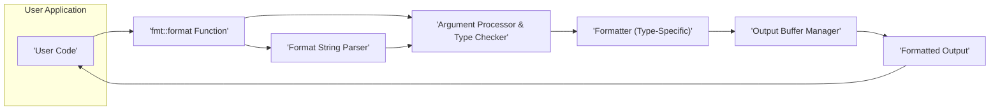
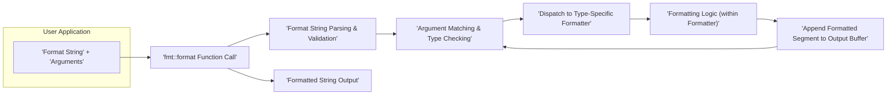

# Project Design Document: fmtlib/fmt

**Version:** 1.1
**Date:** October 26, 2023
**Author:** AI Software Architect

## 1. Introduction

This document provides an enhanced design overview of the `fmtlib/fmt` project, a widely used and highly regarded modern formatting library for C++. This document aims to provide a comprehensive understanding of the library's architecture, key components, and data flow, serving as a robust foundation for subsequent threat modeling activities. It builds upon the previous version by providing more detail and clarity in certain areas.

## 2. Goals and Objectives

The core goals and objectives of the `fmtlib/fmt` library are:

*   To offer a type-safe and performant alternative to traditional C-style formatting (`printf`) and C++ iostreams.
*   To enable compile-time checking of format strings (when using string literals), significantly reducing the risk of format string vulnerabilities.
*   To provide a flexible and extensible mechanism for formatting user-defined types.
*   To maintain a clean and well-documented codebase, promoting ease of use and maintainability.
*   To achieve excellent runtime performance, minimizing overhead compared to alternative formatting methods.
*   To support both header-only integration for simplicity and an optional compiled library for potential performance benefits in specific scenarios.

## 3. Architectural Overview

`fmtlib/fmt` employs a flexible architecture that primarily operates as a header-only library. This design choice allows for seamless integration into projects without requiring separate compilation and linking steps for the core formatting functionality. Optionally, a compiled library can be built and linked against, which can improve compile times in large projects by reducing redundant template instantiations.

The library's central concept involves processing a format string alongside a variable number of arguments. The format string dictates how these arguments are to be rendered into the final output.

*   **User Application:** The C++ code that utilizes the `fmtlib/fmt` library to perform formatting operations.
*   **`fmt::format` Function:** The primary interface for initiating the formatting process. It accepts a format string and a variadic pack of arguments.
*   **Format String Parser:** This component is responsible for analyzing the format string. It identifies literal text and format specifiers (placeholders) that indicate how arguments should be formatted.
*   **Argument Processor & Type Checker:** This component matches the parsed format specifiers with the provided arguments. It performs crucial type checking to ensure that the arguments are compatible with the specified format specifiers, preventing runtime errors.
*   **Formatter (Type-Specific):** A collection of specialized formatting logic tailored to different C++ data types (e.g., integers, floating-point numbers, strings, custom types). These formatters handle the actual conversion of arguments into their string representations according to the format specifiers.
*   **Output Buffer Manager:** This component manages the underlying buffer where the formatted output is constructed. It handles memory allocation and resizing as needed to accommodate the formatted string.
*   **Formatted Output:** The final string resulting from the formatting process, which is then returned to the user application.

## 4. Components

The `fmtlib/fmt` library is composed of several interconnected components, each with a specific responsibility:

*   **Core Formatting Engine:**
    *   This is the central orchestrator of the formatting process.
    *   It manages the overall flow, invoking the parser, argument processor, and type-specific formatters.
    *   Handles basic error conditions and exceptions during formatting.
*   **Format String Parsing and Validation:**
    *   Responsible for meticulously analyzing the format string syntax.
    *   Identifies placeholders, alignment options, width, precision, and type specifiers.
    *   Crucially, performs compile-time validation of format strings when literal strings are used, catching errors early in the development cycle.
*   **Argument Handling and Type Dispatch:**
    *   Manages the variable number of arguments passed to the formatting function.
    *   Uses template metaprogramming to determine the types of the arguments at compile time.
    *   Dispatches each argument to the appropriate type-specific formatter based on its type and the corresponding format specifier.
*   **Built-in Type Formatters:**
    *   A comprehensive set of formatters for standard C++ types:
        *   **Integer Formatters:** Handle formatting of signed and unsigned integers in various bases (decimal, hexadecimal, octal, binary).
        *   **Floating-Point Formatters:**  Manage formatting of `float`, `double`, and `long double` with options for precision, scientific notation, and fixed-point representation.
        *   **String and Character Formatters:** Handle formatting of `std::string`, `char`, and character arrays.
        *   **Pointer Formatters:** Format memory addresses.
        *   **Boolean Formatters:** Format boolean values as `true` or `false`.
*   **Custom Type Formatting Support:**
    *   Provides mechanisms for users to define custom formatting logic for their own classes and structs.
    *   Typically involves specializing the `fmt::formatter` template for the user-defined type.
    *   Allows for seamless integration of custom types into the `fmtlib/fmt` formatting framework.
*   **Output Buffer Management:**
    *   Handles the dynamic allocation and management of the memory buffer used to store the formatted output.
    *   Employs strategies to efficiently resize the buffer as needed to accommodate the formatted string, minimizing memory overhead.
*   **Error Handling and Exception Management:**
    *   Provides robust error handling mechanisms to deal with invalid format strings, type mismatches, and other potential issues during formatting.
    *   Typically throws exceptions of type `fmt::format_error` to signal formatting errors.
*   **Locale Support (Optional):**
    *   Offers optional support for locale-aware formatting, allowing for the output to be formatted according to regional conventions (e.g., number formatting, date and time formatting).
    *   This functionality is often provided through separate header files or extensions.
*   **Compile-Time Checks (Template Metaprogramming):**
    *   A key security feature that leverages C++ templates to perform validation of format strings at compile time when using string literals.
    *   Catches many potential format string errors before runtime, preventing vulnerabilities.

## 5. Data Flow

The data flows through the `fmtlib/fmt` library in a well-defined sequence during a formatting operation:

1. **Input:** The user provides a format string and a set of arguments to the `fmt::format` function.
2. **Function Invocation:** The `fmt::format` function is called, receiving the format string and arguments.
3. **Format String Processing:** The format string parser analyzes the string, identifying literal text and format specifiers. Compile-time validation occurs if the format string is a literal.
4. **Argument Association:** The argument processor matches the parsed format specifiers with the corresponding arguments, performing type checks to ensure compatibility.
5. **Formatter Dispatch:** Based on the type of the argument and the format specifier, the process is dispatched to the appropriate type-specific formatter.
6. **Type-Specific Formatting:** The selected formatter applies the necessary logic to convert the argument into its string representation according to the specified format.
7. **Output Buffering:** The formatted segment (either literal text or the formatted argument) is appended to the output buffer managed by the output buffer manager.
8. **Iteration:** Steps 4-7 are repeated for each format specifier and argument in the format string.
9. **Output Delivery:** Once the entire format string has been processed, the final formatted string is returned to the user application.

## 6. Security Considerations (For Threat Modeling)

This section details potential security considerations relevant for threat modeling the `fmtlib/fmt` library:

*   **Format String Vulnerabilities (Mitigated):**
    *   **Risk:**  If untrusted user input is directly used as a format string, it could potentially lead to information disclosure (reading from the stack) or, in older systems, even arbitrary code execution.
    *   **Mitigation:** `fmtlib/fmt` significantly mitigates this risk by performing compile-time checks on format strings when they are string literals. This catches most common format string errors before runtime. However, dynamically generated format strings still require careful handling.
    *   **Threats:** Information leakage, denial of service.
    *   **Recommendations:** Avoid using user-controlled input directly as format strings. If dynamic format strings are necessary, sanitize and validate them rigorously.
*   **Buffer Overflows (Low Risk):**
    *   **Risk:**  Although `fmtlib/fmt` uses dynamic memory allocation for the output buffer, vulnerabilities could theoretically arise if there are flaws in the buffer resizing logic or if extremely large or deeply nested format strings are processed, potentially leading to excessive memory allocation.
    *   **Mitigation:** `fmtlib/fmt` employs robust buffer management techniques and generally handles memory allocation safely.
    *   **Threats:** Denial of service (due to excessive memory consumption), potential for memory corruption (though less likely with modern C++ memory management).
    *   **Recommendations:** Monitor resource usage if processing extremely large or complex format strings.
*   **Denial of Service (DoS):**
    *   **Risk:**  Maliciously crafted format strings with excessive repetition, deeply nested formatting, or extremely high precision/width specifiers could consume excessive CPU time or memory, leading to a denial of service.
    *   **Mitigation:**  Applications using `fmtlib/fmt` should consider implementing input validation and potentially resource limits to prevent the processing of overly complex format strings.
    *   **Threats:** Application unavailability, resource exhaustion.
    *   **Recommendations:** Implement input validation to restrict the complexity of format strings received from untrusted sources.
*   **Integer Overflows/Underflows in Format Specifiers:**
    *   **Risk:** When handling width or precision specifiers, integer overflows or underflows could potentially lead to unexpected behavior or vulnerabilities if these values are not properly validated.
    *   **Mitigation:** `fmtlib/fmt` likely performs internal checks on these values, but applications should still be mindful of potential issues if these values originate from untrusted sources.
    *   **Threats:** Unexpected formatting behavior, potential for other vulnerabilities if used in calculations.
    *   **Recommendations:** Validate width and precision specifiers if they are derived from external input.
*   **Dependency Vulnerabilities:**
    *   **Risk:** While `fmtlib/fmt` has minimal external dependencies, any dependencies it might have (or future dependencies) could introduce vulnerabilities.
    *   **Mitigation:** Regularly update dependencies and scan for known vulnerabilities using appropriate security tools.
    *   **Threats:** Exploitation of vulnerabilities in dependent libraries.
    *   **Recommendations:** Keep dependencies up to date and perform regular security audits.
*   **Input Validation of Custom Formatters:**
    *   **Risk:** If users implement custom formatters without proper input validation, vulnerabilities could be introduced through these custom formatting routines.
    *   **Mitigation:** Developers implementing custom formatters should follow secure coding practices and perform thorough input validation within their custom formatting logic.
    *   **Threats:**  Varies depending on the logic of the custom formatter, could range from information disclosure to code execution.
    *   **Recommendations:**  Provide clear guidelines and best practices for developing secure custom formatters.

## 7. Deployment

`fmtlib/fmt` offers flexible deployment options:

*   **Header-Only Integration:** The most common method. Simply include the necessary header files (e.g., `<fmt/core.h>`, `<fmt/format.h>`) in your C++ source files. The compiler will then include the library's implementation directly. This simplifies project setup and distribution.
*   **Compiled Library Linking:**  Alternatively, you can build `fmtlib/fmt` as a separate shared or static library and link against it during the linking phase of your build process. This can potentially reduce compile times in large projects by avoiding redundant template instantiations across multiple compilation units.

## 8. Future Considerations

Potential future developments and considerations for `fmtlib/fmt` include:

*   **Adoption into the C++ Standard Library:** There have been proposals and discussions about incorporating a formatting library similar to `fmtlib/fmt` into the C++ standard. This would further solidify its importance and encourage wider adoption.
*   **Further Performance Optimizations:** Continuous efforts to improve the runtime performance of the library, potentially through algorithmic improvements or leveraging new language features.
*   **Enhanced Security Features:** Exploring additional mechanisms to further mitigate potential vulnerabilities, such as more sophisticated static analysis or runtime checks.
*   **Expanded Locale Support:**  Adding more comprehensive and fine-grained control over locale-specific formatting options.
*   **Integration with Other Libraries:** Potential for tighter integration with other popular C++ libraries and frameworks.

This improved design document provides a more detailed and nuanced understanding of the `fmtlib/fmt` project. The enhanced descriptions of components, data flow, and security considerations offer a stronger foundation for effective threat modeling activities.
