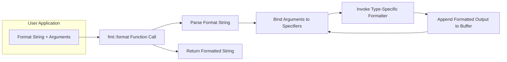

# Project Design Document: fmtlib/fmt

**Version:** 1.1
**Date:** October 26, 2023
**Author:** AI Software Architect

## 1. Introduction

This document provides a detailed design overview of the `fmtlib/fmt` project, a modern, open-source formatting library for C++. This document aims to capture the key architectural elements, components, and data flow within the library, with a specific focus on aspects relevant to security considerations and threat modeling.

## 2. Goals and Objectives

The primary goals of the `fmtlib/fmt` library are:

*   Provide a type-safe and efficient alternative to traditional C-style `printf` and C++ iostreams for formatting output. This includes preventing format string vulnerabilities.
*   Offer compile-time format string checking (when using literal format strings) to proactively identify and prevent potential formatting errors and security issues.
*   Support user-defined types and custom formatting through an extensible mechanism.
*   Maintain a clean, well-documented, and easily maintainable codebase.
*   Deliver excellent performance, often outperforming standard library alternatives.
*   Offer flexible integration options, primarily as a header-only library, with an optional compiled library for specific use cases.

## 3. Architectural Overview

`fmtlib/fmt` is designed with a modular architecture centered around the processing of a format string and a corresponding set of arguments. The core of the library is implemented as header files, facilitating direct inclusion into user projects. An optional compiled library is available for scenarios where compile-time is a significant concern.

The library's operation begins with the `fmt::format` function, which orchestrates the parsing of the format string, the processing of arguments, and the generation of the formatted output.

```mermaid
graph LR
    subgraph "User Application"
        A["User Code"]
    end
    B["fmt::format(\"format string\", args...)"]
    C["Format String Parser"]
    D["Argument Binder"]
    E["Type-Specific Formatter"]
    F["Output Buffer"]

    A --> B
    B --> C
    B --> D
    C --> D
    D --> E
    E --> F
    F --> B
```

*   **User Application:** The C++ code that invokes the `fmtlib/fmt` library to perform formatting operations.
*   **`fmt::format("format string", args...)`:** The primary function call that initiates the formatting process, taking a format string and a variable number of arguments.
*   **Format String Parser:** This component analyzes the format string, identifying literal text and format specifiers (e.g., `{}`, `{:<10}`, `{:.2f}`). It extracts information about argument indices, formatting flags, widths, and precisions.
*   **Argument Binder:** Responsible for associating the parsed format specifiers with the corresponding arguments passed to the `fmt::format` function. It performs basic type checking to ensure compatibility between the format specifier and the argument type.
*   **Type-Specific Formatter:** A collection of specialized formatting logic tailored to different C++ data types (e.g., integers, floating-point numbers, strings, pointers). These formatters handle the conversion of arguments into their string representations according to the specified format.
*   **Output Buffer:** A dynamically managed buffer where the formatted output is constructed incrementally. This buffer grows as needed to accommodate the formatted string.

## 4. Components

The `fmtlib/fmt` library comprises several key components working in concert:

*   **Core Formatting Engine:**
    *   The central logic that drives the formatting process.
    *   Manages the overall flow, coordinating the parser, binder, and formatters.
    *   Handles error conditions and exceptions during formatting.
*   **Format String Parsing and Validation:**
    *   Implements the rules for interpreting the syntax of format strings, including placeholders, alignment, padding, width, precision, and type specifiers.
    *   Performs compile-time validation of format strings when they are string literals, catching errors before runtime. This is a crucial security feature.
*   **Argument Binding and Type Checking:**
    *   Matches format specifiers with the provided arguments, ensuring the correct number of arguments is supplied.
    *   Performs basic type compatibility checks to prevent common errors (e.g., trying to format a string as an integer).
*   **Built-in Type Formatters:**
    *   Provides specialized formatting logic for standard C++ types:
        *   Integral types (int, long, etc.) with support for different bases (decimal, hexadecimal, octal).
        *   Floating-point types (float, double) with control over precision and representation (fixed, scientific).
        *   String types (std::string, char arrays) with alignment and width options.
        *   Character types (char, wchar_t).
        *   Boolean types.
        *   Pointer types.
*   **Custom Formatter Interface:**
    *   Allows users to define custom formatting logic for their own user-defined types.
    *   Involves specializing the `fmt::formatter` struct for the target type, providing a `format` method that handles the conversion to a string representation.
*   **Output Buffer Management:**
    *   Handles the allocation and resizing of the internal buffer used to store the formatted output.
    *   Typically uses dynamic memory allocation to accommodate varying output lengths.
*   **Error Handling and Exceptions:**
    *   Provides mechanisms for reporting errors encountered during formatting, such as invalid format strings or type mismatches.
    *   Primarily uses exceptions (derived from `fmt::format_error`) to signal errors.
*   **Locale Support (Optional):**
    *   Offers optional support for locale-aware formatting, affecting aspects like number grouping and decimal separators.
    *   Requires explicit configuration and usage.
*   **Compile-Time Checks (Template Metaprogramming):**
    *   Leverages C++ template metaprogramming to perform static analysis of format strings at compile time when they are known literals.
    *   This allows for early detection of format string errors, significantly reducing the risk of format string vulnerabilities.

## 5. Data Flow

The sequence of operations during a typical formatting call in `fmtlib/fmt` is as follows:



1. **Input:** The user provides a format string and a variable number of arguments to the `fmt::format` function.
2. **Function Invocation:** The `fmt::format` function is called, receiving the format string and arguments.
3. **Format String Parsing:** The `Format String Parser` analyzes the format string, identifying placeholders and format specifiers.
4. **Argument Binding:** The `Argument Binder` matches the parsed format specifiers with the corresponding arguments, performing basic type checks.
5. **Type-Specific Formatting:** Based on the type of the argument and the format specifier, the appropriate `Type-Specific Formatter` is invoked to convert the argument into its string representation.
6. **Output Buffering:** The formatted string representation of the argument is appended to the `Output Buffer`. This process repeats for each argument.
7. **Output Return:** Once all arguments are processed, the `fmt::format` function returns the final formatted string from the `Output Buffer`.

## 6. Security Considerations (For Threat Modeling)

This section details potential security considerations relevant for threat modeling the `fmtlib/fmt` library:

*   **Format String Vulnerabilities (Mitigated):**
    *   **Risk:** If user-controlled input is directly used as a format string, it could potentially lead to information disclosure or, in older systems, arbitrary code execution.
    *   **Mitigation:** `fmtlib/fmt` significantly mitigates this risk through compile-time checks for literal format strings. When a format string is a string literal, the library can validate it at compile time, preventing many common format string vulnerabilities. However, dynamically generated format strings still require careful handling by the user.
    *   **Threats:** Information leakage (reading from the stack or other memory locations), denial of service (crashing the application due to invalid memory access).
    *   **User Responsibility:** When using dynamic format strings, ensure proper sanitization and validation of the format string content.
*   **Buffer Overflows (Highly Unlikely):**
    *   **Risk:** Although `fmtlib/fmt` uses dynamic memory allocation for the output buffer, potential vulnerabilities could theoretically arise if there are flaws in the buffer resizing logic or if extremely large format strings are processed leading to excessive memory allocation.
    *   **Mitigation:** `fmtlib/fmt` employs robust buffer management techniques and dynamic allocation, making buffer overflows highly unlikely in typical usage scenarios.
    *   **Threats:** Denial of service (due to excessive memory consumption), potential for memory corruption (though less likely with modern memory management).
*   **Denial of Service (DoS):**
    *   **Risk:** Maliciously crafted format strings with excessive repetition, deeply nested formatting, or extremely large width/precision specifiers could consume excessive computational resources (CPU, memory), potentially leading to a denial of service.
    *   **Mitigation:** While `fmtlib/fmt` itself doesn't impose strict limits on format string complexity, applications using the library should consider implementing input validation and resource limits to prevent abuse.
    *   **Threats:** Application unavailability, resource exhaustion.
*   **Integer Overflows/Underflows in Formatting Logic:**
    *   **Risk:** When handling width or precision specifiers, integer overflows or underflows in the internal formatting logic could potentially lead to unexpected behavior or vulnerabilities.
    *   **Mitigation:** `fmtlib/fmt`'s implementation should carefully handle integer arithmetic related to formatting parameters to prevent overflows or underflows.
    *   **Threats:** Unexpected formatting output, potential for other unforeseen vulnerabilities if these values are used in memory calculations.
*   **Dependency Vulnerabilities:**
    *   **Risk:** Although `fmtlib/fmt` is designed to be mostly self-contained, any external dependencies (if introduced in the future) could introduce vulnerabilities.
    *   **Mitigation:** Regularly review and update any dependencies. For the current header-only nature, this risk is minimal.
    *   **Threats:** Exploitation of vulnerabilities in dependent libraries.
*   **Input Validation of Custom Formatters:**
    *   **Risk:** If users implement custom formatters without proper input validation, vulnerabilities could be introduced. For example, a custom formatter might be susceptible to buffer overflows if it doesn't handle input data correctly.
    *   **Mitigation:** Users are responsible for ensuring the security of their custom formatters. `fmtlib/fmt` provides the framework but doesn't enforce security within custom formatter implementations.
    *   **Threats:** Vulnerabilities specific to the custom formatter implementation, potentially leading to crashes, information disclosure, or other issues.

## 7. Deployment

`fmtlib/fmt` offers flexible deployment options:

*   **Header-Only Integration:** The most common method. Simply include the necessary header files (e.g., `fmt/core.h`, `fmt/format.h`) in your C++ project. This requires no separate compilation or linking of the `fmt` library itself.
*   **Compiled Library Linking:** Alternatively, you can build `fmtlib/fmt` as a separate compiled library and link against it. This can potentially reduce compile times in large projects, as the `fmt` library's code is compiled only once.

## 8. Future Considerations

Potential future developments and considerations that could impact the design and security of `fmtlib/fmt` include:

*   **Expansion of Formatting Capabilities:** Adding support for new data types, formatting options, or internationalization features.
*   **Performance Enhancements:** Continuously optimizing the performance of the formatting engine.
*   **Formal Security Audits:** Conducting formal security audits to identify and address potential vulnerabilities.
*   **Integration with Standard Library:** Potential future integration or alignment with standard C++ library features for formatting.
*   **Enhanced Compile-Time Safety:** Exploring further opportunities for compile-time checks and validations to improve safety and prevent errors.

This improved design document provides a more detailed and nuanced overview of the `fmtlib/fmt` project, with a strong emphasis on security considerations relevant for threat modeling. It clarifies the responsibilities of different components, the flow of data, and potential security implications, along with mitigation strategies.
