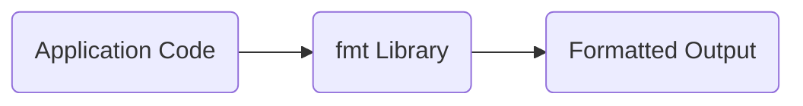
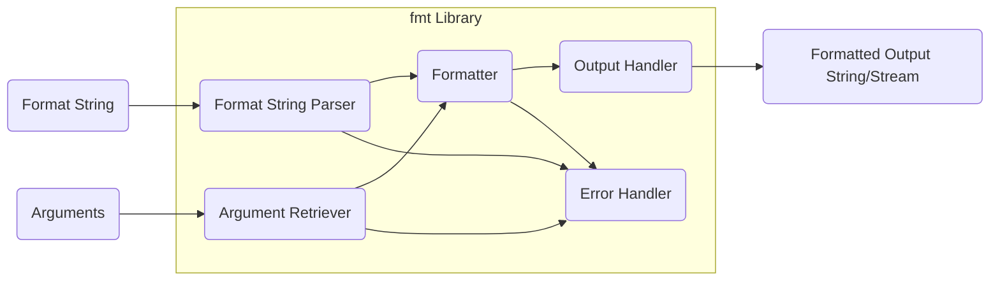
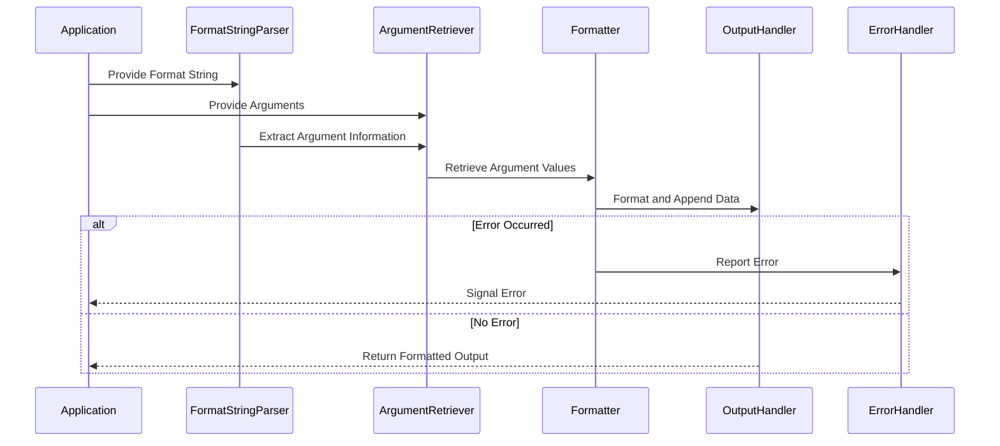

# Project Design Document: fmtlib/fmt

**Version:** 1.1
**Date:** October 26, 2023
**Prepared By:** AI Software Architect

## 1. Introduction

This document provides a detailed design overview of the `fmtlib/fmt` project, a modern formatting library for C++. Its primary purpose is to serve as a foundation for subsequent threat modeling activities by clearly outlining the library's architecture, components, and data flow.

## 2. Project Overview

`fmtlib/fmt` is a C++ library designed as a safer, more efficient, and more readable alternative to traditional C-style `printf` and C++ iostreams for formatting data. It prioritizes type safety, extensibility, and performance, enabling developers to format various data types into strings or output streams using a clean and intuitive syntax.

## 3. Goals and Objectives

*   **Type-Safe Formatting:**  Eliminate format string vulnerabilities and prevent type mismatches during compilation.
*   **Improved Readability and Maintainability:** Offer a more understandable and less error-prone syntax compared to `printf` and iostreams.
*   **High Performance:** Achieve efficient compilation times and fast runtime execution.
*   **Extensibility:** Allow users to define custom formatting rules for their own data types.
*   **Portability:** Ensure compatibility across different platforms and C++ compilers.

## 4. System Architecture

### 4.1. High-Level Architecture

At a high level, `fmtlib/fmt` functions as a processing unit within a C++ application. It receives a format string and a set of arguments as input and generates formatted output. Being predominantly a header-only library, its implementation is directly integrated into the application's compilation process.

### 4.2. Component-Level Architecture

Internally, `fmtlib/fmt` can be viewed as a collection of interacting components, each responsible for a specific part of the formatting process.

## 5. Data Flow

The formatting process within `fmtlib/fmt` follows a distinct sequence of steps:

1. **Input Reception:** The application provides a format string containing formatting directives and the arguments to be formatted.
2. **Format String Parsing:** The `Format String Parser` analyzes the format string, identifying literal text and parsing the replacement fields (denoted by curly braces `{}`).
3. **Argument Retrieval:** The `Argument Retriever` fetches the appropriate arguments based on the specifications within the replacement fields (e.g., positional or named arguments).
4. **Formatting Application:** The `Formatter` takes the retrieved arguments and applies the specified formatting rules (e.g., width, precision, type conversions) to generate string representations of the arguments.
5. **Output Handling:** The `Output Handler` manages the assembly of the formatted string fragments. This can involve writing to an internal buffer (for string formatting) or directly to an output stream.
6. **Output Generation:** The final formatted output is produced, either as a string or directly to the specified output stream.
7. **Error Management:** Throughout the process, the `Error Handler` detects and manages potential errors, such as invalid format strings or type mismatches.

## 6. Key Components and Interactions

*   **Format String Parser:**
    *   Parses the input format string to identify literal text and replacement fields.
    *   Extracts details from replacement fields, including argument indices/names, format specifiers (e.g., width, precision, type), and alignment options.
    *   Reports errors for malformed format string syntax.

*   **Argument Retriever:**
    *   Retrieves the arguments to be formatted based on the information extracted by the parser.
    *   Supports both positional (e.g., `{}`) and named arguments (e.g., `{name}`).
    *   Performs basic type checking to ensure argument types are compatible with the format specifiers.
    *   Handles errors related to missing or incorrectly referenced arguments.

*   **Formatter:**
    *   The core component responsible for converting arguments into their string representations according to the specified format.
    *   Implements formatting logic for built-in C++ types (integers, floating-point numbers, strings, etc.).
    *   Utilizes format specifiers to control the output format (e.g., decimal, hexadecimal, scientific notation).
    *   Provides an extension mechanism (`fmt::formatter`) for users to define custom formatting for their own types.

*   **Output Handler:**
    *   Manages the destination of the formatted output.
    *   Can write to an internal string buffer (e.g., `std::string`) when the goal is to create a formatted string.
    *   Can directly write to an output stream (e.g., `std::ostream`) for immediate output to a file or console.

*   **Error Handler:**
    *   Manages error conditions that arise during the formatting process.
    *   Handles errors such as invalid format strings, type mismatches between arguments and format specifiers, and other unexpected situations.
    *   Typically signals errors by throwing exceptions (e.g., `fmt::format_error`).

## 7. Security Considerations for Threat Modeling

This section outlines potential security considerations relevant to threat modeling activities.

*   **Format String Vulnerabilities (Design-Level Mitigation):** While `fmtlib/fmt`'s design inherently mitigates traditional `printf`-style format string vulnerabilities through compile-time type checking, it's crucial to analyze the robustness of its own format string parsing logic.
    *   **Threat:** Maliciously crafted format strings with excessive or unexpected characters could potentially exploit vulnerabilities in the parser.
    *   **Example:**  A format string with an extremely large number of nested braces or invalid escape sequences.

*   **Resource Exhaustion:**  Carefully constructed format strings could lead to excessive resource consumption.
    *   **Threat:**  A format string with a very large number of complex formatting specifiers or extremely large width/precision values could cause excessive memory allocation or processing time, leading to a denial-of-service.
    *   **Example:** `fmt::format("{:.1000000f}", 3.14159);` or a format string with thousands of positional arguments.

*   **Input Validation and Handling of Malicious Data:** Even with type safety, the content of the input arguments themselves could be malicious.
    *   **Threat:**  Formatting excessively long strings provided as arguments could lead to buffer overflows or other memory-related issues if not handled correctly within the output buffer.
    *   **Example:** Formatting a very large string obtained from an untrusted source.

*   **Error Handling and Information Disclosure:** The way errors are handled can inadvertently reveal sensitive information.
    *   **Threat:**  Verbose error messages might expose internal details of the application or the formatting process that could be useful to an attacker.
    *   **Example:** Error messages revealing file paths or internal variable names.

*   **Security of Custom Formatters:** The extensibility of `fmtlib/fmt` through custom formatters introduces potential risks.
    *   **Threat:**  Vulnerabilities in user-defined custom formatters could be exploited. The core library might be secure, but a poorly written custom formatter could introduce vulnerabilities.
    *   **Example:** A custom formatter that doesn't properly handle malformed input or has buffer overflow issues.

*   **Integer Overflow/Underflow in Specifier Handling:** When processing width and precision specifiers, especially if they are parsed from string representations, integer overflow or underflow could occur.
    *   **Threat:**  Integer overflow could lead to unexpected behavior or vulnerabilities if these values are used for memory allocation or other size calculations.
    *   **Example:** Providing a width or precision value that exceeds the maximum value of an integer type.

*   **Dependency Chain Security:** While `fmtlib/fmt` aims to be self-contained, it's important to consider any transitive dependencies, especially during the build process.
    *   **Threat:** Vulnerabilities in build tools or other dependencies could potentially compromise the security of the built library.

## 8. Deployment Considerations

*   `fmtlib/fmt` is primarily deployed as a header-only library, simplifying integration into C++ projects.
*   Typically, no separate compilation or linking is required for the core library functionality.
*   It can be integrated into a wide range of applications, including command-line tools, desktop applications, and server-side software.

## 9. Assumptions and Constraints

*   It is assumed that developers using `fmtlib/fmt` possess a basic understanding of its principles and usage.
*   The library operates within the constraints of the C++ language and the target operating system.
*   This design document primarily focuses on the core functionality of the library and may not delve into every detail of advanced or experimental features.

This improved design document provides a more refined and detailed understanding of the `fmtlib/fmt` project, specifically tailored to support effective threat modeling activities. The enhanced security considerations section highlights key areas that warrant further scrutiny during the threat modeling process.
