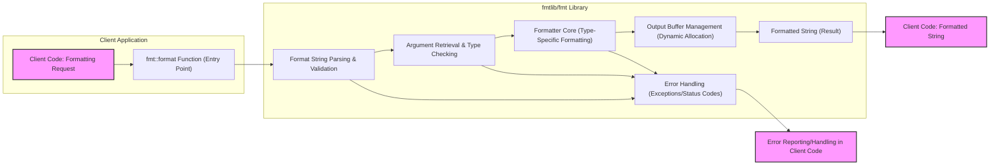
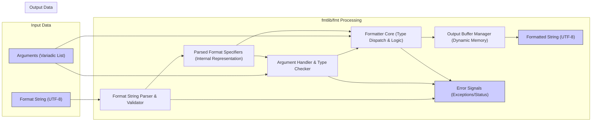

# Project Design Document: fmtlib/fmt

**Project Name:** fmtlib/fmt

**Project Repository:** [https://github.com/fmtlib/fmt](https://github.com/fmtlib/fmt)

**Version:** (Design based on current main branch as of October 26, 2023)

**1. Introduction**

fmtlib/fmt is a widely adopted, open-source formatting library for C++. It is designed as a safer, more performant, and extensible alternative to traditional C-style `printf` and C++ iostreams for text formatting.  Key design goals include:

* **Safety:**  Eliminating format string vulnerabilities and buffer overflows through compile-time and runtime checks, and type safety.
* **Performance:** Achieving formatting speeds comparable to or exceeding `printf` and iostreams, crucial for performance-sensitive applications.
* **Extensibility:** Providing a flexible mechanism for users to define custom formatters for their own data types, promoting code reusability and adaptability.
* **Ease of Use:** Offering a clean, intuitive, and modern syntax that simplifies formatting tasks and improves developer productivity.
* **Portability:** Ensuring cross-platform compatibility across various operating systems and compilers, maximizing code reusability.

This document provides a detailed design overview of the fmtlib/fmt library. It is intended to be used as a basis for threat modeling and security analysis, outlining the system's architecture, core components, data flow, and underlying technology stack with a focus on security-relevant aspects.

**2. System Architecture**

fmtlib/fmt is primarily implemented as a header-only library, meaning the core formatting logic is embedded directly into client code during compilation. This design choice offers performance benefits and simplifies deployment. The formatting process within fmtlib/fmt can be conceptually divided into distinct stages, as illustrated below:

**3. Component Description**

The fmtlib/fmt library is structured into several key components, each responsible for a specific aspect of the formatting process. Understanding these components is crucial for threat modeling.

* **3.1. `fmt::format` Function (Entry Point & Orchestration):**
    * **Purpose:** Serves as the primary interface for users to initiate formatting operations. It accepts a format string and a variable number of arguments.
    * **Functionality:**
        * **Input Validation:** Performs initial checks on input arguments, although primary validation is delegated to subsequent components.
        * **Orchestration:**  Acts as the central coordinator, invoking the format string parser, argument handler, formatter core, and output buffer manager in sequence.
        * **Error Handling Initiation:**  Sets up error handling context and propagates errors from downstream components back to the client.
        * **Output Delivery:** Returns the final formatted string (typically as `std::string`) or writes to a specified output sink (e.g., `std::ostream`, user-provided buffer).
    * **Security Relevance:** As the entry point, it's the first line of defense against malicious input. Robust input validation and error handling starting here are critical.

* **3.2. Format String Parsing & Validation:**
    * **Purpose:**  Analyzes the format string to extract literal text and interpret format specifiers, ensuring the format string conforms to the library's syntax.
    * **Functionality:**
        * **Lexical Analysis:** Scans the format string character by character, identifying tokens (literal text, format specifiers, escape sequences).
        * **Syntax Validation:**  Checks for syntax errors in format specifiers (e.g., unmatched braces, invalid flags, incorrect argument indices).
        * **Format Specifier Decomposition:**  Parses format specifiers within curly braces `{}` to extract:
            * **Argument Indexing:** Determines argument position (implicit or explicit numerical indexing).
            * **Format Flags:** Extracts flags for alignment, sign, padding, alternate form, etc.
            * **Width & Precision:** Parses width and precision values, potentially from format string or arguments.
            * **Conversion Specifiers:** Identifies conversion types (e.g., `d`, `x`, `s`, `f`, `p`).
        * **Escape Sequence Handling:** Processes escape sequences like `{{` and `}}` to output literal braces.
    * **Security Relevance:**  This component is crucial for preventing format string vulnerabilities. Robust parsing and validation are essential to reject malformed or potentially malicious format strings that could exploit parsing logic flaws or lead to unexpected behavior.  Denial of Service (DoS) attacks could target this component by providing extremely complex format strings designed to consume excessive parsing resources.

* **3.3. Argument Retrieval & Type Checking:**
    * **Purpose:**  Retrieves arguments based on parsed format specifiers and verifies that argument types are compatible with the specified conversion specifiers.
    * **Functionality:**
        * **Argument Mapping:** Associates format specifiers with corresponding arguments based on implicit order or explicit indices.
        * **Type Introspection (Templates & Compile-Time Checks):** Leverages C++ templates and compile-time mechanisms to determine argument types.
        * **Type Compatibility Validation:**  Checks if the argument type is compatible with the conversion specifier (e.g., ensuring an integer argument is provided for `%d`).
        * **Custom Formatter Dispatch:**  For user-defined types, dispatches to user-provided custom formatter functions based on type information.
        * **Argument Access & Potential Copying/Moving:** Retrieves argument values, potentially copying or moving them as needed for formatting.
    * **Security Relevance:** Type safety is a core security feature of fmtlib/fmt. This component enforces type checks to prevent type confusion vulnerabilities and ensure that arguments are handled in a type-safe manner.  Incorrect type handling could lead to unexpected behavior or even memory corruption in vulnerable scenarios.  Custom formatters, while powerful, introduce a potential security surface if not carefully implemented by users.

* **3.4. Formatter Core (Type-Specific Formatting Logic):**
    * **Purpose:**  Implements the core formatting algorithms for built-in C++ types and dispatches to custom formatters for user-defined types.
    * **Functionality:**
        * **Type-Specific Formatting:** Contains specialized formatting routines for each supported built-in type (integers, floating-point numbers, strings, characters, pointers, booleans, etc.).
        * **Format Flag Application:** Applies format flags (alignment, padding, width, precision, sign, etc.) according to the parsed format specifiers.
        * **Conversion Logic:** Performs necessary type conversions (e.g., integer to string representation, floating-point to string with specified precision).
        * **Custom Formatter Invocation:**  Calls user-defined custom formatter functions for user-defined types, passing the argument and format context.
        * **Output Generation (Fragmented):** Generates formatted text fragments, which are then passed to the output buffer manager.
    * **Security Relevance:**  This component is responsible for the actual transformation of data into formatted strings.  It must be implemented carefully to avoid buffer overflows, integer overflows during calculations (e.g., width/precision calculations), and other vulnerabilities related to data manipulation.  The security of custom formatters depends entirely on user implementation, making them a potential area of concern if not properly audited.

* **3.5. Output Buffer Management (Dynamic Allocation & Efficiency):**
    * **Purpose:**  Manages the buffer where the formatted string is constructed, ensuring efficient memory usage and preventing buffer overflows.
    * **Functionality:**
        * **Dynamic Buffer Allocation:**  Allocates memory for the output buffer dynamically, resizing as needed to accommodate the formatted string.
        * **Buffer Growth Strategy:** Employs a strategy for buffer resizing (e.g., exponential growth) to balance memory usage and performance.
        * **Formatted Text Appending:**  Efficiently appends formatted text fragments received from the formatter core to the output buffer.
        * **Output Destination Handling:**  Provides mechanisms to write the formatted string to different output destinations, such as `std::string`, `std::ostream`, or user-provided buffers.
        * **Memory Deallocation:**  Releases allocated buffer memory when the formatting operation is complete.
    * **Security Relevance:** Dynamic buffer management is a key defense against buffer overflows.  Proper implementation of dynamic allocation and resizing is crucial to ensure that the library never writes beyond allocated memory boundaries. Memory leaks are also a potential concern if buffer management is not handled correctly, although less directly a security vulnerability, they can contribute to instability.

* **3.6. Error Handling (Exceptions & Status Codes):**
    * **Purpose:**  Manages errors that may occur during any stage of the formatting process, providing informative error reporting and preventing unexpected program termination.
    * **Functionality:**
        * **Error Detection:** Detects various error conditions, including format string syntax errors, type mismatches, invalid format specifiers, and potential resource allocation failures.
        * **Exception Handling (Default):**  By default, fmtlib/fmt uses exceptions to signal errors, allowing client code to catch and handle formatting failures gracefully.
        * **Status Code/Error Code Support (Optional):**  May provide options for error reporting using status codes or error codes for environments where exceptions are undesirable or disabled.
        * **Error Message Generation:**  Generates informative error messages to aid in debugging and error diagnosis.
        * **Error Propagation:**  Propagates errors back up the call stack to the `fmt::format` entry point and ultimately to the client application.
    * **Security Relevance:** Robust error handling is essential for preventing unexpected program behavior and potential security vulnerabilities.  Clear error messages can help developers identify and fix issues quickly.  Exception safety ensures that errors are handled in a controlled manner, preventing crashes or undefined behavior that could be exploited.  Careful handling of error conditions also prevents information leakage through overly verbose or insecure error messages in production environments.

**4. Data Flow Diagram (Detailed)**

This diagram provides a more detailed view of the data flow within fmtlib/fmt, highlighting the interactions between components and the data transformations that occur.

**Detailed Data Flow Steps:**

1. **Input Reception:** The `fmt::format` function receives the format string (typically UTF-8 encoded) and a variadic list of arguments from the client code.
2. **Format String Parsing & Validation:** The "Format String Parser & Validator" component (C) takes the format string (A) as input. It performs lexical analysis and syntax validation, generating "Parsed Format Specifiers" (D) in an internal representation.  If parsing or validation errors occur, the "Error Handler" (I) is invoked.
3. **Argument Handling & Type Checking:** The "Argument Handler & Type Checker" component (E) receives the "Parsed Format Specifiers" (D) and the arguments (B). It maps specifiers to arguments, performs type compatibility checks, and retrieves argument values. Type errors are reported to the "Error Handler" (I).
4. **Formatter Core (Type Dispatch & Logic):** The "Formatter Core" (F) receives "Parsed Format Specifiers" (D), arguments (B), and type information from the previous stages. It dispatches to type-specific formatting logic based on the conversion specifiers and argument types. It applies format flags and generates formatted text fragments. Errors during formatting are reported to the "Error Handler" (I).
5. **Output Buffer Management:** The "Output Buffer Manager" (G) receives formatted text fragments from the "Formatter Core" (F). It dynamically manages the output buffer, appending fragments and resizing as needed.
6. **Formatted String Output:** Once formatting is complete, the "Output Buffer Manager" (G) provides the "Formatted String Data" (H), typically as a UTF-8 encoded string. This string is returned to the client code via the `fmt::format` function.
7. **Error Reporting:** If any errors occurred during parsing, argument handling, or formatting, the "Error Handler" (I) signals these errors to the client code, typically through exceptions or status codes (J).

**5. Technology Stack**

* **Programming Language:** C++ (primarily targeting C++11 and later standards, with ongoing evolution to incorporate newer C++ features).
* **Build System:** CMake (cross-platform build automation).
* **Standard Library Reliance:**  Extensive use of the C++ Standard Library (STL), including:
    * `<string>`: String manipulation and storage.
    * `<vector>`: Dynamic arrays for internal data structures.
    * `<algorithm>`: Standard algorithms for parsing and processing.
    * `<type_traits>`: Compile-time type introspection and manipulation.
    * `<iostream>` (Optional): For `std::ostream` output support, but core formatting is independent.
    * `<locale>` (Optional): For locale-aware formatting, if enabled.
* **Header-Only Design (Core Library):**  The core formatting functionality is implemented as a header-only library, facilitating easy integration and compilation directly into client projects.  A compiled library is also available for specific features or build configurations (e.g., for reducing compile times in very large projects).
* **Platform and Compiler Independence:**  Designed for broad cross-platform compatibility, supporting major operating systems (Windows, Linux, macOS, etc.) and compilers (GCC, Clang, MSVC, etc.).  Emphasis on adhering to C++ standards to maximize portability.
* **UTF-8 Encoding:** Primarily designed to handle UTF-8 encoded format strings and output strings, aligning with modern text processing practices.

**6. Security Considerations (Detailed Threat Modeling Input)**

This section expands on security considerations, providing more detailed input for threat modeling activities.

* **6.1. Format String Vulnerabilities (Robust Mitigation):**
    * **Risk:**  Classic `printf`-style format string vulnerabilities are a severe security risk, allowing attackers to potentially read from or write to arbitrary memory locations if user-controlled input is directly used as a format string.
    * **fmtlib/fmt Mitigation Strategies:**
        * **Type Safety by Design:**  fmtlib/fmt's core design inherently prevents classic format string vulnerabilities by enforcing strict type checking between format specifiers and arguments. The format string is treated as a template, not directly executed as code.
        * **Separation of Format String and Arguments:** The format string is always passed as a distinct argument, separate from the data to be formatted. This separation prevents accidental or malicious interpretation of data as format specifiers in typical usage.
        * **Controlled Format Specifier Set:** fmtlib/fmt employs a well-defined and limited set of format specifiers, reducing the attack surface compared to the more complex and potentially dangerous specifiers in `printf`.
        * **Compile-Time and Runtime Checks:**  Type checking is performed both at compile time (where possible through templates) and at runtime to catch type mismatches and invalid format specifiers.
    * **Remaining Considerations for Threat Modeling:** While fmtlib/fmt effectively mitigates *classic* format string vulnerabilities, threat modeling should still consider:
        * **Complex Format String Parsing Logic:**  Are there any edge cases or vulnerabilities in the format string parsing logic itself that could be exploited with carefully crafted, albeit syntactically valid, format strings?
        * **Custom Formatters:**  The security of custom formatters is the responsibility of the user. Threat modeling should consider the potential risks if custom formatters are not implemented securely (e.g., buffer overflows, information disclosure within custom formatting logic).

* **6.2. Input Validation and Sanitization (Format String & Arguments):**
    * **Risk:**  Maliciously crafted format strings or arguments could still attempt to exploit vulnerabilities in the parsing, argument handling, or formatting logic, even if classic format string vulnerabilities are mitigated.
    * **Considerations:**
        * **Format String Complexity Limits:**  Are there limits on format string complexity (e.g., nesting depth, length) to prevent DoS attacks through excessive parsing resource consumption? Threat modeling should explore scenarios with extremely long or deeply nested format strings.
        * **Argument Size and Type Handling:**  How does fmtlib/fmt handle extremely large arguments (e.g., very long strings, large numerical values)? Are there potential integer overflows or other issues when processing argument sizes or lengths?
        * **Unicode and Encoding Issues:**  Given that fmtlib/fmt handles UTF-8, are there any potential vulnerabilities related to Unicode processing, encoding conversions, or handling of invalid UTF-8 sequences in format strings or arguments?
        * **Injection Attacks (Indirect):**  While direct format string injection is prevented, could there be indirect injection vectors? For example, if user-controlled data influences the *choice* of format string (rather than being directly embedded in it), could this lead to vulnerabilities?
    * **Mitigation in fmtlib/fmt:**
        * **Robust Parsing and Validation:**  The format string parser is designed to be robust and reject invalid or malformed format strings.
        * **Type Safety:** Type checking helps prevent unexpected argument types from causing issues.
        * **Error Handling:**  Errors during parsing or validation are handled through exceptions, preventing uncontrolled behavior.

* **6.3. Buffer Overflow (Dynamic Buffer Management as Defense):**
    * **Risk:**  Buffer overflows are a common vulnerability in string formatting if output buffers are not sized correctly.
    * **fmtlib/fmt Mitigation:**
        * **Dynamic Buffer Allocation:**  fmtlib/fmt's dynamic buffer management is the primary defense against buffer overflows. The output buffer grows as needed, preventing writes beyond buffer boundaries.
        * **String Length Estimation (Optimization):**  In some cases, fmtlib/fmt may attempt to estimate the required buffer size beforehand to optimize memory allocation and potentially reduce reallocations.
    * **Remaining Considerations for Threat Modeling:**
        * **Buffer Allocation Failures:**  What happens if dynamic memory allocation fails (e.g., due to memory exhaustion)? How is this error handled, and could it lead to a DoS or other issues?
        * **Buffer Resizing Efficiency:**  While dynamic resizing prevents overflows, inefficient resizing strategies could lead to performance degradation or excessive memory usage in DoS scenarios. Threat modeling could consider scenarios with extremely large output strings.
        * **Integer Overflows in Buffer Size Calculations:**  Are there any potential integer overflows in calculations related to buffer size estimation or resizing logic?

* **6.4. Denial of Service (DoS) Attacks:**
    * **Risk:**  Malicious input could be crafted to cause excessive resource consumption (CPU, memory, time) during formatting, leading to a denial of service.
    * **Potential DoS Vectors:**
        * **Complex Format Strings (Parsing DoS):**  As mentioned earlier, extremely complex or deeply nested format strings could overload the parser.
        * **Very Large Output Strings (Memory Exhaustion):**  Formatting operations that generate extremely large output strings could consume excessive memory, leading to memory exhaustion and DoS.
        * **Inefficient Formatting Logic:**  While fmtlib/fmt is designed for performance, are there specific format specifier combinations or argument types that could trigger inefficient formatting logic and lead to CPU-bound DoS?
        * **Recursive or Infinite Formatting (Less Likely, but Consider):**  Although not immediately obvious, threat modeling should consider if there are any theoretical scenarios (even if unlikely in the current design) that could lead to infinite loops or unbounded recursion during formatting.
    * **Mitigation in fmtlib/fmt:**
        * **Performance Optimization:**  fmtlib/fmt is generally designed for performance, which helps mitigate some DoS risks.
        * **Resource Limits (Implicit):**  System-level resource limits (memory limits, CPU quotas) can provide some protection against DoS, although they are not specific to fmtlib/fmt.
    * **Recommendations for DoS Resilience:**
        * **Consider Adding Explicit Limits:**  Explore adding optional limits on format string complexity, maximum output string length, or formatting time to provide more explicit DoS protection if needed for highly sensitive environments.
        * **Resource Monitoring:**  In applications using fmtlib/fmt in critical contexts, consider monitoring resource usage (CPU, memory) during formatting operations to detect and respond to potential DoS attacks.

* **6.5. Error Handling and Resilience (Exception Safety & Graceful Degradation):**
    * **Risk:**  Improper error handling can lead to crashes, undefined behavior, or information leakage.
    * **Considerations:**
        * **Exception Safety:**  Is fmtlib/fmt exception-safe? Does it guarantee that exceptions thrown during formatting will not leave the system in an inconsistent state or leak resources?
        * **Error Message Security:**  Are error messages informative but also secure? Do they avoid disclosing sensitive information that could be useful to attackers?
        * **Graceful Degradation:**  In error scenarios, does fmtlib/fmt degrade gracefully? Does it avoid crashing or exhibiting undefined behavior? Can it provide a reasonable fallback or error indication to the client application?
        * **Error Logging and Auditing:**  Are formatting errors logged or auditable?  Logging formatting errors can be valuable for debugging and security monitoring.
    * **Mitigation in fmtlib/fmt:**
        * **Exception-Based Error Handling (Default):**  Exceptions provide a structured way to handle errors and prevent uncontrolled program flow.
        * **Informative Error Messages:**  fmtlib/fmt aims to provide informative error messages to aid in debugging.
    * **Recommendations:**
        * **Review Exception Safety:**  Thoroughly review the code for exception safety, especially in error handling paths and resource management.
        * **Error Message Sanitization (If Necessary):**  In security-sensitive contexts, consider sanitizing error messages to remove potentially sensitive information before logging or displaying them.
        * **Consider Status Code Error Handling (Optional):**  For environments where exceptions are strictly prohibited, ensure that the optional status code/error code error handling mechanisms are robust and secure.

* **6.6. Dependency Security (Primarily Header-Only, but Consider Build Dependencies):**
    * **Risk:**  Although fmtlib/fmt is primarily header-only, build-time dependencies (like CMake) and any compiled components could introduce security risks if they contain vulnerabilities.
    * **Considerations:**
        * **CMake Security:**  Ensure that the CMake build system and any CMake scripts used in fmtlib/fmt are secure and up-to-date.
        * **Compiled Library Dependencies (If Applicable):**  If using the compiled library version of fmtlib/fmt, consider the security of any runtime dependencies it might have (though typically minimal for a formatting library).
        * **Supply Chain Security:**  For organizations with strict supply chain security requirements, consider the provenance and integrity of the fmtlib/fmt source code and build artifacts.
    * **Mitigation in fmtlib/fmt:**
        * **Minimal Dependencies:**  The header-only nature minimizes runtime dependencies.
        * **Open Source and Community Review:**  Being open source and widely used, fmtlib/fmt benefits from community review and scrutiny, which can help identify and address security issues.
    * **Recommendations:**
        * **Regularly Update Build Tools:** Keep CMake and other build tools up-to-date to patch any known vulnerabilities.
        * **Source Code Auditing (For High-Security Environments):**  For very high-security environments, consider performing independent security audits of the fmtlib/fmt source code.

* **6.7. Memory Management Security (Beyond Buffer Overflows):**
    * **Risk:**  Memory management issues beyond buffer overflows, such as memory leaks, use-after-free vulnerabilities (less likely in fmtlib/fmt's design, but worth considering), or double-free vulnerabilities, could potentially be exploited.
    * **Considerations:**
        * **Memory Leaks:**  Are there any scenarios where memory allocated by fmtlib/fmt might be leaked, especially in error handling paths or during exception handling?
        * **Use-After-Free/Double-Free:**  While less likely in a well-designed library like fmtlib/fmt, threat modeling should briefly consider if there are any theoretical scenarios where memory could be freed prematurely or freed multiple times.
        * **Resource Exhaustion (Memory):**  DoS attacks could target memory exhaustion by triggering excessive memory allocation within fmtlib/fmt.
    * **Mitigation in fmtlib/fmt:**
        * **RAII (Resource Acquisition Is Initialization):**  C++ RAII principles are likely used in fmtlib/fmt to manage memory and other resources, reducing the risk of leaks and other memory management errors.
        * **Dynamic Buffer Management:**  Dynamic buffer management, while primarily for overflow prevention, also helps manage memory efficiently.
    * **Recommendations:**
        * **Memory Leak Testing:**  Perform memory leak testing (e.g., using Valgrind or similar tools) to identify and fix any potential memory leaks in fmtlib/fmt.
        * **Code Review for Memory Safety:**  Code review should pay attention to memory management aspects to ensure correctness and prevent memory-related vulnerabilities.

**7. Conclusion**

This detailed project design document provides a comprehensive overview of the fmtlib/fmt library, focusing on aspects relevant to security threat modeling. fmtlib/fmt is designed with security in mind, particularly to mitigate format string vulnerabilities and buffer overflows that are common in traditional C-style formatting.  However, as with any software, thorough threat modeling and security analysis are essential to identify and address any potential remaining risks.  This document serves as a valuable starting point for such activities, highlighting key components, data flows, and security considerations that should be further investigated.  By addressing the considerations outlined in Section 6, developers and security teams can ensure the robust and secure use of fmtlib/fmt in their applications.