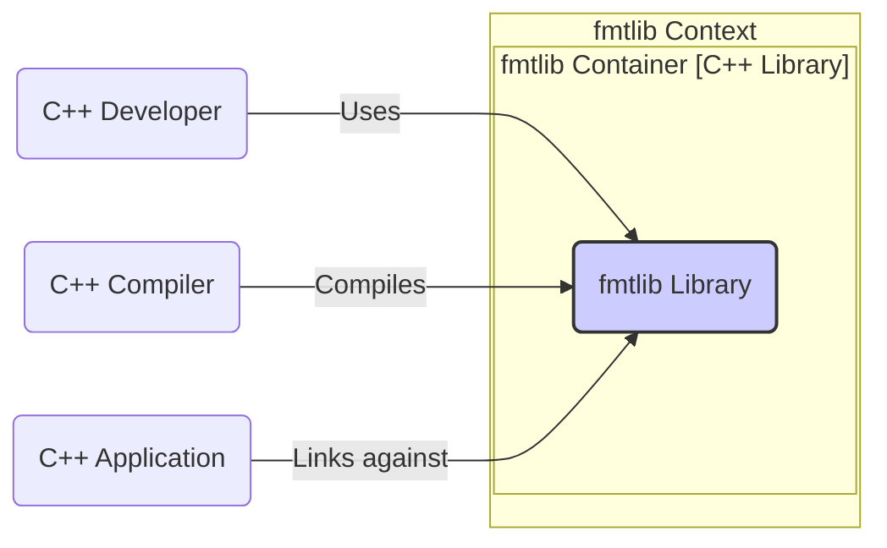
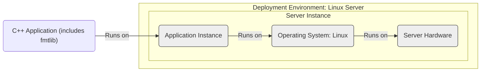
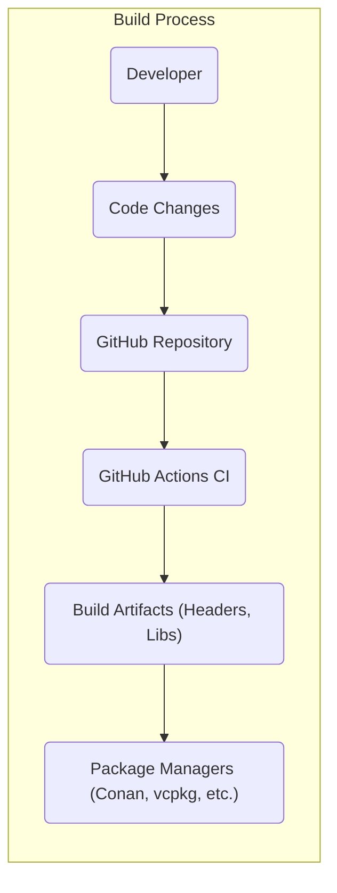

# BUSINESS POSTURE

- Business Priorities and Goals:
 - Improve code readability and maintainability in C++ projects by providing a modern and safe formatting library.
 - Enhance developer productivity by offering a user-friendly and efficient formatting tool.
 - Reduce potential errors and vulnerabilities associated with traditional C-style formatting functions like `printf`.
 - Offer a performant alternative to standard library formatting functions.

- Business Risks:
 - Dependency risk: Projects adopting fmtlib become dependent on its continued maintenance and security. Vulnerabilities in fmtlib could impact dependent projects.
 - Integration risk: Compatibility issues with different C++ compilers, standard library versions, or build systems might arise.
 - Adoption risk: Developers might be hesitant to adopt a new library if they are already comfortable with existing formatting methods.
 - Performance risk: Although fmtlib is designed to be performant, there is a potential risk of unexpected performance overhead in specific use cases compared to simpler formatting methods.

# SECURITY POSTURE

- Existing Security Controls:
 - security control: Code hosted on GitHub, leveraging GitHub's infrastructure security. (Implemented: GitHub platform)
 - security control: Publicly accessible repository, allowing for community review and contributions. (Implemented: GitHub repository access control)
 - security control: Issue tracking system on GitHub for reporting and addressing bugs and potential security vulnerabilities. (Implemented: GitHub Issues)
 - security control: Build and testing infrastructure using GitHub Actions for continuous integration. (Implemented: GitHub Actions workflows - visible in repository)
 - security control: Open Source license (MIT License) promoting transparency and community scrutiny. (Implemented: LICENSE file in repository)

- Accepted Risks:
 - accepted risk:  Reliance on community contributions for security vulnerability discovery and patching.
 - accepted risk: Potential for undiscovered vulnerabilities in the library code.
 - accepted risk: Risk of supply chain attacks targeting the GitHub repository or build pipeline, although mitigated by GitHub's security measures.

- Recommended Security Controls:
 - security control: Implement automated dependency scanning to detect known vulnerabilities in third-party libraries used during fmtlib's development or testing.
 - security control: Integrate static analysis security testing (SAST) tools into the CI/CD pipeline to automatically identify potential security flaws in the code.
 - security control: Consider performing regular security audits or penetration testing, especially before major releases, to proactively identify and address vulnerabilities.
 - security control: Establish a clear vulnerability disclosure policy to guide users on how to report security issues and define the process for handling and resolving them.

- Security Requirements:
 - Authentication: Not directly applicable to a formatting library itself. Authentication is relevant for systems that *use* fmtlib, but not fmtlib itself.
 - Authorization: Not directly applicable to a formatting library itself. Authorization is relevant for systems that *use* fmtlib, but not fmtlib itself.
 - Input Validation: While fmtlib is designed to be safer than `printf`, input validation is still relevant for users of fmtlib. Users should ensure that format strings and arguments passed to fmtlib functions are properly constructed to avoid unexpected behavior or potential vulnerabilities in their applications. fmtlib itself implements checks to prevent format string vulnerabilities, which is a security control.
 - Cryptography: Not directly applicable to a formatting library itself. Cryptography is relevant for applications that *use* fmtlib if they need to format sensitive data, but fmtlib itself does not handle encryption or decryption.

# DESIGN

## C4 CONTEXT

```mermaid
flowchart LR
    subgraph "fmtlib Context"
      center_system("fmtlib" <br> "C++ Formatting Library")
    end

    user_cpp_developer("C++ Developer") -- Uses --> center_system
    cpp_compiler("C++ Compiler") -- Compiles --> center_system
    cpp_application("C++ Application") -- Uses --> center_system

    center_system -- "Integrated into" --> cpp_application
    center_system -- "Built with" --> cpp_compiler

    style center_system fill:#f9f,stroke:#333,stroke-width:2px
```

- Context Diagram Elements:
 - - Name: C++ Developer
   - Type: User
   - Description: Software developers who write C++ code and need to format strings for various purposes such as logging, user interfaces, and data serialization.
   - Responsibilities: Utilize fmtlib in their C++ projects to format strings, report issues, and potentially contribute to the library.
   - Security controls:  Responsible for using fmtlib correctly and securely within their applications, including proper input validation in their application logic when using fmtlib.

 - - Name: C++ Compiler
   - Type: System
   - Description:  Compilers such as GCC, Clang, MSVC that are used to compile fmtlib and applications that use fmtlib.
   - Responsibilities: Compile the fmtlib source code into a usable library and compile applications that link against fmtlib.
   - Security controls:  Compiler itself is assumed to be a trusted component in the development toolchain. Security controls related to compiler security are outside the scope of fmtlib itself.

 - - Name: C++ Application
   - Type: System
   - Description:  Any software application written in C++ that integrates and uses the fmtlib library for string formatting.
   - Responsibilities: Utilize fmtlib to perform string formatting operations within the application's functionality.
   - Security controls: Applications are responsible for their own security controls, including how they use fmtlib. This includes validating inputs before formatting and handling any formatted output securely. They inherit the security posture of fmtlib as a dependency.

 - - Name: fmtlib (C++ Formatting Library)
   - Type: System
   - Description: A modern open-source C++ library providing fast and safe string formatting capabilities, intended as a replacement for older C-style formatting functions.
   - Responsibilities: Provide robust, efficient, and secure string formatting functionalities to C++ applications. Maintain code quality, address bugs and security vulnerabilities, and ensure compatibility across different platforms and compilers.
   - Security controls: Implements input validation to prevent format string vulnerabilities. Undergoes testing and code review processes. Relies on GitHub's security infrastructure. Recommended security controls listed in the SECURITY POSTURE section should be implemented.

## C4 CONTAINER



- Container Diagram Elements:
 - - Name: fmtlib Library
   - Type: Container
   - Description: A single C++ library container that provides all the formatting functionalities of fmtlib. It's distributed as header files and compiled library files.
   - Responsibilities: Encapsulates all the code for string formatting, including parsing format strings, handling arguments, and producing formatted output.
   - Security controls: Input validation within the library to prevent format string vulnerabilities. Memory safety practices in C++ code to avoid buffer overflows and other memory-related issues. Security testing (SAST, fuzzing) should be applied to this container.

## DEPLOYMENT

- Deployment Model:
 fmtlib itself is a library and is not deployed as a standalone service or application. It is integrated into and deployed as part of C++ applications. The deployment of fmtlib is therefore dependent on how the applications that use it are deployed.

- Example Deployment Scenario (for an application using fmtlib):
  Let's consider a simple C++ command-line application that uses fmtlib and is deployed to a Linux server.



- Deployment Diagram Elements (for example application deployment):
 - - Name: Server Hardware
   - Type: Infrastructure
   - Description: Physical or virtual server hardware running in a data center or cloud environment.
   - Responsibilities: Provide the physical resources (CPU, memory, storage, network) to host the operating system and application.
   - Security controls: Physical security of the data center, hardware security features (e.g., secure boot), and infrastructure security controls provided by the hosting environment (firewalls, intrusion detection, etc.).

 - - Name: Operating System: Linux
   - Type: Infrastructure Software
   - Description: Linux operating system installed on the server hardware, providing the runtime environment for the application.
   - Responsibilities: Manage system resources, provide system services, and ensure the security and stability of the server environment.
   - Security controls: Operating system hardening, access control lists, security patches, firewall rules, and intrusion detection systems.

 - - Name: Application Instance
   - Type: Software Deployment Unit
   - Description: A running instance of the C++ application that is linked with the fmtlib library.
   - Responsibilities: Execute the application logic, utilize fmtlib for string formatting, and provide the intended application functionality.
   - Security controls: Application-level security controls, such as input validation (in application code using fmtlib), authorization, session management, and secure logging. The application inherits the security posture of fmtlib library.

## BUILD



- Build Process Elements:
 - - Name: Developer
   - Type: Actor
   - Description: Software developers who write and modify the fmtlib source code.
   - Responsibilities: Write code, fix bugs, implement new features, and contribute changes to the fmtlib project.
   - Security controls: Developer workstations should be secured. Code changes should be reviewed before being merged into the main repository. Developers should follow secure coding practices.

 - - Name: Code Changes
   - Type: Data
   - Description: Modifications to the fmtlib source code made by developers.
   - Responsibilities: Represent the changes being introduced into the codebase.
   - Security controls: Code changes should be tracked using version control (Git). Changes should be reviewed via pull requests to ensure code quality and security.

 - - Name: GitHub Repository
   - Type: System
   - Description: The central Git repository hosted on GitHub that stores the fmtlib source code and history.
   - Responsibilities: Version control, code storage, collaboration platform for development.
   - Security controls: GitHub's platform security, access controls to the repository, branch protection rules, and audit logs.

 - - Name: GitHub Actions CI
   - Type: System
   - Description: Continuous Integration and Continuous Delivery (CI/CD) system provided by GitHub, used to automate the build, test, and release process for fmtlib.
   - Responsibilities: Automate building the library from source code, running tests, performing static analysis, and creating build artifacts.
   - Security controls: Secure configuration of CI/CD pipelines, use of secrets management for credentials, dependency scanning in CI, SAST integration in CI, and ensuring the integrity of the build environment.

 - - Name: Build Artifacts (Headers, Libs)
   - Type: Data
   - Description: Compiled header files and library files produced by the build process.
   - Responsibilities: Represent the distributable components of fmtlib.
   - Security controls: Ensure the integrity of build artifacts by signing them or using checksums. Store artifacts securely.

 - - Name: Package Managers (Conan, vcpkg, etc.)
   - Type: System
   - Description: Package managers used to distribute and consume fmtlib library in C++ projects.
   - Responsibilities: Distribute fmtlib packages to developers, manage dependencies, and facilitate easy integration of fmtlib into C++ projects.
   - Security controls: Package managers should use secure distribution channels (HTTPS). Packages should be signed to ensure authenticity and integrity.

# RISK ASSESSMENT

- Critical Business Processes:
 - Software development using C++ where string formatting is required.
 - Maintaining code quality and developer productivity in C++ projects.
 - Ensuring the reliability and security of C++ applications that depend on string formatting.

- Data to Protect and Sensitivity:
 - Source code of fmtlib: Sensitivity - Medium (Open Source, but intellectual property and maintainability).
 - Build artifacts (header files, library files): Sensitivity - Medium (Integrity and availability are important for users).
 - No sensitive user data is directly processed or stored by fmtlib itself. However, applications using fmtlib might handle sensitive data, and the security of fmtlib as a dependency is important for those applications.

# QUESTIONS & ASSUMPTIONS

- Questions:
 - What are the primary target platforms and compilers for fmtlib? (Assumption: Broad range of modern C++ compilers and operating systems).
 - Are there specific performance benchmarks or security certifications that fmtlib aims to achieve? (Assumption: Focus on general performance and security best practices for a C++ library).
 - What is the process for handling security vulnerability reports for fmtlib? (Assumption: Standard open-source vulnerability disclosure and patching process via GitHub and community).
 - Are there any specific industries or use cases that fmtlib is particularly targeted towards? (Assumption: General-purpose C++ formatting library applicable to a wide range of domains).

- Assumptions:
 - BUSINESS POSTURE: The primary business goal is to provide a high-quality, modern, and safe C++ formatting library for general use in C++ development.
 - SECURITY POSTURE: Standard open-source development security practices are followed. The project benefits from the transparency and community scrutiny of open source. Security is a consideration but not the primary differentiating feature compared to functionality and performance.
 - DESIGN: fmtlib is designed as a standalone C++ library. Deployment is handled by applications that integrate fmtlib. The build process is automated using GitHub Actions and standard C++ build tools.