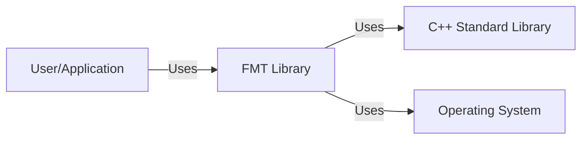
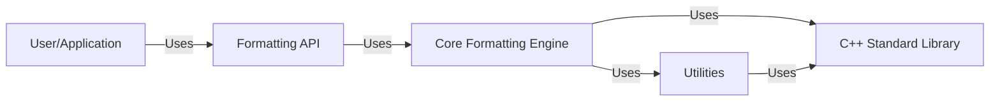
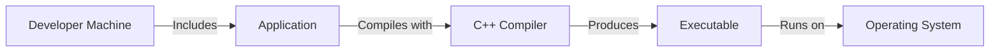
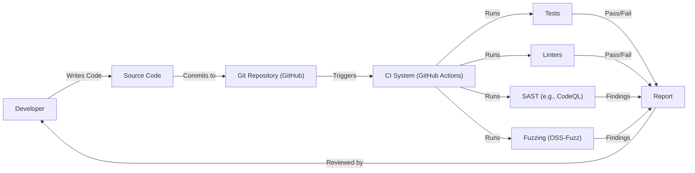

# BUSINESS POSTURE

Business Priorities and Goals:

*   Provide a fast and safe alternative to the standard formatting methods provided by C++ (printf, iostreams).
*   Offer a wide range of formatting options and customization capabilities.
*   Ensure cross-platform compatibility and portability.
*   Maintain a clean and easy-to-use API.
*   Provide extensive documentation and examples.
*   Foster a community around the library and encourage contributions.
*   Minimize external dependencies.
*   Ensure high performance and efficiency.

Business Risks:

*   Vulnerabilities in the formatting logic could lead to security exploits, such as format string vulnerabilities, denial of service, or potentially arbitrary code execution.
*   Incorrect or inconsistent formatting across different platforms could lead to application instability or data corruption.
*   Performance bottlenecks in the library could impact the performance of applications using it.
*   Lack of proper error handling could lead to unexpected application behavior.
*   Compatibility issues with different compilers or C++ standards could limit adoption.

# SECURITY POSTURE

Existing Security Controls:

*   security control: Fuzz testing: The project uses OSS-Fuzz for continuous fuzzing, which helps identify potential vulnerabilities and crashes. (Found in the GitHub repository and documentation).
*   security control: Tests: The project has a comprehensive test suite. (Found in the GitHub repository).
*   security control: Compiler warnings: The project aims to compile cleanly with various compilers and warning levels. (Implicit in the project's goals and build configuration).
*   security control: Static analysis: The project may use static analysis tools, although this is not explicitly stated. (Common practice, but needs confirmation).
*   security control: Memory safety: The library is designed to be memory-safe, avoiding buffer overflows and other memory-related issues. (Implicit in the project's goals and design).

Accepted Risks:

*   accepted risk: Reliance on standard C++ library: The library depends on the standard C++ library, which itself could have vulnerabilities.
*   accepted risk: Compiler-specific behavior: While efforts are made to ensure cross-compiler compatibility, there might be subtle differences in behavior due to compiler-specific implementations.

Recommended Security Controls:

*   security control: Integrate a SAST (Static Application Security Testing) tool into the build process to automatically scan for potential vulnerabilities.
*   security control: Conduct regular security code reviews to identify potential vulnerabilities that may be missed by automated tools.
*   security control: Establish a clear security policy and vulnerability reporting process.
*   security control: Consider using a memory error detection tool (e.g., AddressSanitizer, Valgrind) during testing to catch memory corruption issues.

Security Requirements:

*   Authentication: Not applicable, as this is a formatting library, not a service or application that requires authentication.
*   Authorization: Not applicable, as this is a formatting library.
*   Input Validation:
    *   The library must handle invalid format strings gracefully, without crashing or causing undefined behavior.
    *   The library should protect against format string vulnerabilities, ensuring that user-provided format strings cannot be used to access or modify arbitrary memory locations.
    *   Input length limitations should be considered to prevent excessive memory usage or denial-of-service attacks.
*   Cryptography: Not directly applicable, but if the library is used to format sensitive data, the application using the library should ensure that this data is properly encrypted where necessary.
*   Output Encoding:
    *   The library should correctly handle different character encodings to prevent encoding-related vulnerabilities.

# DESIGN

## C4 CONTEXT

Element Description:

*   User/Application:
    *   Name: User/Application
    *   Type: User/External System
    *   Description: Any application or user that utilizes the FMT library for formatting.
    *   Responsibilities: Provides input to the FMT library and consumes the formatted output.
    *   Security controls: Responsible for securing any sensitive data passed to the FMT library.
*   FMT Library:
    *   Name: FMT Library
    *   Type: System
    *   Description: The core formatting library.
    *   Responsibilities: Provides formatting functionalities, handles format strings and arguments, and produces formatted output.
    *   Security controls: Input validation, format string vulnerability protection, error handling.
*   C++ Standard Library:
    *   Name: C++ Standard Library
    *   Type: External System
    *   Description: The standard library provided by the C++ compiler.
    *   Responsibilities: Provides underlying functionalities used by the FMT library, such as memory management and string manipulation.
    *   Security controls: Relies on the security of the specific C++ standard library implementation.
*   Operating System
    *   Name: Operating System
    *   Type: External System
    *   Description: OS that application is running on.
    *   Responsibilities: Provide system resources.
    *   Security controls: Relies on the security of the specific OS.

## C4 CONTAINER

Element Description:

*   User/Application:
    *   Name: User/Application
    *   Type: User/External System
    *   Description: Any application or user that utilizes the FMT library for formatting.
    *   Responsibilities: Provides input to the FMT library and consumes the formatted output.
    *   Security controls: Responsible for securing any sensitive data passed to the FMT library.
*   Formatting API:
    *   Name: Formatting API
    *   Type: Container
    *   Description: The public interface of the FMT library.
    *   Responsibilities: Provides functions for formatting data, such as `fmt::format`, `fmt::print`, etc.
    *   Security controls: Input validation, error handling.
*   Core Formatting Engine:
    *   Name: Core Formatting Engine
    *   Type: Container
    *   Description: The core logic for parsing format strings and generating formatted output.
    *   Responsibilities: Parses format strings, handles arguments, performs type conversions, and generates the formatted output.
    *   Security controls: Format string vulnerability protection, error handling.
*   Utilities:
    *   Name: Utilities
    *   Type: Container
    *   Description: Helper functions and classes used by the core formatting engine.
    *   Responsibilities: Provides functionalities such as string manipulation, buffer management, and character encoding handling.
    *   Security controls: Memory safety, error handling.
*   C++ Standard Library:
    *   Name: C++ Standard Library
    *   Type: External System
    *   Description: The standard library provided by the C++ compiler.
    *   Responsibilities: Provides underlying functionalities used by the FMT library, such as memory management and string manipulation.
    *   Security controls: Relies on the security of the specific C++ standard library implementation.

## DEPLOYMENT

Possible deployment solutions:

1.  Header-only library: The library can be used as a header-only library, where all the code is included in header files.
2.  Static linking: The library can be compiled into a static library (.a or .lib) and linked statically with the application.
3.  Dynamic linking: The library can be compiled into a dynamic library (.so, .dll, or .dylib) and linked dynamically with the application.

Chosen solution (Header-only):

Element Description:

*   Developer Machine:
    *   Name: Developer Machine
    *   Type: Environment
    *   Description: The machine where the developer writes and compiles the code.
    *   Responsibilities: Provides the development environment.
    *   Security controls: Secure coding practices, development environment security.
*   Application:
    *   Name: Application
    *   Type: Software System
    *   Description: The application that uses the FMT library.
    *   Responsibilities: Includes the FMT library headers.
    *   Security controls: Application-level security controls.
*   C++ Compiler:
    *   Name: C++ Compiler
    *   Type: Tool
    *   Description: The compiler used to compile the application and the FMT library.
    *   Responsibilities: Compiles the code.
    *   Security controls: Compiler security settings, secure compilation practices.
*   Executable:
    *   Name: Executable
    *   Type: Software System
    *   Description: The compiled executable of the application.
    *   Responsibilities: Runs the application logic.
    *   Security controls: Operating system security controls.
*   Operating System:
    *   Name: Operating System
    *   Type: Environment
    *   Description: The operating system on which the executable runs.
    *   Responsibilities: Provides the runtime environment.
    *   Security controls: Operating system security features, user access controls.

## BUILD

Build Process Description:

1.  Developer writes code and commits it to the Git repository (GitHub).
2.  The commit triggers the CI system (GitHub Actions).
3.  The CI system runs various checks:
    *   Tests: Unit tests and integration tests to ensure the functionality of the library.
    *   Linters: Code style checks and static analysis to enforce coding standards.
    *   SAST (Static Application Security Testing): Scans the code for potential security vulnerabilities (e.g., using CodeQL).
    *   Fuzzing (OSS-Fuzz): Continuously fuzzes the library to identify potential crashes and vulnerabilities.
4.  The results of the checks are reported.
5.  Developers review the reports and address any issues found.
6.  If all checks pass, the build is considered successful. Since it is header only library, there is no build artifact.

Security Controls in Build Process:

*   security control: CI/CD pipeline (GitHub Actions): Automates the build and testing process, ensuring consistency and repeatability.
*   security control: Tests: Comprehensive test suite to catch bugs and regressions.
*   security control: Linters: Enforce coding standards and identify potential code quality issues.
*   security control: SAST (e.g., CodeQL): Scans for potential security vulnerabilities.
*   security control: Fuzzing (OSS-Fuzz): Continuous fuzzing to identify vulnerabilities and crashes.
*   security control: Code review: Manual review of code changes to identify potential issues.

# RISK ASSESSMENT

Critical Business Processes:

*   Providing reliable and efficient text formatting for applications.
*   Maintaining the stability and security of applications that use the library.

Data Protection:

*   Data Sensitivity: The FMT library itself does not handle sensitive data directly. However, it may be used to format sensitive data that is passed to it by the application. The sensitivity of the data depends on the application using the library.
*   Data to Protect: The library should not store or persist any data. The primary concern is to prevent vulnerabilities that could allow attackers to access or modify data handled by the application using the library.

# QUESTIONS & ASSUMPTIONS

Questions:

*   Are there any specific compliance requirements (e.g., industry standards, regulations) that the library needs to adhere to?
*   What are the specific target platforms and compilers that need to be supported?
*   What is the expected usage pattern of the library (e.g., high-performance applications, embedded systems)?
*   Is there any existing security documentation or threat model for the library or similar projects?
*   Is there a specific static analysis tool used, or is it an assumption?

Assumptions:

*   BUSINESS POSTURE: The primary goal is to provide a high-quality, performant, and secure formatting library.
*   SECURITY POSTURE: The development team follows secure coding practices. The library is used in environments where security is a concern.
*   DESIGN: The library is designed to be modular and extensible. The C++ standard library used is a reasonably up-to-date and secure version.