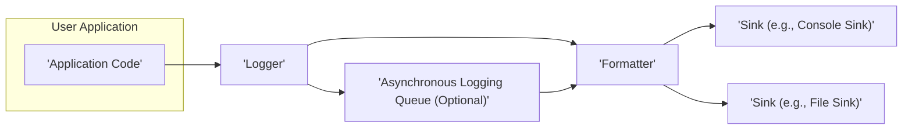
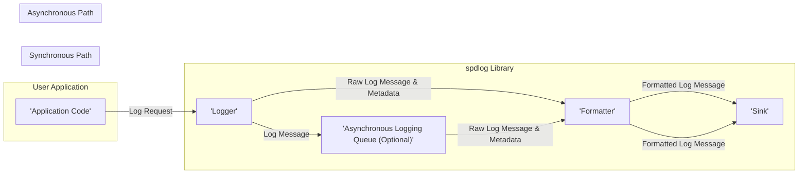

# Project Design Document: spdlog - Fast C++ Logging Library

**Version:** 1.1
**Date:** October 26, 2023
**Author:** AI Software Architect

## 1. Introduction

This document provides an enhanced and detailed design overview of the spdlog library, a fast C++ logging library. This document is specifically intended to serve as a comprehensive foundation for subsequent threat modeling activities. It meticulously outlines the key components, data flow, architectural nuances, and potential security implications of spdlog.

## 2. Goals and Objectives

The primary goals of spdlog are:

* **High Performance:** Deliver a logging solution with minimal performance overhead, crucial for performance-sensitive applications.
* **Developer Friendliness:** Offer an intuitive and easy-to-use API, reducing the learning curve for developers.
* **Versatile Output Destinations:** Support a wide range of logging sinks (destinations) to accommodate diverse logging requirements.
* **Flexible Formatting:** Provide extensive formatting options to tailor log output to specific needs.
* **Extensibility for Customization:** Enable users to develop and integrate custom sinks and formatters, extending the library's functionality.
* **Thread Safety for Concurrent Environments:** Ensure safe and reliable operation in multithreaded applications, preventing data corruption or race conditions.

## 3. High-Level Architecture

spdlog's architecture is structured around three core concepts: Loggers, Sinks, and Formatters. User applications interact with Logger instances to submit log messages. These Loggers then process the messages, potentially utilizing a Formatter to structure the output, and finally direct the formatted messages to one or more Sinks. Asynchronous logging introduces an optional queue for improved performance.

**Key Components:**

* **Logger:** The central point of interaction for logging. It receives log requests from the application.
* **Sink:** Represents the destination where log messages are ultimately written.
* **Formatter:** Responsible for transforming the raw log message into a presentable string format.
* **Asynchronous Logging Queue (Optional):** A buffer used when asynchronous logging is enabled to decouple log message submission from the actual writing to sinks.

## 4. Component Design

### 4.1. Logger

* **Responsibilities:**
    * **Log Message Reception:** Accepts log messages from the application, including the log level and the message content.
    * **Log Level Filtering:** Determines if a message should be processed based on its log level and the logger's configured level.
    * **Sink Routing:** Directs the log message to all associated sinks if the log level is sufficient.
    * **Formatter Invocation:**  Calls the associated formatter to prepare the message for output.
    * **Sink Management:**  Maintains a collection of associated sinks and manages their lifecycle.
    * **Logging Level Control:**  Allows setting and modifying the logging level (trace, debug, info, warn, error, critical, off).
    * **Naming and Identification:** Provides a name for the logger, facilitating identification and management.
    * **Synchronization (Internal):** Implements internal synchronization mechanisms (e.g., mutexes) to ensure thread-safe access to its internal state and sinks.
    * **Asynchronous Handling:**  Manages the optional asynchronous logging queue if enabled.

* **Key Attributes:**
    * `Name`: A string identifier for the logger.
    * `LogLevel`: The minimum log level for messages to be processed.
    * `Sinks`: A collection (e.g., `std::vector`) of pointers to associated Sink objects.
    * `Formatter`: A pointer to the Formatter object used by this logger (can be shared).
    * `IsAsync`: A boolean flag indicating whether asynchronous logging is enabled.
    * `Mutex`: A synchronization primitive (e.g., `std::mutex`) for thread safety.

### 4.2. Sink

* **Responsibilities:**
    * **Formatted Message Reception:** Receives the fully formatted log message string from the logger.
    * **Output Writing:** Writes the received message to the specific destination (e.g., console, file, network).
    * **Resource Management:** Handles the opening, closing, and management of resources associated with the output destination (e.g., file handles).
    * **Buffering (Optional):** May implement internal buffering to improve write performance.
    * **Error Handling:**  Handles potential errors during the writing process.
    * **Customization:**  Allows for the implementation of custom logic for writing to various destinations.
    * **Thread Safety (Implementation-Specific):**  Individual sink implementations are responsible for their own thread safety if required.

* **Built-in Sink Types (with specific considerations):**
    * **Console Sink (`stdout_sink_mt`, `stderr_sink_mt`):** Writes to standard output or standard error. Potential for information disclosure if output is not properly secured.
    * **Basic File Sink (`basic_file_sink_mt`):** Writes to a single file. Requires careful management of file permissions to prevent unauthorized access or modification. Susceptible to denial-of-service if the file system fills up.
    * **Rotating File Sink (`rotating_file_sink_mt`):** Writes to a file and rotates it based on size. Needs secure rotation logic to prevent race conditions or data loss during rotation.
    * **Daily File Sink (`daily_file_sink_mt`):** Creates a new log file each day. Similar file permission and storage considerations as the basic file sink.
    * **MSVC Debug Sink (`msvc_sink`):** Outputs to the Visual Studio debugger output window. Primarily for development and debugging, security implications are less critical in production environments.
    * **Syslog Sink (`syslog_sink`):** Sends log messages to the system log. Security depends on the underlying syslog configuration and security measures.
    * **Null Sink (`null_sink`):** Discards all log messages. Useful for disabling logging in certain scenarios.

* **Key Attributes (General):**
    * `SinkType`: An identifier for the specific sink implementation.
    * `Configuration`: Parameters specific to the sink type (e.g., file path, rotation size).
    * `Mutex (Optional)`: Synchronization primitive used internally by some sinks for thread safety.

### 4.3. Formatter

* **Responsibilities:**
    * **Message Structuring:** Receives the raw log message and associated metadata (log level, timestamp, thread ID, source location if available).
    * **String Conversion:** Converts the raw message and metadata into a formatted string representation.
    * **Format Pattern Application:** Applies a defined formatting pattern to structure the output string.
    * **Customization:** Allows users to define custom formatting patterns and logic.

* **Built-in Formatting Options:**
    * **Simple Formatter:** Provides basic formatting with minimal overhead.
    * **Pattern Formatter:** Uses a pattern string with placeholders (e.g., `%Y-%m-%d %H:%M:%S.%e [%l] %v`) to define the output format.

* **Key Attributes:**
    * `Pattern`: The formatting pattern string used by the formatter.

### 4.4. Asynchronous Logging Queue

* **Responsibilities:**
    * **Message Buffering:** Temporarily stores log messages submitted by the logger when asynchronous logging is enabled.
    * **Thread-Safe Access:** Provides a thread-safe mechanism for adding messages to the queue from the logging thread and retrieving them from the worker thread.
    * **Message Delivery:** Ensures that messages are eventually delivered to the formatter and sinks.

* **Key Attributes:**
    * `Queue`: The underlying queue data structure (often a lock-free queue or a queue with mutex protection).
    * `Mutex (Optional)`: May be used for synchronization depending on the queue implementation.
    * `Condition Variable (Optional)`: May be used to signal the worker thread when new messages are available.
    * `Worker Thread`: A dedicated background thread that processes messages from the queue.

## 5. Data Flow

The flow of a log message through spdlog can be either synchronous or asynchronous, depending on the logger's configuration.

**Detailed Steps:**

1. **Log Request Initiation:** The application code calls a logging macro or function on a specific Logger instance, providing the log level and the message content.
2. **Logger Processing:**
    * The Logger checks if the message's log level meets the Logger's configured threshold. If not, the message is discarded.
    * **Synchronous Logging:** If asynchronous logging is disabled:
        * The Logger retrieves its associated Formatter.
        * The raw log message and metadata are passed to the Formatter.
        * The Formatter returns the formatted log message.
        * The Logger iterates through its associated Sinks and passes the formatted message to each Sink's `log()` method.
    * **Asynchronous Logging:** If asynchronous logging is enabled:
        * The raw log message is placed into the Asynchronous Logging Queue.
        * A separate worker thread retrieves messages from the queue.
        * The worker thread retrieves the Logger's associated Formatter.
        * The raw log message and metadata are passed to the Formatter.
        * The Formatter returns the formatted log message.
        * The worker thread iterates through the Logger's associated Sinks and passes the formatted message to each Sink's `log()` method.
3. **Formatting:** The Formatter receives the raw log message and associated metadata. It applies the defined formatting pattern to create the final log message string.
4. **Sink Output:** Each Sink receives the formatted log message and writes it to its designated output destination.

## 6. Security Considerations (Pre-Threat Modeling)

This section details potential security vulnerabilities and concerns related to spdlog's architecture and components.

* **Input Validation and Log Injection:**
    * **Threat:** Malicious or untrusted data logged by the application could be interpreted as commands or control characters by systems processing the logs (e.g., log aggregation tools, security information and event management (SIEM) systems).
    * **Affected Components:** Logger (receives input), Sinks (output potentially vulnerable data).
    * **Mitigation Strategies (Application Level):** Sanitize log messages before logging.

* **Resource Exhaustion and Denial of Service:**
    * **Threat:** An attacker could flood the logging system with excessive log messages, leading to disk space exhaustion, CPU overload, or memory exhaustion.
    * **Affected Components:** Logger (processes all requests), Asynchronous Logging Queue (potential bottleneck), Sinks (write to storage).
    * **Mitigation Strategies:** Implement rate limiting at the application level, configure appropriate queue sizes, monitor disk space usage.

* **Information Disclosure:**
    * **Threat:** Sensitive information (e.g., passwords, API keys, personal data) might be inadvertently logged and stored in log files, making it accessible to unauthorized individuals.
    * **Affected Components:** Logger (processes sensitive data if the application logs it), Sinks (store the logs).
    * **Mitigation Strategies (Application Level):** Avoid logging sensitive data. If necessary, implement redaction or masking before logging. Secure log file storage with appropriate permissions.

* **File System Vulnerabilities (Sinks):**
    * **Threat:**
        * **Path Traversal:** If file paths for log sinks are constructed from untrusted input without proper validation, attackers could write log files to arbitrary locations.
        * **Symlink Attacks:** Attackers could manipulate symbolic links to redirect log output to unintended locations, potentially overwriting critical files.
    * **Affected Components:** File-based Sinks (Basic File Sink, Rotating File Sink, Daily File Sink).
    * **Mitigation Strategies:** Avoid constructing file paths from user input. Use absolute paths or carefully validate relative paths. Ensure proper file system permissions.

* **Configuration Vulnerabilities:**
    * **Threat:** Insecure default configurations or the ability to modify configurations without proper authorization could introduce vulnerabilities. For example, setting overly permissive file permissions for log files.
    * **Affected Components:** Logger, Sinks (configuration parameters).
    * **Mitigation Strategies:** Use secure default configurations. Protect configuration files with appropriate permissions.

* **Asynchronous Logging Queue Overflow:**
    * **Threat:** If the asynchronous logging queue is not adequately sized or if the sinks are slow to process messages, the queue could overflow, leading to dropped log messages and potential loss of critical information.
    * **Affected Components:** Asynchronous Logging Queue.
    * **Mitigation Strategies:** Configure an appropriate queue size based on expected logging volume and sink performance. Monitor queue usage.

* **Dependency Vulnerabilities:**
    * **Threat:** Although spdlog has minimal external dependencies, vulnerabilities in those dependencies could potentially affect spdlog.
    * **Affected Components:**  Potentially all components if a core dependency is compromised.
    * **Mitigation Strategies:** Regularly update dependencies and monitor for known vulnerabilities.

* **Lack of Built-in Encryption:**
    * **Threat:** Log files stored on disk are not encrypted by default, making them vulnerable to unauthorized access and disclosure if the storage is compromised.
    * **Affected Components:** File-based Sinks.
    * **Mitigation Strategies:** Implement encryption at the file system level or use sinks that support secure transmission (e.g., to a secure logging server).

## 7. Deployment Considerations

The security implications of spdlog can vary depending on how and where it is deployed.

* **Desktop Applications:** Log files are typically stored locally on the user's machine. Security relies on operating system-level file permissions.
* **Server Applications:** Logs are often centralized to a logging server or service. Secure transmission (e.g., TLS) and secure storage on the logging server are crucial.
* **Cloud Environments:** Logging is often integrated with cloud logging services (e.g., AWS CloudWatch, Azure Monitor). Security relies on the security measures provided by the cloud platform, including access control and encryption.
* **Embedded Systems:** Resource constraints might limit the complexity of logging and security measures. Careful consideration must be given to storage capacity and access control.

## 8. Assumptions and Constraints

* **Application Responsibility for Content Sanitization:** spdlog assumes that the application using it is responsible for sanitizing log message content to prevent log injection attacks.
* **Reliance on Operating System Security:** spdlog relies on the underlying operating system for file system security, access control, and user authentication.
* **Secure Configuration Practices:** It is assumed that the configuration of spdlog is performed securely and that configuration files are protected from unauthorized modification.
* **No Built-in Log Encryption:** spdlog does not provide built-in encryption for log messages. Encryption, if required, must be implemented at a higher level (e.g., file system encryption or secure transmission).

## 9. Future Considerations

* **Built-in Log Message Sanitization Options:** Explore the possibility of adding optional built-in mechanisms for sanitizing log messages to mitigate log injection risks.
* **Integration with Security Auditing Frameworks:** Provide better integration points with security auditing frameworks and tools.
* **Enhanced Error Handling and Security Logging:** Improve error handling within spdlog and provide more detailed security-related logging for internal events.
* **Support for Secure Log Transmission:** Consider adding support for secure log transmission protocols directly within certain sink implementations.

This enhanced design document provides a more detailed and security-focused overview of the spdlog library's architecture and components, making it a more robust foundation for threat modeling activities.