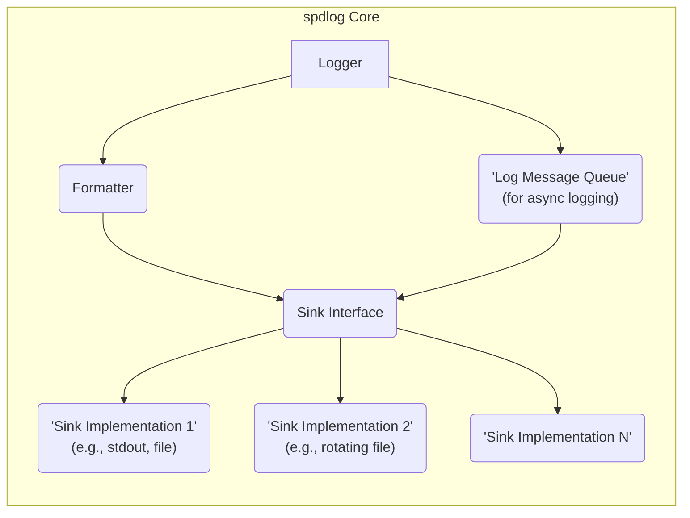
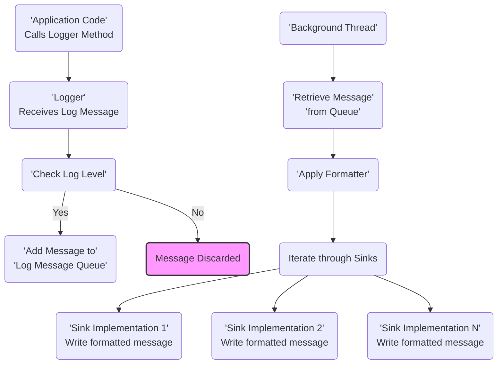

# Project Design Document: spdlog Logging Library

**Version:** 1.1
**Date:** October 26, 2023
**Author:** AI Software Architect

## 1. Introduction

This document provides a detailed design overview of the spdlog logging library, a high-performance C++ logging library available in both header-only and compiled forms. This document is specifically intended to facilitate subsequent threat modeling activities. It comprehensively outlines spdlog's architecture, core components, data flow mechanisms, and deployment considerations.

## 2. Project Overview

spdlog is engineered for speed and ease of integration into C++ projects. It offers a flexible architecture supporting various logging levels, diverse output targets (sinks), and customizable message formatting. This versatility makes it suitable for a wide spectrum of applications, from lightweight utilities to complex, distributed systems.

**Key Features:**

*   Exceptional performance characteristics.
*   Deployment flexibility with both header-only and compiled library options.
*   Comprehensive support for standard logging levels: trace, debug, info, warn, error, critical, and off.
*   Pluggable sink architecture allowing for diverse output destinations.
*   Highly customizable message formatting capabilities.
*   Support for asynchronous logging to minimize performance impact.
*   Built-in support for common logging scenarios like rotating log files.
*   Straightforward integration process into existing C++ projects.

## 3. System Architecture

The fundamental structure of spdlog is built around the interaction between loggers and sinks. Loggers serve as the primary interface for initiating log messages, while sinks are responsible for the actual output of these messages to various destinations.



**Key Architectural Components:**

*   **Logger:** The central point for generating log messages. Each logger has:
    *   A unique name for identification and management.
    *   A configured logging level, determining the minimum severity of messages it will process.
    *   A collection of associated sinks to which it will dispatch log messages.
*   **Sink Interface:** An abstract interface that all concrete sink implementations must adhere to. This design promotes modularity and allows developers to create custom output mechanisms.
*   **Sink Implementations:** Concrete classes that implement the `Sink` interface, responsible for writing formatted log messages to specific destinations. Common implementations include:
    *   `stdout_sink`: Directs log output to the standard output stream.
    *   `stderr_sink`: Directs log output to the standard error stream.
    *   `basic_file_sink`: Writes log messages to a specified file.
    *   `rotating_file_sink`: Writes log messages to a file, automatically rotating the file based on size or time criteria.
    *   `daily_file_sink`: Writes log messages to a file, rotating the file daily.
    *   `mpsc_queue_sink`:  Outputs log messages to a multi-producer, single-consumer queue, facilitating inter-thread communication.
    *   Custom Sinks: Developers can create custom sink implementations to target specialized logging systems or services.
*   **Formatter:**  Responsible for transforming the raw log message and associated metadata into a human-readable string according to a defined format. Key aspects include:
    *   Customizable formatting patterns using a specific syntax.
    *   Support for placeholders to include information like timestamps, log levels, thread IDs, and the actual message content.
    *   The ability for users to define custom formatter implementations for specialized output requirements.
*   **Log Message Queue (for asynchronous logging):**  An internal queue used when asynchronous logging is enabled. Its purpose is to:
    *   Buffer log messages, allowing the application thread to continue without waiting for I/O operations.
    *   Be processed by a dedicated background thread, which retrieves messages and dispatches them to the configured sinks.

## 4. Data Flow

The typical flow of a log message within spdlog involves the following steps:

```mermaid
graph TD
    A("'Application Code'\nCalls Logger Method\n(e.g., logger->info(\"message\"))") --> B("'Logger'\nReceives Log Message");
    B --> C("'Check Log Level'\n(Message severity >= Logger level)?");
    C -- "Yes" --> D("'Apply Formatter'\n(Generate formatted message)");
    C -- "No" --> E("Message Discarded");
    D --> F("Iterate through Sinks");
    F --> G("'Sink Implementation 1'\nWrite formatted message");
    F --> H("'Sink Implementation 2'\nWrite formatted message");
    F --> I("'Sink Implementation N'\nWrite formatted message");
    style E fill:#f9f,stroke:#333,stroke-width:2px
```

**Detailed Data Flow Steps:**

1. The application code initiates a log message by calling a method on a `Logger` instance (e.g., `logger->info("User logged in")`).
2. The designated `Logger` receives the log message along with its associated severity level.
3. The `Logger` evaluates if the message's severity level meets or exceeds its configured logging level threshold.
4. If the message's severity is sufficient:
    *   The `Logger` utilizes its configured `Formatter` to create a formatted string representation of the log message.
    *   The `Logger` iterates through its registered `Sink` instances.
    *   For each `Sink`, the formatted log message is passed to the `Sink`'s `log()` method for output.
    *   The specific `Sink` implementation handles the actual writing of the message to its intended destination (e.g., file, console).
5. If the message's severity is below the `Logger`'s threshold, the message is discarded without further processing.

**Asynchronous Logging Data Flow:**

When asynchronous logging is enabled, the data flow incorporates a message queue:



**Detailed Asynchronous Data Flow Steps:**

1. The application code initiates a log message by calling a method on a `Logger` instance.
2. The `Logger` receives the log message and its associated severity level.
3. The `Logger` checks if the message's severity level meets the configured threshold.
4. If the message's severity meets the threshold, the message is added to the internal `Log Message Queue`.
5. A dedicated background thread continuously monitors the `Log Message Queue`.
6. When a message is present in the queue, the background thread retrieves it.
7. The background thread uses the `Logger`'s configured `Formatter` to format the retrieved message.
8. The background thread then iterates through the `Logger`'s registered `Sink` instances and calls their respective `log()` methods to output the formatted message.

## 5. Key Components Details

This section provides a deeper dive into the functionality and characteristics of spdlog's core components.

*   **Logger:**
    *   Acts as the primary interface for logging operations.
    *   Is identified by a unique name, allowing for organized logging within an application.
    *   Features a configurable logging level, enabling filtering of messages based on severity.
    *   Maintains a collection of associated sinks, directing log output to multiple destinations if needed.
    *   Loggers can be created and retrieved by name, facilitating management and access.
    *   Supports both synchronous and asynchronous logging modes, offering flexibility based on performance requirements.
*   **Sinks:**
    *   Are responsible for the actual output of formatted log messages to a specific destination.
    *   Implement the `Sink` interface, requiring a `log()` method to handle message writing.
    *   Sinks can be chained together, allowing a single log message to be written to multiple outputs.
    *   Offer various configuration options, such as file paths, rotation policies, and connection details.
    *   The ability to implement custom sinks allows integration with specialized logging infrastructure or third-party services.
*   **Formatters:**
    *   Transform raw log messages and associated metadata into a formatted string representation.
    *   Utilize a pattern-based syntax to define the structure and content of the output.
    *   Support placeholders for dynamic insertion of information like timestamps, log levels, thread IDs, logger names, and the message itself.
    *   Custom formatter implementations can be created to meet specific formatting needs.
*   **Log Message Queue:**
    *   A thread-safe queue used exclusively in asynchronous logging mode for buffering log messages.
    *   Typically implemented using efficient, concurrent data structures like lock-free queues to minimize overhead.
    *   Decouples the logging process from the main application thread, preventing logging I/O from blocking application execution and improving overall performance.

## 6. Dependencies

spdlog is designed to have minimal external dependencies, particularly when used in header-only mode.

*   **Standard C++ Library:**  Relies on standard C++ library components, including streams, strings, and threading utilities.
*   **Operating System APIs:**  May utilize OS-specific APIs for functionalities such as file system operations, time retrieval, and thread management, depending on the specific sink implementations and features being used.

## 7. Deployment Considerations

spdlog offers flexible deployment options suitable for various application architectures:

*   **Standalone Applications:** Directly integrated into the application's source code and built alongside it.
*   **Libraries:** Can be used as the internal logging mechanism within a reusable C++ library.
*   **Microservices:** Deployed within individual microservices to provide localized logging for events and debugging.
*   **Cloud Environments:** Can be configured to write logs to cloud-based logging services through custom sink implementations or by utilizing file-based sinks that are then ingested by cloud logging agents.

The choice between header-only and compiled library deployment depends on project-specific requirements and build system preferences. Header-only deployment simplifies integration but may increase compilation times. Compiled library deployment requires linking but can potentially reduce compilation times in larger projects.

## 8. Security Considerations (Focus for Threat Modeling)

This section highlights key security considerations that should be the primary focus during subsequent threat modeling activities.

*   **Log Injection Vulnerabilities:** If user-supplied data is directly incorporated into log messages without proper sanitization or encoding, attackers could inject malicious content. This could lead to:
    *   **Log Tampering:**  Injecting false or misleading log entries to obscure malicious activity.
    *   **Command Injection (in log processing systems):** If logs are processed by automated systems that interpret log data as commands, injected content could lead to arbitrary command execution.
*   **Exposure of Sensitive Information:**  Careless logging practices can lead to the unintentional inclusion of sensitive data (e.g., passwords, API keys, personal identifiable information) in log files. This poses a risk if log files are accessed by unauthorized individuals or systems.
*   **Log File Security and Access Control:** Log files themselves are potential targets for attackers. Insufficient file system permissions can allow unauthorized:
    *   **Reading:**  Exposing sensitive information contained within the logs.
    *   **Modification:**  Tampering with logs to hide malicious activity.
    *   **Deletion:**  Removing evidence of attacks or system failures.
*   **Denial of Service through Excessive Logging:**  Malicious actors or even misconfigured applications could generate an excessive volume of log messages, potentially leading to:
    *   **Disk Space Exhaustion:** Filling up storage allocated for logs, potentially impacting system stability.
    *   **Performance Degradation:**  Overwhelming logging infrastructure, especially with synchronous logging to remote sinks.
*   **Vulnerabilities in Custom or Third-Party Sinks:**  If custom or less commonly used sink implementations are employed, they might contain security vulnerabilities that could be exploited. This includes:
    *   **Injection Flaws:**  Vulnerabilities in how the sink handles and transmits log data.
    *   **Authentication or Authorization Issues:**  Weaknesses in how the sink authenticates to remote logging services.
*   **Insecure Configuration:**  Improper configuration of spdlog can introduce security risks. Examples include:
    *   **Overly Permissive Log Levels:** Logging excessively verbose information, increasing the attack surface.
    *   **Insecure Log File Paths:** Storing logs in publicly accessible locations.
    *   **Weak Rotation Policies:**  Retaining logs for extended periods without proper security measures.

## 9. Diagrams

The architectural and data flow diagrams are embedded within the corresponding sections above for clarity and context.

## 10. Conclusion

This revised document provides a comprehensive and detailed design overview of the spdlog logging library, specifically tailored for use in threat modeling. It clearly outlines the architecture, key components, data flow, and critical security considerations. This information serves as a solid foundation for identifying and mitigating potential security vulnerabilities in systems that utilize spdlog.
