## Project Design Document: spdlog Logging Library (Improved)

**1. Introduction**

This document provides an enhanced design overview of the `spdlog` C++ logging library, specifically tailored for threat modeling. It details the key architectural components, data flow, and security considerations to facilitate the identification of potential vulnerabilities. This document is intended for security architects, developers, and anyone involved in assessing the security posture of systems utilizing `spdlog`. The information presented here will serve as the foundation for subsequent threat modeling activities.

**2. Project Overview**

* **Project Name:** spdlog
* **Project Description:** `spdlog` is a high-performance, primarily header-only C++ logging library. It offers a flexible and efficient way to record application events, supporting various logging levels, multiple output destinations (sinks), and customizable message formatting. Its design prioritizes speed and minimal overhead.
* **Project Repository:** https://github.com/gabime/spdlog
* **Core Functionality:** Provides structured logging capabilities for C++ applications.
* **Key Features:**
    * **Performance Focus:** Designed for speed and low resource consumption.
    * **Header-Mostly Library:** Simplifies integration into projects.
    * **Granular Logging Levels:** Supports standard levels (trace, debug, info, warn, error, critical, off) for filtering log messages.
    * **Diverse Log Sinks:**  Offers a variety of output destinations:
        * Console output (standard output and standard error streams).
        * File logging (with options for rotation based on size or date).
        * Asynchronous logging (offloads logging to a separate thread).
        * System log (syslog integration).
        * Windows Event Log support.
        * Extensibility through custom sink implementations.
    * **Flexible Formatting:** Allows customization of log message structure using a pattern-based syntax.
    * **Thread Safety:** Designed to be used safely in multithreaded environments.
    * **Customizable Formatting Flags:** Enables developers to define specific elements to include in log messages.
    * **Named Loggers:** Supports the creation and retrieval of loggers by name, facilitating organized logging within applications.

**3. System Architecture**

The `spdlog` library's architecture revolves around several interacting components:

* **Logger:** The central point of interaction for logging. Applications obtain `Logger` instances (often named) and use them to submit log requests. Each logger has an associated logging level, filtering messages based on severity.
* **Sink:**  Represents the destination for log messages. Different sink types handle writing logs to specific outputs. Sinks are decoupled from loggers, allowing for flexible routing of log messages.
* **Formatter:** Responsible for transforming the raw log message and associated data into a formatted string suitable for output. Formatters apply a user-defined pattern to structure the log message.
* **Log Message:**  The fundamental unit of logging, containing the severity level, timestamp, source information (optional), and the actual message content provided by the application.
* **Logging Level:**  A numerical or symbolic representation of the severity of a log message. This is used for filtering which messages are processed and outputted.
* **Asynchronous Logging Queue (Optional):** When asynchronous logging is enabled, a queue is used to buffer log messages before they are processed by a separate thread, preventing blocking of the application's main thread.
* **Thread Pool (for asynchronous logging):**  Manages a pool of worker threads that process log messages from the asynchronous queue and write them to the designated sinks.

**3.1. Data Flow Diagram**

```mermaid
graph LR
    subgraph "Application Process"
        A["Application Code"]
    end
    B["Logger Instance"]
    C["Log Request (Message, Level)"]
    D["Logging Level Check"]
    E{{"Message Passes Level Check?"}}
    F["Formatter"]
    G["Formatted Log Message"]
    subgraph "Sink Processing"
        H["Sink Instance (e.g., File Sink)"]
        I["Logged Output"]
    end
    J["Asynchronous Logging Queue"]
    K["Thread Pool"]

    A --> B
    B -- "Log Call" --> C
    C --> D
    D --> E
    E -- "Yes" --> F
    E -- "No" --> L["Discard Message"]
    F --> G
    G --> H
    H --> I

    style A fill:#ccf,stroke:#333,stroke-width:2px
    style B fill:#ccf,stroke:#333,stroke-width:2px
    style C fill:#fff,stroke:#333,stroke-width:1px
    style D fill:#ccf,stroke:#333,stroke-width:2px
    style E fill:#ddd,stroke:#333,stroke-width:2px
    style F fill:#ccf,stroke:#333,stroke-width:2px
    style G fill:#fff,stroke:#333,stroke-width:1px
    style H fill:#ccf,stroke:#333,stroke-width:2px
    style I fill:#fff,stroke:#333,stroke-width:1px
    style J fill:#eee,stroke:#333,stroke-width:1px
    style K fill:#eee,stroke:#333,stroke-width:1px
    style L fill:#eee,stroke:#333,stroke-width:1px

    subgraph "Asynchronous Path"
        G --> J
        J --> K
        K --> H
    end
```

**3.2. Component Interaction Details**

1. **Log Request Initiation:** The application code calls a logging method (e.g., `spdlog::info`, `spdlog::error`) on a specific `Logger` instance, providing the log message and implicitly or explicitly specifying the logging level.
2. **Level Filtering:** The `Logger` checks if the severity level of the incoming log message meets or exceeds the logger's configured logging level. If not, the message is dropped. This is a crucial step for controlling the volume and verbosity of logs.
3. **Message Formatting:** If the message passes the level filter, it is passed to the associated `Formatter`. The `Formatter` uses the defined pattern string to create the final log message string, incorporating elements like timestamp, log level, logger name, and the message itself.
4. **Sink Processing:** The formatted log message is then passed to one or more configured `Sink` instances. Each sink handles the actual output of the log message to its specific destination.
5. **Asynchronous Handling (Optional):** If the logger is configured for asynchronous logging, the formatted message is placed into the asynchronous logging queue. A worker thread from the thread pool retrieves messages from the queue and then passes them to the sink for output. This prevents logging operations from blocking the main application thread.
6. **Sink Output:** The `Sink` writes the formatted log message to its designated output. For example, a file sink writes to a file, a console sink writes to standard output or error, and a syslog sink sends the message to the system log daemon.

**3.3. Dependencies**

* **Standard C++ Library:** `spdlog` relies heavily on the standard C++ library for core functionalities such as string manipulation (`<string>`), input/output operations (`<fstream>`), and threading primitives (`<thread>`, `<mutex>`, `<condition_variable>`).
* **Operating System APIs (Conditional):** Depending on the chosen sinks, `spdlog` may interact with operating system-specific APIs. For instance, the syslog sink utilizes system calls related to syslog, and the Windows Event Log sink uses Windows-specific APIs.

**4. Security Considerations for Threat Modeling**

This section details potential security vulnerabilities and threats associated with the design and usage of `spdlog`, categorized for clarity in threat modeling.

* **Information Disclosure Risks:**
    * **Over-Logging (Excessive Verbosity):** Configuring loggers with overly permissive logging levels (e.g., `trace` or `debug` in production) can lead to the unintentional logging of sensitive data, such as API keys, passwords, or personal information. This data could be exposed through log files or other sink outputs.
    * **Direct Logging of Sensitive Data:**  If application code directly includes sensitive information in log messages without proper sanitization or redaction, it creates a direct vulnerability.
    * **Insecure Log Storage:** If log files are stored with inadequate access controls (e.g., world-readable permissions), unauthorized individuals can access potentially sensitive information.
    * **Log Aggregation and Transmission:** When logs are aggregated or transmitted over a network (e.g., to a central logging server), lack of encryption (e.g., using TLS) can expose sensitive data in transit.
* **Denial of Service (DoS) Vulnerabilities:**
    * **Log Flooding:** An attacker might be able to trigger a large volume of log messages, potentially exhausting disk space on the logging system or degrading the performance of the application due to excessive I/O operations.
    * **Asynchronous Logging Queue Exhaustion:** While designed for performance, a malicious actor could potentially flood the asynchronous logging queue with a large number of log requests, leading to memory exhaustion and application instability.
* **Log Injection Attacks:**
    * **Unsanitized Input in Log Messages:** If user-provided input or data from external sources is directly included in log messages without proper sanitization, attackers can inject malicious content. This injected content could be interpreted as commands or control characters by log analysis tools or other systems that process the logs, potentially leading to security breaches or misinterpretations of log data.
* **Configuration and Management Weaknesses:**
    * **Insecure Default Configurations:** Default settings for sinks or formatters might have security implications if not reviewed and hardened. For example, default file permissions for log files might be too permissive.
    * **Exposure of Logging Configuration:** If the logging configuration itself (e.g., file paths, network addresses, credentials) is stored insecurely, attackers might be able to modify it to disable logging, redirect logs to malicious destinations, or inject malicious content into the logs.
* **Sink-Specific Vulnerabilities:**
    * **Network Sink Security:** Logging to network sinks (e.g., syslog) without proper authentication and encryption can expose log data to eavesdropping or tampering.
    * **File Sink Vulnerabilities:** Issues with file handling in custom file sinks (e.g., path traversal vulnerabilities) could allow attackers to write logs to arbitrary locations on the file system.
* **Dependency Chain Risks:** While `spdlog` has minimal external dependencies, vulnerabilities in the standard C++ library or operating system APIs it relies on could indirectly impact its security.

**5. Deployment Scenarios and Security Implications**

The way `spdlog` is deployed significantly impacts the potential security risks.

* **Backend Web Services:**
    * **Risk:** Exposure of sensitive user data or internal system information in logs.
    * **Mitigation:** Implement strict logging level controls, sanitize log messages, secure log storage, and encrypt log transmission.
* **Desktop Applications:**
    * **Risk:** Local storage of sensitive data in log files accessible to malicious software or users.
    * **Mitigation:** Secure log file permissions, consider encrypting log files, and avoid logging highly sensitive information.
* **Embedded Systems:**
    * **Risk:** Limited storage and processing power can make robust security measures challenging. Logs might be stored on insecure media.
    * **Mitigation:** Carefully consider the necessity of logging, minimize the amount of data logged, and secure the storage medium.
* **Cloud Environments:**
    * **Risk:** Exposure of logs in transit or at rest in cloud storage if not properly secured using cloud provider security features (e.g., encryption, access controls).
    * **Mitigation:** Utilize cloud-native logging services with built-in security features, enforce encryption, and manage access controls.
* **Libraries and Frameworks:**
    * **Risk:** If a library using `spdlog` logs sensitive data, it could expose applications that depend on it.
    * **Mitigation:** Libraries should provide clear documentation on their logging practices and allow consumers to configure logging appropriately.

**6. Data Handling Considerations for Security**

The type of data handled by `spdlog` (within the log messages) is a primary security concern.

* **Potentially Sensitive Data:** Log messages might contain:
    * User credentials (passwords, API keys - avoid logging these directly).
    * Personally Identifiable Information (PII).
    * Financial data.
    * Internal system details that could aid attackers.
* **Importance of Data Minimization:** Only log necessary information. Avoid logging sensitive data unless absolutely required and with appropriate safeguards.
* **Redaction and Anonymization:** Implement mechanisms to redact or anonymize sensitive data before it is logged.
* **Compliance Requirements:** Be aware of relevant data privacy regulations (e.g., GDPR, CCPA) that might impact logging practices.

**7. Future Considerations for Security Enhancement**

* **Built-in Log Redaction/Masking:** Explore adding features to automatically redact or mask sensitive data within log messages based on configurable patterns or rules.
* **Integrity Protection for Logs:** Investigate mechanisms to ensure the integrity of log files, preventing tampering or unauthorized modification. This could involve digital signatures or cryptographic hashing.
* **Secure Configuration Management:** Provide guidance and tools for securely managing `spdlog` configurations, potentially integrating with secrets management solutions.
* **Enhanced Auditing of Logging Activities:** Implement more detailed auditing of logging events, such as configuration changes or access to log files.
* **Formal Security Audits:** Encourage and facilitate independent security audits of the `spdlog` library to identify potential vulnerabilities.

This improved design document provides a more detailed and security-focused overview of the `spdlog` library, serving as a robust foundation for comprehensive threat modeling activities.