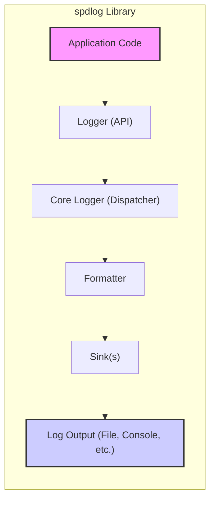
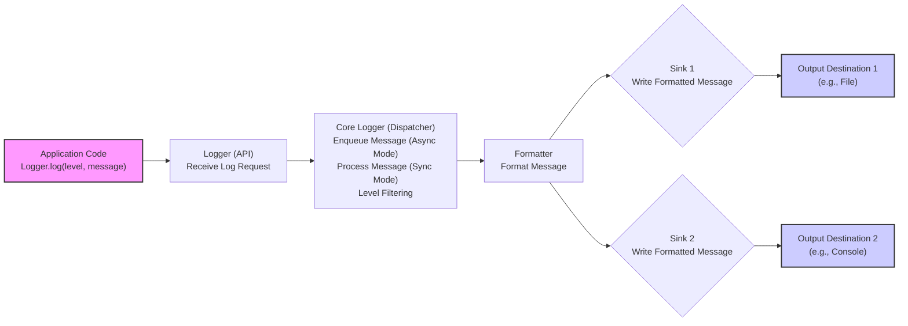

# Project Design Document: spdlog - Fast C++ Logging Library

**Version:** 1.1
**Date:** October 27, 2023
**Author:** AI Expert (Based on request)

## 1. Introduction

This document provides a detailed design overview of the `spdlog` project, a fast C++ logging library available at [https://github.com/gabime/spdlog](https://github.com/gabime/spdlog). This document is intended to serve as a foundation for threat modeling and security analysis of the `spdlog` library. It outlines the system architecture, key components, data flow, and security considerations from a design perspective.

### 1.1. Project Overview

`spdlog` is a header-only, very fast, and cross-platform C++ logging library. It is designed to be easy to use while offering high performance and flexibility. Key features include:

*   **Speed:** Optimized for performance, minimizing overhead in logging operations.
*   **Ease of Use:** Simple API for common logging tasks.
*   **Flexibility:** Supports various logging levels, formatting options, and output destinations (sinks).
*   **Extensibility:** Allows for custom formatters, sinks, and error handlers.
*   **Cross-Platform:** Works on major operating systems (Windows, Linux, macOS, etc.).
*   **Header-Only:** Easy integration into projects without complex build processes.

### 1.2. Purpose of this Document

This design document aims to:

*   Provide a comprehensive understanding of the `spdlog` library's architecture and functionality.
*   Identify key components and their interactions.
*   Describe the data flow within the logging system.
*   Highlight potential security vulnerabilities and design weaknesses that could be exploited.
*   Serve as a reference for developers, security analysts, and anyone interested in understanding the inner workings of `spdlog` for security assessments and improvements.

## 2. System Architecture

`spdlog`'s architecture is centered around the concepts of **Loggers**, **Sinks**, and **Formatters**.  Loggers are the primary interface for users to write log messages. Sinks are the destinations where log messages are written (e.g., files, console). Formatters define the structure and appearance of log messages. The Core Logger acts as a central dispatcher, managing formatters and sinks.

**Components:**

*   **Application Code:** The user application that utilizes the `spdlog` library to generate log messages. This is the entry point for logging operations.
*   **Logger (API):** The public interface provided by `spdlog` for applications to log messages. This includes functions for different logging levels (e.g., `debug`, `info`, `warn`, `error`, `critical`). Loggers are named entities, allowing for categorized logging, and are retrieved by name using a factory pattern.
*   **Core Logger (Dispatcher):**  The internal component acting as the central processing unit for log messages. It receives log requests from Loggers, applies the configured Formatter, and dispatches the formatted log messages to the appropriate Sink(s). It manages asynchronous logging queues and thread pools when configured for asynchronous operation.
*   **Formatter:**  Responsible for transforming log messages into a string representation based on a defined pattern. Formatters use pattern strings to define the output structure, including timestamps, log levels, thread IDs, logger names, source code location, and the actual message.
*   **Sink(s):**  Output destinations for formatted log messages. `spdlog` supports a variety of sink types, catering to different logging needs:
    *   **Console Sink:** Writes logs to the standard output (`stdout`) or standard error (`stderr`) streams.
    *   **File Sink:** Writes logs to files, with options for various file handling strategies.
    *   **Rotating File Sink:**  Extends File Sink with automatic file rotation based on file size, keeping log files manageable.
    *   **Daily File Sink:** File sink that rotates files daily, typically at midnight, for time-based log management.
    *   **Syslog Sink:** Sends logs to the system's syslog facility (Unix-like systems), enabling centralized system logging.
    *   **MSVC Debug Output Sink:** Writes logs to the Visual Studio debugger output window (Windows), useful for debugging in a Windows environment.
    *   **Memory Sink:** Stores logs in memory, primarily used for testing and scenarios where persistent storage is not immediately required.
    *   **Dist Sink:** Allows directing log messages to multiple sinks simultaneously.
    *   **Custom Sinks:** Users can implement their own sinks to extend `spdlog`'s functionality and write logs to databases, network sockets, cloud logging services, or other custom destinations.
*   **Log Output (File, Console, etc.):** The physical or logical destination where the logs are ultimately written, depending on the configured sinks. This could be files on disk, console output, syslog server, or a custom system.

## 3. Component Details

### 3.1. Logger (API)

*   **Functionality:** Provides the user-facing API for logging operations. Applications obtain a logger instance (usually by name using `spdlog::get()` or `spdlog::default_logger()`) and use its methods (`spdlog::logger::debug()`, `info()`, `warn()`, `error()`, `critical()`, `log()`) to generate log messages.
*   **Key Features:**
    *   **Named Loggers:** Loggers are identified by unique names, enabling organized logging from different modules or components of an application. This allows for granular control over logging levels and sinks for different parts of the system.
    *   **Logging Levels:** Each logger operates with a defined logging level. Log messages with a level below the logger's configured level are filtered out and discarded, reducing verbosity and improving performance. Standard levels are (from lowest to highest severity): `trace`, `debug`, `info`, `warn`, `err`, `critical`, `off`.
    *   **Variadic Arguments & Formatting:** Logging methods support variadic arguments, similar to `printf`, enabling structured and formatted log messages using format strings and placeholders. This is crucial for readability and machine parsing of logs.
    *   **Asynchronous and Synchronous Modes:** Loggers can be configured to operate in either synchronous (blocking) or asynchronous (non-blocking) mode. Asynchronous logging utilizes a background thread and a message queue to offload logging operations from the application's main thread, significantly improving performance, especially under heavy logging load.
    *   **Error Handling Configuration:** Loggers can be configured with custom error handlers to manage errors that occur during the logging process (e.g., sink failures).

### 3.2. Core Logger (Dispatcher)

*   **Functionality:**  Acts as the central dispatcher for all logging requests. It receives log messages from Logger API instances, applies the configured Formatter to generate a formatted string, and then routes this formatted message to all associated Sinks.
*   **Key Features:**
    *   **Message Queue (Asynchronous Mode):** In asynchronous mode, log messages are enqueued into a lock-free queue. A dedicated worker thread (or thread pool) dequeues messages and processes them, ensuring minimal impact on the application's performance.
    *   **Sink Management:**  Manages the association between Loggers and Sinks. A single logger can be configured to output to multiple sinks simultaneously, providing flexibility in log routing and redundancy.
    *   **Formatter Application:**  Retrieves the Formatter associated with the Logger and applies it to the log message and arguments. This step transforms the raw log data into a presentable string format.
    *   **Level Filtering Enforcement:** Re-enforces the logging level check, ensuring that only messages at or above the logger's configured level are processed and dispatched to sinks.
    *   **Error Handling and Fallback:**  Includes internal error handling for situations like formatter failures or sink write errors.  It may have configurable fallback mechanisms or error reporting.
    *   **Thread Safety:** Designed to be thread-safe, allowing concurrent logging from multiple threads without data corruption or race conditions.

### 3.3. Formatter

*   **Functionality:**  Transforms structured log messages into formatted strings based on a user-defined pattern. This pattern dictates the layout and content of the log output.
*   **Key Features:**
    *   **Pattern-Based Formatting:** Employs a pattern string syntax to define the output format. Patterns include placeholders (e.g., `%Y-%m-%d %H:%M:%S.%e` for timestamp, `%l` for log level, `%n` for logger name, `%v` for message) that are replaced with actual log data during formatting.
    *   **Predefined and Custom Patterns:** `spdlog` provides predefined patterns for common logging formats. Users can also create custom patterns to tailor the log output to specific requirements.
    *   **Color Support (Console Sink):**  Formatters can embed ANSI escape codes within the output string to add color to console logs based on log levels or other criteria, enhancing readability in terminal environments.
    *   **Custom Formatters (Extensibility):**  `spdlog` allows users to create custom formatter classes by inheriting from a base formatter class and implementing specific formatting logic. This enables highly specialized formatting beyond pattern-based approaches.
    *   **Performance Optimization:** Formatters are designed for performance, minimizing string allocations and processing overhead to ensure logging remains fast.

### 3.4. Sink(s)

*   **Functionality:**  Responsible for writing formatted log messages to their designated output destinations. Sinks handle the actual I/O operations and manage the interaction with the logging target.
*   **Key Features (General for Sinks):**
    *   **Output Destination Abstraction:** Each sink type encapsulates the logic for writing to a specific output (file, console, syslog, etc.), abstracting away the low-level details from the core logger and formatters.
    *   **Buffering and Flushing:** Sinks often implement buffering to improve write performance by reducing the frequency of system calls. Buffering can be configured and flushed periodically or on demand (e.g., on critical log levels or program termination).
    *   **Error Handling (Sink-Specific):** Sinks handle errors that occur during writing to their output destination (e.g., disk full errors for file sinks, network errors for syslog sinks). Error handling strategies can vary between sink types and may be configurable.
    *   **Thread Safety:** Sinks are designed to be thread-safe to support concurrent logging from multiple threads within an application. Internal locking or lock-free mechanisms are used to ensure data integrity.
    *   **Sink Combinations (Dist Sink):** The `dist_sink` allows combining multiple sinks, enabling a single logger to write to several destinations simultaneously.
*   **Specific Sink Types and Security Considerations:**
    *   **Console Sink:**
        *   **Output Streams:** Writes to `stdout` or `stderr`.
        *   **Buffering:** Typically line-buffered or unbuffered.
        *   **Security:** Lowest security risk in terms of data exposure as output is directly visible in the application's execution environment. However, excessive console logging can contribute to DoS if it consumes excessive resources.
    *   **File Sink (Rotating, Daily):**
        *   **File Permissions:** File sinks operate under the permissions of the application process. Incorrectly configured file permissions are a major security risk, potentially leading to unauthorized access, modification, or deletion of log files.
        *   **File Rotation:** Rotation mechanisms (size-based, time-based) are essential for managing log file size and preventing disk space exhaustion. Robust rotation logic is crucial to avoid data loss, race conditions, or denial of service due to disk filling.
        *   **File Locking (Multi-Process):** In multi-process environments where multiple processes might write to the same log file, file locking mechanisms are necessary to prevent data corruption and ensure log integrity.
        *   **Security:** Log files are a significant security concern as they often contain sensitive information. Access control to log files is paramount. Regular security audits of log file permissions and access patterns are recommended.
    *   **Syslog Sink:**
        *   **Protocol:** Uses the syslog protocol (typically UDP or TCP) to send logs to a syslog daemon.
        *   **Network Communication:** Syslog can involve network communication, potentially over insecure networks. Security risks include interception of log messages in transit, especially over UDP.
        *   **Syslog Server Security:** The security of the syslog sink is also dependent on the security of the syslog server and the network infrastructure. Compromised syslog servers can lead to log data manipulation or loss.
        *   **Security:** Syslog messages transmitted over insecure networks are vulnerable to eavesdropping and tampering. Consider using secure syslog protocols (e.g., syslog-ng with TLS) or VPNs for secure transmission.
    *   **Custom Sinks:**
        *   **Flexibility & Risk:**  Provides maximum flexibility but also introduces the highest security risk if not implemented carefully. Security vulnerabilities in custom sinks can directly compromise the logging system and potentially the application itself.
        *   **Security Responsibility:** Security of custom sinks is entirely the responsibility of the developer.  Thorough security reviews and testing are essential for custom sink implementations, especially when dealing with network communication, external systems, or sensitive data handling.  Vulnerabilities like injection flaws, insecure data storage, or insecure communication must be avoided.

## 4. Data Flow

The data flow for a log message in `spdlog` can be visualized as follows:

**Detailed Data Flow Steps:**

1.  **Log Request Initiation:** The application code initiates a log request by calling a logging method on a `spdlog::logger` instance (e.g., `logger->info("Processing request from user: {}", username)`).
2.  **Logger API Reception:** The Logger API method receives the log level, message, and any associated formatting arguments.
3.  **Core Logger (Dispatcher) Processing:**
    *   **Mode Determination:** The Core Logger checks if the logger is configured for asynchronous or synchronous operation.
    *   **Asynchronous Path:** If asynchronous, the log message and associated data are enqueued into the core logger's message queue. A worker thread from the thread pool will dequeue and process the message later.
    *   **Synchronous Path:** If synchronous, the core logger proceeds to process the message immediately in the current thread.
    *   **Level Filtering (First Pass):** The core logger performs an initial check to see if the log message's level is enabled for the logger. If the message level is below the logger's configured level, the message is discarded at this stage to minimize processing overhead.
4.  **Formatter Application:** The core logger retrieves the configured Formatter associated with the logger. The Formatter's `format()` method is invoked, transforming the log message and arguments into a formatted string according to the defined pattern.
5.  **Dispatch to Sinks:** The core logger iterates through the list of Sinks associated with the Logger. For each Sink:
    *   **Level Filtering (Sink Level - Optional):** Some sinks might implement their own level filtering, providing a second layer of filtering if needed.
    *   **Sink `log()` Method Invocation:** The formatted log message string is passed to the Sink's `log()` method.
    *   **Sink Output:** The Sink writes the formatted log message to its configured output destination (e.g., file I/O, console output, network transmission). This step involves the actual I/O operations.
6.  **Output to Destination:** The Sink completes the write operation to the final output destination. This could involve writing to a file on disk, displaying text on the console, sending data over a network socket, or other sink-specific actions.

## 5. Security Considerations (Design Level)

This section outlines security considerations from a design perspective, categorized by security principles (Confidentiality, Integrity, Availability) and common threat types.

**5.1. Confidentiality Threats:**

*   **Log File Exposure (C-1):**
    *   **Threat:** Log files containing sensitive data (user credentials, PII, system secrets, application data) are stored with insufficient access controls, allowing unauthorized users or processes to read them.
    *   **Mitigation:**
        *   **Principle of Least Privilege:** Implement strict file system permissions (e.g., using chown and chmod on Linux/Unix) to restrict read access to log files to only authorized users and processes (e.g., the application owner, system administrators, dedicated log analysis services).
        *   **Encryption at Rest (EAR):** For highly sensitive logs, consider encrypting log files at rest using file system encryption (e.g., LUKS, BitLocker) or application-level encryption before writing to disk.
        *   **Secure Log Rotation:** Ensure log rotation processes maintain proper permissions on new log files and rotated archives.
*   **Log Data in Transit (C-2 - Syslog/Network Sinks):**
    *   **Threat:** Log messages transmitted over a network (e.g., via Syslog to a central server or to cloud logging services) are intercepted by attackers if transmitted over insecure channels.
    *   **Mitigation:**
        *   **Encryption in Transit (EIT):** Use secure protocols for network logging. For Syslog, use TLS-encrypted syslog (syslog-ng with TLS). For custom network sinks, implement TLS/SSL encryption for all network communication.
        *   **VPN/Secure Channels:** Transmit log data over VPNs or other secure network channels to protect against network sniffing.

**5.2. Integrity Threats:**

*   **Log Tampering/Modification (I-1):**
    *   **Threat:** Attackers gain write access to log files and modify or delete log entries to cover their tracks, manipulate audit trails, or inject false information.
    *   **Mitigation:**
        *   **Write-Only Access (Principle of Least Privilege):**  Configure file system permissions to allow the logging application write-only access to log directories and files. Separate accounts for application execution and log analysis.
        *   **Log Integrity Monitoring:** Implement log integrity monitoring tools (e.g., file integrity monitoring systems - FIM) that detect unauthorized modifications to log files and alert administrators.
        *   **Log Signing/Digital Signatures:** For critical audit logs, consider implementing log signing or digital signature mechanisms to cryptographically verify the integrity and authenticity of log entries.
        *   **Immutable Logging:**  Store logs in immutable storage (e.g., WORM storage, blockchain-based logging) to prevent any modification after writing.
*   **Log Injection (I-2):**
    *   **Threat:** Attackers inject malicious content into log messages by exploiting vulnerabilities in log message formatting or by directly manipulating log input if user-controlled data is logged without proper sanitization. This can lead to:
        *   **Log Forgery:** Injecting false log entries to mislead administrators or security systems.
        *   **Exploitation of Log Analysis Tools:** Malicious log entries can exploit vulnerabilities in log analysis tools (e.g., SQL injection in log viewers, command injection in log processing scripts).
    *   **Mitigation:**
        *   **Parameterized Logging:** **Crucially**, use parameterized logging (as provided by `spdlog` with format strings and arguments) to separate log messages from dynamic data. Avoid string concatenation of user input directly into log messages.
        *   **Input Validation and Sanitization:** If user-provided data *must* be logged, validate and sanitize the input to remove or escape potentially harmful characters or formatting codes before logging.
        *   **Output Encoding:** Ensure proper output encoding when writing logs to prevent interpretation of malicious characters by log viewers or analysis tools.

**5.3. Availability Threats:**

*   **Denial of Service through Logging (A-1):**
    *   **Threat:** Attackers trigger excessive logging (e.g., by generating a flood of errors, requests, or malicious inputs) to overwhelm the logging system, consume excessive resources (CPU, memory, disk space), and potentially cause application or system crashes.
    *   **Mitigation:**
        *   **Rate Limiting/Throttling:** Implement rate limiting or throttling mechanisms for logging, especially in critical code paths or for specific log levels (e.g., limit the rate of error logs).
        *   **Logging Level Management:** Configure appropriate logging levels for production environments. Avoid excessively verbose logging (e.g., `trace` or `debug` level in production) unless specifically needed for troubleshooting.
        *   **Disk Space Monitoring and Management:** Monitor disk space usage for log partitions. Implement log rotation and archiving strategies to prevent disk space exhaustion.
        *   **Asynchronous Logging:** Utilize asynchronous logging to minimize the performance impact of logging on the application's main threads, preventing logging from becoming a bottleneck under heavy load.
        *   **Resource Limits for Logging:** In containerized environments or systems with resource control, set resource limits (CPU, memory, disk I/O) for the logging process to prevent it from consuming excessive resources and impacting other services.
*   **Log Storage Exhaustion (A-2):**
    *   **Threat:** Uncontrolled log growth fills up available storage space, leading to log loss, application failures due to inability to write logs, or system instability.
    *   **Mitigation:**
        *   **Log Rotation and Archiving:** Implement robust log rotation strategies (size-based, time-based) to manage log file sizes. Archive rotated logs to secondary storage for long-term retention if required.
        *   **Log Retention Policies:** Define and enforce log retention policies to automatically delete or archive older logs after a specified period, based on compliance requirements and storage capacity.
        *   **Centralized Log Management:** Utilize centralized log management systems that provide features for log aggregation, storage, indexing, and retention management, making it easier to manage large volumes of logs.

**5.4. Configuration and Management Threats:**

*   **Insecure Configuration (M-1):**
    *   **Threat:** `spdlog` configuration files or settings are stored insecurely (e.g., world-readable permissions, plain text credentials) or contain sensitive information (e.g., database connection strings for custom sinks, API keys).
    *   **Mitigation:**
        *   **Secure Configuration Storage:** Store `spdlog` configuration files with restricted file system permissions (e.g., readable only by the application owner and root).
        *   **Secrets Management:** Avoid storing sensitive credentials directly in configuration files. Use environment variables, secrets management systems (e.g., HashiCorp Vault, AWS Secrets Manager), or encrypted configuration to manage sensitive information securely.
        *   **Configuration Validation:** Implement configuration validation to detect and prevent misconfigurations that could weaken security (e.g., insecure sink configurations, overly permissive logging levels).
*   **Insufficient Logging (M-2):**
    *   **Threat:** Critical security events or application errors are not logged adequately, hindering incident detection, security monitoring, and forensic analysis.
    *   **Mitigation:**
        *   **Log Everything Important:** Define clear logging requirements and ensure that all relevant security events (authentication attempts, authorization failures, access control changes, critical errors, security-related API calls) are logged at appropriate levels.
        *   **Regular Log Review:** Regularly review log configurations and audit logs to ensure that logging is comprehensive and effective for security monitoring and incident response.

## 6. Deployment Considerations

`spdlog`'s header-only nature simplifies deployment.

*   **Integration:**  Simply include `spdlog` headers in C++ source files. No separate library linking is typically required for the core library itself.
*   **Configuration:** Configuration is primarily done programmatically in C++ code. For more complex setups, configuration can be loaded from external files (e.g., JSON, YAML) or environment variables, allowing for runtime adjustments without recompilation.
*   **Runtime Dependencies:** `spdlog` relies on standard C++ library features and OS APIs. Ensure the target runtime environment meets the C++ standard requirements (typically C++11 or later) and has necessary OS libraries available (e.g., syslog libraries for syslog sink).
*   **Permissions:**  When deploying applications using `spdlog`, carefully consider the permissions required for log file directories and files. The application process needs write permissions to the log destinations. Ensure these permissions are correctly set and follow the principle of least privilege.

## 7. Technologies Used

*   **Programming Language:** C++ (C++11 and later recommended for full feature set and performance)
*   **Standard Library:**  Extensive use of the C++ Standard Library (STL) for core functionalities: strings, containers, algorithms, threads, I/O streams, and time utilities.
*   **Operating System APIs:** OS-specific APIs are used for certain sinks and features:
    *   File I/O ( `<fstream>`, OS file system calls for file sinks).
    *   Console I/O (`<iostream>`, OS console APIs for console sink).
    *   Syslog (`<syslog.h>` or equivalent OS syslog API for syslog sink).
    *   Thread management (`<thread>`, OS threading APIs for asynchronous logging).
    *   Windows Debug Output (`OutputDebugString` API for MSVC Debug Output Sink).
*   **Build System Compatibility:** Designed to be compatible with standard C++ build systems like CMake, Make, Meson, and IDE projects (Visual Studio, Xcode, etc.). Header-only nature simplifies integration into existing build processes.

## 8. Conclusion

This enhanced design document provides a more detailed and security-focused overview of the `spdlog` library. It expands on the architecture, component details, data flow, and, most importantly, the security considerations. By categorizing threats and providing specific mitigations, this document aims to be a valuable resource for threat modeling and security assessments of systems using `spdlog`.  Further threat modeling exercises should utilize this document as a foundation to identify specific attack vectors, assess risks, and implement appropriate security controls to protect the confidentiality, integrity, and availability of logging data and the applications that rely on it.