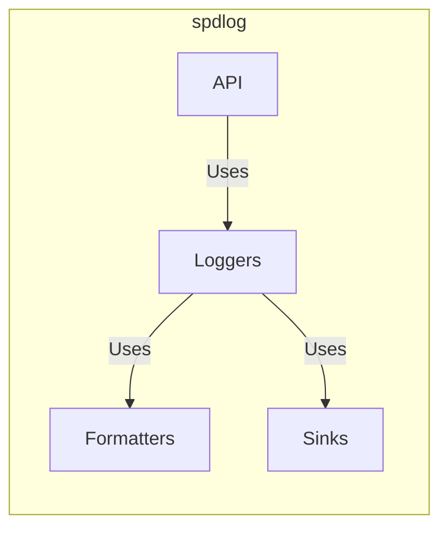
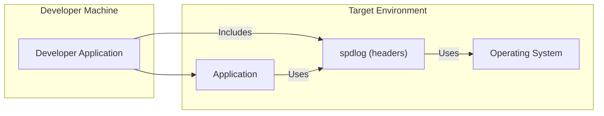
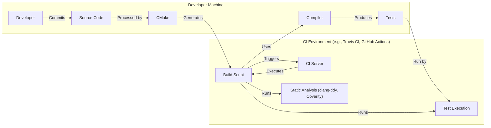

# BUSINESS POSTURE

Business Priorities and Goals:

The spdlog project aims to provide a very fast, header-only/compiled, C++ logging library. Its primary goals are:

*   Performance: Minimize logging overhead to ensure minimal impact on application performance.
*   Ease of Use: Provide a simple and intuitive API for developers to easily integrate logging into their applications.
*   Flexibility: Offer various configuration options, including different log levels, output formats, and destinations (sinks).
*   Portability: Support a wide range of platforms and compilers.
*   Maintainability: Keep the codebase clean, well-documented, and easy to maintain.

Business Risks:

*   Performance Degradation: If the logging library is not performant enough, it could negatively impact the performance of applications using it. This is a critical risk given the project's primary goal.
*   Data Loss: If log messages are not reliably written to their destinations, important diagnostic information could be lost.
*   Security Vulnerabilities: While not a primary focus, vulnerabilities in the logging library could potentially be exploited (e.g., format string vulnerabilities, denial of service).
*   Compatibility Issues: Failure to maintain compatibility with various compilers and platforms could limit the library's adoption and usefulness.
*   Lack of Features: If the library lacks essential features, users may choose alternative solutions.

# SECURITY POSTURE

Existing Security Controls:

*   security control: Input Validation: The library likely performs some input validation on format strings and other user-provided data to prevent common vulnerabilities. (spdlog uses fmt library, which should handle format string vulnerabilities)
*   security control: Testing: The project includes a test suite to ensure functionality and potentially identify some security issues. (described in CMakeLists.txt)
*   security control: Code Reviews: As an open-source project, spdlog likely benefits from community code reviews, which can help identify potential security flaws. (visible on GitHub)
*   security control: Static Analysis: The project mentions the use of static analysis tools like clang-tidy and Coverity Scan, which can detect potential bugs and security vulnerabilities. (described in CMakeLists.txt and .travis.yml)
*   security control: Compiler Warnings: The project aims to compile with high warning levels, which can help catch potential errors. (described in CMakeLists.txt)

Accepted Risks:

*   accepted risk: Denial of Service: While unlikely, a specially crafted input could potentially cause excessive resource consumption, leading to a denial of service. This is a lower priority risk given the library's typical usage.
*   accepted risk: Limited Input Sanitization: The library may not sanitize all possible inputs, relying on the user to provide valid data in some cases.

Recommended Security Controls:

*   security control: Fuzzing: Implement fuzz testing to systematically test the library with a wide range of invalid and unexpected inputs to identify potential vulnerabilities.
*   security control: Regular Security Audits: Conduct periodic security audits of the codebase to identify and address potential vulnerabilities.

Security Requirements:

*   Authentication: Not directly applicable to a logging library.
*   Authorization: Not directly applicable to a logging library.
*   Input Validation:
    *   Validate format strings to prevent format string vulnerabilities.
    *   Sanitize user-provided data where appropriate to prevent injection attacks.
    *   Enforce length limits on log messages and other inputs to prevent buffer overflows.
*   Cryptography:
    *   If sensitive data is logged, consider providing options for encryption or redaction. This is generally discouraged, but may be necessary in some cases. The library itself should not handle sensitive data directly.
*   Error Handling:
    *   Handle errors gracefully and provide informative error messages.
    *   Avoid leaking sensitive information in error messages.

# DESIGN

## C4 CONTEXT

```mermaid
graph LR
    subgraph Users
        Developer["Developer"]
    end
    subgraph "spdlog"
        spdlog["spdlog library"]
    end
    subgraph External Systems
        OS["Operating System"]
        fmtlib["fmt library"]
    end

    Developer -- Uses --> spdlog
    spdlog -- Writes logs to --> OS
    spdlog -- Uses --> fmtlib
```

Element Descriptions:

*   Element:
    *   Name: Developer
    *   Type: Person
    *   Description: A software developer who integrates spdlog into their application.
    *   Responsibilities: Uses spdlog API to log messages from their application.
    *   Security controls: None directly applicable.

*   Element:
    *   Name: spdlog library
    *   Type: Software System
    *   Description: The spdlog logging library.
    *   Responsibilities: Provides an API for logging, formats log messages, and writes them to configured sinks.
    *   Security controls: Input validation, static analysis, compiler warnings, testing.

*   Element:
    *   Name: Operating System
    *   Type: Software System
    *   Description: The underlying operating system.
    *   Responsibilities: Provides file system access, console output, and other system resources.
    *   Security controls: OS-level security controls (file permissions, etc.).

*   Element:
    *   Name: fmt library
    *   Type: Software System
    *   Description: External library used for formatting.
    *   Responsibilities: Provides string formatting capabilities.
    *   Security controls: Input validation, testing.

## C4 CONTAINER



Element Descriptions:

*   Element:
    *   Name: API
    *   Type: Component
    *   Description: The public interface of the spdlog library.
    *   Responsibilities: Provides functions for creating loggers and logging messages.
    *   Security controls: Input validation.

*   Element:
    *   Name: Formatters
    *   Type: Component
    *   Description: Components responsible for formatting log messages.
    *   Responsibilities: Convert log messages into strings according to specified formats.
    *   Security controls: Input validation (format string handling).

*   Element:
    *   Name: Sinks
    *   Type: Component
    *   Description: Components responsible for writing log messages to their destinations.
    *   Responsibilities: Write log messages to files, console, or other outputs.
    *   Security controls: None directly applicable, relies on OS security.

*   Element:
    *   Name: Loggers
    *   Type: Component
    *   Description: Components that manage log levels, formatters, and sinks.
    *   Responsibilities: Receive log messages from the API, format them, and send them to the appropriate sinks.
    *   Security controls: None directly applicable.

## DEPLOYMENT

Possible Deployment Solutions:

1.  Header-Only Library: The user simply includes the spdlog header files in their project.
2.  Static Library: The user compiles spdlog into a static library and links it with their application.
3.  Dynamic Library: The user compiles spdlog into a dynamic library and links it with their application.

Chosen Deployment Solution (Header-Only):



Element Descriptions:

*   Element:
    *   Name: Developer Application
    *   Type: Software System
    *   Description: The application being developed that will use spdlog.
    *   Responsibilities: Contains the application logic.
    *   Security controls: Application-specific security controls.

*   Element:
    *   Name: Application
    *   Type: Software System
    *   Description: The compiled application.
    *   Responsibilities: Runs the application logic, including logging.
    *   Security controls: Application-specific security controls.

*   Element:
    *   Name: spdlog (headers)
    *   Type: Code
    *   Description: The spdlog header files.
    *   Responsibilities: Provide the spdlog API and implementation.
    *   Security controls: Input validation, static analysis, compiler warnings, testing.

*   Element:
    *   Name: Operating System
    *   Type: Software System
    *   Description: The underlying operating system.
    *   Responsibilities: Provides file system access, console output, and other system resources.
    *   Security controls: OS-level security controls.

## BUILD



Build Process Description:

1.  Developer: The developer writes code and commits it to the repository.
2.  CMake: CMake is used as the build system generator. It processes the CMakeLists.txt files to generate build files for various platforms and compilers.
3.  Compiler: The compiler (e.g., GCC, Clang, MSVC) compiles the source code.
4.  Tests: Unit tests are compiled.
5.  CI Environment: A Continuous Integration (CI) server (e.g., Travis CI, GitHub Actions) is triggered by commits to the repository.
6.  Build Script: The CI server executes a build script.
7.  Static Analysis: Static analysis tools (clang-tidy, Coverity Scan) are run as part of the build process to identify potential code quality and security issues.
8.  Test Execution: The unit tests are executed to verify the functionality of the library.

Security Controls in Build Process:

*   security control: Static Analysis: clang-tidy and Coverity Scan are used to detect potential bugs and security vulnerabilities.
*   security control: Compiler Warnings: The project is compiled with high warning levels to catch potential errors.
*   security control: Automated Testing: Unit tests are run automatically to ensure functionality and prevent regressions.
*   security control: CI/CD: The use of a CI/CD pipeline ensures that the build and test process is consistent and repeatable.

# RISK ASSESSMENT

Critical Business Processes:

*   Application Performance: Maintaining the performance of applications that use spdlog is critical.
*   Reliable Logging: Ensuring that log messages are reliably written to their destinations is important for debugging and auditing.

Data Sensitivity:

*   Log Data: The sensitivity of log data depends on what the application logs. In general, applications should avoid logging sensitive information (passwords, API keys, PII, etc.). If sensitive data must be logged, it should be redacted or encrypted. Spdlog itself does not handle data sensitivity; this is the responsibility of the application using it.

# QUESTIONS & ASSUMPTIONS

Questions:

*   Are there any specific compliance requirements (e.g., GDPR, HIPAA) that need to be considered?
*   What are the expected log volumes and retention policies?
*   Are there any specific platform or compiler compatibility requirements beyond what is already supported?
*   What level of support is provided for custom sinks and formatters?

Assumptions:

*   BUSINESS POSTURE: The primary concern is performance and ease of use, with security being a secondary but important consideration.
*   SECURITY POSTURE: The library is used in a wide range of environments, so security controls should be robust but not overly restrictive.
*   DESIGN: The library is designed to be flexible and extensible, allowing users to customize its behavior.
*   DESIGN: The library is used correctly, and sensitive data is not logged without proper precautions.