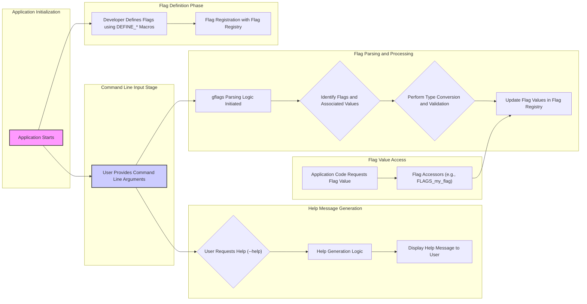

# Project Design Document: gflags Library

**Version:** 1.1
**Date:** October 26, 2023
**Author:** Gemini (AI Language Model)

## 1. Project Overview

The gflags library is a command-line flags processing module primarily for C++ (with some support for Python). It empowers developers to define and manage command-line arguments for their applications in a structured and type-safe manner. This design document details the architecture and key components of the gflags library, specifically for the purpose of threat modeling.

## 2. Goals

* Provide a straightforward and intuitive method for defining command-line flags.
* Support a range of data types for flags, including integers, strings, booleans, and floating-point numbers.
* Offer mechanisms for specifying default values for flags when no value is provided on the command line.
* Enable validation and constraints to be associated with flag values.
* Automatically generate help messages based on the defined flags and their descriptions.
* Allow flags to be set via command-line arguments and potentially through configuration files.
* Maintain cross-platform compatibility across various operating systems.
* Ensure efficiency and minimal performance impact on the application.

## 3. Non-Goals

* Serving as a comprehensive configuration management system that goes beyond command-line flags.
* Implementing a complex graphical user interface (GUI) for managing flags.
* Handling inter-process communication or distributed configuration scenarios.
* Providing advanced dependency injection or service location functionalities.
* Incorporating a full-fledged logging framework within the library itself.

## 4. Architecture and Components

The gflags library can be conceptually divided into the following core components:

* **Flag Definition Interface:**
    * This involves the set of macros (e.g., `DEFINE_bool`, `DEFINE_int32`, `DEFINE_string`) that application developers use within their source code to declare command-line flags.
    * Each macro invocation specifies the flag's name, its default value, and a descriptive help message that will be displayed to the user.
    * Internally, these macros are responsible for registering the newly defined flag with the central Flag Registry.

* **Flag Registry Component:**
    * This is an internal data structure, likely implemented as a map or hash table, that acts as a central repository for information about all defined flags within the application.
    * The registry stores key details for each flag, such as its unique name, the associated data type, the default value, the currently set value, and the descriptive help text.

* **Command-Line Argument Parsing Logic:**
    * This component is the core of gflags' functionality, responsible for processing the array of strings representing the command-line arguments passed to the application.
    * It iterates through these arguments, identifying potential flags (typically by the presence of a prefix like `--`).
    * Upon identifying a flag, it extracts the corresponding value (if provided) and performs the necessary type conversion based on the flag's defined data type.
    * This component also handles error conditions, such as encountering unknown flags or values that cannot be converted to the expected type.

* **Flag Value Storage Mechanism:**
    * This refers to how the actual values of the flags are stored in memory during the application's execution.
    * This might involve directly storing the value within the Flag Registry itself, or by associating the flag with a specific variable in the application's memory space. The accessors then interact with this storage.

* **Flag Accessor Functions/Methods:**
    * These are the functions or methods (often generated based on the `DEFINE_*` macros, e.g., `FLAGS_my_flag`) that application code uses to retrieve the current value of a defined flag.
    * These accessors provide a type-safe way to access the flag values, ensuring that the returned value matches the flag's declared data type.

* **Built-in Flag Handling:**
    * gflags typically includes support for certain built-in flags, such as `--help` (to display help information) and `--version` (to display the application's version).
    * The parsing logic is designed to recognize and handle these special flags, triggering the appropriate actions (e.g., generating and printing the help message).

* **Configuration File Processing (Optional):**
    * Some implementations or extensions of gflags may offer the capability to load flag values from external configuration files.
    * This component would handle the reading and parsing of these files, typically supporting a specific format (e.g., INI-like syntax or a custom format). It would then update the flag values in the registry based on the contents of the file.

## 5. Data Flow

**Data Flow Description:**

* **Application Initialization:** The application's execution begins.
* **Flag Definition Phase:** The application developer utilizes the gflags `DEFINE_*` macros to declare the command-line flags that the application will accept. This process registers each defined flag and its associated metadata within the Flag Registry.
* **Command Line Input Stage:** The user launches the application, providing command-line arguments as input.
* **Flag Parsing and Processing:**
    * The gflags parsing logic is invoked to process the command-line arguments.
    * The parser identifies potential flags and their corresponding values.
    * It attempts to convert the string values from the command line to the data types specified in the flag definitions. Validation rules (if any) are also applied at this stage.
    * If parsing and validation are successful, the Flag Registry is updated with the values provided by the user.
* **Flag Value Access:** When the application logic needs to access the value of a particular flag, it uses the generated flag accessor (e.g., `FLAGS_my_flag`). This accessor retrieves the current value of the flag from the Flag Registry.
* **Help Message Generation:** If the user includes the `--help` flag in the command-line arguments, the parsing logic detects this and triggers the help message generation component. This component retrieves the definitions of all registered flags and formats them into a user-friendly help message, which is then displayed to the user.

## 6. Security Considerations

This section outlines potential security considerations relevant to the gflags library and its usage.

* **Input Validation Vulnerabilities:**
    * **Risk:** If the application relies solely on gflags' basic type checking and does not implement more robust validation, malicious or unexpected input provided through command-line arguments could lead to vulnerabilities. This could include buffer overflows, format string bugs, or injection attacks if flag values are used unsafely in subsequent operations.
    * **Considerations:**
        * While gflags provides basic type checking, application developers must implement additional validation logic to ensure that flag values are within acceptable ranges, conform to expected formats, and do not contain malicious content.
        * Be particularly cautious when handling string inputs, as they are a common source of vulnerabilities. Sanitize and validate string inputs before using them in potentially dangerous operations.

* **Insecure Default Values:**
    * **Risk:** If default values for flags are not chosen carefully, they could inadvertently expose the application to vulnerabilities if the user does not explicitly override them with more secure values.
    * **Considerations:**
        * Select secure default values for flags, especially those that control security-sensitive aspects of the application's behavior.
        * Clearly document the default values and their security implications to inform users about potential risks.

* **Configuration File Security (If Supported):**
    * **Risk:** If gflags supports loading flag values from external configuration files, these files become a potential attack vector. If these files are stored in insecure locations or are not properly protected, they could be tampered with, leading to unauthorized changes in the application's configuration and potentially compromising its security.
    * **Considerations:**
        * If configuration files are used, ensure they are stored in secure locations with appropriate file system permissions to restrict unauthorized access.
        * Consider implementing mechanisms to verify the integrity of configuration files, such as using digital signatures or checksums, to detect tampering.
        * Be aware of potential vulnerabilities in the configuration file parsing logic itself, such as buffer overflows or format string bugs.

* **Information Disclosure through Help and Version Flags:**
    * **Risk:** The `--help` and `--version` flags, while useful for users, can potentially reveal sensitive information about the application's internal workings, dependencies, or configuration. This information could be exploited by attackers.
    * **Considerations:**
        * Carefully review the information exposed by the `--help` and `--version` flags and ensure that they do not inadvertently disclose sensitive details that could aid an attacker.
        * Consider providing a more generic version information output if the full version details are considered too sensitive.

* **Denial of Service (DoS) via Excessive Input:**
    * **Risk:** An attacker could potentially cause a denial of service by providing an extremely large number of flags or excessively long flag values, potentially overwhelming the parsing logic and consuming excessive resources.
    * **Considerations:**
        * While gflags itself might have some inherent limitations on input size, the application's handling of a large number of flags and their values should be considered.
        * Implement safeguards within the application to prevent excessive resource consumption due to a large number of input flags.

* **Type Confusion Vulnerabilities:**
    * **Risk:** Although gflags aims for type safety, potential vulnerabilities could arise if type conversions are not handled correctly or if there are inconsistencies between the declared flag type and how the value is used within the application.
    * **Considerations:**
        * Thoroughly review the type conversion logic within gflags for any potential flaws or edge cases that could lead to unexpected behavior or security issues.
        * Ensure that the application code consistently uses the flag values according to their declared types.

* **Dependency Chain Security:**
    * **Considerations:** While gflags itself might have minimal external dependencies, it's important to consider the security of the entire dependency chain of the application. Ensure that any underlying libraries or system calls used by gflags or the application itself are secure and up-to-date.

## 7. Dependencies

* **Standard C++ Library:** gflags relies heavily on the standard C++ library for core functionalities such as string manipulation, memory management, and input/output operations.
* **Potentially Platform-Specific Libraries:** Depending on the target platform and the specific features used, gflags might have dependencies on platform-specific libraries for tasks such as command-line argument parsing or file system access.

## 8. Deployment

The gflags library is typically deployed by:

* **Linking:** The gflags library is compiled and linked directly into the application's executable during the build process. This means that the gflags code becomes an integral part of the application.
* **No Separate Installation Required:** End-users of the application do not need to install the gflags library separately, as it is bundled within the application's executable.

## 9. Future Considerations

* **Enhanced Flag Validation Capabilities:** Exploring the addition of more sophisticated and flexible validation mechanisms directly within gflags, allowing developers to define custom validation rules more easily.
* **Support for More Complex Data Types:**  Investigating the possibility of adding built-in support for more complex data types, such as lists, maps, or custom data structures, directly within the flag definitions.
* **Improved Configuration File Handling:**  Standardizing and enhancing the support for loading flags from configuration files, with a strong focus on security best practices and support for various file formats.
* **Modularization of Components:**  Considering the potential for breaking down gflags into smaller, more independent modules to improve maintainability and allow for more targeted inclusion of specific functionalities.