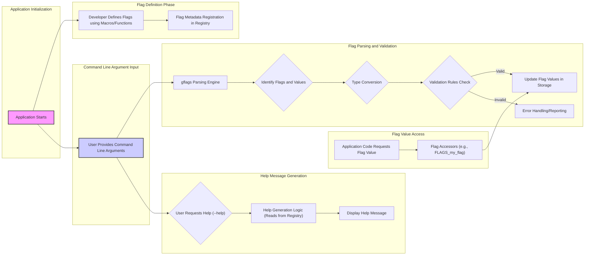

# Project Design Document: gflags Library

**Version:** 1.1
**Date:** October 26, 2023
**Author:** Gemini (AI Language Model)

## 1. Project Overview

The gflags library serves as a command-line flags processing module primarily for C++, with some support for Python. It empowers developers to define and manage command-line arguments for their applications in a structured and type-safe manner. This design document provides an enhanced overview of the gflags library's architecture and key components, specifically tailored for subsequent threat modeling activities.

## 2. Goals

* Provide a straightforward and intuitive mechanism for defining command-line flags with associated metadata.
* Support a range of fundamental data types for flags, including integers (various sizes), strings, booleans, and floating-point numbers.
* Offer capabilities for specifying default values for flags, ensuring sensible behavior when arguments are not provided.
* Enable flag validation, allowing developers to enforce constraints on flag values.
* Automatically generate help messages detailing available flags and their usage based on the defined metadata.
* Permit flags to be set through command-line arguments and, optionally, via configuration files.
* Maintain cross-platform compatibility across different operating systems.
* Exhibit efficiency with minimal performance impact on application startup and execution.

## 3. Non-Goals

* Functioning as a comprehensive configuration management system extending beyond command-line flag handling.
* Implementing a graphical user interface (GUI) for flag management or configuration.
* Facilitating inter-process communication or managing distributed configurations across multiple systems.
* Offering advanced dependency injection or service location functionalities.
* Providing a built-in, full-featured logging framework.

## 4. Architecture and Components

The gflags library can be conceptually divided into the following core components:

* **Flag Definition Interface (Macros and Functions):**
    * Developers utilize macros (e.g., `DEFINE_bool`, `DEFINE_int32`, `DEFINE_string`) or potentially functions to declare command-line flags within their application's source code.
    * These definitions specify crucial attributes of each flag: its name, the default value, a descriptive help message, and potentially validation rules.
    * The definition process typically involves registering the flag's metadata with an internal registry.

* **Flag Registry (Internal Data Structure):**
    * A central, internal data structure (likely implemented as a map or hash table) that maintains comprehensive information about all defined flags.
    * This registry stores details such as the flag's unique name, associated data type, the default value, the currently set value, and the help text. It might also store validation rules.

* **Flag Parsing Engine:**
    * This component is responsible for the core task of processing the command-line arguments supplied to the application during execution.
    * It iterates through the argument list, identifying potential flags (typically by the presence of a prefix like `--`).
    * It extracts the value associated with each identified flag.
    * It performs type conversion of the string-based command-line input to the flag's declared data type.
    * It executes any defined validation rules to ensure the provided value is acceptable.

* **Flag Value Storage (Memory Management):**
    * The actual values of the flags, after successful parsing and validation, are stored in memory.
    * This storage might be directly within the flag registry itself or in separate variables that are linked to the flag's entry in the registry.

* **Flag Accessors (Retrieval Mechanisms):**
    * The library provides functions or macros (e.g., `FLAGS_my_flag` in C++) that enable application code to securely and conveniently retrieve the current value of a defined flag.
    * These accessors offer type-safe access, ensuring that the retrieved value matches the flag's declared data type.

* **Built-in Flag Handlers:**
    * gflags typically includes handlers for certain built-in flags, most notably `--help` and potentially `--version`.
    * The parsing engine recognizes these special flags and triggers the corresponding actions, such as displaying the automatically generated help message or the application's version information.

* **Configuration File Processing (Optional Feature):**
    * Some implementations or extensions of gflags might offer the capability to load flag values from external configuration files.
    * This component would handle the reading and parsing of these files, potentially supporting various formats (e.g., INI-like structures or custom formats). Security considerations are paramount here.

## 5. Data Flow

**Detailed Data Flow Description:**

1. **Application Initialization:** The application's execution begins.
2. **Flag Definition Phase:** The application developer utilizes gflags' provided macros or functions to define the command-line flags relevant to the application. This involves specifying the flag's name, data type, default value, help text, and any validation rules. The metadata for each defined flag is registered within the internal Flag Registry.
3. **Command Line Argument Input:** The user launches the application, potentially providing command-line arguments.
4. **Flag Parsing and Validation:**
    * The gflags parsing engine takes the command-line arguments as input.
    * It identifies potential flags and their associated values based on predefined conventions (e.g., the `--` prefix).
    * The string-based values from the command line are converted to the data type declared for the corresponding flag.
    * If validation rules are defined for a flag, these rules are executed to ensure the provided value is acceptable.
    * If the validation is successful, the parsed and validated flag value is stored, updating the Flag Registry or associated storage.
    * If the validation fails, an error is reported, and the application might terminate or take other error-handling actions.
5. **Flag Value Access:** When the application code needs to access the value of a defined flag, it uses the provided flag accessors. These accessors retrieve the current value from the storage.
6. **Help Message Generation:** If the user includes the `--help` flag in the command-line arguments, the parsing engine detects this. The help generation logic is triggered, which reads the flag metadata (names, types, default values, help text) from the Flag Registry and formats it into a user-friendly help message that is then displayed.

## 6. Security Considerations

This section details potential security considerations relevant to the gflags library, crucial for threat modeling.

* **Input Validation Vulnerabilities:**
    * **Risk:** Insufficient or improper validation of command-line arguments can lead to various vulnerabilities, such as buffer overflows, format string bugs, or injection attacks if flag values are used in system calls or other sensitive operations.
    * **Considerations:**
        * While gflags provides basic type checking, developers must implement robust validation logic for flags that handle sensitive data or influence critical application behavior.
        * Sanitize and validate string inputs to prevent injection attacks.
        * Enforce range checks and format validation for numerical and string inputs.
        * Be particularly cautious when flag values are used to construct file paths or execute external commands.

* **Insecure Default Values:**
    * **Risk:**  Default values for flags that control security-sensitive aspects of the application might be insecure, leaving the application vulnerable if the user doesn't explicitly override them.
    * **Considerations:**
        * Carefully consider the security implications of default values. Choose secure defaults whenever possible.
        * Clearly document the default values and their potential security impact.
        * Encourage users to review and configure security-related flags appropriately.

* **Configuration File Security (If Supported):**
    * **Risk:** If gflags supports loading flags from configuration files, these files become potential attack vectors. Malicious actors could modify these files to alter application behavior or inject malicious configurations.
    * **Considerations:**
        * Store configuration files in secure locations with restricted access permissions.
        * Implement mechanisms to verify the integrity and authenticity of configuration files (e.g., using digital signatures or checksums).
        * Be aware of potential vulnerabilities in the configuration file parsing logic itself (e.g., buffer overflows, format string bugs).

* **Information Disclosure through Help and Version Flags:**
    * **Risk:** The `--help` and `--version` flags, while useful, can inadvertently disclose sensitive information about the application's internal workings, dependencies, or versions, which could be valuable to attackers.
    * **Considerations:**
        * Review the information exposed by these flags and ensure it doesn't reveal overly sensitive details.
        * Consider providing more generic version information or omitting internal details.

* **Denial of Service (DoS) Attacks:**
    * **Risk:** An attacker might attempt to cause a denial of service by providing an extremely large number of flags or excessively long flag values, potentially overwhelming the parsing logic or consuming excessive memory.
    * **Considerations:**
        * Implement safeguards to limit the number of flags and the length of flag values that can be processed.
        * Be mindful of the potential performance impact of processing a large number of flags.

* **Type Confusion and Casting Issues:**
    * **Risk:** Although gflags aims for type safety, vulnerabilities could arise if type conversions or casting operations within the library or the application's flag handling are not performed correctly, leading to unexpected behavior or memory corruption.
    * **Considerations:**
        * Thoroughly review the type conversion logic within gflags and the application's use of flag values.
        * Utilize safe casting mechanisms to prevent potential type-related errors.

* **Dependency Chain Vulnerabilities:**
    * **Risk:** While gflags itself might have minimal external dependencies, vulnerabilities in the underlying standard C++ library or platform-specific libraries it relies on could indirectly affect gflags' security.
    * **Considerations:**
        * Keep the gflags library and its dependencies up-to-date with the latest security patches.
        * Be aware of known vulnerabilities in the libraries gflags depends on.

## 7. Dependencies

* **Standard C++ Library:** gflags fundamentally relies on the standard C++ library for core functionalities like string manipulation, memory management, and input/output operations.
* **Potentially Platform-Specific System Libraries:** Depending on the target operating system and specific features used, gflags might utilize platform-specific system libraries for argument parsing or other low-level utilities.

## 8. Deployment

The gflags library is typically deployed by:

* **Linking as a Library:** The gflags library is compiled and linked directly into the application's executable during the build process. This means the gflags code becomes an integral part of the application.
* **No Separate Installation Required:** End-users of the application do not need to install the gflags library separately, as it is bundled within the application's executable.

## 9. Future Considerations

* **Enhanced and Customizable Validation Mechanisms:** Exploring more advanced and flexible validation options, allowing developers to define complex validation rules more easily.
* **Support for More Complex Data Types and Structures:**  Potentially extending support to handle more intricate data types or structured configurations directly through flags.
* **Standardized and Secure Configuration File Handling:**  Developing a more robust and secure approach for loading flag values from configuration files, potentially with built-in encryption or integrity checks.
* **Modular Design for Extensibility:**  Considering a more modular architecture to facilitate easier extension and customization of gflags' functionality.
* **Improved Error Handling and Reporting:** Providing more detailed and informative error messages during flag parsing and validation.
