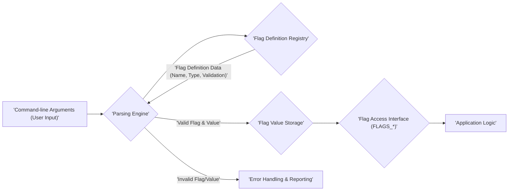

## Project Design Document: gflags - Command-line Flags Library

**1. Introduction**

This document provides a detailed design overview of the gflags library, a command-line flags processing library written in C++. This document serves as a foundational artifact for subsequent threat modeling activities, aiming to provide a clear understanding of the library's architecture and potential attack surfaces.

**1.1. Purpose**

The primary purpose of this document is to furnish a comprehensive architectural description of the gflags library. This description will serve as the basis for identifying and analyzing potential security vulnerabilities and risks associated with its design, implementation, and usage.

**1.2. Scope**

This document comprehensively covers the core functionalities of the gflags library, including:

*   Mechanism for defining and declaring command-line flags within C++ code.
*   Process of parsing command-line arguments provided to an application.
*   Methods for accessing and retrieving flag values within the application's logic.
*   Implementation of flag validation rules and constraint enforcement.
*   Generation of help messages detailing available flags and their usage.

This document explicitly excludes:

*   In-depth analysis of specific C++ code implementation details.
*   Configuration and intricacies of the build system.
*   Details regarding testing methodologies and procedures.
*   Comprehensive analysis of external libraries that might utilize gflags.

**1.3. Target Audience**

This document is specifically intended for:

*   Security engineers and architects tasked with performing threat modeling and security assessments.
*   Software developers actively working with or integrating the gflags library into their projects.
*   Individuals seeking a high-level yet detailed understanding of the gflags library's architectural design.

**2. Overview**

gflags is a C++ library designed to simplify the process of defining and accessing command-line flags for applications. It offers a structured and standardized approach to managing application configuration via command-line arguments. The library handles the complexities of parsing the command line input, validating the provided flag values against defined rules, and providing a convenient interface for accessing these values within the application's code. This promotes cleaner code and better user experience by providing clear and documented command-line options.

**3. System Architecture**

The gflags library can be conceptually decomposed into the following key architectural components, each with specific responsibilities:

*   **Flag Definition and Registration:** This component provides the API (typically macros like `DEFINE_string`, `DEFINE_int`, etc.) that allows developers to declare command-line flags within their C++ source code. This includes specifying the flag's name, data type, default value, a descriptive help message, and optional validation rules or constraints. Upon application startup, these definitions are registered internally.
*   **Command-line Parsing Engine:** This is the central component responsible for processing the raw command-line arguments passed to the application during execution. It iterates through the arguments, identifies potential flags based on predefined prefixes (e.g., `--`, `-`), and attempts to extract the corresponding flag name and value. This component handles different argument formats (e.g., `--flag=value`, `--flag value`).
*   **Flag Value Storage and Management:**  Internally, gflags maintains data structures (often using templates and maps) to store the parsed flag values. This component ensures that each defined flag has a corresponding storage location for its value. It manages the lifecycle of these values, updating them during parsing and providing access methods.
*   **Flag Access Interface:** This component provides the mechanism for application code to retrieve the values of the defined flags. This is typically achieved through accessor functions or variables generated by the flag definition macros (e.g., `FLAGS_my_flag`). This interface provides type-safe access to the flag values.
*   **Validation and Constraint Enforcement Module:** This crucial component ensures that the values provided for the flags adhere to any constraints defined during flag declaration. This can include checking for valid ranges, allowed sets of values, or adherence to specific formats. Validation occurs during the parsing phase, and errors are reported if constraints are violated.
*   **Help Message Generation Engine:** This component is responsible for dynamically generating help messages that describe the available command-line flags. It utilizes the information provided during flag definition (name, help text, default value) to create a user-friendly summary of the application's command-line options. This is typically triggered by a special flag like `--help`.

**4. Data Flow**

The following diagram illustrates the typical flow of data within an application utilizing the gflags library:

**Detailed Data Flow Description:**

1. **'Command-line Arguments (User Input)':** The process commences when a user executes the application, providing command-line arguments. These arguments are passed as strings to the application's `main` function.
2. **'Parsing Engine':** Upon application initialization, the gflags library's parsing engine is activated. This engine receives the raw command-line arguments as input.
3. **'Flag Definition Registry':** The parsing engine consults the internal 'Flag Definition Registry'. This registry holds metadata about all the flags defined within the application's source code, including their names, data types, default values, help text, and validation rules.
4. **'Flag Definition Data (Name, Type, Validation)':** The 'Flag Definition Registry' provides the parsing engine with the necessary details about each defined flag to facilitate parsing and validation.
5. **'Valid Flag & Value':** If the parsing engine successfully identifies a valid flag and extracts a corresponding value that passes all defined validation checks, the flag name and its parsed value are passed to the 'Flag Value Storage'.
6. **'Flag Value Storage':** The 'Flag Value Storage' component stores the validated flag values internally, making them available for access by the application logic.
7. **'Invalid Flag/Value':** If the parsing engine encounters an unrecognized flag or a value that fails validation (e.g., wrong data type, out of range), it triggers the 'Error Handling & Reporting' mechanism.
8. **'Error Handling & Reporting':** This component handles errors encountered during parsing. This typically involves printing informative error messages to the console, indicating the invalid flag or the nature of the validation failure. In some cases, it might lead to application termination.
9. **'Flag Access Interface (FLAGS_*)':** The application logic utilizes the 'Flag Access Interface', often through globally accessible variables prefixed with `FLAGS_`, to retrieve the stored values of the parsed flags.
10. **'Application Logic':** The application's core logic then uses the retrieved flag values to configure its behavior, control its execution flow, and access user-provided parameters.

**5. Security Considerations (Detailed for Threat Modeling)**

Building upon the initial thoughts, here are more detailed security considerations relevant for threat modeling:

*   **Input Validation Vulnerabilities (Critical):**
    *   **Insufficient or Missing Validation:** If flag values are not properly validated against their expected types, ranges, or formats, it can lead to vulnerabilities. For example, an integer flag intended for a port number might accept a negative value, causing unexpected behavior or crashes.
    *   **Injection Attacks:** If flag values are directly incorporated into system commands, database queries, or other sensitive operations without proper sanitization or escaping, it could lead to command injection, SQL injection, or other injection vulnerabilities. For instance, a string flag intended for a filename could be crafted to include malicious commands.
    *   **Denial-of-Service (DoS) via Resource Exhaustion:** Maliciously crafted flag values (e.g., extremely long strings) could consume excessive memory or processing power during parsing or subsequent use, leading to a denial of service.
    *   **Type Confusion:**  If the parsing logic doesn't strictly enforce data types, providing a value of the wrong type might lead to unexpected behavior or even security exploits in languages with less strict type systems (though less likely in C++ with gflags' strong typing).
*   **Default Value Exploitation:**
    *   **Insecure Defaults:** If default values for certain flags are insecure or expose sensitive functionality, an attacker might rely on these defaults if the user doesn't explicitly override them. For example, a debugging flag defaulting to `true` in a production environment.
*   **Flag Name Collision and Confusion:**
    *   **Internal Collisions:** While gflags aims to prevent this, potential vulnerabilities could arise if internal logic mishandles cases where flag names might somehow collide or be misinterpreted.
    *   **External Collisions/Shadowing:** If an application uses multiple libraries that define flags with the same name, this could lead to unexpected behavior as one flag might shadow or override another.
*   **Information Disclosure via Help Messages:**
    *   **Revealing Internal Details:**  Overly verbose help messages might inadvertently reveal sensitive information about the application's internal workings, configuration options, or even potential vulnerabilities that could be exploited by attackers.
*   **Dependency Chain Vulnerabilities (Indirect):**
    *   While gflags has minimal direct dependencies, vulnerabilities in the standard C++ library or the underlying operating system could indirectly impact the security of applications using gflags.
*   **Race Conditions in Multi-threaded Applications:**
    *   If flag values are accessed or modified concurrently by multiple threads without proper synchronization, race conditions could lead to inconsistent flag states and unpredictable application behavior, potentially creating security loopholes.
*   **Abuse of Flag Combinations (Logical Flaws):**
    *   Certain combinations of valid flags, while individually harmless, might create unintended or harmful states when used together. This is more of an application logic issue but is influenced by how flags are defined and used.
*   **Environment Variable Interaction (If Supported):** If gflags or the application interacts with environment variables to set or override flag values, vulnerabilities related to environment variable manipulation could arise.

**6. Dependencies**

The gflags library has minimal external dependencies, primarily relying on:

*   **Standard C++ Library:**  The core functionality of gflags is built upon standard C++ library features.

**7. Deployment**

The gflags library is typically deployed by:

*   **Linking:**  The gflags library (either as a static or shared library) is linked with the application's executable during the build process.
*   **Runtime Initialization:**  The application initializes the gflags library at runtime, typically early in the execution flow, to process the command-line arguments before the main application logic begins.

**8. Future Considerations (Relevant for Long-Term Design and Security)**

While not directly within the scope of immediate threat modeling, these future considerations can influence the long-term security and robustness of gflags and applications using it:

*   **Enhanced Validation Mechanisms:** Exploring more advanced and flexible validation techniques, such as support for regular expressions, custom validation functions, or integration with external validation libraries.
*   **Secure Configuration File Integration:** If configuration file support is added, ensuring secure parsing and handling of configuration data to prevent injection or other vulnerabilities.
*   **Improved Error Reporting and Logging:** Providing more detailed and context-rich error messages and logging capabilities to aid in debugging and security auditing.
*   **Namespaced Flags:**  Implementing namespaces for flags to mitigate the risk of flag name collisions, especially in large projects or when integrating with multiple libraries.
*   **Security Audits and Best Practices Documentation:** Regularly conducting security audits of the gflags codebase and providing clear documentation on secure usage patterns and potential pitfalls for developers.

This improved document provides a more detailed and nuanced understanding of the gflags library's architecture, data flow, and potential security considerations, making it a more effective foundation for comprehensive threat modeling activities.