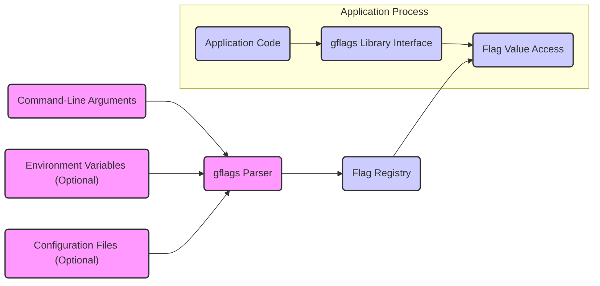

# Project Design Document: gflags Library

**Version:** 1.1
**Date:** October 26, 2023
**Author:** Gemini (AI Language Model)

## 1. Introduction

This document provides a detailed design overview of the gflags library, a command-line flags processing library for C++. This document is intended to serve as a foundation for subsequent threat modeling activities. It outlines the key components, data flow, and interactions within the gflags library and its usage context, with a focus on aspects relevant to security analysis.

## 2. Goals and Objectives

The primary goal of this document is to provide a comprehensive architectural understanding of the gflags library to facilitate effective threat modeling. Specific objectives include:

*   Clearly defining the boundaries of the gflags library and its interaction points.
*   Identifying the key components and elaborating on their specific responsibilities and internal mechanisms.
*   Mapping the data flow within the library and between the library and its users, including potential data transformations.
*   Highlighting potential areas of security concern based on the detailed design, providing specific examples where applicable.

## 3. System Architecture

The gflags library facilitates the definition, parsing, and access of command-line flags in C++ applications. Its architecture is centered around managing flag definitions and processing input from various sources.

### 3.1. Key Components

*   **Flag Definition Macros (`DEFINE_bool`, `DEFINE_int32`, etc.):** These macros, used by the application developer, are the primary interface for declaring command-line flags.
    *   *Responsibility:*  Registering the flag's name, type, default value, and help text with the gflags library's internal registry.
    *   *Mechanism:*  Typically involve creating static global variables and registering them with the flag registry during program initialization.
*   **Flag Registry:** An internal component responsible for storing and managing the metadata of all defined flags.
    *   *Responsibility:*  Maintaining a data structure (e.g., a map) that maps flag names to their properties (type, default value, current value, help text).
    *   *Mechanism:*  Uses data structures like `std::map` to store flag information. Provides methods for adding, retrieving, and iterating over registered flags.
*   **gflags Parser:** The core component responsible for processing command-line arguments, environment variables, and configuration files.
    *   *Responsibility:*  Iterating through input sources, identifying flag names and values, performing type conversions, and updating the flag values in the Flag Registry.
    *   *Mechanism:*
        *   **Command-Line Parsing:**  Iterates through `argv`, looking for arguments starting with `--` or `-`. Extracts flag names and values. Handles boolean flags (e.g., `--myflag` vs. `--nomyflag`).
        *   **Environment Variable Parsing:**  Checks environment variables based on a naming convention (often converting flag names to uppercase with prefixes).
        *   **Configuration File Parsing:**  Reads configuration files (typically line by line), parsing key-value pairs. The format is usually simple (e.g., `flag_name=value`).
*   **Flag Value Storage (within Flag Registry):** The mechanism for storing the current values of the flags.
    *   *Responsibility:* Holding the parsed or default values for each registered flag.
    *   *Mechanism:*  The Flag Registry itself acts as the storage, holding the current value for each flag. The type of storage depends on the flag's data type.
*   **Flag Value Access (Global Variables/Accessors):**  The methods by which the application code retrieves the current values of the flags.
    *   *Responsibility:* Providing a way for the application to access the parsed flag values.
    *   *Mechanism:*  The `DEFINE_*` macros typically create global variables with the flag's name. Accessing these variables directly retrieves the current flag value. Accessor functions might also be provided in some cases.
*   **Help Message Generation:** Functionality to automatically create help messages.
    *   *Responsibility:*  Generating a formatted output listing all defined flags, their types, default values, and help text.
    *   *Mechanism:*  Iterates through the Flag Registry and formats the information for display on the console.

### 3.2. Data Flow

The data flow within an application using gflags involves several stages:

1. **Flag Definition Phase:**
    *   The application code utilizes `DEFINE_*` macros.
    *   This triggers registration of flag metadata (name, type, default, help) with the Flag Registry.
2. **Initialization and Parsing Phase:**
    *   The application calls `google::ParseCommandLineFlags` (or similar).
    *   **Command-Line Argument Processing:**
        *   The gflags Parser iterates through the command-line arguments.
        *   It identifies potential flag arguments (e.g., `--flag=value`).
        *   It extracts the flag name and the provided value.
        *   It looks up the flag in the Flag Registry.
        *   It attempts to convert the provided value to the flag's declared type.
        *   The Flag Registry is updated with the parsed value.
    *   **Environment Variable Processing (Optional):**
        *   The gflags Parser checks environment variables for flag values.
        *   It maps environment variable names to flag names.
        *   It retrieves the environment variable's value.
        *   It attempts type conversion.
        *   The Flag Registry is updated (if the value is different from the default and not already set by command-line arguments).
    *   **Configuration File Processing (Optional):**
        *   The gflags Parser reads the specified configuration file.
        *   It parses key-value pairs from the file.
        *   It maps keys to flag names.
        *   It attempts type conversion.
        *   The Flag Registry is updated (following the precedence rules).
3. **Flag Access Phase:**
    *   The application code accesses the global variables created by the `DEFINE_*` macros.
    *   The current value of the flag is retrieved from the Flag Registry.
4. **Help Message Generation Phase (on request):**
    *   The application might call a function to display the help message.
    *   The gflags library iterates through the Flag Registry.
    *   It formats the flag names, types, default values, and help text.
    *   The formatted help message is outputted.

## 4. Security Considerations

This section details potential security considerations related to the design and usage of the gflags library.

*   **Insufficient Input Validation:**
    *   *Threat:*  Maliciously crafted or unexpected input values for flags could lead to vulnerabilities if not properly validated. For example, providing a very large number for an integer flag could cause integer overflows or excessive memory allocation if used without bounds checking. Supplying non-numeric data to an integer flag might lead to parsing errors or unexpected behavior.
    *   *Mitigation:*  Applications using gflags should implement their own validation logic on the flag values after parsing, especially for security-sensitive flags.
*   **Denial of Service (DoS) via Excessive Input:**
    *   *Threat:*  An attacker could provide an extremely large number of flags or excessively long flag values, potentially exhausting server resources (memory, CPU) and causing a denial of service.
    *   *Mitigation:*  Consider implementing limits on the number of flags or the maximum length of flag values that the application will process.
*   **Information Disclosure through Command-Line Arguments:**
    *   *Threat:*  If sensitive information (e.g., passwords, API keys) is passed through command-line flags, it can be exposed in process listings (e.g., `ps`), shell history, and potentially to other users on the system.
    *   *Mitigation:*  Avoid passing sensitive information via command-line flags. Consider alternative methods like environment variables (with appropriate permissions) or secure configuration file management.
*   **Configuration File Vulnerabilities:**
    *   *Threat:* If gflags reads from configuration files, vulnerabilities can arise from insecure file permissions, allowing unauthorized modification of flag values. Also, if the parsing logic for configuration files is flawed, it could be exploited (e.g., buffer overflows if line lengths are not checked).
    *   *Mitigation:*  Ensure configuration files have appropriate read/write permissions. Implement robust parsing logic to handle potentially malformed input. Consider using more structured and secure configuration file formats.
*   **Environment Variable Security Risks:**
    *   *Threat:*  Relying on environment variables for configuration can introduce risks if the environment is not properly secured. Malicious actors might be able to set environment variables to influence the application's behavior. Also, environment variables can be unintentionally leaked to child processes.
    *   *Mitigation:*  Be cautious when using environment variables for sensitive configuration. Document which environment variables are used and their expected values. Consider the security implications of environment variable inheritance.
*   **Type Confusion Vulnerabilities:**
    *   *Threat:*  Errors in the parsing or type conversion logic within gflags could potentially lead to type confusion, where a flag is interpreted as a different type than intended, potentially leading to unexpected behavior or security vulnerabilities.
    *   *Mitigation:*  The gflags library itself should have robust type checking and conversion mechanisms. Applications should be aware of the types of their flags and handle them accordingly.
*   **Default Value Security Implications:**
    *   *Threat:*  Insecure default values for flags can create vulnerabilities if users do not explicitly set the flag to a secure value. For example, a debugging flag enabled by default could expose sensitive information.
    *   *Mitigation:*  Carefully consider the security implications of default flag values. Defaults should be set to the most secure option where possible.
*   **Dependency Chain Risks:**
    *   *Threat:* While gflags has minimal dependencies, vulnerabilities in the standard C++ library could indirectly affect applications using gflags.
    *   *Mitigation:*  Keep the compiler and standard library up-to-date with security patches.

## 5. Deployment Considerations

The method of deploying an application using gflags can have security implications.

*   **Static Linking:**
    *   *Security Implication:*  Security updates to the gflags library require recompiling and redeploying the entire application. This can lead to delays in patching vulnerabilities. However, it also isolates the application from potentially incompatible changes in shared libraries.
*   **Dynamic Linking:**
    *   *Security Implication:*  Security updates to gflags can be applied by updating the shared library without recompiling the application, allowing for faster patching. However, this introduces a dependency on the presence and integrity of the shared library on the target system. A compromised or outdated shared library could introduce vulnerabilities. Care must be taken to ensure compatibility between the application and updated versions of the shared library.

Considerations for deployment:

*   **Permissions:** Ensure the application executable and any configuration files have appropriate file system permissions to prevent unauthorized modification.
*   **Supply Chain Security:**  Verify the integrity of the gflags library and any dependencies used during the build and deployment process.
*   **Update Mechanisms:**  Establish a process for updating the gflags library (especially in dynamic linking scenarios) to address security vulnerabilities.

## 6. Dependencies

The gflags library has a primary dependency on the standard C++ library.

*   **Standard C++ Library:** gflags relies on standard C++ features for core functionalities like memory management (`<memory>`), string manipulation (`<string>`), input/output (`<iostream>`), and data structures (`<map>`, `<vector>`). Security vulnerabilities in the standard C++ library could potentially impact gflags.

## 7. Future Considerations

Potential future changes to gflags could introduce new security considerations:

*   **Support for more complex data types (e.g., nested structures, lists):**  This could increase the complexity of parsing and validation, potentially introducing new vulnerabilities if not implemented carefully.
*   **Integration with external configuration sources (e.g., cloud-based configuration services):**  This would introduce new attack surfaces related to the security of those external services and the communication between gflags and those services.
*   **Enhanced validation features (e.g., regular expressions, custom validation callbacks):** While beneficial, poorly implemented or overly complex validation logic could itself introduce vulnerabilities (e.g., regular expression denial of service).
*   **Changes to the parsing logic or the order of precedence for different configuration sources:**  Unexpected changes could lead to misconfigurations and potential security issues.

This improved design document provides a more detailed and security-focused overview of the gflags library, serving as a stronger foundation for subsequent threat modeling activities.