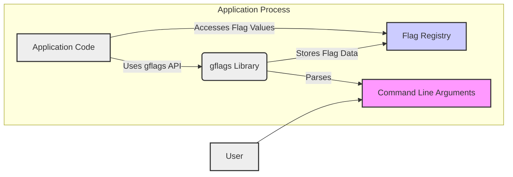

## Project Design Document: gflags - Command-line Flags Library (Improved)

**1. Introduction**

This document provides an enhanced design overview of the gflags (command-line flags) library, available on GitHub at [https://github.com/gflags/gflags](https://github.com/gflags/gflags).  It serves as a refined foundation for threat modeling and security analysis of gflags and applications utilizing it. This document details the system architecture, key components, data flow, and crucial security considerations, aiming for greater clarity and actionable insights for security assessments.

**2. Project Overview**

gflags is a robust C++ library designed to streamline command-line flag processing. It empowers developers to define typed flags within their C++ applications, which users can then configure via command-line arguments. gflags simplifies argument parsing, offering a structured, type-safe, and user-friendly method to manage application configuration through command-line options.

**Key Features:**

* **Declarative Flag Definition:**  Utilizes macros (e.g., `DEFINE_bool`, `DEFINE_int32`) for concise flag declaration, including name, type, default value, and descriptive help text.
* **Automated Flag Parsing:**  Parses command-line arguments provided to the application executable, automatically extracting flag values.
* **Type-Safe Flag Access:** Provides direct, type-safe access to flag values within the application code, minimizing type-related errors.
* **Integrated Help System:**  Generates user-friendly help messages listing all defined flags, their types, default values, and descriptions, accessible via standard help flags (e.g., `--help`, `-h`).
* **Configuration Persistence (Optional):** Supports saving and loading flag values from configuration files, enabling persistent application settings across sessions.
* **Flag Validation and Customization:**  Allows for registration of flags and implementation of custom validation logic to ensure flag values meet application-specific requirements.

**3. System Architecture**

The gflags library operates as an embedded component within the application's process space. It is not a separate service or daemon. Its primary interactions are confined to the application code that integrates it and the command-line arguments supplied during application execution.

**3.1. High-Level Architecture Diagram**

**Diagram Description:**

* **"User"**: Represents the external actor providing command-line input.
* **"Command Line Arguments"**: The text input provided by the "User" when launching the application, serving as the primary external interface for flag configuration.
* **"gflags Library"**: The core library, linked directly into the "Application Code", responsible for parsing arguments, managing flag definitions in the "Flag Registry", and providing access to flag values.
* **"Flag Registry"**: An internal, in-memory data structure within the "gflags Library" that holds all defined flag metadata (name, type, value, help text, validators, etc.).
* **"Application Code"**: The developer-written application logic that utilizes the "gflags Library" to define, parse, and access command-line flags to control application behavior.

**3.2. Detailed Component Breakdown**

**3.2.1. Flag Definition Interface:**

* **Purpose:**  Provides the API for developers to declare and define command-line flags within their C++ source code.
* **Functionality:**
    * Macros like `DEFINE_bool`, `DEFINE_int64`, `DEFINE_double`, `DEFINE_string`, and `DEFINE_enum` are used to declare flags with specific data types.
    * These macros require the flag name, a default value, and descriptive help text as parameters.
    * Internally, these macros register the defined flag, along with its metadata, within the "Flag Registry".
* **Interface:** C++ preprocessor macros and inline functions exposed through gflags header files (e.g., `<gflags/gflags.h>`).
* **Security Relevance:**  While the definition itself is not a direct vulnerability, poorly chosen default values or unclear help text can indirectly contribute to misconfiguration and potential security issues in the application if users are misled.

**3.2.2. Command Line Argument Parsing Engine:**

* **Purpose:**  To process the raw command-line arguments (typically the `argv` array) passed to the application and extract flag names and their corresponding values.
* **Functionality:**
    * Parses the `argv` array, identifying potential flags based on prefixes (e.g., `--`, `-`).
    * Extracts flag names and values based on defined syntax (e.g., `--flag_name=value`, `--flag_name value`, `-fvalue`, `-f value`).
    * Performs basic type conversion from string representations in command-line arguments to the defined flag types (integer, boolean, string, etc.).
    * Includes error handling for invalid flag syntax, unknown flags, or type conversion failures, reporting errors to the user (typically via standard error).
    * Handles special built-in flags like `--help` (or `-h`) and `--version`, triggering help message generation or version display.
* **Interface:** Internal functions within the gflags library, primarily invoked by the `google::ParseCommandLineFlags()` function, which is called by the application.
* **Security Relevance:** This component is a critical point for security. Vulnerabilities here could lead to:
    * **Injection Vulnerabilities:** If the parser doesn't correctly handle special characters or escape sequences in flag values, it could be susceptible to command injection or other injection attacks when these values are later used by the application.  *Note: gflags itself primarily parses; the application is responsible for secure usage of parsed values.*
    * **Denial of Service (DoS):**  Maliciously crafted command lines with excessively long flags, deeply nested structures (if supported, though less common in gflags), or attempts to exploit parsing inefficiencies could potentially lead to resource exhaustion and DoS.
    * **Argument Smuggling/Confusion:** Subtle parsing ambiguities or inconsistencies could be exploited to "smuggle" arguments or cause the application to interpret arguments in unintended ways.

**3.2.3. Flag Registry (Internal Data Store):**

* **Purpose:**  To centrally manage and store the definitions and current values of all flags defined within the application using gflags.
* **Functionality:**
    * Stores metadata for each flag: name, data type, default value, current parsed value, help text, validation functions (if any), and potentially other attributes.
    * Provides efficient lookup mechanisms to retrieve flag information based on the flag name during parsing and when the application accesses flag values.
    * Manages updates to flag values as they are parsed from the command line or potentially modified programmatically (though less common).
* **Interface:** Internal data structures (likely hash maps or similar) and access functions within the gflags library, not directly exposed to application code.
* **Security Relevance:**  While not directly externally accessible, the integrity of the "Flag Registry" is vital. Corruption or manipulation of this internal data structure (e.g., through memory corruption vulnerabilities in gflags itself, though unlikely) could lead to unpredictable and potentially insecure application behavior.

**3.2.4. Flag Access API:**

* **Purpose:**  To provide a type-safe and convenient way for application code to retrieve and utilize the values of the defined command-line flags after parsing.
* **Functionality:**
    * Typically provides direct access to flag values through global variables that are automatically created by the `DEFINE_*` macros.  These variables are named after the flag names.
    * Offers type-safe access; the global variable's type corresponds to the flag's defined type (e.g., `bool`, `int32`, `string`).
* **Interface:** C++ global variables (generated by macros) and potentially inline accessor functions exposed through gflags header files.
* **Security Relevance:**  The way application code *uses* the flag values obtained through this API is paramount for security.  **Gflags itself does not perform application-level input validation or sanitization.** Applications *must* implement robust validation and sanitization of flag values *after* retrieving them from gflags and *before* using them in any security-sensitive operations (e.g., file path manipulation, system commands, database queries).

**3.2.5. Help and Version Generation Module:**

* **Purpose:**  To automatically generate and display help messages listing available flags and optionally application version information when requested by the user (e.g., via `--help` or `-h` flags).
* **Functionality:**
    * Iterates through the "Flag Registry" to collect definitions and descriptions of all registered flags.
    * Formats this information into a human-readable help message, typically output to standard output (stdout).
    * May also handle `--version` flags to display application version information if the application provides this information to gflags (through a flag or other mechanism).
* **Interface:** Internal functions within the gflags library, triggered when help or version flags are detected during parsing.
* **Security Relevance:**  Help messages themselves are generally not a direct security risk. However, exposing detailed version information *could* indirectly aid attackers by revealing specific application versions that might have known vulnerabilities.  Consider if detailed version information needs to be exposed via `--version` in security-sensitive deployments.

**4. Data Flow**

The primary data flow in gflags centers around processing user-provided command-line arguments, parsing them into flag values, and making these values accessible to the application logic.

**4.1. Data Flow Diagram**

```mermaid
graph LR
    A["User Executes Application with Command Line Arguments"] --> B("OS Passes Arguments (argv)");
    B --> C("Application Calls google::ParseCommandLineFlags()");
    C --> D["gflags Parsing Engine"];
    D --> E{"Argument Type?"};
    E -- "Flag Argument" --> F["Lookup Flag in Registry"];
    E -- "Non-Flag Argument" --> G["Application Handles (Positional Args)"];
    F --> H{"Flag Defined?"};
    H -- "Yes" --> I["Validate Flag Syntax & Value"];
    H -- "No" --> J["Report Unknown Flag Error (Optional)"];
    I --> K["Store Parsed Value in Flag Registry"];
    K --> L["Application Accesses Flag Values via API"];
    L --> M["Application Logic Uses Flag Values (Crucial Validation Step Here!)"];

    style A fill:#f9f,stroke:#333,stroke-width:2px
    style B fill:#eee,stroke:#333,stroke-width:2px
    style C fill:#eee,stroke:#333,stroke-width:2px
    style D fill:#eee,stroke:#333,stroke-width:2px
    style E fill:#ccf,stroke:#333,stroke-width:2px
    style F fill:#eee,stroke:#333,stroke-width:2px
    style G fill:#eee,stroke:#333,stroke-width:2px
    style H fill:#ccf,stroke:#333,stroke-width:2px
    style I fill:#eee,stroke:#333,stroke-width:2px
    style J fill:#eee,stroke:#333,stroke-width:2px
    style K fill:#eee,stroke:#333,stroke-width:2px
    style L fill:#eee,stroke:#333,stroke-width:2px
    style M fill:#f9f,stroke:#333,stroke-width:2px
```

**Data Flow Description:**

1. **"User Executes Application with Command Line Arguments"**: The user initiates the application from the command line, providing arguments intended to configure application behavior via flags.
2. **"OS Passes Arguments (argv)"**: The Operating System passes the command-line arguments as an array of strings (`argv`) to the application's `main()` function.
3. **"Application Calls google::ParseCommandLineFlags()"**: The application code explicitly calls the `google::ParseCommandLineFlags()` function from the gflags library, initiating the parsing process.
4. **"gflags Parsing Engine"**: The gflags parsing engine takes control and begins to process the arguments in the `argv` array.
5. **"Argument Type?"**: For each argument, the parser determines if it is intended to be a flag argument (e.g., starts with `--` or `-`) or a positional (non-flag) argument.
6. **"Flag Argument"**: If identified as a flag argument, the process proceeds to flag-specific handling.
7. **"Non-Flag Argument"**: If it's not a flag argument, it's treated as a positional argument. gflags itself typically ignores these; they are meant to be handled by application-specific logic *outside* of gflags.
8. **"Lookup Flag in Registry"**: For flag arguments, the parser looks up the flag name in the internal "Flag Registry" to check if it corresponds to a defined flag.
9. **"Flag Defined?"**: Checks if a flag with the extracted name is registered in the "Flag Registry".
10. **"Yes"**: If the flag is found, the parser proceeds to validate the syntax and value provided for the flag.
11. **"No"**: If the flag is not found in the registry, it's considered an unknown flag.
12. **"Report Unknown Flag Error (Optional)"**: gflags can be configured to report errors for unknown flags, typically printing an error message to stderr and potentially exiting. This behavior is configurable.
13. **"Validate Flag Syntax & Value"**: The parser validates the syntax of the flag argument and attempts to convert the provided string value to the flag's defined data type. Basic validation (e.g., type checking) is performed.
14. **"Store Parsed Value in Flag Registry"**: If validation is successful, the parsed flag value is stored in the "Flag Registry", updating the current value associated with that flag.
15. **"Application Handles (Positional Args)"**: Non-flag arguments are passed through or ignored by gflags and are intended to be processed by the application's own argument handling logic (if it uses positional arguments).
16. **"Application Accesses Flag Values via API"**: The application code uses the gflags API (typically accessing global variables created by `DEFINE_*` macros) to retrieve the parsed flag values from the "Flag Registry".
17. **"Application Logic Uses Flag Values (Crucial Validation Step Here!)"**: The application logic then uses the retrieved flag values to control its behavior. **Crucially, the application is responsible for performing thorough validation and sanitization of these flag values *before* using them in any security-sensitive operations.**

**5. Security Considerations**

While gflags is a parsing library and not directly involved in complex security mechanisms, its usage introduces several security considerations for applications:

* **Application-Level Input Validation is Paramount:** gflags provides basic syntax and type checking, but **it is the application's responsibility to perform comprehensive validation and sanitization of flag values.**  Gflags does *not* prevent injection attacks, path traversal, or other vulnerabilities arising from malicious input.  Applications must treat flag values as untrusted input and validate them against expected formats, ranges, and character sets before use.
* **Command Injection Risks (Application Responsibility):** If flag values are used to construct system commands, shell scripts, or other external commands *without proper sanitization*, applications become vulnerable to command injection attacks.  Attackers could manipulate flag values to inject malicious commands that are then executed by the application.
* **Path Traversal Vulnerabilities (Application Responsibility):** If flag values are used to specify file paths or URLs *without proper validation*, applications can be vulnerable to path traversal attacks. Attackers could use ".." sequences or absolute paths in flag values to access files or resources outside of the intended scope.
* **Denial of Service (DoS) via Crafted Command Lines:** Although less likely with gflags itself, poorly designed parsing logic *could* theoretically be exploited for DoS.  Attackers might craft extremely long command lines, deeply nested flag structures (if supported), or inputs designed to trigger inefficient parsing algorithms, potentially leading to resource exhaustion and application crashes.  This requires careful scrutiny of gflags' parsing implementation.
* **Flag Name Collisions and Namespace Management:** In large applications or when integrating multiple libraries that use gflags, flag name collisions can occur.  If different components define flags with the same names, it can lead to unexpected behavior and configuration conflicts.  Adopting clear naming conventions and potentially namespacing flag names can mitigate this.
* **Default Flag Value Security Implications:**  Carefully consider the security implications of default flag values.  Overly permissive or insecure default values can weaken the overall security posture of the application if users are not explicitly setting more secure values via command-line flags.  Defaults should be chosen with security in mind.
* **Configuration File Security (If Persistence is Used):** If gflags is used to load flag values from configuration files, the security of these configuration files becomes critical.  Ensure appropriate file permissions are set to prevent unauthorized modification.  Also, consider the potential for configuration file injection attacks if the parsing of configuration files is not robust and if file contents are not treated as potentially untrusted.

**6. Threat Modeling Focus Areas**

Based on the design and security considerations, threat modeling efforts should prioritize the following areas:

* **In-depth Analysis of Command Line Parsing Engine:** Conduct a detailed review of the gflags parsing engine's code to identify potential vulnerabilities related to:
    * **Input validation weaknesses:** How robustly does it handle unusual or malicious input in flag names and values?
    * **Parsing ambiguities:** Are there any edge cases or ambiguities in the parsing logic that could be exploited?
    * **DoS vulnerabilities:** Could crafted command lines cause excessive resource consumption during parsing?
* **Application's Usage of Flag Values (Primary Focus):**  The most critical area for threat modeling is how the *application code* uses the flag values obtained from gflags.  Specifically:
    * **Input Validation and Sanitization:**  Thoroughly analyze all code paths where flag values are used.  Are robust input validation and sanitization routines in place *before* flag values are used in any security-sensitive operations?
    * **Command Execution:** If flag values are used to construct or influence system commands, are there adequate safeguards against command injection?
    * **File/Path Handling:** If flag values are used to specify file paths or URLs, are there protections against path traversal vulnerabilities?
    * **Database Interactions:** If flag values are used in database queries, are there risks of SQL injection or other database-related vulnerabilities?
* **Configuration File Parsing (If Applicable):** If configuration file loading is used, analyze the parsing logic for potential vulnerabilities:
    * **File Format Vulnerabilities:** Are there vulnerabilities in the parsing of the configuration file format itself?
    * **File Content Injection:** Could malicious content be injected into configuration files to compromise the application?
    * **File Access Control:** Are configuration files protected with appropriate file permissions?
* **Impact of Flag Combinations and Interactions:**  Consider how different combinations of flag values might interact and potentially lead to unexpected or insecure application states.  Are there any flag dependencies or interactions that need careful security analysis?

**7. Conclusion**

This improved design document provides a more detailed and security-focused overview of the gflags library. It emphasizes that while gflags simplifies command-line argument parsing, the ultimate security responsibility lies with the application developer to properly validate and sanitize flag values before using them.  By focusing threat modeling efforts on the identified areas, particularly the application's handling of flag values, developers can significantly enhance the security of applications that utilize the gflags library.  Remember, gflags is a tool; its secure usage depends on secure application design and implementation.