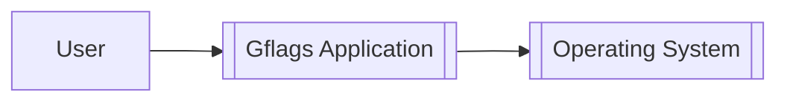
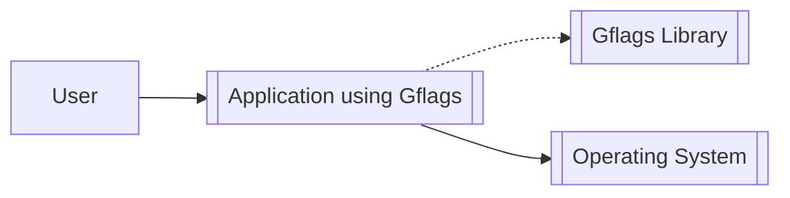
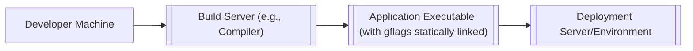
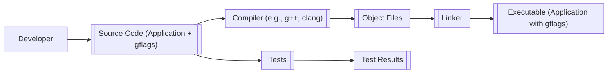

Okay, let's create a design document for the gflags project.

# BUSINESS POSTURE

Business Priorities and Goals:

*   Provide a robust and reliable command-line flag parsing library.
*   Support a wide range of flag types and usage patterns.
*   Offer a consistent and user-friendly API for developers.
*   Maintain backward compatibility where possible.
*   Ensure cross-platform compatibility (primarily C++).
*   Minimize external dependencies.
*   Facilitate easy integration into existing projects.

Most Important Business Risks:

*   Incorrect flag parsing leading to unexpected application behavior.
*   Security vulnerabilities introduced through misuse of the library or vulnerabilities within the library itself.
*   Compatibility issues with different compilers, operating systems, or build environments.
*   Difficulty of use or integration, hindering adoption.
*   Lack of maintainability due to complex or poorly documented code.

# SECURITY POSTURE

Existing Security Controls:

*   security control: Input validation: The library likely performs input validation on flag values to ensure they conform to the expected types (e.g., integer, string, boolean). (Described in the library's source code and documentation).
*   security control: Testing: The project includes a suite of tests to verify the correctness of the flag parsing logic and prevent regressions. (Visible in the test/ directory of the repository).
*   security control: Code Reviews: As an open-source project, gflags benefits from community code reviews, which can help identify potential security issues. (Visible in the pull request history on GitHub).
*   security control: Static Analysis: The project may use static analysis tools to detect potential bugs and vulnerabilities. (Not explicitly mentioned, but common practice).

Accepted Risks:

*   accepted risk: The library itself does not handle authentication or authorization. It is the responsibility of the application using gflags to implement these security measures.
*   accepted risk: The library does not encrypt flag values. Sensitive data should not be passed as command-line flags without additional protection.
*   accepted risk: The library assumes a trusted execution environment. It does not protect against attacks that modify the application's memory or environment.

Recommended Security Controls:

*   security control: Fuzz Testing: Implement fuzz testing to identify potential vulnerabilities related to unexpected or malformed input.
*   security control: Regular Security Audits: Conduct periodic security audits of the codebase to identify and address potential vulnerabilities.
*   security control: Dependency Management: Regularly update dependencies to address known vulnerabilities.
*   security control: Document Security Considerations: Provide clear documentation on security considerations for users of the library, including best practices for handling sensitive data.

Security Requirements:

*   Authentication: Not applicable to the library itself. Applications using gflags must implement their own authentication mechanisms.
*   Authorization: Not applicable to the library itself. Applications using gflags must implement their own authorization mechanisms.
*   Input Validation:
    *   The library MUST validate flag values against their defined types.
    *   The library SHOULD provide mechanisms for users to define custom validation rules.
    *   The library MUST handle invalid input gracefully, providing informative error messages.
*   Cryptography:
    *   The library itself does not require cryptographic functionality.
    *   If applications using gflags need to handle sensitive data, they should use appropriate cryptographic libraries.
* Secure by default configuration.

# DESIGN

## C4 CONTEXT

Element Description:

*   User:
    *   Name: User
    *   Type: Person
    *   Description: A person who interacts with an application that uses gflags.
    *   Responsibilities: Provides command-line arguments to the application.
    *   Security controls: None (relies on application-level security).
*   Gflags Application:
    *   Name: Gflags Application
    *   Type: Software System
    *   Description: An application that uses the gflags library to parse command-line flags.
    *   Responsibilities: Parses command-line flags, provides access to flag values, executes application logic.
    *   Security controls: Input validation, testing, code reviews, static analysis (potentially).
*   Operating System
    *   Name: Operating System
    *   Type: Software System
    *   Description: System that executes application.
    *   Responsibilities: Provides access to system resources.
    *   Security controls: OS-level security controls.

## C4 CONTAINER

Since gflags is a library, the container diagram is essentially the same as the context diagram. The library is linked directly into the application.

Element Description:

*   User:
    *   Name: User
    *   Type: Person
    *   Description: A person who interacts with the application.
    *   Responsibilities: Provides command-line arguments to the application.
    *   Security controls: None (relies on application-level security).
*   Application using Gflags:
    *   Name: Application using Gflags
    *   Type: Software System
    *   Description: The main application executable.
    *   Responsibilities: Executes application logic, uses gflags to parse command-line arguments.
    *   Security controls: Input validation, testing, code reviews, static analysis (potentially), application-specific security controls.
*   Gflags Library:
    *   Name: Gflags Library
    *   Type: Library
    *   Description: The gflags library code.
    *   Responsibilities: Parses command-line flags, provides access to flag values.
    *   Security controls: Input validation, testing.
*   Operating System
    *   Name: Operating System
    *   Type: Software System
    *   Description: System that executes application.
    *   Responsibilities: Provides access to system resources.
    *   Security controls: OS-level security controls.

## DEPLOYMENT

Gflags is a library, so "deployment" in the traditional sense doesn't apply. Instead, it's *integrated* into other applications.  Here are the common integration methods:

1.  **Static Linking:** The gflags source code is compiled and linked directly into the application executable. This is the most common approach.
2.  **Dynamic Linking:** The gflags library is compiled into a shared library (e.g., .so, .dll) and loaded at runtime. This allows multiple applications to share the same library code, reducing disk space usage.
3.  **System Package:** Gflags may be installed as a system package (e.g., using apt, yum, or a similar package manager). Applications can then link against the system-installed library.

We'll describe the static linking approach in detail, as it's the most straightforward and avoids external dependencies.

Element Description:

*   Developer Machine:
    *   Name: Developer Machine
    *   Type: Infrastructure Node
    *   Description: The machine where the application code (and gflags source) resides and is initially compiled.
    *   Responsibilities: Code development, initial testing.
    *   Security controls: Developer machine security best practices (e.g., strong passwords, up-to-date software).
*   Build Server (e.g., Compiler):
    *   Name: Build Server
    *   Type: Infrastructure Node
    *   Description: The system that compiles the application code and links it with the gflags library. This could be the same as the developer machine or a separate build server.
    *   Responsibilities: Compiling code, linking libraries, creating the executable.
    *   Security controls: Secure build environment, access controls, potentially static analysis tools.
*   Application Executable (with gflags statically linked):
    *   Name: Application Executable
    *   Type: Software Artifact
    *   Description: The final executable file, containing both the application code and the gflags library code.
    *   Responsibilities: Running the application, parsing command-line flags.
    *   Security controls: Inherits security controls from the build process and application code.
* Deployment Server/Environment
    *   Name: Deployment Server/Environment
    *   Type: Infrastructure Node
    *   Description: Server or environment where application will be deployed.
    *   Responsibilities: Host and run application.
    *   Security controls: OS-level security controls, network security, access controls.

## BUILD

The build process for an application using gflags (with static linking) typically involves the following steps:

1.  **Source Code Acquisition:** The developer obtains the gflags source code (e.g., by cloning the GitHub repository or downloading a release).
2.  **Compilation:** The gflags source code is compiled along with the application's source code. This is usually done using a C++ compiler (e.g., g++, clang).
3.  **Linking:** The compiled object files (both from gflags and the application) are linked together to create the final executable.
4.  **Testing:** Unit tests and integration tests are run to verify the correctness of the application and the flag parsing.
5.  **Artifact Creation:** The final executable is the primary build artifact.

Security Controls in the Build Process:

*   security control: **Secure Source Code Management:** Use a secure repository (like GitHub) with appropriate access controls.
*   security control: **Compiler Warnings and Errors:** Treat compiler warnings as errors to catch potential issues early.
*   security control: **Static Analysis:** Integrate static analysis tools (e.g., Clang Static Analyzer, Coverity) into the build process to identify potential vulnerabilities.
*   security control: **Dependency Management:** If using external dependencies (other than gflags), use a dependency manager to track and update them, addressing known vulnerabilities.
*   security control: **Build Automation:** Use a build system (e.g., CMake, Make) to automate the build process, ensuring consistency and reproducibility.
*   security control: **Testing:** Include comprehensive unit and integration tests to verify the correctness of the code and prevent regressions.

# RISK ASSESSMENT

*   Critical Business Processes:
    *   Reliable application execution based on user-provided configuration (via flags).
    *   Consistent application behavior across different environments.

*   Data to Protect:
    *   The primary data handled by gflags itself are the flag values. The sensitivity of this data depends entirely on the application using gflags.
    *   If the application uses flags to pass sensitive information (which is discouraged), then those flag values would be considered sensitive data. Examples include API keys, passwords, or database connection strings. However, gflags itself does not inherently handle sensitive data. It's the responsibility of the application to protect any sensitive data passed through flags.
    *   Data Sensitivity: Varies depending on the application. Can range from non-sensitive configuration settings to highly sensitive credentials.

# QUESTIONS & ASSUMPTIONS

Questions:

*   Are there any specific compliance requirements (e.g., PCI DSS, HIPAA) that the applications using gflags must adhere to?
*   What is the expected threat model for applications using gflags? (e.g., untrusted users, network-based attacks)
*   Are there any specific performance requirements for flag parsing?
*   What specific static analysis tools are currently used or planned to be used?
*   What is the process for reporting and addressing security vulnerabilities in gflags?

Assumptions:

*   BUSINESS POSTURE: The primary goal is to provide a reliable and easy-to-use flag parsing library. Security is a high priority, but not at the expense of usability or performance.
*   SECURITY POSTURE: The development team follows secure coding practices. Regular security reviews and updates are performed.
*   DESIGN: The library is primarily used for non-sensitive configuration settings. Applications handling sensitive data will implement additional security measures. The library is statically linked in most cases.