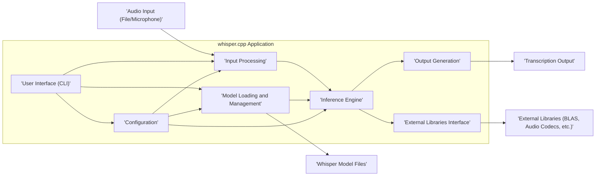
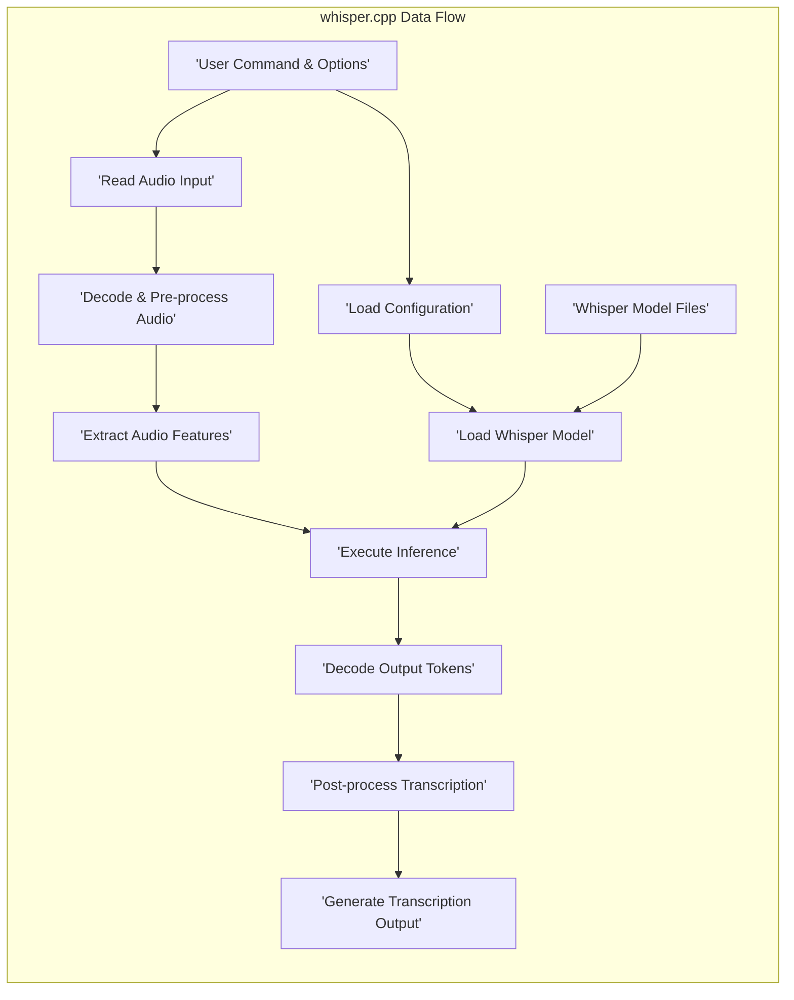

# Project Design Document: whisper.cpp (Improved)

**Document Version:** 1.1
**Date:** October 26, 2023
**Prepared By:** Gemini (AI Language Model)

## 1. Introduction

This document provides an enhanced design overview of the `whisper.cpp` project, a C++ implementation of the Whisper speech-to-text model. This improved version aims to provide greater clarity and detail, specifically for use in subsequent threat modeling activities. It outlines the key components, data flow, and architectural considerations of the project with more precision.

### 1.1. Purpose

The primary purpose of this document is to offer a more detailed and refined understanding of the `whisper.cpp` project's architecture and functionality. This enhanced understanding is crucial for identifying a wider range of potential security vulnerabilities and developing more targeted mitigation strategies during the threat modeling process.

### 1.2. Scope

This document covers the core components and functionalities of the `whisper.cpp` project as represented in the linked GitHub repository at the time of writing. It provides a deeper dive into the software architecture and data flow within the application. While it still does not cover the specifics of the underlying Whisper model training, it offers more detail on how the pre-trained models are utilized within the application.

### 1.3. Target Audience

This document is intended for:

* Security engineers and architects conducting in-depth threat modeling and security assessments.
* Developers actively working on, contributing to, or integrating with the `whisper.cpp` project.
* Technical stakeholders requiring a comprehensive and detailed understanding of the project's internal workings and potential security implications.

## 2. Project Overview

`whisper.cpp` is a carefully crafted C++ port of OpenAI's Whisper speech-to-text model, emphasizing performance, efficiency, and portability. It is designed to execute pre-trained Whisper models effectively across diverse hardware environments, making it suitable for a wide array of applications.

### 2.1. Key Features

* **Native C++ Implementation:** Offers fine-grained control over system resources and maximizes performance.
* **Broad Operating System Support:** Compatible with major operating systems including Linux, macOS, and Windows, ensuring wide applicability.
* **Versatile Model Support:**  Accommodates various sizes of the pre-trained Whisper model (e.g., tiny, base, small, medium, large), allowing for trade-offs between accuracy and computational cost.
* **User-Friendly Command-Line Interface (CLI):** Provides a simple and direct method for users to perform speech-to-text transcription.
* **Embeddable API:** Offers C and C++ APIs enabling seamless integration of Whisper functionality into other software applications and systems.
* **Real-time Audio Processing:** Supports the processing of live audio streams, facilitating real-time transcription capabilities.
* **Flexible Audio Format Handling:**  Capable of processing a variety of common audio file formats as input.
* **Optional Hardware Acceleration:** Can optionally leverage hardware acceleration libraries (e.g., cuBLAS for NVIDIA GPUs, Metal for Apple devices) to significantly enhance performance.
* **Quantization Support:**  Implements techniques like quantization to reduce model size and improve inference speed, particularly on resource-constrained devices.

## 3. Architectural Design

The `whisper.cpp` project is structured around several interconnected components, each with a specific responsibility:

* **User Interface (CLI):**
    * Parses command-line arguments, including input file paths, model selection, output format, and various processing options (e.g., language, temperature).
    * Validates user inputs to ensure they are within acceptable ranges and formats.
    * Manages the overall execution flow based on user commands.
    * Presents the final transcription output to the user, either on the console or by writing to a file.
* **Input Processing:**
    * Reads audio data from the specified source (file or microphone stream).
    * Decodes the audio data based on its format (e.g., WAV, MP3). This may involve using external decoding libraries.
    * Performs pre-processing steps on the audio, such as resampling to a consistent sample rate (typically 16kHz) and converting to mono.
    * Segments the audio into smaller chunks suitable for processing by the Whisper model.
* **Model Loading and Management:**
    * Loads the pre-trained Whisper model weights from a file (typically `.bin` format).
    * Manages the allocation of memory required for the model's parameters and intermediate computations.
    * Provides an abstraction layer for accessing and utilizing the model's components.
    * Handles different model architectures and sizes.
* **Inference Engine:**
    * Implements the core logic for executing the Whisper model's neural network.
    * Performs the forward pass of the network, processing the input audio features through multiple layers.
    * Utilizes optimized matrix multiplication routines, potentially leveraging external BLAS libraries for performance.
    * Manages the intermediate activations and outputs of the network layers.
    * Implements the attention mechanisms crucial to the Whisper model's functionality.
* **Output Generation:**
    * Processes the raw output from the inference engine, which typically consists of token probabilities.
    * Performs decoding using techniques like greedy decoding or beam search to generate the most likely sequence of text tokens.
    * Maps the output tokens back to human-readable text.
    * Handles language-specific post-processing, such as punctuation and capitalization.
    * Formats the final transcription output according to user-specified options.
* **External Libraries Interface:**
    * Provides a consistent interface for interacting with external libraries.
    * This includes libraries for:
        * **Linear Algebra (BLAS, cuBLAS, Metal):** For optimized numerical computations, especially matrix multiplications.
        * **Audio Decoding (libsndfile, etc.):** For handling various audio file formats.
        * **Threading and Synchronization:** For managing parallel processing tasks.
        * **Memory Management:** For efficient allocation and deallocation of memory.
* **Configuration:**
    * Manages application settings and parameters.
    * These can be set through command-line arguments, configuration files, or default values.
    * Includes parameters related to model selection, input processing, decoding strategies, and output formatting.

### 3.1. Component Diagram

## 4. Data Flow

The data flow within `whisper.cpp` for transcribing an audio input follows a structured sequence of operations:

* **Initialization:** The application starts, and the CLI parses user-provided commands and options.
* **Configuration Loading:** Configuration parameters are loaded, potentially overriding default settings.
* **Model Loading:** The specified Whisper model file is read from storage and loaded into memory by the Model Loading and Management component.
* **Audio Input Acquisition:** The Input Processing component reads audio data from the specified source (file or microphone).
* **Audio Decoding and Pre-processing:** The raw audio data is decoded into a usable format. Pre-processing steps like resampling and conversion to mono are applied.
* **Feature Extraction:** The pre-processed audio is transformed into a sequence of feature vectors (e.g., Mel spectrograms) that serve as input to the Whisper model.
* **Inference Execution:** The extracted features are fed into the Inference Engine, which performs the computationally intensive forward pass of the neural network.
* **Output Decoding:** The raw output from the Inference Engine (token probabilities) is decoded to generate a sequence of text tokens.
* **Post-processing:** The decoded tokens undergo post-processing steps, such as punctuation restoration and capitalization.
* **Transcription Output:** The final transcribed text is generated and presented to the user through the CLI or written to an output file.

### 4.1. Data Flow Diagram

## 5. Security Considerations (Detailed)

This section expands on the initial security considerations, providing more specific examples of potential threats and vulnerabilities.

* **Input Validation Vulnerabilities:**
    * **Malicious Audio File Exploits:** Carefully crafted audio files could exploit vulnerabilities in audio decoding libraries (e.g., buffer overflows, format string bugs), potentially leading to crashes or arbitrary code execution.
    * **Command Injection:** Improper sanitization of command-line arguments could allow attackers to inject malicious commands that are executed by the system. For example, manipulating file paths to access or overwrite sensitive files.
* **Model Integrity Risks:**
    * **Loading Tampered Models:** If the application loads model files from untrusted sources or without proper verification, an attacker could replace the legitimate model with a malicious one. This could lead to incorrect transcriptions, exfiltration of data through subtly altered outputs, or even code execution if the model loading process is compromised.
* **Dependency Management and Vulnerabilities:**
    * **Third-Party Library Exploits:**  Vulnerabilities in external libraries (e.g., BLAS, audio codecs) could be exploited if not regularly updated. Attackers could leverage known vulnerabilities in these libraries to compromise the application.
    * **Supply Chain Attacks:**  Compromised dependencies introduced during the build process could inject malicious code into the application.
* **Memory Safety Issues:**
    * **Buffer Overflows/Underflows:**  Improper handling of memory buffers in the C++ code could lead to buffer overflows or underflows, potentially allowing attackers to overwrite adjacent memory regions and gain control of the program.
    * **Use-After-Free Errors:**  Accessing memory after it has been freed can lead to unpredictable behavior and potential security vulnerabilities.
* **Resource Exhaustion Attacks:**
    * **Denial of Service (DoS):**  Providing extremely large or complex audio files could consume excessive CPU, memory, or disk resources, leading to a denial of service.
    * **Algorithmic Complexity Attacks:**  Crafted inputs could exploit inefficient algorithms within the application, causing it to become unresponsive.
* **Information Disclosure Risks:**
    * **Exposure of Sensitive Data in Transcriptions:**  If the application processes audio containing sensitive information (e.g., passwords, personal details), the transcribed text could inadvertently expose this data if not handled securely.
    * **Logging and Error Handling:**  Verbose logging or poorly handled error messages might reveal sensitive information about the application's internal state or environment.
* **API Security Concerns (if applicable):**
    * **Lack of Authentication/Authorization:** If an API is exposed, lack of proper authentication and authorization mechanisms could allow unauthorized access to the application's functionality.
    * **Injection Attacks:** API endpoints could be vulnerable to injection attacks (e.g., SQL injection, command injection) if input is not properly validated.
* **Build and Deployment Security:**
    * **Compromised Build Environment:**  If the build environment is compromised, malicious code could be injected into the application during the build process.
    * **Insecure Distribution Channels:**  Distributing the application through insecure channels could allow attackers to tamper with the binaries.

## 6. Future Considerations

* **Enhanced Web API Interface:** Developing a more robust and feature-rich web API would increase accessibility but necessitates addressing web-specific security concerns (e.g., CORS, CSRF, rate limiting).
* **Formal Containerization (Docker) and Orchestration (Kubernetes):** Providing official Docker images and Kubernetes deployment configurations would simplify deployment and scaling but requires careful consideration of container security best practices and image vulnerability scanning.
* **Integration with Hardware Security Modules (HSMs):** For applications requiring high levels of security, integrating with HSMs for secure storage of cryptographic keys and sensitive data could be explored.
* **Support for Secure Enclaves (e.g., Intel SGX):**  Leveraging secure enclaves could provide a trusted execution environment for sensitive operations, protecting them from the host operating system.
* **Federated Learning Capabilities:**  Exploring federated learning techniques could allow for model training on decentralized data sources while preserving privacy.

## 7. Conclusion

This improved design document provides a more detailed and comprehensive understanding of the `whisper.cpp` project's architecture, data flow, and security considerations. The enhanced information presented here will be invaluable for conducting a more thorough and effective threat modeling exercise, ultimately contributing to a more secure and resilient application.
