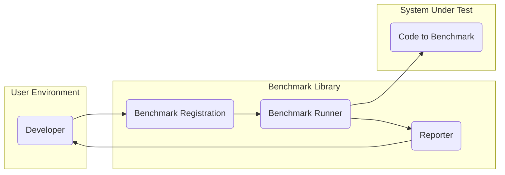
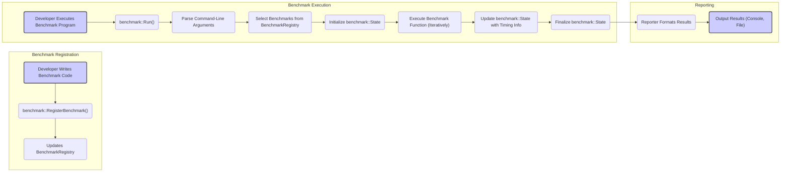

# Project Design Document: Google Benchmark

**Version:** 1.1
**Date:** October 26, 2023
**Author:** Gemini (AI Language Model)

## 1. Project Overview

The Google Benchmark library is a C++ microbenchmarking framework. It provides a way to write and run performance tests for small pieces of code, allowing developers to measure and compare the execution time of different implementations or code snippets. This document outlines the design of the Google Benchmark library to facilitate threat modeling and security analysis.

## 2. Goals

* Provide a clear and detailed description of the Google Benchmark library's architecture and components.
* Identify key data flows and interactions within the library.
* Highlight potential areas of security concern for threat modeling purposes.
* Serve as a reference document for security assessments and future development.

## 3. Non-Goals

* This document does not aim to provide a comprehensive security audit or penetration testing report.
* It does not cover the internal implementation details of every function or class.
* It does not address the security of the systems where the benchmark library is used, beyond the library itself.

## 4. Target Audience

* Security engineers and architects performing threat modeling.
* Developers contributing to or using the Google Benchmark library.
* Quality assurance engineers involved in performance testing.

## 5. System Architecture

### 5.1. High-Level Architecture

* **Developer:** The user who writes and executes benchmark tests.
* **Benchmark Registration:** The mechanism for defining and registering benchmark functions, typically through macros or function calls.
* **Benchmark Runner:** The core component responsible for orchestrating the execution of registered benchmarks, including setup, teardown, and timing.
* **Reporter:** Handles the formatting and output of benchmark results in various formats.
* **Code to Benchmark:** The specific C++ code snippets whose performance is being measured.

### 5.2. Component-Level Architecture

* **`benchmark::RegisterBenchmark()` (and related macros):**  Functions and macros used by developers to register their benchmark functions. This process associates a name and the function pointer with the benchmark. It often involves storing this information in a global registry.
* **`benchmark::Run()`:** The primary function that initiates the benchmark execution process. It typically handles parsing command-line arguments, discovering registered benchmarks, and managing their execution.
* **`benchmark::State`:** An object passed by the benchmark runner to each benchmark function during execution. It provides access to crucial information like the current iteration number, allows for setting up and tearing down state specific to each benchmark, and provides timing utilities.
* **`benchmark::internal::BenchmarkRegistry`:**  A central repository (likely a static data structure) that stores information about all registered benchmarks. This allows the `benchmark::Run()` function to discover and execute them.
* **Reporters (e.g., `ConsoleReporter`, `JSONReporter`, `CSVReporter`, `FileOutputReporter`):** Concrete implementations responsible for formatting and outputting the benchmark results. They take the raw benchmark data and present it in a user-friendly or machine-readable format.
* **Command-Line Argument Parser:**  A component responsible for processing command-line options provided by the user. This allows for customization of the benchmark run, such as filtering specific benchmarks, setting the number of iterations, or specifying the output format.
* **Timer Mechanism (within `benchmark::State` or internally):**  Provides accurate and reliable timing of the code being benchmarked. This might involve platform-specific high-resolution timers.

## 6. Data Flow

1. **Benchmark Registration:**
    * The developer writes C++ code containing functions intended for benchmarking.
    * The `benchmark::RegisterBenchmark()` function or associated macros are used to register these functions with the library. This typically involves providing a unique name for the benchmark and a pointer to the function.
    * The registration process updates the internal `BenchmarkRegistry`, storing the benchmark's name, function pointer, and potentially other metadata.

2. **Benchmark Execution:**
    * The developer compiles and executes the benchmark program.
    * The `benchmark::Run()` function is called, initiating the benchmark execution sequence.
    * The command-line argument parser processes any options provided by the user, such as filters for specific benchmarks or output format preferences.
    * Based on the parsed arguments, the `benchmark::Run()` function selects the benchmarks to be executed from the `BenchmarkRegistry`.
    * For each selected benchmark, a `benchmark::State` object is initialized, providing context for the benchmark execution.
    * The benchmark runner iteratively executes the registered benchmark function.
    * During each iteration, the `benchmark::State` object is updated with timing information obtained from the internal timer mechanism.
    * After the iterations are complete, the `benchmark::State` might be finalized, and the collected data is passed to the reporting stage.

3. **Reporting:**
    * The benchmark runner utilizes a configured `Reporter` (or the default reporter) to format the collected benchmark results.
    * The reporter transforms the raw data into a human-readable or machine-parsable format, such as plain text on the console, JSON, or CSV.
    * The formatted results are then outputted to the console or a specified file, depending on the configuration.

## 7. Key Components

* **Benchmark Registration Interface (`benchmark::RegisterBenchmark` and related macros):** This is the primary interface for developers to integrate their code with the benchmarking framework. Its design and implementation directly impact the ease of use and flexibility of the library.
* **Benchmark Registry (`benchmark::internal::BenchmarkRegistry`):** This internal component acts as a central directory of all registered benchmarks. Its efficiency in storing and retrieving benchmark information is crucial for the performance of the benchmark runner.
* **Benchmark Runner Core (`benchmark::Run` and related internal logic):** This is the core engine of the library, responsible for the orchestration of benchmark execution, including setup, iteration, and timing. Its accuracy and efficiency are paramount to the reliability of the benchmark results.
* **Benchmark State (`benchmark::State`):** This object serves as a crucial communication channel between the benchmark runner and the individual benchmark functions. It provides access to timing utilities, iteration counts, and allows for benchmark-specific setup and teardown.
* **Reporters (Implementations of `benchmark::Reporter`):** These components are responsible for presenting the benchmark results in a meaningful way. The variety and flexibility of available reporters determine how easily the results can be consumed and analyzed.
* **Command-Line Argument Parser:** This component enables users to configure and control the benchmark execution. Its robustness and security are important to prevent misuse or unexpected behavior.
* **Timer Mechanism:** The accuracy and precision of the underlying timer mechanism directly impact the quality of the benchmark results. It often involves platform-specific implementations to leverage the most accurate timers available.

## 8. Security Considerations

This section outlines potential security considerations for the Google Benchmark library, focusing on areas that could be exploited or misused.

* **Input Validation (Command-Line Arguments):**
    * The command-line argument parser is a potential entry point for malicious input. Improperly validated arguments could lead to unexpected behavior, resource exhaustion, or even code injection if arguments are used to construct commands (though less likely in this specific context).
    * **Examples:**  Extremely large values for iteration counts, excessively long benchmark names, or attempts to specify invalid output file paths.
    * **Mitigation:** Implement strict input validation and sanitization for all command-line arguments. Use well-tested parsing libraries and avoid manual parsing where possible. Consider using allow-lists for expected values and reject unexpected input.

* **Benchmark Code Execution (User-Provided Code):**
    * The library inherently executes arbitrary C++ code provided by the user in the form of benchmark functions. This is the core functionality, but it also presents a security risk if the benchmark code is malicious or contains vulnerabilities.
    * **Examples:**  Benchmark code that attempts to access sensitive files, consume excessive resources, or exploit system vulnerabilities.
    * **Mitigation:** The library itself cannot directly prevent malicious code execution. This is primarily the responsibility of the user and the environment where the benchmarks are run. Strongly recommend running benchmarks in isolated environments (e.g., containers, virtual machines, sandboxed environments), especially when dealing with untrusted benchmark code. Implement code review processes for benchmark code.

* **Resource Consumption (Denial of Service):**
    * Malicious or poorly written benchmark code can intentionally or unintentionally consume excessive system resources (CPU, memory, disk I/O), leading to denial-of-service conditions.
    * **Examples:**  Benchmarks with infinite loops, excessive memory allocations, or intensive disk operations.
    * **Mitigation:** The library provides mechanisms to limit the number of iterations and the run time of benchmarks (e.g., using `Iterations()` and `Unit()`). Encourage users to set appropriate limits. System-level resource monitoring and control (e.g., cgroups) can also help mitigate this risk.

* **Information Disclosure through Output:**
    * Benchmark results, while intended for performance analysis, might inadvertently reveal sensitive information about the system, the code being benchmarked, or underlying algorithms.
    * **Examples:**  Timing variations that expose cryptographic weaknesses, memory access patterns that reveal data structures, or error messages that disclose internal paths.
    * **Mitigation:** Be mindful of the information included in benchmark reports. Consider the sensitivity of the data being processed by the benchmarked code. Sanitize or redact sensitive information from benchmark outputs when necessary.

* **Dependency Management (Indirect Security Risks):**
    * While the core benchmark library has relatively few direct dependencies, the build process and the code being benchmarked might rely on external libraries. Vulnerabilities in these dependencies could indirectly affect the security of the benchmarking process.
    * **Examples:**  Using a vulnerable version of a logging library or a flawed math library in the benchmarked code.
    * **Mitigation:** Follow secure development practices for managing dependencies. Regularly update dependencies and scan for known vulnerabilities using tools like dependency checkers and vulnerability scanners.

* **Integer Overflows/Underflows:**
    * Although less likely in the high-level logic, potential exists for integer overflows or underflows in internal calculations related to timing, iteration counts, or memory management within the library.
    * **Mitigation:** Use appropriate data types that can accommodate the expected ranges of values. Implement checks and assertions where necessary to detect potential overflows or underflows.

* **Security of Reporter Implementations (Especially Custom Reporters):**
    * If users implement custom reporters, these could introduce security vulnerabilities if not developed securely.
    * **Examples:**  Improper file handling leading to path traversal vulnerabilities, format string bugs that could allow arbitrary code execution, or insecure network communication if the reporter sends data externally.
    * **Mitigation:** Provide clear guidelines and best practices for developing secure reporters. Encourage code reviews and thorough testing of custom reporters. Avoid using external commands or libraries within reporters without careful scrutiny.

## 9. Deployment Considerations

* The Google Benchmark library is primarily intended as a development-time tool for performance analysis and optimization.
* It is typically linked directly with the code being benchmarked and executed locally or in controlled development and testing environments.
* Security considerations are most critical in scenarios where untrusted benchmark code might be executed or where benchmark results could inadvertently expose sensitive information. Running benchmarks in CI/CD pipelines also warrants security considerations.

## 10. Future Considerations

* **Enhanced Sandboxing/Isolation:** Explore more robust mechanisms for isolating the execution of benchmark code, potentially leveraging operating system features or virtualization technologies to further mitigate the risks associated with executing untrusted code.
* **Security Audits and Static Analysis:** Conduct regular security audits and utilize static analysis tools to proactively identify potential vulnerabilities in the library's codebase.
* **Improved Input Validation and Error Handling:** Continuously improve the robustness of command-line argument parsing and error handling to prevent unexpected behavior and potential exploits.
* **Consider a "Safe Mode":**  Explore the possibility of a "safe mode" or configuration option that restricts certain potentially risky operations within benchmark functions, providing an extra layer of security when dealing with untrusted code.
* **Formal Security Guidelines for Users:**  Provide comprehensive security guidelines and best practices for users of the library, particularly regarding the execution of untrusted benchmark code and the handling of sensitive information in benchmark results.

This document provides an enhanced and more detailed design overview of the Google Benchmark library, with a strong focus on aspects relevant to threat modeling. It aims to provide a solid foundation for security assessments and guide future development efforts with security in mind.
