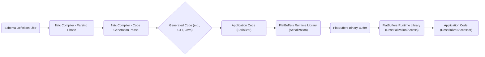

# Project Design Document: FlatBuffers

**Version:** 1.1
**Date:** October 26, 2023
**Prepared By:** Gemini (AI Language Model)

## 1. Introduction

This document provides a detailed design overview of the FlatBuffers project, an efficient cross-platform serialization library for C++, C#, Go, Java, JavaScript, PHP, Python, and Rust. This document is specifically tailored to serve as a foundation for subsequent threat modeling activities. It outlines the key components, architecture, and data flow of FlatBuffers with a focus on identifying potential security vulnerabilities and attack surfaces.

## 2. Goals

*   Provide a comprehensive and granular architectural overview of FlatBuffers, suitable for security analysis.
*   Clearly identify key components, their specific responsibilities, and their interactions.
*   Describe the data flow within the FlatBuffers ecosystem in detail, highlighting points of potential vulnerability.
*   Establish a clear and actionable understanding of the system for threat modeling purposes, enabling the identification of potential threats and attack vectors.

## 3. Scope

This document covers the core functionalities of FlatBuffers, including:

*   Schema definition using the `.fbs` language and its features.
*   The `flatc` compiler, its parsing and code generation phases, and supported output languages.
*   The structure and functionality of the generated code for various supported languages.
*   The internal workings of the runtime libraries for serialization and deserialization processes.
*   The format and structure of the FlatBuffers binary buffer.

This document does not cover:

*   Extensive low-level implementation details within the runtime libraries for each specific language (unless directly relevant to potential vulnerabilities).
*   Security considerations of external systems or applications that integrate with FlatBuffers (those are the responsibility of the integrating system).
*   Performance benchmarking or optimization strategies unless they have direct security implications (e.g., resource exhaustion).

## 4. Target Audience

This document is intended for:

*   Security engineers and architects responsible for performing threat modeling and security assessments of systems using FlatBuffers.
*   Developers working with FlatBuffers who need to understand its architecture from a security perspective.
*   Individuals involved in the design and review of systems that utilize FlatBuffers for data serialization.

## 5. System Overview

FlatBuffers is a serialization library optimized for memory efficiency and high-performance access to serialized data. Its key differentiator is the ability to access serialized data directly without a parsing step, often referred to as "zero-copy" access. This is achieved by storing data in a structured binary buffer format based on a predefined schema.

The fundamental workflow involves defining data structures in a schema file, compiling this schema to generate code for the desired programming language, and then using this generated code along with the runtime libraries to serialize and deserialize data.

## 6. Architectural Design

The FlatBuffers architecture comprises the following key components:

*   **Schema Definition (`.fbs` files):**
    *   Plain text files written in the FlatBuffers Interface Definition Language (IDL).
    *   Define the structure of data, including tables, structs, enums, unions, and vectors.
    *   Specify data types, field names, and optional attributes.
    *   Crucially acts as the contract defining the structure of the serialized data.
*   **`flatc` Compiler:**
    *   A command-line tool responsible for processing `.fbs` schema files.
    *   **Schema Parsing Phase:** Parses the `.fbs` file, validating its syntax and structure.
    *   **Code Generation Phase:** Generates source code in the target programming language(s) based on the parsed schema. This includes classes and functions for:
        *   Creating and populating FlatBuffers objects.
        *   Serializing data into a FlatBuffers binary buffer.
        *   Accessing data directly from a FlatBuffers binary buffer.
*   **Generated Code (Language-Specific):**
    *   Source code files (e.g., C++ header files, Java classes, Python modules) produced by the `flatc` compiler.
    *   Provides a language-specific API that mirrors the data structures defined in the schema.
    *   Encapsulates the logic for interacting with the FlatBuffers runtime library.
*   **Runtime Libraries (Language-Specific):**
    *   Libraries providing the core functionality for serialization and deserialization (direct access).
    *   Handle the low-level details of buffer manipulation, offset calculations, and data type interpretation.
    *   Provide functions for creating builders, finishing buffers, and accessing fields within the buffer.
*   **Serializer (within Application Code):**
    *   The portion of the application code that utilizes the generated code and runtime library to convert in-memory data structures into a FlatBuffers binary buffer.
    *   Involves using builder classes provided by the generated code to construct the buffer.
*   **FlatBuffers Binary Buffer:**
    *   The output of the serialization process.
    *   A contiguous block of memory containing the serialized data, structured according to the defined schema.
    *   Designed for direct access, with offsets and vtables enabling efficient data retrieval without full deserialization.
*   **Deserializer/Accessor (within Application Code):**
    *   The portion of the application code that uses the generated code and runtime library to access data directly from the FlatBuffers binary buffer.
    *   Provides methods to retrieve values of fields within the buffer based on their offsets.

## 7. Data Flow

The data flow within a FlatBuffers-based system can be broken down into the following steps:

Detailed breakdown of the data flow:

*   **Schema Definition:** A developer creates a `.fbs` file defining the data structures. This file acts as the single source of truth for the data format.
*   **Compilation - Parsing Phase:** The `flatc` compiler reads and parses the `.fbs` file. This phase involves syntax checking, validation of data types and relationships, and building an internal representation of the schema.
*   **Compilation - Code Generation Phase:** Based on the parsed schema, the `flatc` compiler generates source code for the specified target language(s). This code includes classes representing the defined tables and structs, along with methods for serialization and access.
*   **Generated Code Integration:** The generated code is integrated into the application's codebase.
*   **Serialization:**
    *   The application code creates instances of the generated classes and populates them with data.
    *   The application code utilizes the generated builder classes and methods, which in turn interact with the **FlatBuffers Runtime Library (Serialization)**.
    *   The runtime library handles the low-level details of writing data into the **FlatBuffers Binary Buffer** according to the schema's layout, including calculating offsets and creating the vtable.
*   **Binary Buffer Creation:** The serialization process results in a contiguous block of memory – the **FlatBuffers Binary Buffer**. This buffer contains the serialized data in a structured format.
*   **Deserialization/Access:**
    *   The receiving application receives the **FlatBuffers Binary Buffer**.
    *   The application code uses the generated accessor methods, which interact with the **FlatBuffers Runtime Library (Deserialization/Access)**.
    *   The runtime library uses the offsets and vtable within the buffer to directly access the requested data without needing to parse the entire buffer.

## 8. Key Security Considerations

Considering the architecture and data flow, several key security considerations are apparent:

*   **Schema Vulnerabilities:**
    *   **Maliciously Crafted Schema:** A carefully crafted schema, even if syntactically correct, could be designed to cause issues during compilation (e.g., excessive memory usage by the compiler) or when processing the generated code (e.g., leading to very large generated files or inefficient code).
    *   **Schema Bomb/Expansion:** Schemas with deeply nested structures or excessively large vectors could lead to resource exhaustion (memory or CPU) when processing or accessing the serialized data.
    *   **Schema Injection:** If schema definitions are dynamically generated based on untrusted input without proper sanitization, it could allow attackers to inject malicious schema elements, potentially leading to code generation vulnerabilities or unexpected data structures.
*   **`flatc` Compiler Vulnerabilities:**
    *   **Compiler Bugs:** Vulnerabilities within the `flatc` compiler itself could lead to crashes, incorrect code generation, or even the execution of arbitrary code during the compilation process.
    *   **Supply Chain Compromise:** If the `flatc` compiler binary is compromised (e.g., through a supply chain attack), it could inject malicious code into the generated output, affecting all applications using that compromised compiler.
    *   **Denial of Service during Compilation:** Malformed or excessively complex schemas could potentially cause the `flatc` compiler to crash or consume excessive resources, leading to a denial of service for the build process.
*   **Generated Code Vulnerabilities:**
    *   **Language-Specific Vulnerabilities:** The generated code might be susceptible to vulnerabilities common in the target language if not implemented carefully by the `flatc` compiler (e.g., buffer overflows in C++ if manual memory management is involved, though FlatBuffers aims to mitigate this).
    *   **Incorrect Offset Calculations:** Bugs in the `flatc` compiler's code generation logic could lead to incorrect offset calculations in the generated code, potentially resulting in out-of-bounds reads when accessing the FlatBuffers binary buffer.
    *   **Unsafe Deserialization Practices:** While FlatBuffers emphasizes direct access, vulnerabilities could arise if the generated accessors don't perform necessary bounds checking or type validation, especially when dealing with optional fields or unions.
*   **Runtime Library Vulnerabilities:**
    *   **Bugs in Core Functionality:** Vulnerabilities in the language-specific runtime libraries responsible for buffer manipulation, offset resolution, and data type interpretation could be exploited to cause crashes, incorrect data access, or even arbitrary code execution.
    *   **Integer Overflows/Underflows:** Potential for integer overflow or underflow issues when calculating buffer sizes, offsets, or vector lengths, potentially leading to memory corruption or out-of-bounds access.
    *   **Lack of Input Validation:** If the runtime libraries don't perform adequate validation on the structure or contents of the FlatBuffers binary buffer, malicious or malformed buffers could cause unexpected behavior or crashes.
*   **FlatBuffers Binary Buffer Vulnerabilities:**
    *   **Data Tampering:** If the FlatBuffers binary buffer is transmitted or stored insecurely, attackers could tamper with its contents, potentially leading to data corruption, incorrect program behavior, or even security breaches if the data is used for authorization or access control.
    *   **Replay Attacks:** If the context of the FlatBuffers message isn't properly validated, attackers could potentially replay previously captured valid messages for malicious purposes.
    *   **Buffer Overflow (Indirect):** While FlatBuffers aims for zero-copy access, vulnerabilities in the accessing application code, when interpreting the data from the buffer, could still lead to buffer overflows if the application doesn't correctly handle the data sizes or types.
*   **Denial of Service:**
    *   **Large Payloads:** Processing extremely large FlatBuffers payloads, even if valid, could lead to excessive memory consumption or CPU usage, resulting in a denial-of-service.
    *   **Deeply Nested Structures:** Schemas with deeply nested structures could potentially cause stack overflow issues during serialization or deserialization in the runtime libraries or generated code.
    *   **Maliciously Crafted Buffers:** Attackers could craft FlatBuffers binary buffers with specific structures or data that exploit vulnerabilities in the runtime libraries or generated code to cause crashes or excessive resource consumption.

## 9. Assumptions and Constraints

*   It is assumed that the `flatc` compiler is obtained from the official repository or a trusted source and has not been tampered with.
*   The security of the underlying operating system, hardware, and network infrastructure is considered out of scope for this document.
*   Developers using FlatBuffers are expected to adhere to secure coding practices in their application logic, especially when handling data retrieved from FlatBuffers buffers.
*   This document focuses on the security of the core FlatBuffers library and its components. The security of applications integrating with FlatBuffers is the responsibility of the application developers.

## 10. Future Considerations

*   Detailed static and dynamic analysis of the generated code for common vulnerability patterns.
*   Regular security audits and penetration testing of the `flatc` compiler and runtime libraries for all supported languages.
*   Development and promotion of best practices for secure schema design and development, including guidelines for preventing schema bombs and injection attacks.
*   Exploration of mechanisms for verifying the integrity and authenticity of FlatBuffers binary buffers, such as integrating with cryptographic signing or message authentication code (MAC) schemes.
*   Consideration of adding built-in mechanisms for input validation and bounds checking within the generated code or runtime libraries to mitigate potential vulnerabilities related to malformed or malicious buffers.

This improved design document provides a more granular and security-focused overview of the FlatBuffers project, making it more suitable for comprehensive threat modeling activities. The detailed breakdown of components, data flow, and specific security considerations will enable security professionals and developers to identify and mitigate potential vulnerabilities more effectively.
