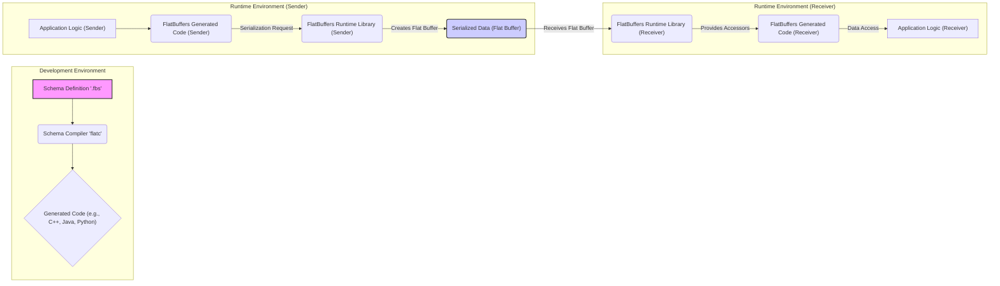

# Project Design Document: FlatBuffers

**Version:** 1.1
**Date:** October 26, 2023
**Author:** AI Software Architect

## 1. Introduction

This document provides an enhanced and more detailed design overview of the FlatBuffers project, an efficient cross-platform serialization library. This revised document aims to provide a stronger foundation for subsequent threat modeling activities by elaborating on the key components, architecture, and data flow within the FlatBuffers ecosystem.

## 2. Project Overview

FlatBuffers is engineered for optimal memory efficiency and speed in data serialization. Its core advantage lies in enabling direct, zero-copy access to serialized data, eliminating the need for traditional parsing and object instantiation. This is achieved through a flat binary buffer structure that directly reflects the defined schema.

**Key Features:**

*   **Highly Efficient Serialization:**  Serialization process incurs minimal overhead.
*   **Zero-Copy Data Access:**  Direct in-place access to serialized data, avoiding parsing overhead.
*   **Flexible Schema Evolution:**  Designed to support both backward and forward compatibility for evolving data structures.
*   **Broad Cross-Platform Support:**  Compatible with a wide range of programming languages including C++, C#, Go, Java, JavaScript, PHP, Python, and Rust.
*   **Strongly Typed Data Structures:**  Relies on schemas to enforce structure and type safety.

## 3. System Architecture

The FlatBuffers system is composed of distinct components that work together to facilitate the serialization and deserialization of data.

### 3.1. Components

*   **Schema Compiler (`flatc`):**
    *   A versatile command-line tool.
    *   **Input:** Takes a FlatBuffers schema definition file (`.fbs`).
    *   **Functionality:** Parses the schema and generates optimized source code.
    *   **Output:** Produces language-specific code (e.g., C++, Java, Python classes).
    *   The generated code provides the necessary structures and methods for working with FlatBuffers data.
*   **Schema Definition Language (`.fbs`):**
    *   A declarative language for defining data structures.
    *   **Purpose:** Specifies the organization and types of data to be serialized.
    *   **Supported Types:** Includes scalar types, vectors, structs, tables, unions, and enums.
    *   **Key Feature:** Enables the definition of relationships and constraints within the data.
*   **Generated Code (Language-Specific):**
    *   Source code automatically generated by the `flatc` compiler.
    *   **Target Languages:**  Tailored for specific programming languages.
    *   **Functionality:** Provides a language-idiomatic API for:
        *   Constructing FlatBuffers objects in memory.
        *   Serializing these objects into the flat binary buffer format.
        *   Providing direct access methods to read data from the binary buffer.
*   **Runtime Libraries (Language-Specific):**
    *   Language-specific libraries providing the core mechanisms for interacting with FlatBuffers.
    *   **Core Functions:**
        *   Reading and writing fundamental scalar types.
        *   Navigating the structure of the binary buffer using offsets.
        *   Performing basic integrity checks on the buffer.
*   **Serialized Data (Flat Binary Buffer):**
    *   The binary output resulting from the serialization process.
    *   **Structure:** A contiguous block of memory.
    *   **Organization:** Data is arranged according to the rules defined in the schema.
    *   **Key Feature:** Designed for direct access without requiring parsing.

### 3.2. Architectural Diagram

### 3.3. Data Flow

The typical data flow within a system utilizing FlatBuffers involves these key stages:

1. **Schema Definition:** A developer defines the structure of the data using the FlatBuffers schema definition language (`.fbs`). This defines the blueprint for the data.
2. **Schema Compilation:** The `.fbs` file is fed into the `flatc` compiler.
3. **Code Generation:** The `flatc` compiler processes the schema and generates source code in the target programming language. This code provides the necessary tools to work with the defined data structures.
4. **Serialization (Sender):**
    *   The sending application utilizes the generated code to create in-memory representations of the data to be sent.
    *   The FlatBuffers runtime library and the generated code work together to serialize this in-memory data into a flat binary buffer. This buffer is the final serialized output.
5. **Data Transmission/Storage:** The generated flat binary buffer is then transmitted over a network or stored in a persistent storage medium.
6. **Deserialization/Access (Receiver):**
    *   The receiving application obtains the flat binary buffer.
    *   Using the generated code and the runtime library, the application can directly access the data within the buffer. Crucially, this access happens without a traditional deserialization step, leveraging the zero-copy nature of FlatBuffers.

## 4. Detailed Component Design

### 4.1. Schema Compiler (`flatc`)

*   **Input:** A `.fbs` schema definition file.
*   **Core Processing Steps:**
    *   **Parsing:**  Analyzes the schema file, verifying its syntax and adherence to the FlatBuffers language rules.
    *   **Validation:** Checks the semantic correctness of the schema, ensuring type compatibility and proper structure.
    *   **Dependency Resolution:**  Manages and resolves any `include` directives, incorporating definitions from other schema files.
    *   **Code Generation:**  Translates the validated schema into source code for the specified target language. This involves creating classes, accessors, and utility functions.
*   **Configuration Options:** Supports various command-line flags to customize code generation, such as setting the output directory, specifying namespaces, and enabling or disabling specific features.
*   **Output:** Generates one or more source code files in the target language (e.g., `.h` and `.cpp` for C++, `.java` for Java, `.py` for Python).

### 4.2. Schema Definition Language (`.fbs`)

*   **Syntax:** Employs a clear and declarative syntax for defining data structures.
*   **Fundamental Elements:**
    *   `namespace`:  Organizes generated code into logical namespaces, preventing naming conflicts.
    *   `include`:  Allows the reuse of schema definitions from other `.fbs` files, promoting modularity.
    *   `attribute`:  Provides a mechanism to attach metadata to schema elements, enabling custom processing or documentation.
    *   `enum`:  Defines enumeration types, representing a set of named integer constants.
    *   `union`:  Defines a type that can hold one of several different types, useful for representing variant data.
    *   `struct`:  Defines value types with a fixed memory layout. Structs are typically used for small, tightly packed data.
    *   `table`:  Defines reference types where fields are optional and can be added or removed without breaking binary compatibility. This is a key feature for schema evolution.
    *   `root_type`:  Specifies the top-level table of the schema, indicating the starting point for accessing serialized data.

### 4.3. Generated Code

*   **Structure:** The generated code directly reflects the structure defined in the `.fbs` file.
*   **Key Components:**
    *   **Builder Classes:**  Provide a fluent interface for constructing FlatBuffers objects in memory before serialization. These classes simplify the process of populating data according to the schema.
    *   **Accessor Methods:**  Offer type-safe methods for reading data from a serialized buffer. These methods provide direct access to fields without requiring parsing.
    *   **Offset Management:**  The generated code internally handles the offsets within the binary buffer, allowing developers to interact with data using named fields.
    *   **Verification Methods (Optional):**  Some generated code includes methods for performing basic checks on the integrity of the received buffer, ensuring it conforms to the expected schema structure.

### 4.4. Runtime Libraries

*   **Core Responsibilities:**
    *   **Buffer Navigation:** Provides functions to traverse the flat binary buffer using offsets, enabling access to different parts of the serialized data.
    *   **Data Access:** Offers functions to read scalar values (integers, floats, booleans), strings, and elements from vectors directly from the buffer.
    *   **Buffer Creation and Management:** Includes functionalities for allocating and managing the memory used for the flat binary buffer during the serialization process.
    *   **String Handling:** Provides utilities for reading and interpreting UTF-8 encoded strings stored within the buffer.
    *   **Vector Handling:** Offers methods for accessing individual elements within vectors (arrays) stored in the buffer.

### 4.5. Serialized Data (Flat Binary Buffer)

*   **Structure and Organization:**
    *   **File Identifier (Optional):**  Can start with a file identifier, allowing for easy identification of the buffer's content type.
    *   **Root Object Offset:** Contains an offset pointing to the root table of the serialized data. This is the entry point for accessing the data.
    *   **Data Layout:** Data for tables, structs, vectors, and strings is laid out contiguously in memory. Tables use a vtable (virtual table) to manage optional fields and schema evolution.
    *   **Offset Usage:** Offsets are used extensively to locate nested data structures within the buffer, enabling efficient navigation.
    *   **Endianness:** Typically uses little-endian byte order for storing numerical values.

## 5. Security Considerations (Pre-Threat Modeling)

This section expands on potential security considerations to inform the threat modeling process.

*   **Schema Compiler Vulnerabilities:**
    *   **Malicious Schema Exploitation:** Carefully crafted schema files could exploit vulnerabilities within the `flatc` compiler. This could potentially lead to denial-of-service attacks on the build system or, in more severe cases, arbitrary code execution during the compilation phase.
*   **Generated Code Vulnerabilities:**
    *   **Language-Specific Bugs:** Bugs or flaws in the generated code (specific to the target language) could introduce vulnerabilities such as buffer overflows, incorrect memory access, or logic errors when handling serialized data.
*   **Runtime Library Vulnerabilities:**
    *   **Buffer Overflows/Out-of-Bounds Access:** Vulnerabilities in the runtime libraries could be exploited by providing maliciously crafted flat buffers with incorrect offsets or sizes, potentially leading to crashes or even remote code execution.
    *   **Denial of Service through Resource Exhaustion:**  Processing extremely large or deeply nested buffers could exhaust system resources (memory, CPU), leading to denial of service.
*   **Denial of Service:**
    *   **Compiler Resource Exhaustion:**  Complex or excessively large schemas could overwhelm the `flatc` compiler, leading to excessive memory consumption or prolonged compilation times.
    *   **Deserialization Resource Exhaustion:** Maliciously crafted buffers with deeply nested structures or very large vectors could consume excessive resources during access, leading to denial of service on the receiving application.
*   **Data Integrity:**
    *   **Lack of Built-in Integrity Checks:** FlatBuffers does not inherently provide cryptographic integrity checks. If the buffer is tampered with during transmission or storage, the receiving application might process corrupted data without detection, leading to unpredictable behavior or security breaches.
*   **Schema Evolution Issues:**
    *   **Compatibility Problems:** Incorrectly managed schema evolution can lead to compatibility issues between different versions of the application, potentially causing errors or unexpected behavior when processing data serialized with an older or newer schema.
*   **Information Disclosure:**
    *   **Unencrypted Sensitive Data:** If sensitive data is serialized into the flat buffer without encryption, it becomes vulnerable to interception and unauthorized access during transmission or if the storage is compromised.
*   **Input Validation:**
    *   **Reliance on Application-Level Validation:** Applications using FlatBuffers must implement their own input validation on the deserialized data. Failure to do so can leave the application vulnerable to attacks if the received data contains unexpected or malicious values.

## 6. Threat Modeling Scope

The subsequent threat modeling exercise should specifically focus on:

*   **Schema Definition and Compilation Phase:**  Thoroughly analyze potential threats associated with malicious schema files and vulnerabilities within the `flatc` compiler itself. Consider supply chain attacks targeting schema dependencies.
*   **Security of Generated Code:**  Examine the security implications of the generated code across different target languages. This includes looking for potential vulnerabilities introduced during the code generation process.
*   **Robustness of Runtime Libraries:**  Assess the resilience of the runtime libraries against various forms of malicious or malformed flat buffers. Focus on error handling and preventing exploitable conditions.
*   **Data Transmission and Storage Security:**  Evaluate threats related to the confidentiality, integrity, and availability of the serialized data during transmission and in storage. Consider man-in-the-middle attacks and data tampering.
*   **Security within Application Integration:**  Analyze how applications using FlatBuffers can introduce or mitigate security risks. This includes examining input validation practices and how applications handle potentially malicious data. Consider using frameworks like STRIDE to categorize threats.

## 7. Diagrams

The architectural diagram in section 3.2 provides a high-level view. Additional diagrams for threat modeling could include:

*   **Detailed Data Flow Diagram with Trust Boundaries:**  A more granular diagram illustrating the steps involved in serialization and deserialization, explicitly marking trust boundaries between different components and processes.
*   **Component Interaction Diagram with Data Flow:**  A diagram showcasing the interactions between the application code, generated code, and runtime library during data processing, highlighting the flow of data and control.

## 8. Conclusion

This enhanced design document provides a more in-depth understanding of the FlatBuffers project's architecture, components, and data flow. By elaborating on potential security considerations, this document aims to provide a robust foundation for the upcoming threat modeling process. This detailed information is crucial for effectively identifying and mitigating potential security risks associated with the implementation and use of FlatBuffers in various systems.