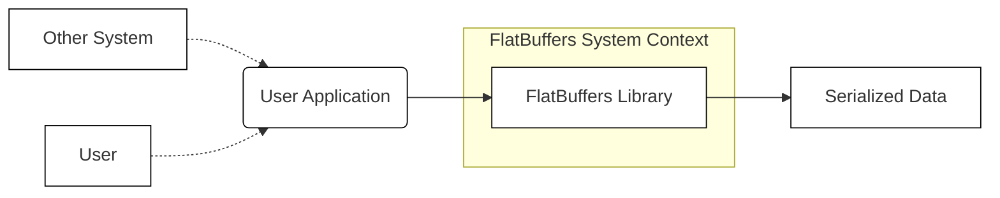
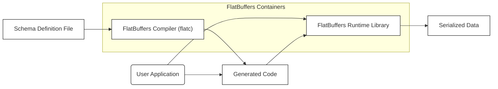
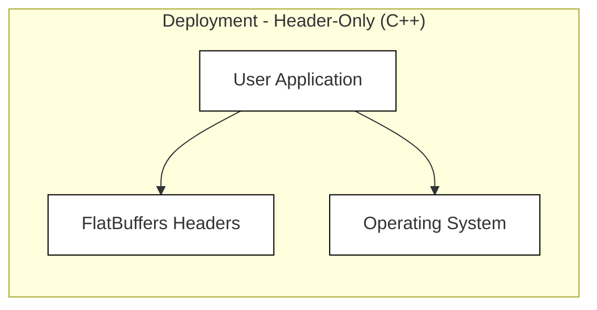

# Project Design Document: FlatBuffers

## BUSINESS POSTURE

FlatBuffers is an open-source, cross-platform serialization library that prioritizes performance and efficiency. It's designed for use cases where speed and minimal memory usage are critical, such as in game development, high-frequency trading, and other performance-sensitive applications.

Priorities:

-   Performance: Minimize serialization and deserialization overhead.
-   Efficiency: Reduce memory footprint and allocation.
-   Cross-platform compatibility: Support a wide range of programming languages and operating systems.
-   Ease of use: Provide a simple and intuitive API for developers.
-   Maintainability: Ensure the codebase is well-structured and easy to maintain.
-   Extensibility: Allow for future enhancements and features.

Goals:

-   Provide a faster and more efficient alternative to other serialization libraries like JSON and Protocol Buffers.
-   Enable developers to build high-performance applications with minimal serialization overhead.
-   Support a wide range of platforms and languages to maximize adoption.

Business Risks:

-   Data corruption: Incorrect implementation of the FlatBuffers schema or library could lead to data corruption.
-   Security vulnerabilities: Exploitable vulnerabilities in the library could expose applications to attacks.
-   Compatibility issues: Changes to the FlatBuffers schema or library could break compatibility with existing applications.
-   Performance degradation: Unexpected performance issues could arise in specific use cases or platforms.
-   Lack of adoption: If developers don't find FlatBuffers easy to use or beneficial, it may not gain widespread adoption.

## SECURITY POSTURE

Existing Security Controls:

-   security control: Fuzz testing: FlatBuffers utilizes fuzz testing (OSS-Fuzz) to identify potential vulnerabilities and edge cases. Where: Described in the documentation and integrated into the build process.
-   security control: Schema validation: The FlatBuffers compiler performs schema validation to ensure that data conforms to the defined schema. Where: Implemented in the FlatBuffers compiler (`flatc`).
-   security control: Code reviews: Changes to the codebase are subject to code reviews to identify potential security issues. Where: Part of the GitHub development workflow.
-   security control: Static analysis: Static analysis tools are used to identify potential code quality and security issues. Where: Integrated into the build process and CI pipeline.
-   security control: Memory safety: FlatBuffers is designed to avoid unnecessary memory allocations and copies, reducing the risk of memory-related vulnerabilities. Where: Core design principle of the library.

Accepted Risks:

-   accepted risk: Limited built-in cryptographic support: FlatBuffers itself does not provide built-in encryption or signing capabilities. It relies on external mechanisms for data protection in transit and at rest.
-   accepted risk: Potential for denial-of-service: Maliciously crafted FlatBuffers data could potentially lead to excessive resource consumption (CPU, memory) in applications using the library.

Recommended Security Controls:

-   security control: Integrate a robust input validation mechanism beyond schema validation to handle potentially malicious inputs.
-   security control: Provide clear guidelines and best practices for secure usage of FlatBuffers, including recommendations for data encryption and integrity checks.
-   security control: Consider adding support for data signing and verification to ensure data integrity and authenticity.

Security Requirements:

-   Authentication: Not directly applicable to the FlatBuffers library itself. Authentication should be handled at the application level.
-   Authorization: Not directly applicable to the FlatBuffers library itself. Authorization should be handled at the application level.
-   Input Validation:
    -   The FlatBuffers compiler (`flatc`) must validate the schema definition.
    -   Applications using FlatBuffers must validate the data against the schema before accessing it.
    -   Applications should implement additional input validation checks beyond schema validation to mitigate potential vulnerabilities.
-   Cryptography:
    -   FlatBuffers does not provide built-in cryptographic features.
    -   Applications requiring data encryption or integrity checks must use external cryptographic libraries and mechanisms.
    -   Recommendations for secure cryptographic practices should be provided in the documentation.

## DESIGN

### C4 CONTEXT



Element Descriptions:

-   Element:
    -   Name: User
    -   Type: Person
    -   Description: A person who interacts with a system that uses FlatBuffers for data serialization.
    -   Responsibilities: Interacts with the User Application.
    -   Security controls: N/A (External to FlatBuffers)

-   Element:
    -   Name: User Application
    -   Type: Software System
    -   Description: An application that utilizes the FlatBuffers library for serialization and deserialization of data.
    -   Responsibilities: Uses FlatBuffers to serialize and deserialize data. Handles application logic.
    -   Security controls: Input validation, application-level security controls (authentication, authorization, etc.).

-   Element:
    -   Name: FlatBuffers Library
    -   Type: Software System
    -   Description: The core FlatBuffers library, providing functionality for schema definition, data serialization, and deserialization.
    -   Responsibilities: Provides API for schema definition and data manipulation. Performs schema validation. Serializes and deserializes data.
    -   Security controls: Fuzz testing, schema validation, code reviews, static analysis, memory safety design.

-   Element:
    -   Name: Serialized Data
    -   Type: Data
    -   Description: Data serialized using the FlatBuffers format.
    -   Responsibilities: Stores data in a platform-independent, efficient binary format.
    -   Security controls: None (inherently passive data). Relies on external mechanisms for encryption and integrity.

-   Element:
    -   Name: Other System
    -   Type: Software System
    -   Description: Any other system that interacts with the User Application, potentially exchanging data serialized with FlatBuffers.
    -   Responsibilities: Varies depending on the specific system.
    -   Security controls: Depends on the specific system.

### C4 CONTAINER



Element Descriptions:

-   Element:
    -   Name: Schema Definition File
    -   Type: File
    -   Description: A text file defining the structure of the data to be serialized using FlatBuffers.
    -   Responsibilities: Defines data types, fields, and relationships.
    -   Security controls: None (static file).

-   Element:
    -   Name: FlatBuffers Compiler (flatc)
    -   Type: Application
    -   Description: The command-line tool that parses the schema definition file and generates code for various programming languages.
    -   Responsibilities: Parses schema definition. Validates schema. Generates code for data access and manipulation.
    -   Security controls: Schema validation.

-   Element:
    -   Name: Generated Code
    -   Type: Code
    -   Description: Code generated by the FlatBuffers compiler, specific to a target programming language.
    -   Responsibilities: Provides language-specific APIs for interacting with FlatBuffers data.
    -   Security controls: Inherits security controls from the compiler and runtime library.

-   Element:
    -   Name: FlatBuffers Runtime Library
    -   Type: Library
    -   Description: The core library that provides functions for serializing and deserializing data.
    -   Responsibilities: Provides functions for creating, accessing, and modifying FlatBuffers data.
    -   Security controls: Fuzz testing, memory safety design.

-   Element:
    -   Name: User Application
    -   Type: Application
    -   Description: An application that utilizes the FlatBuffers library.
    -   Responsibilities: Uses generated code and runtime library to interact with FlatBuffers data.
    -   Security controls: Input validation, application-level security controls.

-   Element:
    -   Name: Serialized Data
    -   Type: Data
    -   Description: Data serialized in the FlatBuffers format.
    -   Responsibilities: Stores data in a binary format.
    -   Security controls: None (inherently passive data).

### DEPLOYMENT

Possible deployment solutions:

1.  Static linking: The FlatBuffers runtime library is statically linked into the user application.
2.  Dynamic linking: The FlatBuffers runtime library is dynamically linked into the user application.
3.  Header-only library: For C++, FlatBuffers can be used as a header-only library, eliminating the need for separate compilation and linking.

Chosen solution (Header-only library for C++):



Element Descriptions:

-   Element:
    -   Name: User Application
    -   Type: Application
    -   Description: The application using FlatBuffers.
    -   Responsibilities: Contains application logic and uses FlatBuffers for serialization.
    -   Security controls: Application-level security controls.

-   Element:
    -   Name: FlatBuffers Headers
    -   Type: Files
    -   Description: The C++ header files containing the FlatBuffers implementation.
    -   Responsibilities: Provides the FlatBuffers API to the user application.
    -   Security controls: Fuzz testing, code reviews, static analysis.

-   Element:
    -   Name: Operating System
    -   Type: Operating System
    -   Description: The underlying operating system.
    -   Responsibilities: Provides system resources and services.
    -   Security controls: OS-level security controls.

### BUILD

```mermaid
graph LR
    Developer[Developer] --> SourceCode[Source Code (GitHub)]
    SourceCode --> CI[Continuous Integration (GitHub Actions)]
    CI --> BuildArtifacts[Build Artifacts (Headers, Libraries, Compiler)]
    CI --> Fuzzing[Fuzzing (OSS-Fuzz)]
    Fuzzing --> VulnerabilityReports[Vulnerability Reports]
    Developer -.-> VulnerabilityReports

    classDef default fill:#fff,stroke:#000,stroke-width:1px;
```

Build Process Description:

1.  Developer commits code changes to the GitHub repository.
2.  GitHub Actions triggers a CI build.
3.  The CI build process:
    -   Compiles the FlatBuffers compiler (`flatc`).
    -   Builds the FlatBuffers runtime libraries for various platforms and languages.
    -   Runs unit tests.
    -   Runs static analysis tools.
    -   Packages the build artifacts (headers, libraries, compiler).
4.  OSS-Fuzz continuously fuzzes the FlatBuffers library and reports any vulnerabilities found.
5.  Developers address any reported vulnerabilities.

Security Controls:

-   security control: Continuous Integration (GitHub Actions): Automates the build process and ensures consistent builds.
-   security control: Unit Tests: Verify the correctness of individual components.
-   security control: Static Analysis: Identifies potential code quality and security issues.
-   security control: Fuzzing (OSS-Fuzz): Continuously tests the library for vulnerabilities using fuzzing techniques.
-   security control: Dependency Management: Dependencies are managed and reviewed to minimize the risk of supply chain attacks.

## RISK ASSESSMENT

Critical Business Processes:

-   Data serialization and deserialization in performance-sensitive applications.
-   Cross-platform data exchange.

Data Sensitivity:

-   FlatBuffers itself does not handle data sensitivity. The sensitivity of the data being serialized depends on the application using FlatBuffers. Applications must implement appropriate security measures (e.g., encryption) to protect sensitive data.

## QUESTIONS & ASSUMPTIONS

Questions:

-   Are there any specific compliance requirements (e.g., GDPR, HIPAA) that need to be considered when using FlatBuffers?
-   What are the expected data sizes and throughput requirements for applications using FlatBuffers?
-   What are the target platforms and programming languages for applications using FlatBuffers?
-   Are there any existing security policies or guidelines that need to be followed?

Assumptions:

-   BUSINESS POSTURE: The primary concern is performance and efficiency, with security being a secondary but important consideration.
-   SECURITY POSTURE: Developers using FlatBuffers are responsible for implementing appropriate security measures at the application level, including data encryption and integrity checks.
-   DESIGN: The header-only deployment model for C++ is the most common and will be the focus of the deployment diagram. Other deployment models are possible but less common. The build process relies heavily on GitHub Actions and OSS-Fuzz for automation and security testing.