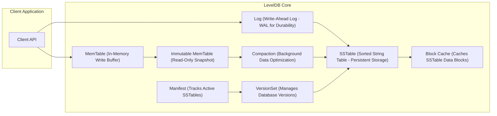
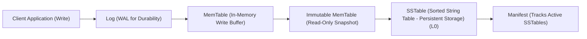
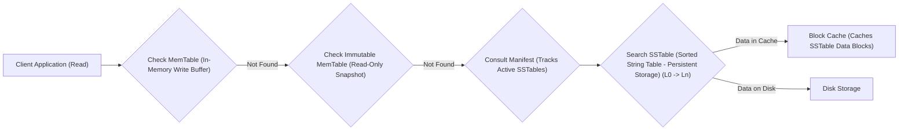

## Project Design Document: LevelDB for Threat Modeling (Improved)

**1. Introduction**

This document provides an enhanced and detailed design overview of the LevelDB key-value store library, specifically tailored for threat modeling activities. It aims to provide a comprehensive understanding of LevelDB's architecture, data flow, and component interactions, with a strong emphasis on identifying potential security vulnerabilities and attack surfaces. This document focuses on the core architectural aspects relevant to security considerations.

**2. Goals and Objectives (for Threat Modeling)**

*   **Comprehensive Attack Surface Identification:**  Clearly define all potential entry points and interaction points with the LevelDB system that could be targeted by malicious actors. This includes API calls, file system interactions, and internal component communication.
*   **Detailed Data Flow Vulnerability Analysis:**  Map the precise movement of data within LevelDB, highlighting potential points for interception, manipulation, unauthorized access, or data leakage at each stage.
*   **In-Depth Component Interaction Security Assessment:**  Examine the communication protocols, data exchange formats, and trust relationships between different LevelDB components to identify potential risks of cascading failures, privilege escalation, or information disclosure.
*   **Explicit Documentation of Security-Relevant Design Choices:**  Clearly articulate the design decisions within LevelDB that have direct security implications, such as persistence mechanisms, concurrency control algorithms, memory management strategies, and data handling procedures.
*   **Robust Foundation for Threat and Vulnerability Identification:**  Establish a thorough and accurate representation of the system's architecture to enable security experts to systematically identify potential threats, vulnerabilities, and associated risks.

**3. System Architecture Overview**

LevelDB is designed as a single-process, embedded key-value store, providing ordered mappings from string keys to string values. Its architecture is built around managing data both in memory and persistently on disk to achieve a balance between performance and durability. Direct network access is not a design goal.

**4. Component Details**

*   **Client API:** The primary interface for interacting with LevelDB. Potential vulnerabilities here include:
    *   **Input Validation Issues:**  If the API doesn't properly validate input keys and values, it could be susceptible to buffer overflows or other injection attacks in internal components.
    *   **Resource Exhaustion:**  Maliciously large or numerous requests could potentially overwhelm the LevelDB instance.
    *   **API Misuse:** Incorrect usage of the API by the client application could lead to unexpected states or data corruption.
    *   List of core functions:
        *   `Put(key, value)`: Inserts or updates a key-value pair.
        *   `Get(key)`: Retrieves the value associated with a given key.
        *   `Delete(key)`: Removes a key-value pair.
        *   `NewIterator()`: Creates an iterator to traverse the database.
        *   `NewWriteBatch()`: Creates a batch of write operations for atomic application.
        *   `Open(options)`: Opens a LevelDB database, with options that can influence security (e.g., file permissions).
        *   `Close()`: Closes a LevelDB database.
        *   `RepairDB(options)`: Attempts to repair a corrupted database; improper use could lead to further corruption or data loss.

*   **MemTable (In-Memory Write Buffer):**  A temporary in-memory store for recent writes. Security considerations:
    *   **Memory Exhaustion:**  Large volumes of writes could lead to excessive memory consumption, potentially causing crashes.
    *   **Data Loss on Crash (Pre-Persistence):** Data in the MemTable is vulnerable to loss if a crash occurs before it's flushed to disk. The WAL mitigates this, but its proper functioning is crucial.
    *   Implementation details (e.g., skip list) could have inherent vulnerabilities if not implemented securely.

*   **Immutable MemTable (Read-Only Snapshot):** A read-only version of the MemTable awaiting flushing. Security considerations:
    *   Similar memory exhaustion risks as the active MemTable.
    *   Potential for race conditions if not properly synchronized with the flushing process.

*   **Log (Write-Ahead Log - WAL for Durability):**  A sequential record of write operations for crash recovery. Critical security aspects:
    *   **WAL Corruption:** If the WAL file is corrupted, data loss or inconsistency can occur.
    *   **Unauthorized Access to WAL:**  If an attacker gains access to the WAL, they could potentially replay, modify, or delete recent transactions. File system permissions are paramount here.
    *   **WAL Overflow/Exhaustion:**  Although designed for sequential writes, vulnerabilities in handling edge cases could lead to issues.

*   **SSTable (Sorted String Table - Persistent Storage):**  Immutable, sorted files storing key-value pairs on disk. Key security concerns:
    *   **Data at Rest Encryption:** LevelDB doesn't provide built-in encryption. SSTable files are vulnerable if the underlying storage is compromised.
    *   **Unauthorized Access:**  File system permissions on SSTable files are critical to prevent unauthorized reading or modification.
    *   **Data Integrity:**  Mechanisms to ensure the integrity of SSTable files are important to prevent tampering.
    *   **Information Leakage in Deleted Data:** While entries are logically deleted, the physical data might remain until compaction. Secure deletion practices at the storage level might be needed.

*   **Manifest (Tracks Active SSTables):**  A file that maintains the current state of the database by listing active SSTables. Security implications:
    *   **Manifest Corruption:** If the Manifest is corrupted, LevelDB might not be able to open or might operate on an inconsistent view of the data.
    *   **Unauthorized Modification:**  If an attacker can modify the Manifest, they could potentially hide or introduce malicious data by manipulating the list of active SSTables.

*   **VersionSet (Manages Database Versions):**  Handles different versions of the database state. Security considerations:
    *   **Race Conditions:**  Improper synchronization in version management could lead to inconsistent reads or writes.
    *   **Denial of Service:**  An attacker might try to trigger rapid version changes to exhaust resources.

*   **Compaction (Background Data Optimization):**  Merges and sorts SSTables to improve performance and reclaim space. Potential security risks:
    *   **Data Corruption during Compaction:**  Bugs or vulnerabilities in the compaction process could lead to data loss or corruption.
    *   **Resource Exhaustion:**  Aggressive compaction could consume excessive I/O and CPU resources, leading to DoS.
    *   **Temporary File Security:** Compaction often involves temporary files. The security of these files needs consideration.

*   **Block Cache (Caches SSTable Data Blocks):**  An optional in-memory cache for frequently accessed SSTable data. Security implications:
    *   **Sensitive Data in Memory:**  The cache holds decrypted data. If the process memory is compromised, this data could be exposed.
    *   **Cache Poisoning:**  An attacker might try to manipulate the cache to serve incorrect data.

**5. Data Flow**

**5.1. Write Operation (`Put`, `Delete`)**

1. The client application initiates a write operation (`Put` or `Delete`) through the **"Client API"**.
2. The write request is first appended to the **"Log (WAL for Durability)"** to ensure durability.
3. The write operation is then inserted into the **"MemTable (In-Memory Write Buffer)"**.
4. When the MemTable reaches a predefined threshold, it's converted into an **"Immutable MemTable (Read-Only Snapshot)"**.
5. The Immutable MemTable is subsequently flushed to disk, resulting in the creation of one or more new **"SSTable (Sorted String Table - Persistent Storage)"** files at level 0 (L0).
6. The **"Manifest (Tracks Active SSTables)"** is updated to reflect the newly created SSTables and the current state of the database.

**5.2. Read Operation (`Get`)**

1. The client application requests data using the **"Client API"** with a specific key.
2. LevelDB first checks the **"MemTable (In-Memory Write Buffer)"** for the requested key.
3. If the key is not found in the MemTable, LevelDB then checks the **"Immutable MemTable (Read-Only Snapshot)"** instances (if any exist).
4. If the key is still not found, LevelDB consults the **"Manifest (Tracks Active SSTables)"** to determine the active SSTables and their levels.
5. LevelDB then searches for the key within the **"SSTable (Sorted String Table - Persistent Storage)"** files, starting from the lower levels (L0) and progressing to higher levels.
6. Before accessing SSTables on disk, LevelDB checks the **"Block Cache (Caches SSTable Data Blocks)"** to potentially retrieve the data from memory.

**6. Security Considerations**

*   **Data at Rest Security:**
    *   LevelDB's persistent data resides in SSTable files. The primary security concern is unauthorized access.
    *   **Threat:**  An attacker gaining access to the file system could read or modify SSTable files, leading to data breaches or corruption.
    *   **Mitigation:**  Strong file system permissions, disk encryption, and potentially application-level encryption are crucial.

*   **Data in Transit (Internal) Security:**
    *   While internal data movement is within the same process, vulnerabilities in inter-component communication could be exploited.
    *   **Threat:**  In a compromised environment, an attacker might attempt to intercept or manipulate data being passed between components.
    *   **Mitigation:**  Secure coding practices, memory protection mechanisms, and ensuring the integrity of internal data structures.

*   **Authentication and Authorization Deficiencies:**
    *   LevelDB lacks built-in authentication and authorization.
    *   **Threat:** Any process with sufficient file system permissions can access and manipulate the database.
    *   **Mitigation:**  The responsibility lies with the embedding application to implement appropriate access controls. Operating system-level security measures are also critical.

*   **Input Validation Vulnerabilities:**
    *   Insufficient input validation can lead to various attacks.
    *   **Threat:**  Maliciously crafted keys or values could cause buffer overflows, format string bugs, or other vulnerabilities in internal components.
    *   **Mitigation:**  Rigorous input validation at the Client API level is essential.

*   **Concurrency Control Weaknesses:**
    *   Flaws in LevelDB's internal locking mechanisms could be exploited.
    *   **Threat:**  Race conditions or deadlocks could lead to data corruption or denial of service.
    *   **Mitigation:**  Thorough testing and review of concurrency control implementations are necessary.

*   **Error Handling and Resilience Gaps:**
    *   Inadequate error handling can create security vulnerabilities.
    *   **Threat:**  An attacker could trigger specific error conditions to cause crashes or expose sensitive information through error messages.
    *   **Mitigation:**  Implement robust error handling and avoid exposing sensitive details in error messages.

*   **Denial of Service (DoS) Attacks:**
    *   LevelDB is susceptible to resource exhaustion attacks.
    *   **Threat:**  An attacker could flood the system with write requests, trigger excessive compactions, or consume excessive memory, leading to performance degradation or service disruption.
    *   **Mitigation:**  Implement rate limiting or resource quotas at the application level. Carefully configure compaction settings.

*   **Write-Ahead Log (WAL) Security Risks:**
    *   The WAL contains sensitive recent write operations.
    *   **Threat:**  Unauthorized access to the WAL file could allow an attacker to replay or modify recent transactions, leading to data manipulation.
    *   **Mitigation:**  Secure file system permissions for the WAL file are crucial.

*   **Compaction Process Vulnerabilities:**
    *   Errors or vulnerabilities in the compaction process can have serious consequences.
    *   **Threat:**  Data corruption or loss could occur due to bugs in the compaction logic.
    *   **Mitigation:**  Thorough testing of the compaction process is vital.

*   **RepairDB Functionality Risks:**
    *   While intended for recovery, `RepairDB` could be misused.
    *   **Threat:**  A malicious actor could potentially use `RepairDB` to introduce further corruption or gain unauthorized access if not properly controlled.
    *   **Mitigation:**  Restrict access to the `RepairDB` functionality and carefully review its usage.

**7. Deployment Considerations**

*   LevelDB's security is heavily influenced by its deployment environment.
    *   **Operating System Security:** The security of the underlying OS directly impacts LevelDB's security.
    *   **File System Permissions:**  Properly configuring file system permissions for LevelDB data files (SSTables, WAL, Manifest) is paramount.
    *   **Process Isolation:**  Ensure the LevelDB process has appropriate isolation to prevent other processes from interfering.
    *   **Resource Limits:**  Setting appropriate resource limits (memory, disk space) can help mitigate DoS risks.

**8. Future Considerations (for Security)**

*   **Integration of Data-at-Rest Encryption:**  Exploring options for built-in encryption of SSTable files would significantly enhance security.
*   **Enhanced Input Validation Mechanisms:**  Implementing more comprehensive input validation within LevelDB itself could reduce the reliance on the embedding application.
*   **Security Audits of Concurrency Control:**  Regular security audits of the locking and synchronization mechanisms are essential.
*   **Consideration of Secure Deletion:**  Implementing mechanisms to securely erase data marked for deletion during compaction could mitigate information leakage risks.
*   **Explore Options for Integrity Checks:**  Adding integrity checks for SSTable and Manifest files could help detect tampering.

This improved design document provides a more detailed and security-focused overview of LevelDB's architecture. It serves as a stronger foundation for thorough threat modeling exercises, enabling a more comprehensive identification and mitigation of potential security risks.
