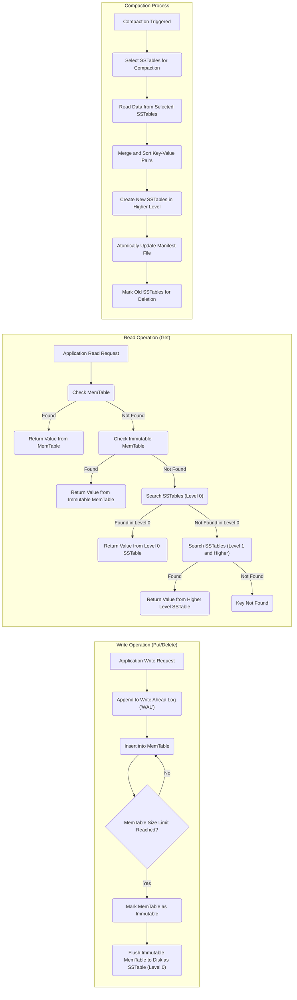

# Project Design Document: LevelDB for Threat Modeling (Improved)

**1. Introduction**

This document provides an enhanced and detailed design overview of the LevelDB project, specifically tailored for subsequent threat modeling activities. It aims to provide a comprehensive understanding of LevelDB's internal workings from a security perspective, focusing on components, data flow, and architectural considerations relevant to identifying potential security vulnerabilities and attack vectors. This document serves as a foundational resource for security engineers and architects involved in assessing the security posture of systems utilizing LevelDB.

**2. Project Overview: LevelDB**

LevelDB is a high-performance, embedded key-value storage library developed by Google. It offers an ordered mapping from arbitrary byte arrays (keys) to arbitrary byte arrays (values). Key characteristics relevant to security considerations include:

*   **Embedded Nature:** LevelDB is designed to be directly integrated into applications as a library. This implies that its security is intrinsically linked to the security of the host application process and its environment.
*   **Local File System Persistence:** LevelDB primarily stores its data on the local file system of the machine where the embedding application runs. This makes file system security a critical aspect.
*   **Absence of Native Networking:** LevelDB itself does not implement any networking functionalities. Any remote access or interaction is the sole responsibility of the embedding application. This simplifies LevelDB's internal security but shifts the burden to the application layer.
*   **Crash and Power Failure Resilience:** LevelDB employs mechanisms like the Write-Ahead Log (WAL) to ensure data consistency and durability even in the face of unexpected interruptions. Understanding these mechanisms is important for assessing data integrity threats.
*   **Ordered Key Storage:** Keys are stored in lexicographical order. This ordering can have security implications, particularly in scenarios involving range queries or predictable key patterns.
*   **Log-Structured Merge-Tree (LSM-Tree) Architecture:** LevelDB's core architecture is based on the LSM-Tree, which involves a multi-layered structure of in-memory and on-disk sorted tables. This architecture influences data access patterns and potential attack surfaces.
*   **Write-Ahead Logging (WAL):**  All modifications are first written to a sequential log file before being applied to in-memory structures. This is crucial for durability and recovery but also represents a potential target for attackers seeking to manipulate data before it's permanently stored.

**3. System Architecture**

LevelDB's architecture is composed of several interacting components. A thorough understanding of these components and their interactions is essential for identifying potential threat vectors and attack surfaces.

*   **MemTable:**
    *   An in-memory data structure, typically a skip list or a similar ordered structure, that serves as the initial destination for all write operations.
    *   Provides very fast read and write access for recently added data.
    *   Data residing solely in the MemTable is volatile and will be lost in case of a crash before being flushed to disk. This makes the WAL critical for durability.

*   **Write Ahead Log (WAL) / Log File:**
    *   A sequential file on disk where every mutation (insert, update, delete) is durably recorded *before* being applied to the MemTable.
    *   This ensures data durability and allows for recovery in the event of application crashes or power failures.
    *   The WAL is a critical component for data integrity and a potential target for attackers aiming to prevent data persistence or introduce malicious modifications.

*   **Immutable MemTable:**
    *   When the active MemTable reaches a predefined size limit, it is marked as immutable, and a new empty MemTable is created to handle subsequent writes.
    *   The immutable MemTable is then scheduled to be flushed to disk, creating a Sorted String Table (SSTable). This transition point is important for understanding data persistence.

*   **Sorted String Table (SSTable):**
    *   On-disk files that store key-value pairs in sorted order. SSTables are immutable once created.
    *   Organized into multiple levels (Level 0, Level 1, Level 2, and so on). This tiered structure is fundamental to the LSM-Tree architecture and impacts read performance and compaction.
    *   Level 0 SSTables are created directly from flushed immutable MemTables and may have overlapping key ranges. This overlap necessitates checking multiple Level 0 SSTables during reads.
    *   Higher levels (Level 1 and above) contain larger, sorted SSTables with non-overlapping key ranges *within each level*. This organization optimizes read performance by reducing the number of files to search.

*   **Compaction:**
    *   A background process that periodically merges and sorts SSTables from different levels to optimize read performance and reclaim disk space.
    *   Compaction involves reading data from multiple SSTables, merging and sorting the key-value pairs, and writing them to new, larger SSTables in the next higher level.
    *   This process is crucial for maintaining performance but also represents a complex operation with potential vulnerabilities if not implemented correctly.

*   **Manifest File:**
    *   A file that persistently records the set of SSTables currently belonging to each level of the database.
    *   Used during startup to reconstruct the database state by identifying the valid SSTables.
    *   The Manifest file is critical for data integrity and recovery. Corruption or manipulation of the Manifest file can lead to data loss or inconsistencies.

*   **Current File:**
    *   A small file that simply contains the name of the current Manifest file. This indirection allows for atomic updates during Manifest file creation.

*   **Options:**
    *   Configuration parameters that govern LevelDB's behavior, such as block size, compression settings, and cache size.
    *   Incorrectly configured options can potentially impact performance and security (e.g., disabling compression might increase storage footprint).

*   **Block Cache:**
    *   An optional in-memory cache used to store frequently accessed data blocks read from SSTables.
    *   Improves read performance by reducing the need to read from disk.
    *   The cache itself can be a target for attacks if not properly managed (e.g., cache poisoning).

**4. Data Flow**

Understanding the flow of data through LevelDB during read and write operations is crucial for identifying potential interception points and manipulation opportunities.

*   **Write Operation (Put/Delete):**
    1. The embedding application initiates a write request (e.g., `Put` or `Delete`).
    2. The write operation is first atomically appended to the **Write Ahead Log (WAL)** on disk. This ensures durability.
    3. The write operation is then inserted into the current **MemTable**.
    4. When the MemTable reaches its configured size limit, it becomes an **Immutable MemTable**.
    5. The Immutable MemTable is then flushed to disk, creating a new **SSTable** in **Level 0**.

*   **Read Operation (Get):**
    1. The embedding application requests a value for a specific key using the `Get` operation.
    2. LevelDB first checks the current **MemTable**. If the key is found, the value is returned.
    3. If not found in the MemTable, LevelDB checks the **Immutable MemTable** (if one exists and hasn't been fully flushed).
    4. If still not found, LevelDB searches the **SSTables**, starting with **Level 0**. Because Level 0 SSTables can have overlapping key ranges, multiple files might need to be checked.
    5. If the key is not found in Level 0, the search proceeds to higher levels (Level 1, Level 2, etc.). Within each level, SSTables have non-overlapping key ranges, allowing for more efficient searching.
    6. The **Block Cache** is often consulted before reading directly from SSTable files on disk.
    7. If the key is found in an SSTable, the corresponding value is retrieved and returned.
    8. If the key is not found in any of the MemTables or SSTables, the `Get` operation indicates that the key does not exist.

*   **Compaction Process:**
    1. The compaction process is triggered based on predefined criteria (e.g., the number of SSTables in a level).
    2. LevelDB selects a set of **SSTables** from one or more levels to be compacted.
    3. The data from the selected SSTables is read into memory.
    4. The key-value pairs are merged and sorted, eliminating duplicates and obsolete entries.
    5. New, larger **SSTables** are created in the next higher level.
    6. The **Manifest File** is updated to reflect the new set of SSTables and the removal of the old ones. This update is typically done atomically.
    7. The old SSTables are then marked for deletion (the actual deletion happens later, ensuring that the new SSTables are durable).

**5. Security Considerations**

This section details potential security concerns related to LevelDB's architecture and operation.

*   **Data at Rest Encryption:**
    *   LevelDB **does not provide native encryption** for data stored on disk.
    *   The responsibility for encrypting data at rest falls entirely on the embedding application or the underlying file system.
    *   Without encryption, sensitive data stored by LevelDB is vulnerable to unauthorized access if the storage medium is compromised.

*   **Data in Transit Encryption:**
    *   As an embedded library, LevelDB **does not handle network communication**.
    *   Encryption of data being transmitted to or from the application using LevelDB is the sole responsibility of the embedding application's communication layer (e.g., using TLS/SSL).

*   **Access Control and Authentication:**
    *   LevelDB **lacks built-in user authentication and authorization mechanisms**.
    *   Access control is entirely managed by the embedding application. This means the application must implement robust mechanisms to control who can read and write data to the LevelDB store.
    *   Vulnerabilities in the application's access control can directly expose the LevelDB data.

*   **Input Validation:**
    *   LevelDB relies on the embedding application to provide valid and sanitized keys and values.
    *   Insufficient input validation in the application can lead to unexpected behavior within LevelDB, potentially causing crashes or data corruption. Carefully consider the size and format of keys and values.

*   **Denial of Service (DoS):**
    *   An attacker might attempt to overwhelm LevelDB by sending a large volume of write requests, potentially exhausting disk space or other resources. The embedding application needs to implement rate limiting or other protective measures.
    *   Crafted keys or values with extremely long lengths could potentially exploit internal data structures and lead to performance degradation or crashes.
    *   Excessive read requests, especially for non-existent keys, can also impact performance.

*   **Data Integrity:**
    *   LevelDB uses checksums to detect corruption in SSTable blocks, providing a degree of protection against data corruption at rest.
    *   The WAL ensures durability and allows for recovery from crashes, minimizing the risk of data loss due to unexpected interruptions.
    *   However, storage-level issues (e.g., bit flips) that occur after checksum calculation could still lead to silent data corruption.

*   **Side-Channel Attacks:**
    *   The ordered nature of keys might make LevelDB susceptible to certain side-channel attacks if an attacker can observe access patterns or timing information. This is more relevant in scenarios where the attacker has some level of access to the system.

*   **Dependency Vulnerabilities:**
    *   While LevelDB has relatively few external dependencies, any vulnerabilities in those dependencies could indirectly affect LevelDB's security. Keeping dependencies up-to-date is important.

*   **File System Security:**
    *   The security of LevelDB's data is heavily dependent on the file system permissions of the directories and files it uses. Incorrect permissions can allow unauthorized access, modification, or deletion of database files.

*   **Compaction Process Vulnerabilities:**
    *   Although less likely, vulnerabilities in the compaction logic could potentially lead to data corruption or inconsistencies if not handled correctly.

**6. Deployment Scenarios**

Understanding common deployment scenarios helps in identifying context-specific threats.

*   **Embedded Database within Applications:**  Used as a local storage engine for applications like web browsers, desktop applications, and mobile apps. In this scenario, the security of LevelDB is tightly coupled with the security of the application itself.
*   **Persistent Caching Layer:**  Used to cache frequently accessed data persistently. Security considerations include protecting the cached data from unauthorized access.
*   **Storage for Application State:**  Used to store application-specific state information. Protecting this state is crucial for maintaining the integrity and functionality of the application.
*   **Building Block for Distributed Systems:**  Used as a component in larger distributed systems. In this case, the security of the overall system depends on securing the individual LevelDB instances and the communication between them (if any, handled by the application).

**7. Data Flow Diagrams**

These diagrams visually represent the flow of data during key operations, aiding in the identification of potential threat vectors.

**8. Conclusion**

This improved design document provides a more detailed and security-focused architectural overview of LevelDB. It highlights key components, data flow, and critical security considerations relevant for threat modeling. Understanding these aspects is essential for identifying potential vulnerabilities and designing appropriate security mitigations at the application level and within the deployment environment. The embedded nature of LevelDB underscores the importance of a holistic security approach that encompasses the host application, the operating system, and the underlying infrastructure. This document serves as a valuable resource for security assessments and the development of robust security strategies for systems utilizing LevelDB.