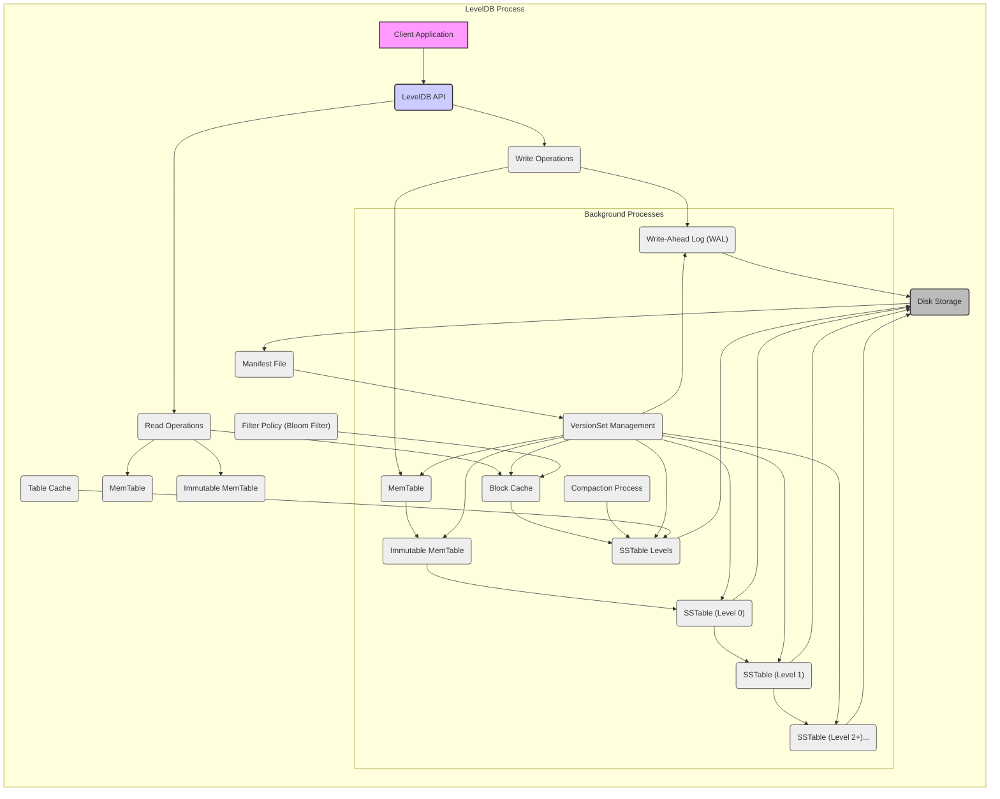
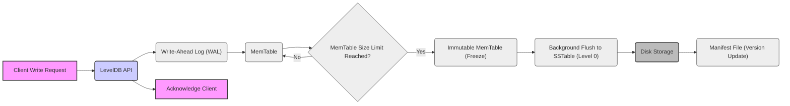
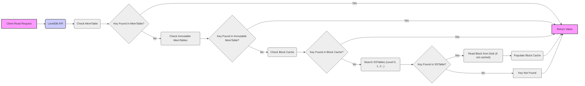

# Project Design Document: LevelDB

**Version:** 1.1
**Date:** October 27, 2023
**Author:** Gemini (AI Expert in Software, Cloud, and Cybersecurity Architecture)
**Project:** LevelDB - A fast key-value storage library

## 1. Project Overview

LevelDB is a high-performance, embedded key-value storage library designed for single-process applications. Developed by Google, it provides persistent, ordered key-value mappings where both keys and values are arbitrary byte arrays. LevelDB is optimized for scenarios requiring fast read and write operations on local storage, making it suitable for embedding within applications rather than serving as a standalone database server. Its architecture, based on the Log-Structured Merge-Tree (LSM-Tree), allows for efficient handling of large datasets and high write throughput.

**Key Features:**

*   **Ordered Key-Value Store:** Keys are lexicographically sorted, enabling efficient range scans and ordered iteration.
*   **Persistent Storage:** Data is durably stored on disk, ensuring data survival across application restarts and system failures.
*   **High Performance:** Engineered for low-latency read and write operations, particularly beneficial for local storage access patterns.
*   **Log-Structured Merge-Tree (LSM-Tree) Architecture:** Employs an LSM-Tree structure to optimize write performance by batching writes and performing background compaction.
*   **Crash Recovery:** Robust crash recovery mechanisms using Write-Ahead Logging (WAL) to guarantee data consistency even in the event of unexpected termination.
*   **Snapshot Support:** Provides consistent, point-in-time snapshots of the database, allowing for consistent backups and read operations against a stable view of the data.
*   **Atomic Batch Operations:** Supports atomic batch writes, enabling multiple key-value pairs to be written or deleted as a single, atomic transaction, improving efficiency and consistency.
*   **Data Compression:** Offers optional data compression (using configurable compression algorithms like Snappy) to reduce storage space and potentially improve I/O performance.
*   **Configurable Cache:** Features a configurable block cache to keep frequently accessed data blocks in memory, significantly accelerating read operations.

**Intended Use Cases:**

*   **Embedded Databases:** Ideal for applications requiring local, persistent storage without the overhead of a separate database server.
*   **Caching Layers:** Can serve as a persistent cache to augment in-memory caches, providing durability and larger capacity.
*   **Indexing Systems:** Suitable for building indexing structures where fast key lookups and ordered storage are essential.
*   **Local Storage for Applications:** Well-suited for desktop, mobile, and IoT applications needing reliable local data storage.
*   **Building Blocks for Distributed Systems:** Can be used as a local storage component within nodes of larger distributed systems.

## 2. System Architecture

LevelDB's architecture revolves around the Log-Structured Merge-Tree (LSM-Tree) principle, which prioritizes write performance by sequentially writing data and deferring data organization to background processes. The core components work in concert to manage data in memory and on disk, ensuring both speed and durability.

### 2.1. Components

*   **MemTable:**  The in-memory write buffer. All incoming write operations are initially stored in the MemTable. It's implemented as a sorted data structure (typically a skip list) to maintain key order and facilitate efficient lookups.  The MemTable is optimized for fast insertions and lookups, serving as the primary point of interaction for write operations.
*   **Immutable MemTable:** When the MemTable reaches a predefined size threshold, it is frozen and becomes an Immutable MemTable.  A new, empty MemTable is created to handle subsequent write requests. The Immutable MemTable is then scheduled for flushing to disk as an SSTable. This separation allows write operations to continue without being blocked by the disk I/O of flushing.
*   **SSTable (Sorted String Table):** The fundamental on-disk storage unit in LevelDB. SSTables are immutable files containing sorted key-value pairs. They are organized into levels (Level 0, Level 1, Level 2, and so on), forming the tiered structure of the LSM-Tree.
    *   **Level 0 SSTables:** Created directly from flushing Immutable MemTables. They may have overlapping key ranges and are typically numerous and smaller.
    *   **Level 1+ SSTables:** Created by compacting Level 0 SSTables and lower levels. They have non-overlapping key ranges within each level and are generally larger and fewer in number at higher levels.
*   **Log (Write-Ahead Log - WAL):** A critical component for durability and crash recovery. Before any write operation is applied to the MemTable, it is first appended to the WAL. The WAL is a sequential log file on disk. In the event of a system crash, LevelDB can replay the WAL upon restart to recover any writes that were in memory but not yet flushed to SSTables, ensuring no data loss.
*   **VersionSet:**  Manages the different versions of the database state. It maintains a record of all SSTables present at each level and provides a consistent view of the database for read operations. The VersionSet is updated atomically during compaction and flush operations, ensuring transactional consistency. It is crucial for snapshot functionality and consistent reads during background operations.
*   **Compaction Process:** A background process that periodically merges and reorganizes SSTables. Compaction is essential for:
    *   **Reducing Redundancy:** Merging overlapping SSTables to eliminate duplicate keys and older versions of values.
    *   **Reclaiming Space:** Removing deleted keys and obsolete data.
    *   **Improving Read Performance:** Creating larger, sorted SSTables at higher levels with non-overlapping key ranges, which optimizes read lookups and reduces the number of SSTables to check.
    *   **Leveling:** Moving data from lower levels to higher levels, organizing the LSM-Tree structure.
*   **Cache (Block Cache & Table Cache):**
    *   **Block Cache:**  An in-memory cache that stores uncompressed blocks of data read from SSTables. When a read operation needs to access data from an SSTable, LevelDB first checks the Block Cache. If the required block is present, it's served directly from memory, significantly reducing disk I/O and latency. The Block Cache is crucial for read performance.
    *   **Table Cache:** Caches file handles and metadata for frequently accessed SSTables. Opening and closing SSTable files can be expensive. The Table Cache keeps file handles open and caches metadata (like index blocks and filter blocks), reducing the overhead of accessing SSTables, especially for frequently accessed tables.
*   **Filter Policy (Bloom Filter):** An optional, probabilistic data structure used to optimize read performance. Bloom filters can be associated with SSTables. Before reading an SSTable to check for a key, LevelDB can query the Bloom filter. If the Bloom filter indicates that the key is *likely* not present in the SSTable, LevelDB can avoid reading the SSTable entirely, saving disk I/O. Bloom filters can have false positives (indicating a key might be present when it's not), but they have very low false negative rates, making them effective for quickly filtering out SSTables that definitely do not contain a key.
*   **Manifest File:** A file that persistently stores metadata about the current database version. This includes the list of SSTables at each level, the current version number, and other critical configuration information. The Manifest file is essential for database recovery. Upon startup, LevelDB reads the Manifest file to reconstruct the database state and the VersionSet, ensuring consistency and allowing the database to resume operation after a shutdown or crash.

### 2.2. Component Diagram (Mermaid)

## 3. Data Flow

### 3.1. Write Operation (Detailed)

1.  **Client Write Request:** The client application initiates a write operation (e.g., `Put(key, value)`, `Delete(key)`) through the LevelDB API.
2.  **Write-Ahead Logging (WAL):**  For durability, the write operation is immediately serialized and appended to the Write-Ahead Log (WAL) file on disk. This write to the WAL is typically synchronous to ensure that the operation is durably recorded before proceeding.
3.  **MemTable Insertion:** After successfully writing to the WAL, the write operation is inserted into the MemTable. The MemTable, being an in-memory sorted structure, allows for fast insertion.
4.  **MemTable Size Check:** LevelDB monitors the size of the MemTable. When it exceeds a configurable threshold (e.g., `write_buffer_size` option), the MemTable becomes immutable.
5.  **Immutable MemTable Creation:** The current MemTable is marked as immutable, and a new, empty MemTable is created to accept subsequent write operations. This ensures that write operations can continue without waiting for the flushing of the previous MemTable.
6.  **Background Flush to SSTable (Level 0):** In the background, the Immutable MemTable is flushed to disk as a new SSTable at Level 0. This process involves iterating through the sorted key-value pairs in the Immutable MemTable and writing them sequentially to a new SSTable file. Level 0 SSTables may contain overlapping key ranges.
7.  **WAL Acknowledgement:** Once the write operation is safely in the MemTable (and WAL), the LevelDB API acknowledges the successful write operation back to the client application.
8.  **Compaction (Background):**  The compaction process, running independently in the background, will eventually process the newly created Level 0 SSTable. It will merge it with existing SSTables in Level 0 and potentially move data to higher levels (Level 1, Level 2, etc.) based on compaction strategies.

### 3.2. Read Operation (Detailed)

1.  **Client Read Request:** The client application requests a read operation (e.g., `Get(key)`) through the LevelDB API for a specific key.
2.  **MemTable Lookup:** LevelDB first checks the current MemTable. If the key is found in the MemTable, the corresponding value is returned. This is the fastest path for recently written data.
3.  **Immutable MemTable Lookup:** If the key is not in the MemTable, LevelDB checks any Immutable MemTables (if they exist, as they are waiting to be flushed).
4.  **Block Cache Lookup:** Next, LevelDB checks the Block Cache. If the block containing the key is present in the Block Cache, it's retrieved from memory, and the value is returned. This avoids disk I/O for frequently accessed data blocks.
5.  **SSTable Lookup (Level Order with Bloom Filters):** If the key is not in the cache, LevelDB begins searching SSTables on disk, starting from Level 0 and proceeding to higher levels (Level 1, Level 2, etc.).
    *   **Level 0 SSTables:** LevelDB checks all Level 0 SSTables. Since Level 0 SSTables can have overlapping key ranges, all of them must be checked.
    *   **Level 1+ SSTables:** For levels 1 and above, SSTables within each level have non-overlapping key ranges. LevelDB can use indexing and potentially Bloom filters to efficiently determine which SSTables to check within a level. Bloom filters, if enabled, are checked first to quickly rule out SSTables that are unlikely to contain the key.
6.  **Disk Read (if necessary):** Once an SSTable potentially containing the key is identified, LevelDB reads the relevant data block from disk (if it's not already in the Block Cache).
7.  **Cache Population (if necessary):** The block read from disk is typically added to the Block Cache to improve performance for subsequent reads of nearby keys.
8.  **Value Return or Not Found:** If the key is found in an SSTable, the corresponding value is returned to the client application. If the key is not found in any of the MemTables, Immutable MemTables, Block Cache, or SSTables, LevelDB indicates that the key was not found.

### 3.3. Data Flow Diagram - Write Path (Mermaid)

### 3.4. Data Flow Diagram - Read Path (Mermaid)

## 4. Technology Stack

*   **Programming Language:** C++ (designed for performance and portability)
*   **Standard Library:**  Relies heavily on the C++ Standard Library for core functionalities like memory management, data structures, and file I/O.
*   **File System:**  Interacts directly with the underlying operating system's file system for persistent storage of WAL, SSTables, and Manifest files.  Assumes POSIX-like file system semantics for operations like file creation, deletion, renaming, and synchronization.
*   **Concurrency:** Employs threads and synchronization primitives (like mutexes, condition variables, atomic operations) for managing background compaction, MemTable flushing, and other concurrent operations. Designed to be thread-safe for concurrent access from multiple threads within a single process.
*   **Build System:**  Typically built using cross-platform build systems like Make or CMake, facilitating compilation and linking across different operating systems (Linux, macOS, Windows, etc.).

## 5. Security Considerations

This section details security considerations relevant to LevelDB, categorized for clarity. This analysis will inform a more comprehensive threat model.

### 5.1. Confidentiality

*   **Data at Rest Encryption:** LevelDB itself does not provide built-in encryption for data stored on disk (SSTables, WAL, Manifest).
    *   **Threat:** Sensitive data stored in LevelDB files is vulnerable to unauthorized access if the storage medium is compromised (e.g., physical theft, unauthorized access to the file system).
    *   **Mitigation:** Implement encryption at a higher layer:
        *   **File System Encryption:** Utilize operating system-level file system encryption (e.g., dm-crypt/LUKS, FileVault, BitLocker) to encrypt the entire partition or directory where LevelDB data files are stored.
        *   **Application-Level Encryption:** Encrypt sensitive data within the application *before* writing it to LevelDB and decrypt it after reading. This requires careful key management within the application.
*   **Data in Transit (Internal Process):**  Data transfer within the LevelDB process (between components) is in memory and not typically exposed to external network transit risks.
    *   **Note:** If LevelDB is used as part of a larger distributed system where data *is* transmitted over a network, network-level encryption (TLS/SSL) would be necessary for those external communications, but this is outside the scope of LevelDB itself.

### 5.2. Integrity

*   **Data Corruption:**
    *   **Threat:** Data corruption can occur due to hardware failures (disk errors), software bugs, or malicious manipulation of data files.
    *   **Mitigation:**
        *   **Checksums:** LevelDB uses checksums to protect data integrity within SSTables and the WAL. Checksums are verified during reads to detect corruption.
        *   **Write-Ahead Logging (WAL):** The WAL ensures that write operations are durably logged before being applied to SSTables, providing a recovery mechanism in case of crashes or corruption.
        *   **Robust File I/O:** LevelDB relies on robust file system operations and synchronization (e.g., `fsync`) to minimize the risk of data loss or corruption during writes.
*   **Data Manipulation:**
    *   **Threat:** Unauthorized modification of LevelDB data files on disk could compromise data integrity.
    *   **Mitigation:**
        *   **File System Permissions:** Rely on operating system file system permissions to restrict access to LevelDB data directories and files, limiting who can read or write to them. Proper user and group management is crucial.
        *   **Immutable SSTables:** SSTables are designed to be immutable after creation. This reduces the risk of accidental or malicious modification of existing data files. Compaction creates new SSTables instead of modifying existing ones.

### 5.3. Availability

*   **Denial of Service (DoS):**
    *   **Resource Exhaustion (CPU, Memory, Disk I/O, Disk Space):**
        *   **Threat:** Malicious or unintentional excessive write or read requests can exhaust system resources, leading to performance degradation or service unavailability.
        *   **Mitigation:**
            *   **Configuration Limits:** LevelDB provides configuration options (e.g., `write_buffer_size`, `max_file_size`, `cache_size`) to limit resource consumption. Properly configure these parameters based on expected workload and available resources.
            *   **Rate Limiting (Application Level):** Implement rate limiting or request throttling at the application level to control the rate of requests sent to LevelDB, preventing overload.
            *   **Monitoring and Alerting:** Monitor LevelDB resource usage (CPU, memory, disk I/O, disk space) and set up alerts to detect and respond to potential DoS conditions.
    *   **Compaction Storms:**
        *   **Threat:** In scenarios with very high write rates, the compaction process might become overloaded, consuming excessive resources and potentially impacting read performance or even causing temporary unavailability.
        *   **Mitigation:**
            *   **Compaction Tuning:** LevelDB offers configuration options to tune the compaction process (e.g., compaction styles, background thread settings). Experiment with these settings to optimize compaction performance for specific workloads.
            *   **Write Rate Control:**  If possible, control or smooth out write traffic to avoid sudden bursts that can trigger compaction storms.
    *   **File System Limits (Open Files, Disk Space):**
        *   **Threat:**  Running out of file system resources (e.g., exceeding the maximum number of open files or disk space) can cause LevelDB to fail.
        *   **Mitigation:**
            *   **Resource Monitoring:** Monitor file system resource usage (open files, disk space) and ensure sufficient resources are available.
            *   **Resource Limits (OS Level):** Configure operating system-level resource limits (e.g., `ulimit` on Linux) to prevent resource exhaustion from impacting the entire system.
*   **Crash Recovery Vulnerabilities:**
    *   **Threat:**  Bugs or vulnerabilities in the crash recovery process (WAL replay, Manifest file handling) could potentially lead to data loss or inconsistent database state after a crash.
    *   **Mitigation:**
        *   **Code Reviews and Testing:** Thoroughly review and test the LevelDB codebase, especially the crash recovery logic, to identify and fix potential vulnerabilities.
        *   **Regular Backups:** Implement regular backups of LevelDB data files as an additional safety net in case of catastrophic failures or unrecoverable corruption.

### 5.4. Access Control

*   **Lack of Built-in Access Control:** LevelDB itself does not provide any built-in user authentication or authorization mechanisms.
    *   **Threat:** Any process with sufficient file system permissions can access and manipulate LevelDB data files.
    *   **Mitigation:**
        *   **Operating System Permissions:** Rely entirely on operating system file system permissions to control access to LevelDB data directories and files. Carefully configure user and group permissions to restrict access to authorized processes only.
        *   **Application-Level Access Control:** If fine-grained access control is required, implement it within the application embedding LevelDB. This might involve adding an authorization layer on top of the LevelDB API.

### 5.5. Input Validation

*   **Key and Value Validation:** LevelDB performs minimal validation on keys and values.
    *   **Threat:**  Maliciously crafted keys or values (e.g., excessively long keys, keys with special characters that might cause parsing issues in higher layers) could potentially lead to unexpected behavior or vulnerabilities in the application using LevelDB.
    *   **Mitigation:**
        *   **Application-Level Input Validation:** Implement robust input validation in the application *before* passing keys and values to LevelDB. Sanitize and validate all inputs to ensure they conform to expected formats and constraints.

## 6. Operational Aspects

This section outlines key operational considerations for managing and maintaining LevelDB in a production environment.

### 6.1. Backup and Recovery

*   **Backup Strategies:**
    *   **Snapshot Backups:** LevelDB's snapshot feature allows creating consistent point-in-time backups.  Take a snapshot and then copy the underlying data files (SSTables, WAL, Manifest) to a backup location. This ensures a consistent backup even while LevelDB is running.
    *   **File System Backups:**  Use file system-level backup tools to regularly back up the entire directory containing LevelDB data files. Ensure backups are consistent (e.g., by quiescing writes briefly or using file system snapshot capabilities).
*   **Recovery Procedures:**
    *   **Crash Recovery (Automatic):** LevelDB automatically performs crash recovery upon startup by replaying the WAL. No manual intervention is typically needed for crash recovery.
    *   **Backup Restoration:** To restore from a backup, stop the LevelDB application, replace the current data directory with the backup copy, and restart the application. LevelDB will then start from the restored state.
    *   **Point-in-Time Recovery (using Snapshots):** If using snapshot backups, restore from a specific snapshot to revert the database to a previous point in time.

### 6.2. Monitoring

*   **Key Metrics to Monitor:**
    *   **Disk Space Usage:** Monitor disk space consumed by LevelDB data files to prevent disk space exhaustion.
    *   **Write Latency and Throughput:** Track write operation latency and throughput to identify performance bottlenecks or degradation.
    *   **Read Latency and Throughput:** Monitor read operation latency and throughput to assess read performance.
    *   **Cache Hit Ratio (Block Cache):** Monitor the Block Cache hit ratio to evaluate cache effectiveness. A low hit ratio might indicate insufficient cache size.
    *   **Compaction Activity:** Monitor compaction frequency and duration to understand compaction overhead and identify potential compaction bottlenecks.
    *   **Error Logs:** Regularly check LevelDB error logs for any warnings or errors that might indicate problems.
*   **Monitoring Tools:**
    *   **Application-Level Monitoring:** Integrate LevelDB monitoring into the application itself to collect metrics and expose them through application monitoring systems.
    *   **System Monitoring Tools:** Use system-level monitoring tools (e.g., `iostat`, `vmstat`, `df`, Prometheus, Grafana) to monitor disk I/O, CPU usage, memory usage, and disk space related to LevelDB.

### 6.3. Configuration

*   **Key Configuration Parameters:**
    *   `write_buffer_size`: Size of the MemTable. Larger values can improve write throughput but increase memory usage.
    *   `max_file_size`: Maximum size of SSTable files.
    *   `cache_size`: Size of the Block Cache. Larger caches improve read performance but consume more memory.
    *   `compression`: Enable or disable compression for SSTables. Compression reduces disk space but adds CPU overhead.
    *   `filter_policy`: Configure Bloom filters to improve read performance for non-existent keys.
    *   `compaction_style`: Choose different compaction styles (e.g., level-based, universal) based on workload characteristics.
*   **Configuration Management:**
    *   **Configuration Files:** Store LevelDB configuration parameters in configuration files for easy management and version control.
    *   **Dynamic Configuration (Limited):**  Some LevelDB configuration options can be changed dynamically (e.g., cache size), but many require restarting LevelDB to take effect.

### 6.4. Performance Tuning

*   **Workload Analysis:** Understand the application's workload characteristics (read/write ratio, key size, value size, access patterns) to optimize LevelDB configuration.
*   **Cache Tuning:** Adjust `cache_size` based on read workload and available memory. Monitor cache hit ratio to evaluate effectiveness.
*   **Compression Tuning:** Experiment with different compression algorithms or disable compression if CPU is a bottleneck and disk space is not a major concern.
*   **Compaction Tuning:**  Adjust compaction parameters based on write workload and performance requirements. Consider different compaction styles.
*   **Hardware Considerations:**  Use fast storage devices (SSDs) for optimal performance. Ensure sufficient RAM for caching and MemTables.

This improved design document provides a more detailed and comprehensive overview of LevelDB, including enhanced security considerations and operational aspects, making it a stronger foundation for threat modeling and project development.