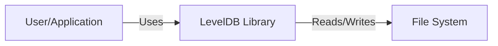
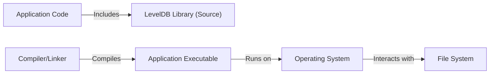
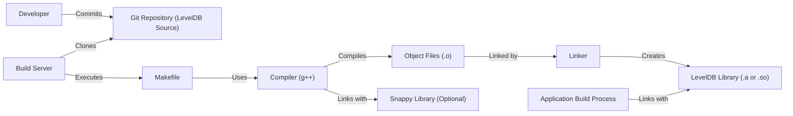

# Project Design Document: LevelDB

## BUSINESS POSTURE

LevelDB is a fast key-value storage library written at Google that provides an ordered mapping from string keys to string values. It's widely used as a building block in various higher-level data storage systems, including databases and caches.

Priorities and Goals:

*   Provide high performance for read and write operations.
*   Ensure data reliability and consistency.
*   Offer a simple and easy-to-use API.
*   Maintain portability across different platforms.
*   Minimize storage space usage through efficient data compression.

Business Risks:

*   Data corruption or loss due to software bugs or hardware failures.
*   Performance bottlenecks impacting applications relying on LevelDB.
*   Security vulnerabilities exposing sensitive data.
*   Compatibility issues arising from platform-specific dependencies.
*   Inability to scale to meet growing data storage demands.

## SECURITY POSTURE

Existing Security Controls:

*   security control: Data checksumming: LevelDB uses checksums to detect data corruption. (Implemented in the codebase, specifically in the `table/table.cc` and related files).
*   security control: Atomic operations: LevelDB provides atomic operations for data modification, ensuring consistency. (Implemented throughout the codebase, leveraging platform-specific atomic operations where available).
*   security control: Optional Snappy compression: Data can be compressed using the Snappy library, reducing storage space and potentially improving I/O performance. (Implemented as an optional feature, controlled by build configurations).

Accepted Risks:

*   accepted risk: LevelDB is not designed to be a network-accessible database. It's intended to be embedded within a single process. Network security is the responsibility of the embedding application.
*   accepted risk: LevelDB does not provide built-in encryption. Data encryption is the responsibility of the embedding application.
*   accepted risk: LevelDB does not provide user authentication or authorization. Access control is the responsibility of the embedding application.

Recommended Security Controls:

*   security control: Integrate with a robust input validation mechanism in the embedding application to prevent injection attacks or other malicious input.
*   security control: If sensitive data is stored, implement application-level encryption before passing data to LevelDB.
*   security control: Regularly audit the embedding application's security posture, including its interaction with LevelDB.
*   security control: Consider using a memory-safe language or runtime environment for the embedding application to mitigate memory corruption vulnerabilities that could affect LevelDB.

Security Requirements:

*   Authentication: Not directly applicable to LevelDB itself, as it's an embedded library. The embedding application is responsible for authentication.
*   Authorization: Not directly applicable to LevelDB itself. The embedding application is responsible for authorization.
*   Input Validation: The embedding application must perform thorough input validation before passing data to LevelDB. This includes checking data types, lengths, and formats to prevent potential vulnerabilities.
*   Cryptography: LevelDB does not provide built-in encryption. If data encryption is required, it must be implemented at the application level before data is written to LevelDB and after data is read from LevelDB.
*   Data Integrity: LevelDB uses checksums to ensure data integrity. The embedding application should verify these checksums upon reading data.

## DESIGN

### C4 CONTEXT

Element Descriptions:

*   Element:
    *   Name: User/Application
    *   Type: External Entity (Application)
    *   Description: The application or user that embeds and interacts with the LevelDB library.
    *   Responsibilities:
        *   Initiates read and write operations.
        *   Handles data serialization and deserialization.
        *   Manages LevelDB instances (opening, closing, configuring).
        *   Implements application-level security controls (authentication, authorization, encryption).
    *   Security controls:
        *   Authentication
        *   Authorization
        *   Input validation
        *   Encryption (if required)

*   Element:
    *   Name: LevelDB Library
    *   Type: Software System
    *   Description: The LevelDB key-value storage library.
    *   Responsibilities:
        *   Provides an API for storing and retrieving data.
        *   Manages data organization and indexing.
        *   Handles data compression (optional).
        *   Ensures data consistency and durability.
    *   Security controls:
        *   Data checksumming
        *   Atomic operations

*   Element:
    *   Name: File System
    *   Type: External System
    *   Description: The underlying file system used by LevelDB to store data.
    *   Responsibilities:
        *   Provides persistent storage for data files.
        *   Handles file I/O operations.
    *   Security controls:
        *   Operating system level file permissions.

### C4 CONTAINER

Since LevelDB is a library, the container diagram is essentially the same as the context diagram. It's a single component embedded within the application.

Element Descriptions: (Same as C4 Context)

### DEPLOYMENT

LevelDB is a library, not a standalone service. Therefore, deployment is simply the inclusion of the LevelDB library within the application's build process. There are several ways to achieve this:

1.  Static Linking: The LevelDB code is compiled and linked directly into the application's executable.
2.  Dynamic Linking: The LevelDB code is compiled into a shared library (e.g., .so, .dll) that is loaded at runtime.
3.  Source Inclusion: The LevelDB source code is directly included in the application's source tree and compiled as part of the application.

Chosen Deployment Method (Static Linking):

Element Descriptions:

*   Element:
    *   Name: Application Code
    *   Type: Source Code
    *   Description: The source code of the application that uses LevelDB.
    *   Responsibilities: Contains the application logic and calls to the LevelDB API.
    *   Security controls: Application-level security controls.

*   Element:
    *   Name: LevelDB Library (Source)
    *   Type: Source Code
    *   Description: The source code of the LevelDB library.
    *   Responsibilities: Provides the key-value storage functionality.
    *   Security controls: Data checksumming, atomic operations.

*   Element:
    *   Name: Compiler/Linker
    *   Type: Tool
    *   Description: The compiler and linker used to build the application.
    *   Responsibilities: Compiles the source code and links the LevelDB library into the executable.
    *   Security controls: Compiler security flags (e.g., stack protection, ASLR).

*   Element:
    *   Name: Application Executable
    *   Type: Executable
    *   Description: The compiled application executable.
    *   Responsibilities: Runs the application logic and interacts with LevelDB.
    *   Security controls: Inherits security controls from the application code and LevelDB library.

*   Element:
    *   Name: Operating System
    *   Type: Operating System
    *   Description: The operating system on which the application runs.
    *   Responsibilities: Provides the runtime environment for the application.
    *   Security controls: OS-level security features (e.g., user accounts, file permissions, process isolation).

*   Element:
    *   Name: File System
    *   Type: File System
    *   Description: The file system used by LevelDB to store data.
    *   Responsibilities: Stores the LevelDB data files.
    *   Security controls: File system permissions.

### BUILD

LevelDB uses a `Makefile` based build system. The build process typically involves the following steps:

1.  Developer checks out the source code from the repository.
2.  Dependencies (like Snappy, if enabled) are either installed on the system or their source code is included in the build process.
3.  The `make` command is executed.
4.  The compiler (typically g++) compiles the source code files.
5.  The linker links the compiled object files and any required libraries (e.g., Snappy) to create the LevelDB library (either a static library `.a` or a shared library `.so`).
6.  The resulting library is then used by applications that embed LevelDB.

Security Controls in Build Process:

*   security control: Use of a well-defined build system (`Makefile`) ensures consistent and reproducible builds.
*   security control: Dependencies (like Snappy) should be obtained from trusted sources and their integrity verified.
*   security control: Compiler security flags (e.g., stack protection, ASLR, warnings as errors) should be enabled to enhance the security of the compiled code.
*   security control: Static analysis tools (linters, SAST) can be integrated into the build process to identify potential code quality and security issues.

## RISK ASSESSMENT

Critical Business Processes:

*   Data storage and retrieval for applications that rely on LevelDB. The availability and integrity of this process are critical.

Data Sensitivity:

*   LevelDB itself does not handle data sensitivity. The sensitivity of the data stored in LevelDB is entirely dependent on the embedding application. If the application stores sensitive data (e.g., PII, financial data, credentials), then that data within LevelDB would be considered sensitive. If the application stores non-sensitive data, then the data within LevelDB would be considered non-sensitive.

## QUESTIONS & ASSUMPTIONS

Questions:

*   Are there any specific compliance requirements (e.g., PCI DSS, HIPAA) that the embedding application must adhere to? This would influence the security controls needed at the application level.
*   What is the expected data volume and growth rate? This will impact performance tuning and scaling considerations.
*   What is the expected read/write ratio? This will also impact performance tuning.
*   What are the specific platforms and operating systems that LevelDB needs to support? This will influence portability considerations.
*   What level of concurrency is expected? This will impact the design of the embedding application and its interaction with LevelDB.

Assumptions:

*   BUSINESS POSTURE: The embedding application is responsible for all aspects of security beyond the basic data integrity provided by LevelDB's checksumming.
*   SECURITY POSTURE: The embedding application will handle authentication, authorization, and encryption (if required).
*   DESIGN: The embedding application will perform proper input validation. The file system used by LevelDB is appropriately secured with operating system permissions. The build environment is secure and trusted.