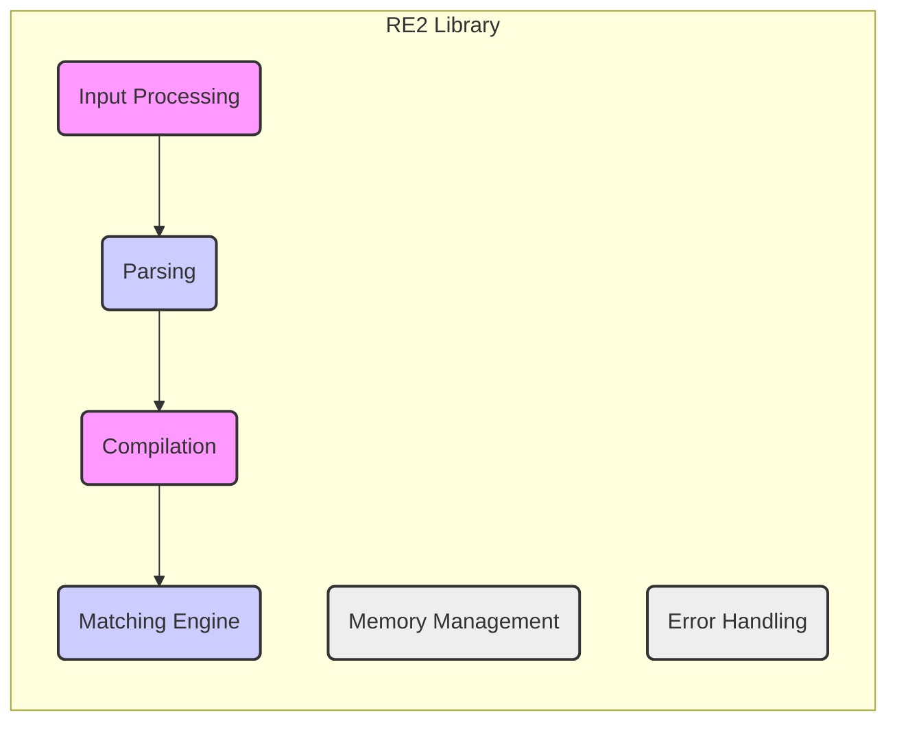
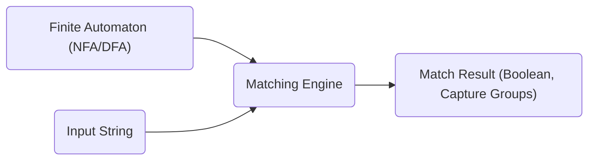

## Project Design Document: RE2 Regular Expression Library

**1. Introduction**

This document provides a detailed design overview of the RE2 regular expression library, developed by Google. This document is intended to serve as a foundation for subsequent threat modeling activities. It outlines the key components, data flow, and architectural considerations of RE2.

**1.1. Purpose**

The primary purpose of this document is to provide a comprehensive architectural understanding of the RE2 library. This understanding is crucial for identifying potential security vulnerabilities and attack vectors during the threat modeling process.

**1.2. Scope**

This document focuses on the core architecture and functionality of the RE2 library as represented in the provided GitHub repository (https://github.com/google/re2). It covers the key components involved in regular expression compilation and matching. It does not delve into specific language bindings or external integrations unless they are integral to the core RE2 functionality.

**1.3. Goals**

*   Clearly articulate the internal architecture of the RE2 library.
*   Describe the data flow during regular expression compilation and matching.
*   Identify key components and their interactions.
*   Provide sufficient detail to facilitate effective threat modeling.

**2. Overview**

RE2 is a fast, safe, thread-friendly alternative to backtracking regular expression engines like those found in PCRE. Its core design principle is to guarantee linear time complexity with respect to the input size, preventing catastrophic backtracking vulnerabilities. RE2 achieves this by implementing a finite automaton-based approach.

**3. Architecture**

The RE2 library can be broadly divided into the following key components:

*   **Input Processing:** Handles the initial intake of the regular expression pattern and the input string to be matched.
*   **Parsing:**  Analyzes the regular expression string and converts it into an internal representation.
*   **Compilation:** Transforms the parsed representation into a deterministic finite automaton (DFA) or a non-deterministic finite automaton (NFA), depending on the complexity of the regex.
*   **Matching Engine:** Executes the automaton against the input string to determine if a match exists.
*   **Memory Management:**  Handles the allocation and deallocation of memory used by the library.
*   **Error Handling:** Manages and reports errors encountered during parsing, compilation, or matching.

**3.1. Component Diagram**

**3.2. Component Details**

*   **Input Processing:**
    *   Receives the regular expression pattern as a string.
    *   Receives the input string to be matched against the pattern.
    *   May perform initial validation or encoding checks on the input strings.

*   **Parsing:**
    *   Lexes the regular expression string into tokens.
    *   Constructs an abstract syntax tree (AST) or a similar intermediate representation of the regex.
    *   Handles syntax errors in the regular expression.

*   **Compilation:**
    *   Takes the parsed representation as input.
    *   Builds a finite automaton (NFA or DFA) representing the regular expression.
    *   Optimizes the automaton for performance.
    *   This stage is crucial for RE2's linear time guarantee.

*   **Matching Engine:**
    *   Takes the compiled automaton and the input string.
    *   Simulates the automaton's execution on the input string.
    *   Determines if the input string matches the regular expression.
    *   May provide information about the matched substrings (capture groups).

*   **Memory Management:**
    *   Allocates memory for internal data structures, such as the automaton and intermediate representations.
    *   Deallocates memory when it is no longer needed.
    *   Designed to prevent memory leaks and other memory-related issues.

*   **Error Handling:**
    *   Detects and reports errors during parsing, compilation, and matching.
    *   Provides mechanisms for handling errors gracefully.

**4. Data Flow**

The following outlines the typical data flow within the RE2 library for both compilation and matching:

**4.1. Compilation Data Flow**

1. The user provides a **Regular Expression String**.
2. The **Input Processing** component receives the regex string.
3. The **Parsing** component analyzes the string and generates a **Parsed Representation (e.g., AST)**.
4. The **Compilation** component takes the parsed representation and builds a **Finite Automaton (NFA/DFA)**.

**4.2. Matching Data Flow**

1. The **Matching Engine** receives the pre-compiled **Finite Automaton (NFA/DFA)**.
2. The **Matching Engine** also receives the **Input String** to be matched.
3. The engine processes the input string against the automaton.
4. The **Match Result (Boolean, Capture Groups)** is returned, indicating whether a match was found and, if so, the captured substrings.

**5. Security Considerations (Initial Thoughts)**

While RE2 is designed with security in mind, potential areas for security considerations include:

*   **Input Validation:** Ensuring the regular expression string itself does not cause unexpected behavior during parsing or compilation.
*   **Memory Safety:**  Verifying that memory management within the library is robust and prevents vulnerabilities like buffer overflows or use-after-free errors.
*   **Denial of Service (DoS):** Although RE2 avoids catastrophic backtracking, extremely complex regular expressions could still potentially consume significant resources during compilation.
*   **Dependency Security:**  If RE2 relies on any external libraries, the security of those dependencies needs to be considered.

**6. Dependencies**

*   RE2 primarily relies on standard C++ libraries.
*   It may have platform-specific dependencies for certain functionalities. A detailed analysis of the build system would be required for a comprehensive list.

**7. Deployment**

RE2 is typically deployed as a library that is linked into other applications. Its security characteristics are therefore important for the overall security of the applications that use it.

**8. Future Considerations**

*   Further investigation into the specific algorithms used for DFA/NFA construction and optimization would be beneficial for deeper threat modeling.
*   Analyzing the implementation details of memory management within RE2 is crucial for identifying potential memory safety vulnerabilities.
*   Understanding how RE2 handles Unicode and different character encodings is important for identifying potential injection or bypass vulnerabilities.

This document provides a foundational understanding of the RE2 library's architecture. This information will be used in subsequent threat modeling exercises to identify potential security risks and develop appropriate mitigation strategies.
