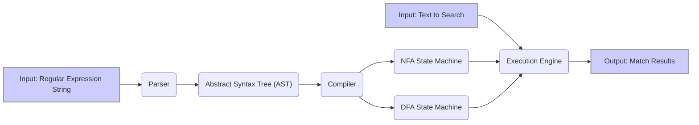

# Project Design Document: RE2 Regular Expression Engine

**Version:** 1.1
**Date:** October 26, 2023
**Author:** AI Expert

## 1. Introduction

This document provides a detailed design overview of the RE2 regular expression engine, as found in the [google/re2](https://github.com/google/re2) repository. This document is intended to serve as a foundation for subsequent threat modeling activities. It outlines the architecture, key components, data flow, and security considerations of RE2, with a focus on identifying potential attack surfaces and vulnerabilities.

## 2. Project Overview

RE2 is a fast, safe, thread-friendly alternative to backtracking regular expression engines like those found in PCRE, Perl, and Python. Its primary characteristic is its guaranteed linear time complexity in the size of the input string, achieved through its implementation using finite automata. This design choice inherently prevents catastrophic backtracking, making it suitable for processing untrusted input where maliciously crafted regular expressions could otherwise cause denial-of-service. RE2 is implemented in C++ and is designed to be used as a library embedded within other applications.

## 3. Goals and Non-Goals

*   **Goals:**
    *   Provide a regular expression engine with predictable, linear time performance, regardless of the complexity of the regular expression.
    *   Offer a safe alternative to backtracking engines for handling potentially malicious regular expressions or inputs, mitigating denial-of-service risks.
    *   Be thread-safe for concurrent usage in multi-threaded applications.
    *   Support a rich and commonly used subset of regular expression syntax.
    *   Be easily embeddable into other C++ projects with minimal dependencies.
    *   Maintain a focus on security and robustness.

*   **Non-Goals:**
    *   Full, 100% compatibility with all features of Perl Compatible Regular Expressions (PCRE). Certain features that inherently lead to backtracking or introduce significant complexity are intentionally omitted.
    *   Being a standalone, end-user application. RE2 is designed and intended as a library for developers.

## 4. Architecture

RE2's architecture follows a well-defined pipeline, transforming the input regular expression into an executable state machine.

*   **Parsing:** The input regular expression string is analyzed and transformed into an internal representation.
*   **Compilation:** The parsed representation is then compiled into a deterministic finite automaton (DFA) or a non-deterministic finite automaton (NFA) that is carefully constructed to avoid backtracking behavior. The choice between DFA and NFA depends on the specific regular expression and optimization strategies.
*   **Execution:** The compiled automaton is used to efficiently match the regular expression against the input text.

Here's a more detailed flowchart illustrating the process:

### 4.1. Key Components

*   **Parser:**
    *   Receives the raw regular expression string as input.
    *   Performs lexical analysis to break the string into tokens.
    *   Performs syntax analysis to ensure the regular expression conforms to RE2's supported grammar, constructing an Abstract Syntax Tree (AST).
    *   Handles operator precedence (e.g., `*`, `+`, `?`, concatenation, alternation) and grouping constructs (parentheses).
    *   Identifies and rejects regular expression constructs that are not supported by RE2, preventing the introduction of backtracking-prone patterns. This is a crucial security boundary.

*   **Compiler:**
    *   Takes the Abstract Syntax Tree (AST) as input.
    *   Transforms the AST into a finite automaton, typically either a Non-deterministic Finite Automaton (NFA) or a Deterministic Finite Automaton (DFA).
        *   **NFA Compilation:** Creates a state machine where transitions can be non-deterministic (multiple possible next states for a given input). RE2's NFA construction avoids the typical recursive backtracking approach.
        *   **DFA Compilation:** Creates a state machine where transitions are deterministic (only one possible next state for a given input). DFA execution is generally faster but can lead to larger state machines.
    *   Applies optimizations to the generated state machine to improve matching performance and reduce memory footprint.
    *   The core of RE2's guarantee of linear time complexity resides in this compilation step, specifically in the algorithms used to construct the NFA or DFA without introducing backtracking.

*   **Execution Engine:**
    *   Receives the compiled state machine (NFA or DFA) and the input text to be searched.
    *   Simulates the transitions of the state machine based on the characters in the input text.
    *   For a DFA, the execution is straightforward: for each input character, transition to the next state.
    *   For an NFA, RE2 uses techniques like lazy DFA construction or simulation to avoid explicit backtracking, maintaining linear time complexity.
    *   Tracks the current state(s) and determines if a match is found based on reaching an accepting state.
    *   Returns information about whether a match was found, and optionally the location and extent of the match (capturing groups).

*   **Memory Management:**
    *   RE2 manages memory for its internal data structures, including the AST, the compiled state machine (NFA or DFA states and transitions), and temporary data structures used during parsing and compilation.
    *   Efficient memory allocation and deallocation are critical for performance and preventing memory leaks, especially when handling a large number of regular expressions or processing large input texts.

## 5. Data Flow

The flow of data through RE2 is sequential and well-defined:

1. A user or an application provides a regular expression string to the RE2 library. This string is potentially untrusted input.
2. The `Parser` component receives the regular expression string.
3. The `Parser` performs lexical and syntactic analysis, validating the regular expression against RE2's supported syntax. If the regex is invalid, an error is reported, preventing further processing of potentially malicious patterns.
4. The `Parser` generates an Abstract Syntax Tree (AST) representing the parsed regular expression.
5. The `Compiler` receives the AST.
6. The `Compiler` transforms the AST into either an NFA or a DFA state machine. This transformation is crucial for ensuring linear time complexity during matching.
7. A user or application provides the text to be searched against the compiled regular expression. This text can also be untrusted input.
8. The `Execution Engine` receives the compiled state machine and the input text.
9. The `Execution Engine` simulates the transitions of the state machine based on the characters in the input text, efficiently finding matches without backtracking.
10. The `Execution Engine` determines if a match is found and, if so, the location and extent of the match (including capturing groups).
11. The `Execution Engine` returns the match results to the user or application.

## 6. Security Considerations

Given the intended use of this document for threat modeling, the following security aspects are paramount:

*   **Regular Expression Injection:**
    *   **Threat:** If the regular expression string is constructed from untrusted input without proper sanitization, an attacker could inject malicious regex patterns. While RE2 prevents catastrophic backtracking, a carefully crafted regex can still be computationally expensive, leading to CPU exhaustion.
    *   **Mitigation:**  Treat regular expressions as untrusted input. Implement strict input validation and sanitization on the regular expression string before passing it to RE2. Consider using a whitelist of allowed regex patterns or escaping special characters if the regex is partially user-controlled. Monitor resource consumption when processing regexes derived from untrusted sources.

*   **Resource Exhaustion (CPU):**
    *   **Threat:** Although RE2 guarantees linear time complexity, processing very large input strings with complex (though linear-time) regular expressions can still consume significant CPU resources, potentially leading to a denial-of-service.
    *   **Mitigation:** Implement limits on the size of the input text and the complexity of the regular expressions allowed. Monitor CPU usage and consider timeouts for regex matching operations, especially when dealing with untrusted input.

*   **Memory Safety:**
    *   **Threat:** As RE2 is implemented in C++, memory safety vulnerabilities such as buffer overflows, use-after-free errors, or memory leaks could exist in the parsing, compilation, or execution stages. These could be exploited to cause crashes or potentially execute arbitrary code.
    *   **Mitigation:**  RE2's codebase should undergo rigorous security audits and testing, including fuzzing, to identify and fix memory safety issues. Employ safe coding practices and utilize memory management tools. Keep the RE2 library updated to benefit from security patches.

*   **Denial of Service (DoS):**
    *   **Threat:** Exploiting resource exhaustion vulnerabilities (CPU or memory) or weaknesses in the parsing or compilation stages could lead to denial-of-service attacks against applications using RE2. An attacker might repeatedly send complex regexes or large input strings to overwhelm the system.
    *   **Mitigation:** Implement rate limiting and request throttling for operations involving RE2, especially when handling external requests. Monitor system resources and have mechanisms to detect and mitigate DoS attacks.

*   **Input Validation (Parser Vulnerabilities):**
    *   **Threat:** Vulnerabilities in the `Parser` component could allow an attacker to craft malformed or excessively complex regular expressions that cause the parser to crash, hang, or consume excessive resources during the parsing phase itself.
    *   **Mitigation:** The `Parser` must be robust and thoroughly tested against a wide range of valid and invalid regular expressions, including edge cases and deliberately malformed inputs. Employ fuzzing techniques to uncover potential parsing vulnerabilities.

*   **Compiler Vulnerabilities:**
    *   **Threat:**  Flaws in the `Compiler` could lead to the generation of an invalid or inefficient state machine, potentially causing unexpected behavior or performance issues during execution. In extreme cases, compiler bugs could be exploitable.
    *   **Mitigation:**  The `Compiler` logic should be carefully designed and implemented with security in mind. Thorough testing of the compilation process with various regular expressions is crucial.

## 7. Dependencies

RE2 has the following key dependencies:

*   **Standard C++ Library:** RE2 relies heavily on the standard C++ library for core functionalities such as string manipulation, memory management, and data structures. Vulnerabilities in the standard library could potentially affect RE2.
*   **Memory Allocator:** The underlying memory allocator used by the system (e.g., the default allocator or a custom allocator) can impact performance and, in some cases, security. Memory corruption vulnerabilities in the allocator could indirectly affect RE2.

## 8. Deployment Considerations

The security posture of RE2 is influenced by how it is deployed and used within an application:

*   **Context of Use:**  Is RE2 being used to process user-supplied input (e.g., in a web application firewall, a search engine, or a data validation system)? Processing untrusted input significantly increases the attack surface and the need for robust security measures.
*   **Privileges:** The privileges under which the application using RE2 runs are critical. Running with elevated privileges increases the potential impact of any vulnerabilities in RE2 or the host application.
*   **Sandboxing and Isolation:** Deploying the application using RE2 within a sandboxed environment or container can limit the impact of potential vulnerabilities by restricting the application's access to system resources.
*   **Integration with Other Libraries:**  Interactions with other libraries or components within the application could introduce new attack vectors. Ensure that data passed to and from RE2 is properly validated and sanitized.

## 9. Threat Model Summary

Based on the design, potential threats to RE2 and applications using it include:

*   **Input Manipulation:** Maliciously crafted regular expressions or input strings leading to resource exhaustion (CPU).
*   **Memory Corruption:** Vulnerabilities in parsing, compilation, or execution leading to crashes or potential code execution.
*   **Denial of Service:** Overloading the system with complex regexes or large inputs.
*   **Exploitation of Parser/Compiler Flaws:** Causing unexpected behavior or crashes through crafted regexes.

## 10. Future Considerations

Potential future developments or changes that could impact the design and security include:

*   **New Regular Expression Features:**  Adding support for more advanced or less common regular expression syntax could introduce new parsing and compilation complexities and potential vulnerabilities if not carefully implemented.
*   **Performance Optimizations:**  Any changes to the compilation or execution engine aimed at improving performance need to be rigorously reviewed for potential security implications, ensuring that optimizations do not introduce new attack vectors.
*   **Language Bindings:**  Adding bindings for other programming languages (e.g., Python, Java) could introduce new attack surfaces or require careful consideration of language-specific security issues and potential vulnerabilities in the binding layer.
*   **Integration with Hardware Acceleration:** Exploring hardware acceleration for regex matching could introduce new security considerations related to the hardware and its interaction with the software.
