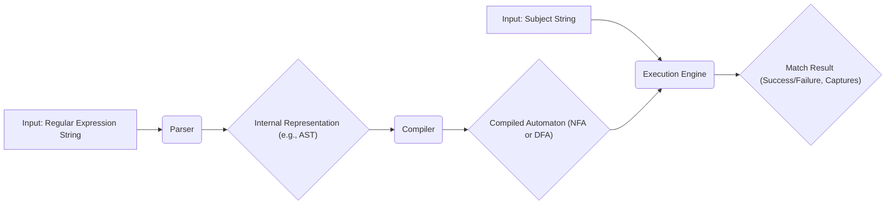

# Project Design Document: RE2 Regular Expression Library

**Version:** 1.1
**Date:** October 26, 2023
**Author:** AI Software Architect

## 1. Introduction

This document provides an enhanced and more detailed design overview of the RE2 regular expression library, developed by Google. This revised document is specifically tailored to serve as a robust foundation for subsequent threat modeling activities. It meticulously outlines the key components, architecture, and data flow within the library, with a strong emphasis on highlighting potential areas of interest and concern for security analysis.

## 2. Goals

*   Provide a comprehensive and in-depth architectural overview of the RE2 library, suitable for security analysis.
*   Clearly identify key components and meticulously describe their interactions and responsibilities.
*   Precisely describe the data flow within the library during the complete regular expression processing lifecycle.
*   Establish a clear and detailed understanding of the system's internal workings to facilitate effective and targeted threat modeling.

## 3. Scope

This document focuses on the intricate internal architecture and functionality of the RE2 library itself. It provides a detailed examination of:

*   The core components actively involved in regular expression parsing, compilation, and execution, including their specific roles.
*   The fundamental data structures employed to represent regular expressions and the various states during the matching process.
*   The detailed interactions and communication pathways between the different internal parts of the library.

This document explicitly does *not* cover:

*   Specific external use cases or the architecture of applications that embed the RE2 library.
*   The intricacies of the build process, the specific compiler flags used, or external dependencies of RE2.
*   Quantitative performance benchmarks, detailed optimization strategies, or low-level implementation details.

## 4. Overview

RE2 stands as a fast, memory-safe, and thread-safe alternative to traditional backtracking regular expression engines, such as those found in PCRE. Its paramount design principle is to guarantee regular expression execution in linear time complexity relative to the input string size, effectively eliminating the risk of catastrophic backtracking vulnerabilities. This crucial characteristic is achieved through the rigorous application of automata theory, specifically by systematically converting regular expressions into deterministic finite automata (DFAs) or non-deterministic finite automata (NFAs) as an intermediate step.

RE2 offers both a comprehensive C++ API, providing a rich object-oriented interface, and a standard C API, ensuring broad compatibility and ease of integration into diverse applications and programming environments. It supports a wide and expressive set of regular expression syntax, closely mirroring the capabilities found in Perl's regular expressions.

## 5. Architecture

The RE2 library can be conceptually decomposed into the following distinct and interacting key components:

*   **Parser:** This component is responsible for accepting a regular expression string as input and meticulously transforming it into a structured internal representation. This process involves:
    *   **Lexical Analysis:** Breaking down the input string into a stream of tokens.
    *   **Syntactic Analysis:**  Analyzing the token stream to ensure it conforms to the regular expression grammar and constructing an Abstract Syntax Tree (AST) or a similar well-defined intermediate representation.
*   **Compiler:** This component takes the structured, parsed representation of the regular expression (e.g., the AST) and systematically transforms it into an executable form optimized for efficient matching. This typically involves:
    *   **Automaton Construction:** Building a finite automaton, which can be either a Non-deterministic Finite Automaton (NFA) or a Deterministic Finite Automaton (DFA), depending on the complexity and characteristics of the regular expression.
    *   **Optimization:** Applying various optimization techniques to the generated automaton to improve matching performance or reduce its memory footprint.
*   **Execution Engine:** This is the central and most critical component, responsible for the actual matching process. It takes the compiled automaton and an input string and determines if the string matches the regular expression. Its operation involves:
    *   **State Management:** Maintaining the current state(s) within the automaton as it processes the input string.
    *   **Transition Logic:**  Following the transitions defined in the automaton based on the characters encountered in the input string.
*   **Memory Management:** This component diligently handles the allocation and deallocation of memory for all data structures used by the library throughout its lifecycle. This includes memory for:
    *   The parsed representation of the regular expression.
    *   The compiled automaton (NFA or DFA).
    *   Temporary state information required during the matching process.
*   **Error Handling:** This component is responsible for managing and reporting errors that may arise during various stages of operation, such as:
    *   **Parsing Errors:** Errors due to invalid regular expression syntax.
    *   **Compilation Errors:** Errors encountered during the automaton construction process.
    *   **Execution Errors:**  Less common, but potential errors during the matching phase, such as resource exhaustion.
*   **C API:** This provides a set of standard C-style functions that enable external applications, particularly those written in C or languages with C interoperability, to interact with the RE2 library's functionality.
*   **C++ API:** This offers a more modern, object-oriented interface specifically designed for C++ applications, providing classes and methods for creating, compiling, and executing regular expressions.

## 6. Data Flow

The typical and detailed data flow within the RE2 library when matching a regular expression against an input string proceeds as follows:

A more granular breakdown of the data flow:

*   **Input Regular Expression String:** The process commences with a regular expression string being provided as input, either directly by the user or programmatically by the calling application.
*   **Parser:** The Parser component receives the raw regular expression string. It performs a detailed analysis of its syntax, breaking it down into meaningful components. It then constructs an internal representation, typically an Abstract Syntax Tree (AST), which accurately reflects the hierarchical structure and semantic meaning of the regular expression.
*   **Internal Representation (e.g., AST):** This intermediate representation serves as the primary input to the Compiler. It provides a structured and easily manipulable representation of the regular expression, abstracting away from the raw string format.
*   **Compiler:** The Compiler component takes the internal representation (e.g., the AST) and systematically transforms it into a finite automaton. This automaton, which can be either an NFA or a DFA, is the core data structure that enables efficient pattern matching. The compilation process may involve various optimization steps to enhance performance and reduce resource consumption.
*   **Compiled Automaton (NFA or DFA):** The resulting automaton is a state machine that precisely encodes the logic of the regular expression. Transitions between states are determined by the characters encountered in the input string. This automaton is the key artifact used by the Execution Engine.
*   **Input Subject String:** The string against which the regular expression will be matched is provided as input to the Execution Engine. This is the data being searched for the specified pattern.
*   **Execution Engine:** The Execution Engine receives both the compiled automaton and the input string. It simulates the traversal of the automaton, moving from state to state based on the characters in the input string. The engine maintains the current state(s) and determines if the automaton reaches an accepting state, indicating a successful match.
*   **Match Result (Success/Failure, Captures):** The Execution Engine produces the final result of the matching operation. This typically includes a boolean value indicating whether a match was found (success or failure). If a match is found, the result may also include information about captured groups, identifying the substrings within the input string that matched specific parts of the regular expression.

## 7. Key Security Considerations (For Threat Modeling)

Building upon the architectural understanding and data flow, the following areas warrant careful consideration during threat modeling to identify potential vulnerabilities:

*   **Regular Expression Parsing:**
    *   **Malformed Regular Expressions Leading to DoS:** How robustly does the parser handle syntactically invalid, deeply nested, or excessively complex regular expressions? Could a maliciously crafted regex cause excessive CPU consumption, memory allocation, or even crashes within the parser, leading to a Denial of Service (DoS)?
    *   **Input Validation Bypass:** Are there potential weaknesses in the input validation of the regular expression string that could allow the injection of unexpected characters or control sequences that could exploit vulnerabilities in subsequent stages of processing?
*   **Automaton Compilation:**
    *   **Resource Exhaustion During Compilation:** Could a particularly intricate regular expression lead to the creation of an exceptionally large automaton, potentially exhausting available memory or consuming excessive processing time during the compilation phase, resulting in a DoS?
    *   **Compiler Bugs Leading to Incorrect Automata:** Are there potential bugs or edge cases within the compiler logic that could lead to the generation of an incorrect or unexpectedly behaving automaton, potentially leading to incorrect matching results or even exploitable conditions?
*   **Execution Engine:**
    *   **Memory Safety Vulnerabilities:** Does the execution engine meticulously manage memory allocation and deallocation to prevent common memory safety issues such as buffer overflows (when handling captured groups or internal buffers), use-after-free errors (if automaton states or data are prematurely released), or other forms of memory corruption?
    *   **Algorithmic Complexity Exploits (Beyond Backtracking):** While RE2 prevents catastrophic backtracking, are there other potential algorithmic complexity issues within the execution engine that could be exploited with specific input strings and automata to cause excessive CPU usage or memory consumption, leading to DoS?
    *   **Integer Overflow/Underflow in State Management:** Are there calculations within the execution engine related to state transitions, capture group tracking, or other internal operations that could be susceptible to integer overflow or underflow vulnerabilities, potentially leading to incorrect state transitions, out-of-bounds access, or other security issues?
*   **C/C++ API:**
    *   **API Misuse Leading to Vulnerabilities:** Could incorrect or insecure usage of the RE2 API by external applications introduce vulnerabilities? Examples include passing invalid pointers, incorrect buffer sizes for output parameters, or mishandling error codes, potentially leading to crashes or information leaks.
    *   **Boundary Condition Errors in API Handling:** Are boundary conditions and error handling within the API robust and secure? Could providing unexpected input values or calling API functions in an incorrect sequence lead to exploitable conditions?
*   **Memory Management:**
    *   **Memory Leaks Under Specific Conditions:** Could certain sequences of operations, error conditions during parsing or compilation, or specific patterns in regular expressions lead to memory leaks within the RE2 library, potentially degrading performance over time or leading to eventual resource exhaustion?
    *   **Double Free Vulnerabilities:** Are there scenarios, particularly in error handling paths or during the destruction of RE2 objects, where memory could be freed multiple times, leading to crashes or potential security exploits?
*   **Error Handling:**
    *   **Information Disclosure Through Error Messages:** Do error messages or error codes returned by the library inadvertently reveal sensitive information about the internal state of the library, the structure of the regular expression being processed, or the input being matched, potentially aiding attackers?
    *   **Insecure Handling of Unexpected Errors:** How does the library handle unexpected errors or exceptions that occur during parsing, compilation, or execution? Could these lead to an insecure state, such as leaving resources in an inconsistent state or failing to properly sanitize data?

## 8. Deployment Considerations

RE2 is predominantly deployed as a library that is linked into and embedded within other applications. Consequently, the security posture of RE2 has a direct and significant impact on the overall security of the applications that depend on it. Threat modeling efforts should carefully consider the specific ways in which RE2 is utilized within the context of the larger application to identify potential integration-related vulnerabilities.

## 9. Future Considerations

Anticipated future development efforts or modifications to RE2 may introduce new security considerations that need to be addressed proactively. Examples of such considerations include:

*   **Introduction of New Regular Expression Features:** Adding support for more advanced or esoteric regular expression syntax could introduce novel parsing or compilation challenges and potentially create new avenues for vulnerabilities if not implemented with meticulous attention to security.
*   **Performance Optimizations with Security Trade-offs:** Changes aimed at achieving further performance improvements could inadvertently introduce security flaws if not carefully designed and rigorously tested for potential security implications.
*   **Expansion of Language Bindings and Interoperability:**  Developing bindings for additional programming languages or enhancing interoperability with other systems could introduce new attack surfaces or create opportunities for API misuse if not implemented securely.

## 10. Conclusion

This enhanced document provides a more in-depth and comprehensive understanding of the RE2 regular expression library's internal architecture and data flow. It meticulously highlights key components, their interactions, and potential areas of interest for security analysis. This detailed information is essential for conducting a thorough and effective threat modeling exercise aimed at proactively identifying and mitigating potential security risks associated with the RE2 library.