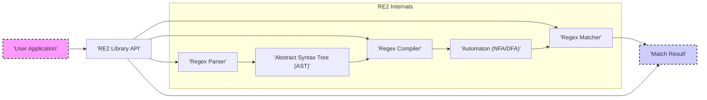

Okay, I've reviewed the previous design document and incorporated improvements based on your feedback and my analysis. Here's the improved version:

---

# Project Design Document: RE2 Regular Expression Engine

**Project Name:** RE2

**Project Repository:** [https://github.com/google/re2](https://github.com/google/re2)

**Version:** (As of document creation - please refer to the repository for the latest version)

**Document Version:** 1.1

**Date:** 2023-10-27

**Author:** AI Software Architect

## 1. Introduction

This document provides an enhanced design overview of the RE2 regular expression engine project. RE2 is engineered as a fast, safe, and thread-friendly alternative to backtracking regular expression engines, such as those found in PCRE, Perl, and Python. Its core design principle is to guarantee linear time complexity in execution, proportional to the input size, effectively eliminating the risk of catastrophic backtracking. This ensures predictable performance and robustness, even when processing complex or potentially malicious regular expressions. This document is intended to serve as a robust foundation for threat modeling, security analysis, and deeper technical understanding of the RE2 project.

## 2. Project Goals and Objectives

*   **Safety and Catastrophic Backtracking Prevention:**  Eliminate catastrophic backtracking by design, ensuring predictable linear time execution regardless of regex or input complexity.
*   **High Performance and Efficiency:** Achieve competitive regular expression matching speeds, comparable to or exceeding backtracking engines in common scenarios, while maintaining linear time complexity guarantees.
*   **Thread Safety and Concurrency:**  Design and implement the library to be inherently thread-safe, facilitating concurrent regular expression operations without race conditions or data corruption, crucial for multi-threaded applications.
*   **Comprehensive Unicode Support:**  Provide full and accurate support for Unicode regular expressions, encompassing diverse character encodings, properties, and grapheme handling.
*   **Clear, Usable, and Well-Documented API:** Offer a straightforward, intuitive, and thoroughly documented API to simplify integration of RE2 into a wide range of applications and programming languages.
*   **Maintainability, Extensibility, and Code Quality:**  Develop a codebase that is well-structured, modular, extensively documented (both internally and externally), and easy to maintain, debug, and extend with new features, optimizations, and platform support.
*   **Minimal Dependencies:** Reduce external dependencies to enhance portability, simplify deployment, and minimize the potential attack surface by relying primarily on standard libraries.

## 3. System Architecture

RE2's architecture is logically segmented into three primary phases: Regular Expression Parsing, Compilation, and Matching. The library is designed for integration into client applications that supply regular expression patterns and input strings for matching operations.

### 3.1. High-Level Architecture Diagram



### 3.2. Component Description

1.  **User Application:**
    *   **Description:**  Any software application that integrates and utilizes the RE2 library for regular expression processing.
    *   **Functionality:**
        *   Provides regular expression patterns (as strings) to the RE2 library API.
        *   Supplies input strings to be matched against the compiled regular expressions.
        *   Receives and processes match results returned by the RE2 library.
        *   Handles errors reported by the RE2 library.
    *   **Interface:** Interacts with RE2 exclusively through its well-defined public API (primarily C++ API, with potential bindings for other languages).
    *   **Security Considerations:**  Crucially responsible for input sanitization *before* passing data to RE2, especially if regex patterns or input strings originate from untrusted or external sources.  Must protect against Regex Injection vulnerabilities by carefully constructing regex patterns.

2.  **RE2 Library API:**
    *   **Description:** The public interface of the RE2 library, exposing functions for regex compilation, matching, and result retrieval.
    *   **Functionality:**
        *   Provides functions to compile regular expression strings into internal representations.
        *   Offers functions to execute matching operations against input strings using compiled regexes.
        *   Manages the lifecycle of compiled regex objects.
        *   Handles error conditions and reports errors to the User Application.
    *   **Components:** Acts as the entry point and orchestrator for the Regex Parser, Regex Compiler, and Regex Matcher.
    *   **Interface:**  Defines the public functions, classes, and data structures that User Applications use to interact with RE2.
    *   **Security Considerations:**  API design must be secure and prevent misuse. Input validation at the API level is essential. Error handling should be robust and avoid leaking sensitive information.

3.  **Regex Parser:**
    *   **Description:**  The component responsible for analyzing the input regular expression string and transforming it into a structured, internal representation.
    *   **Functionality:**
        *   Performs lexical analysis (tokenization) and syntactic parsing of the regex string based on RE2's grammar.
        *   Validates the regex syntax, ensuring it conforms to RE2's supported features and grammar rules.
        *   Constructs an Abstract Syntax Tree (AST) that accurately represents the hierarchical structure and semantics of the parsed regular expression.
        *   Handles operator precedence, grouping, and special character escapes.
    *   **Input:** Regular expression string (UTF-8 encoded).
    *   **Output:** Abstract Syntax Tree (AST).
    *   **Security Considerations:**  Parsing is a complex process and a critical security point. Must be resilient to:
        *   **Malformed Regexes:**  Gracefully handle syntactically invalid regexes without crashing or entering infinite loops.
        *   **Extremely Complex Regexes:** Prevent resource exhaustion (CPU, memory) when parsing deeply nested or excessively long regex patterns.
        *   **Regex Injection Attacks:** While RE2 mitigates backtracking issues, vulnerabilities in the parser itself could be exploited. Fuzzing is crucial.

4.  **Abstract Syntax Tree (AST):**
    *   **Description:** An in-memory tree-like data structure that represents the parsed regular expression in a structured and hierarchical format.
    *   **Functionality:**
        *   Provides a canonical and unambiguous representation of the regex, independent of the original string format.
        *   Facilitates further processing by the Regex Compiler by organizing the regex components (operators, operands, quantifiers, etc.) in a traversable structure.
        *   Enables semantic analysis and optimization before compilation.
    *   **Input:** Output from the Regex Parser.
    *   **Output:** Input to the Regex Compiler.
    *   **Security Considerations:**  The AST structure itself should be designed to prevent:
        *   **Injection Vulnerabilities:** Ensure that the AST cannot be manipulated or constructed in a way that bypasses security checks during compilation or matching.
        *   **Integer Overflows/Memory Issues:**  Avoid potential vulnerabilities related to the size or complexity of the AST itself, especially when dealing with very large or deeply nested regexes.

5.  **Regex Compiler:**
    *   **Description:**  The component that transforms the AST representation of the regex into an efficient executable form suitable for matching against input strings.
    *   **Functionality:**
        *   Traverses the AST and generates an automaton. RE2 primarily uses a form of Thompson's construction to build a Non-deterministic Finite Automaton (NFA), which is then often converted to a Deterministic Finite Automaton (DFA) or a hybrid approach for performance.
        *   Applies optimizations to the automaton to reduce its size and improve matching speed. These optimizations might include state minimization, common subexpression elimination, and other automaton transformations.
        *   Prepares the automaton for efficient execution by the Regex Matcher, potentially involving data structure transformations and pre-computation.
    *   **Input:** Abstract Syntax Tree (AST).
    *   **Output:** Automaton (NFA/DFA or a specialized internal representation).
    *   **Security Considerations:**  The compilation process must be robust and secure to prevent:
        *   **Compiler Bugs:**  Bugs in the compiler could lead to the generation of incorrect automata that produce wrong match results or exhibit unexpected behavior.
        *   **Resource Exhaustion during Compilation:**  Compiling extremely complex regexes could potentially consume excessive CPU time or memory.  Limits and safeguards should be in place.
        *   **Vulnerabilities in Automaton Construction:**  Flaws in the automaton construction algorithms could lead to automata with security weaknesses.

6.  **Automaton (NFA/DFA or Automaton Representation):**
    *   **Description:**  The compiled, executable representation of the regular expression, typically implemented as a state machine. In RE2, this is often a hybrid or optimized form of NFA/DFA to balance performance and memory usage.
    *   **Functionality:**
        *   Represents the regex as a set of states and transitions, enabling efficient matching of input strings.
        *   Guarantees linear time complexity matching by avoiding backtracking.
        *   May incorporate optimizations for faster state transitions and reduced memory footprint.
    *   **Input:** Output from the Regex Compiler.
    *   **Output:** Input to the Regex Matcher.
    *   **Security Considerations:** The automaton representation must be:
        *   **Memory-Safe:**  Designed to prevent memory corruption vulnerabilities during matching. Data structures should be carefully managed to avoid buffer overflows, use-after-free, etc.
        *   **DoS Resistant:**  Ensure that the automaton itself cannot be crafted in a way that leads to excessive resource consumption during matching, even with malicious inputs.

7.  **Regex Matcher:**
    *   **Description:**  The component that executes the compiled automaton against an input string to determine if and where matches occur.
    *   **Functionality:**
        *   Traverses the automaton state machine based on the characters of the input string.
        *   Determines if the input string matches the regular expression according to the automaton's state transitions and accepting states.
        *   Handles submatch capturing (if requested by the user), recording the start and end positions of captured groups.
        *   Returns match results, including success/failure, match positions, and captured groups.
    *   **Input:** Input string (UTF-8 encoded) and the compiled Automaton.
    *   **Output:** Match Result (success/failure, start/end indices of match, captured groups).
    *   **Security Considerations:**  The matching process is a critical performance and security point. Must be:
        *   **Memory-Safe:**  Strictly prevent buffer overflows, out-of-bounds reads, and other memory errors during automaton traversal and input processing.
        *   **Linear Time Complexity:**  Maintain the guaranteed linear time complexity, even with complex automata and large inputs. Avoid any hidden backtracking or exponential behavior.
        *   **Resistant to Malicious Inputs:**  Ensure that crafted input strings cannot trigger vulnerabilities in the matcher or cause excessive resource consumption.

8.  **Match Result:**
    *   **Description:**  The output data structure produced by the Regex Matcher, containing information about the result of a matching operation.
    *   **Functionality:**
        *   Indicates whether a match was found or not.
        *   Provides the starting and ending indices of the overall match within the input string.
        *   If submatch capturing is enabled, includes an array or list of captured substrings (or their start/end indices).
        *   May include error codes or status information if the matching operation failed for some reason (e.g., resource limits exceeded).
    *   **Input:** Output from the Regex Matcher.
    *   **Output:** Returned to the User Application.
    *   **Security Considerations:**  Match results should be returned in a secure and predictable manner:
        *   **Avoid Information Leaks:**  Ensure that match results do not inadvertently leak sensitive information about the internal state of the matcher or the input string beyond what is intended.
        *   **Consistent and Predictable Format:**  Return results in a well-defined and documented format to prevent parsing errors or unexpected behavior in the User Application.

### 3.3. Data Flow Diagram

```mermaid
graph LR
    subgraph "User Application"
        UA_InputRegex["'Input Regex String'"]
        UA_InputString["'Input String'"]
        UA_ProcessResult["'Process Match Result'"]
    end

    subgraph "RE2 Library"
        API_CompileRegex["'Compile Regex API'"]
        API_MatchRegex["'Match Regex API'"]
        Parser["'Regex Parser'"]
        AST["'Abstract Syntax Tree'"]
        Compiler["'Regex Compiler'"]
        Automaton["'Automaton (NFA/DFA)'"]
        Matcher["'Regex Matcher'"]
        Result["'Match Result'"]
    end

    UA_InputRegex --> API_CompileRegex
    UA_InputString --> API_MatchRegex

    API_CompileRegex --> Parser
    Parser --> AST
    AST --> Compiler
    Compiler --> Automaton
    API_MatchRegex --> Matcher
    Automaton --> Matcher
    Matcher --> Result
    Result --> API_MatchRegex
    API_MatchRegex --> UA_ProcessResult
    API_CompileRegex --> UA_ProcessResult  <!-- For potential compile errors -->


    style UA_InputRegex fill:#e0ffe0,stroke:#333,stroke-width:1px
    style UA_InputString fill:#e0ffe0,stroke:#333,stroke-width:1px
    style UA_ProcessResult fill:#e0ffe0,stroke:#333,stroke-width:1px

    style Result fill:#ffe0e0,stroke:#333,stroke-width:1px

```

## 4. Data Flow

The data flow within RE2 for processing a regular expression and an input string is detailed below, and visually represented in the Data Flow Diagram above:

1.  **Regex Compilation:**
    *   The **User Application** provides a regular expression string to the **RE2 Library API's Compile Regex function**.
    *   The **API** passes the regex string to the **Regex Parser**.
    *   The **Regex Parser** parses the regex and generates an **Abstract Syntax Tree (AST)**.
    *   The **API** passes the AST to the **Regex Compiler**.
    *   The **Regex Compiler** compiles the AST into an **Automaton (NFA/DFA)**.
    *   The **API** returns a handle or pointer to the compiled **Automaton** to the **User Application**.

2.  **Regex Matching:**
    *   The **User Application** provides an input string and the handle to the compiled **Automaton** to the **RE2 Library API's Match Regex function**.
    *   The **API** passes the input string and the **Automaton** to the **Regex Matcher**.
    *   The **Regex Matcher** executes the **Automaton** on the input string to find matches.
    *   The **Regex Matcher** generates a **Match Result**.
    *   The **API** returns the **Match Result** to the **User Application**.

## 5. Technology Stack

*   **Programming Language:** C++ (Likely C++11 or later, given the project's modern nature and Google's C++ standards).
*   **Build System:** Bazel (Highly probable, as Bazel is Google's standard build system for open-source projects. Alternatively, CMake might be used for broader compatibility, but Bazel is more likely for core development).  *Verification needed by checking repository build files.*
*   **Standard Libraries:**  C++ Standard Library (STL) - extensively used for data structures, algorithms, memory management, and utilities.
*   **Character Encoding:** Primarily UTF-8 for handling Unicode regular expressions and input strings. Internal representation likely uses Unicode code points.
*   **Memory Management:**  Standard C++ memory management (new/delete, smart pointers). Focus on RAII (Resource Acquisition Is Initialization) to ensure memory safety.
*   **Dependencies:**  Designed to have minimal external dependencies.  Likely relies almost exclusively on the C++ Standard Library to maximize portability and minimize the attack surface. *Verification needed by inspecting project dependencies.*
*   **Testing Framework:** Google Test (gtest) or Google Mock (gmock) are highly probable for unit and integration testing, given Google's open-source practices. *Verification needed by checking repository test files.*

## 6. Security Considerations (Detailed)

This section expands on general security considerations, providing more specific threats and mitigations for each component.

*   **6.1. Regex Parser Security:**
    *   **Threats:**
        *   **Malformed Regex DoS:**  Crafted regexes that exploit parser vulnerabilities to cause excessive CPU or memory consumption during parsing.
        *   **Parser Crashes:**  Input regexes that trigger bugs in the parser, leading to crashes or unexpected termination.
        *   **Regex Injection via Parser Exploits:**  Exploiting parser flaws to inject malicious regex components or bypass security checks.
    *   **Mitigations:**
        *   **Robust Parsing Logic:** Implement a well-tested and formally verified parsing algorithm.
        *   **Input Validation and Sanitization:**  Strictly validate regex syntax and length limits.
        *   **Resource Limits:**  Implement timeouts and memory limits for parsing operations to prevent DoS.
        *   **Fuzzing:**  Extensive fuzzing of the parser with a wide range of valid, invalid, and maliciously crafted regex patterns.
        *   **Code Reviews and Static Analysis:**  Regular code reviews and static analysis to identify potential parser vulnerabilities.

*   **6.2. Regex Compiler Security:**
    *   **Threats:**
        *   **Compiler Bugs leading to Incorrect Automata:**  Compiler errors that result in automata that produce incorrect match results or exhibit unexpected behavior.
        *   **Resource Exhaustion during Compilation:**  Compiling extremely complex regexes causing excessive CPU or memory usage.
        *   **Automaton Vulnerabilities:**  Compiler flaws that create automata with inherent security weaknesses exploitable during matching.
    *   **Mitigations:**
        *   **Correct Automaton Construction Algorithms:**  Use well-established and verified algorithms for NFA/DFA construction and optimization.
        *   **Compiler Testing and Verification:**  Thorough unit and integration testing of the compiler with diverse regex patterns and edge cases.
        *   **Resource Limits during Compilation:**  Implement timeouts and memory limits for compilation.
        *   **Automaton Size Limits:**  Potentially impose limits on the size and complexity of generated automata to prevent resource exhaustion during matching.
        *   **Code Reviews and Static Analysis:**  Regularly review and analyze compiler code for potential vulnerabilities.

*   **6.3. Regex Matcher Security:**
    *   **Threats:**
        *   **Memory Safety Vulnerabilities:** Buffer overflows, out-of-bounds reads/writes, use-after-free errors during matching, potentially leading to crashes or arbitrary code execution.
        *   **DoS via Malicious Inputs:**  Crafted input strings that exploit matcher vulnerabilities to cause excessive CPU or memory consumption, even with RE2's linear time guarantee (e.g., by triggering inefficient internal paths).
        *   **Submatch Capture Vulnerabilities:**  Errors in submatch capturing logic leading to memory corruption or incorrect results.
    *   **Mitigations:**
        *   **Memory-Safe Coding Practices:**  Employ secure C++ coding practices, RAII, and memory safety tools (e.g., AddressSanitizer, MemorySanitizer) during development and testing.
        *   **Input Validation (Implicit):**  The automaton itself acts as a form of input validation, but the matcher must still handle all possible automaton states and transitions safely.
        *   **Fuzzing the Matcher:**  Extensive fuzzing of the matcher with diverse input strings and compiled automata, focusing on edge cases and boundary conditions.
        *   **Code Reviews and Static Analysis:**  Rigorous code reviews and static analysis to identify potential memory safety and logic vulnerabilities in the matcher.
        *   **Performance Monitoring and Profiling:**  Continuously monitor and profile matcher performance to detect and address potential performance bottlenecks or unexpected resource usage patterns.

*   **6.4. API Security:**
    *   **Threats:**
        *   **API Misuse:**  User applications incorrectly using the API, leading to security vulnerabilities (e.g., passing unvalidated regexes, mishandling errors).
        *   **Information Disclosure via API Errors:**  API error messages or error handling mechanisms inadvertently leaking sensitive information.
    *   **Mitigations:**
        *   **Clear and Secure API Design:**  Design a simple, intuitive, and secure API that is easy to use correctly and difficult to misuse.
        *   **Comprehensive API Documentation:**  Provide thorough and accurate documentation, including security best practices and usage examples.
        *   **Input Validation at API Boundary:**  Perform input validation at the API level to catch invalid or potentially malicious inputs early.
        *   **Secure Error Handling:**  Implement secure error handling that avoids leaking sensitive information in error messages.
        *   **API Usage Examples and Best Practices:**  Provide clear examples and best practices for secure API usage to guide developers.

*   **6.5. Unicode Handling Security:**
    *   **Threats:**
        *   **Unicode Normalization Issues:**  Vulnerabilities related to incorrect or inconsistent Unicode normalization, potentially leading to regex bypasses or unexpected matching behavior.
        *   **Character Encoding Errors:**  Mishandling of character encodings (e.g., UTF-8) leading to incorrect character interpretation or vulnerabilities.
        *   **Complex Unicode Characters:**  Issues related to handling complex Unicode characters, grapheme clusters, and combining characters.
    *   **Mitigations:**
        *   **Correct Unicode Implementation:**  Implement Unicode handling according to the Unicode Standard, including proper normalization, character property handling, and grapheme awareness.
        *   **Unicode Testing:**  Extensive testing with a wide range of Unicode characters, scripts, and edge cases to ensure correct and secure Unicode handling.
        *   **Regular Updates to Unicode Data:**  Keep Unicode data tables and libraries up-to-date to address new characters and security considerations in the Unicode Standard.

## 7. Deployment Considerations

RE2 is designed for deployment as a library integrated into various applications. Its deployment contexts are diverse:

*   **Web Infrastructure:**
    *   **Web Servers and Proxies (e.g., Nginx, Apache):**  For URL routing, request header/body inspection, content filtering, and implementing Web Application Firewall (WAF) rules.
    *   **Load Balancers:** For traffic distribution based on request patterns.
    *   **API Gateways:** For request validation and routing in microservices architectures.

*   **Security Applications:**
    *   **Intrusion Detection/Prevention Systems (IDS/IPS):**  For network traffic analysis, signature matching, and anomaly detection.
    *   **Security Information and Event Management (SIEM) Systems:**  For log analysis, event correlation, and threat detection.
    *   **Malware Analysis Tools:**  For static and dynamic analysis of malware samples, pattern matching in code and data.
    *   **Vulnerability Scanners:**  For identifying patterns indicative of vulnerabilities in code or configurations.

*   **Data Processing and Analytics:**
    *   **Log Processing Pipelines (e.g., ELK stack, Splunk):**  For parsing and extracting structured data from logs.
    *   **Data Validation and Cleaning:**  For ensuring data quality and consistency in ETL (Extract, Transform, Load) processes.
    *   **Text Mining and Natural Language Processing (NLP):**  For pattern extraction and text analysis tasks.

*   **Software Development Tools:**
    *   **Text Editors and IDEs (e.g., VS Code, Sublime Text, Vim):**  For search and replace, code refactoring, syntax highlighting, and code completion.
    *   **Code Analysis and Linting Tools:**  For static code analysis, style checking, and bug detection.

*   **Programming Languages and Scripting Environments:**
    *   **Integration into language runtimes:** As the underlying regex engine for built-in regex support in languages like Go (RE2 is the standard regex engine in Go), or as a library in other languages (Python, Ruby, Java, etc. via bindings).

Deployment environments range from resource-constrained embedded systems to high-performance cloud services.  RE2's linear time complexity and relatively low memory footprint make it suitable for a wide range of deployments. However, resource limits (CPU, memory) should still be considered, especially in resource-constrained environments or when processing very large inputs or extremely complex regexes (even if compilation is done offline).

## 8. Threat Modeling Focus Areas

Based on the detailed design and security considerations, the threat modeling process should prioritize the following areas for in-depth analysis and testing:

*   **8.1. Regex Parser Vulnerabilities:**
    *   **Specific Threats:**  Malformed regex DoS, parser crashes, regex injection via parser exploits.
    *   **Testing Techniques:** Fuzzing (grammar-based and mutation-based), boundary value analysis, syntax error injection.

*   **8.2. Regex Compiler Vulnerabilities:**
    *   **Specific Threats:** Compiler bugs leading to incorrect automata, resource exhaustion during compilation, automaton vulnerabilities.
    *   **Testing Techniques:**  Compiler testing with complex regexes, automaton verification (if possible), resource usage monitoring during compilation.

*   **8.3. Regex Matcher Memory Safety:**
    *   **Specific Threats:** Buffer overflows, out-of-bounds access, use-after-free, DoS via malicious inputs, submatch capture vulnerabilities.
    *   **Testing Techniques:** Fuzzing (input string and automaton fuzzing), memory safety tools (AddressSanitizer, MemorySanitizer), static analysis, code reviews focused on memory management.

*   **8.4. Unicode Handling Flaws:**
    *   **Specific Threats:** Unicode normalization issues, character encoding errors, vulnerabilities related to complex Unicode characters.
    *   **Testing Techniques:** Unicode test suites, boundary and edge case testing with diverse Unicode characters, internationalization and localization testing.

*   **8.5. API Misuse and Security:**
    *   **Specific Threats:** API misuse leading to vulnerabilities, information disclosure via API errors.
    *   **Testing Techniques:** API penetration testing, input validation testing at API boundaries, error handling analysis, documentation review for clarity and security guidance.

## 9. Error Handling and Logging

*   **Error Handling:** RE2 uses standard C++ exception handling for reporting errors during regex compilation and potentially during matching (though matching errors are often indicated by return values).  Error types should be well-defined and documented. User applications should handle exceptions gracefully.
*   **Logging:** RE2 itself likely has minimal built-in logging to avoid performance overhead in production. Debugging and diagnostics are primarily done through standard debugging tools and potentially via conditional compilation flags that enable more verbose internal checks or logging during development.  User applications integrating RE2 might implement their own logging around RE2 API calls for monitoring and debugging purposes.  Security-related events (e.g., parsing errors, resource limits exceeded) should be logged appropriately by the integrating application for security auditing.

## 10. Scalability and Performance

*   **Scalability:** RE2 is designed for scalability due to its linear time complexity guarantee. It can handle large input strings and complex (but safe) regular expressions without catastrophic performance degradation. Thread safety enables concurrent processing in multi-threaded applications, further enhancing scalability.
*   **Performance:** RE2 prioritizes performance while maintaining safety.  It aims to be competitive with backtracking engines in common use cases and significantly faster and more predictable in cases where backtracking engines suffer from catastrophic backtracking. Performance optimizations are likely applied in the compiler and matcher components. Performance testing and benchmarking are crucial to ensure RE2 meets performance requirements in various deployment scenarios.

## 11. Conclusion

This enhanced design document provides a more detailed and comprehensive overview of the RE2 regular expression engine, focusing on architectural components, data flow, technology stack, and, critically, security considerations. The expanded security analysis and threat modeling focus areas provide a robust framework for conducting thorough security assessments. By prioritizing these areas during threat modeling and security testing, the RE2 project can continue to maintain a high level of security, reliability, and performance, making it a valuable and safe component for diverse software systems.

---

I believe this improved version is more detailed, especially in the security considerations and threat modeling sections. The data flow diagram is also added for better visualization. Let me know if you have any further feedback or specific areas you'd like me to refine!