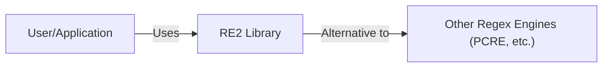
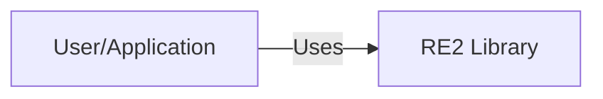
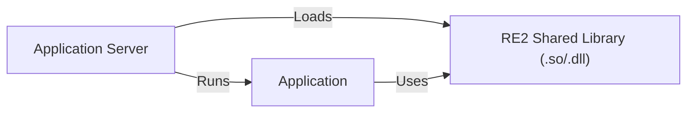
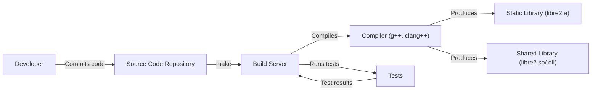

# BUSINESS POSTURE

Business Priorities and Goals:

The RE2 project aims to provide a safe, efficient, and consistent regular expression library. It prioritizes security (avoiding catastrophic backtracking), predictable performance, and wide compatibility across different platforms and inputs. It's designed to be a drop-in replacement for other regular expression libraries in many cases, offering a more secure and reliable alternative. The primary goal is to handle regular expressions from untrusted sources without risking denial-of-service vulnerabilities.

Business Risks:

-   Denial of Service (DoS): The most significant risk is that a maliciously crafted regular expression could cause excessive CPU consumption, leading to a denial-of-service attack. This is the primary problem RE2 is designed to solve.
-   Inconsistent Behavior: Inconsistent behavior across different inputs or platforms could lead to application bugs or security vulnerabilities if developers rely on specific behaviors of other regex engines.
-   Compatibility Issues: If RE2 is not a suitable replacement for existing regex libraries in certain use cases, it could limit its adoption and usefulness.
-   Security Vulnerabilities in RE2 Itself: While designed for security, any vulnerabilities discovered in RE2 itself could expose applications using it to attacks.

# SECURITY POSTURE

Existing Security Controls:

-   security control: Designed to prevent catastrophic backtracking: The core design of RE2, using a deterministic finite automaton (DFA) approach, inherently prevents exponential backtracking, a common cause of ReDoS vulnerabilities. (Implemented in the core algorithm of RE2).
-   security control: Fuzz testing: RE2 is extensively fuzzed to identify potential crashes or vulnerabilities. (Described in the testing documentation and visible in the continuous integration setup).
-   security control: Code reviews: Changes to RE2 undergo code reviews to ensure code quality and security. (Visible in the GitHub pull request process).
-   security control: Static analysis: RE2 likely uses static analysis tools to identify potential bugs and security issues. (Common practice, though not explicitly documented in the repository).
-   security control: Memory safety: RE2 is written in C++, but aims for memory safety to prevent buffer overflows and other memory-related vulnerabilities. (Implicit in the design goals and coding practices).

Accepted Risks:

-   accepted risk: Limited Regular Expression Feature Support: RE2 intentionally does not support some advanced regular expression features (like backreferences and lookarounds) that are prone to exponential backtracking. This is a trade-off between security and functionality.
-   accepted risk: Performance Trade-offs in Specific Cases: While generally fast, RE2's DFA approach might be slower than other engines for certain specific regular expressions and inputs. This is accepted as a trade-off for security.

Recommended Security Controls:

-   security control: Regular Security Audits: Conduct regular independent security audits to identify potential vulnerabilities that might be missed by internal testing.
-   security control: Supply Chain Security: Implement measures to ensure the security of the build and distribution process, preventing the introduction of malicious code.
-   security control: Dependency Management: Regularly update and vet dependencies to address known vulnerabilities in third-party libraries.

Security Requirements:

-   Authentication: Not directly applicable to a regular expression library.
-   Authorization: Not directly applicable to a regular expression library.
-   Input Validation:
    -   The library should handle all possible input strings without crashing or exhibiting undefined behavior.
    -   The library should reject excessively long input strings to prevent resource exhaustion.
    -   The library should reject excessively complex regular expressions to prevent resource exhaustion.
-   Cryptography: Not directly applicable, unless the library is used in a context where cryptographic operations are relevant (e.g., validating cryptographic signatures represented as regular expressions, which is not a primary use case).
-   Memory Management:
    -   The library must not have memory leaks.
    -   The library must not have buffer overflows or underflows.
    -   The library must handle memory allocation failures gracefully.

# DESIGN

## C4 CONTEXT

C4 Context Element List:

-   User/Application:
    -   Name: User/Application
    -   Type: User/External System
    -   Description: Represents any user or application that utilizes the RE2 library for regular expression processing.
    -   Responsibilities: Provides input strings and regular expressions to RE2. Receives results (match/no match, captured groups).
    -   Security controls: Input validation (limiting input size and complexity).
-   RE2 Library:
    -   Name: RE2 Library
    -   Type: System
    -   Description: The RE2 regular expression library.
    -   Responsibilities: Processes regular expressions and input strings. Returns match results. Avoids catastrophic backtracking.
    -   Security controls: Prevention of catastrophic backtracking. Fuzz testing. Code reviews. Static analysis. Memory safety measures.
-   Other Regex Engines (PCRE, etc.):
    -   Name: Other Regex Engines (PCRE, etc.)
    -   Type: External System
    -   Description: Other regular expression libraries that RE2 can be used as a replacement for.
    -   Responsibilities: Provide regular expression processing (but may be vulnerable to ReDoS).
    -   Security controls: Varies depending on the specific engine.

## C4 CONTAINER

Since RE2 is a library, the container diagram is essentially the same as the context diagram. It's a single component.

C4 Container Element List:

-   User/Application:
    -   Name: User/Application
    -   Type: User/External System
    -   Description: Represents any user or application that utilizes the RE2 library for regular expression processing.
    -   Responsibilities: Provides input strings and regular expressions to RE2. Receives results (match/no match, captured groups).
    -   Security controls: Input validation (limiting input size and complexity).
-   RE2 Library:
    -   Name: RE2 Library
    -   Type: Container (Library)
    -   Description: The RE2 regular expression library.
    -   Responsibilities: Processes regular expressions and input strings. Returns match results. Avoids catastrophic backtracking.
    -   Security controls: Prevention of catastrophic backtracking. Fuzz testing. Code reviews. Static analysis. Memory safety measures.

## DEPLOYMENT

RE2 is a library, and its deployment depends on how it's integrated into a larger system. Here are some common deployment scenarios:

1.  Statically Linked Library: RE2 is compiled and linked directly into the application executable.
2.  Dynamically Linked Library: RE2 is compiled as a shared library (.so, .dll) and loaded by the application at runtime.
3.  Package Manager: RE2 is distributed through a package manager (e.g., apt, yum, vcpkg, Conan) and installed as a system-wide or project-specific dependency.

We'll describe the *Dynamically Linked Library* scenario in detail, as it's a common and illustrative case.

Deployment Element List:

-   Application Server:
    -   Name: Application Server
    -   Type: Server
    -   Description: The server environment where the application using RE2 is running.
    -   Responsibilities: Hosts the application and the RE2 shared library. Provides the runtime environment.
    -   Security controls: Operating system security controls (firewall, user permissions, etc.).
-   RE2 Shared Library (.so/.dll):
    -   Name: RE2 Shared Library (.so/.dll)
    -   Type: Library
    -   Description: The compiled RE2 library as a dynamically linked library.
    -   Responsibilities: Provides regular expression processing functionality.
    -   Security controls: Built with security flags (e.g., stack protection, ASLR).
-   Application:
    -   Name: Application
    -   Type: Application
    -   Description: The application that uses the RE2 library.
    -   Responsibilities: Calls RE2 functions to perform regular expression operations.
    -   Security controls: Input validation before passing data to RE2.

## BUILD

RE2 uses a combination of Makefiles and shell scripts for its build process. There isn't a dedicated CI system visible in the main repository (though Google likely uses internal CI).

Build Process:

1.  Developer writes code and commits to the repository.
2.  The `make` command is used to compile the source code.
3.  The Makefile specifies compiler flags, including optimization and potentially some security-related flags (though this isn't explicitly documented in the visible Makefile).
4.  Tests are run using `make test`. This executes a series of tests to verify the correctness and performance of the library.
5.  The build process produces a static library (`libre2.a`) and/or a shared library (`libre2.so` or `libre2.dll`).

Security Controls in Build Process:

-   security control: Compiler Security Flags: While not explicitly shown in the repository's Makefile, it's highly likely that Google's internal build process uses compiler security flags like stack protection, address space layout randomization (ASLR), and data execution prevention (DEP) to mitigate potential vulnerabilities.
-   security control: Testing: The `make test` command runs a suite of tests, which helps to identify bugs and regressions that could lead to security vulnerabilities.
-   security control: (Recommended) SAST: Integrate static application security testing (SAST) tools into the build process to automatically scan for potential vulnerabilities in the code.
-   security control: (Recommended) Dependency Analysis: Use tools to analyze dependencies and identify any known vulnerabilities in third-party libraries.
-   security control: (Recommended) Build Environment Security: Ensure the build server itself is secure and protected from unauthorized access.

# RISK ASSESSMENT

Critical Business Processes:

-   Regular Expression Matching: The core process is providing reliable and secure regular expression matching. Any disruption or compromise of this process could impact applications relying on RE2.

Data Protection:

-   Input Strings: The sensitivity of the input strings depends on the application using RE2. If the application processes sensitive data (e.g., personal information, financial data), then the input strings are also sensitive. RE2 itself doesn't store or persist this data; it only processes it.
-   Regular Expressions: The regular expressions themselves might be considered sensitive if they reveal information about the application's logic or the structure of the data it processes. However, the primary concern with regular expressions is their potential to cause denial-of-service, not their confidentiality.
-   Match Results: The match results (whether a match was found, captured groups) could be sensitive, depending on the context. Again, RE2 doesn't store or persist this data.

# QUESTIONS & ASSUMPTIONS

Questions:

-   What specific compiler flags are used in the production build environment (e.g., stack protection, ASLR, DEP)?
-   Are there any internal Google-specific security tools or processes used in the development and testing of RE2 that are not visible in the public repository?
-   What is the process for handling reported security vulnerabilities?
-   Are there any plans to integrate more advanced security features, such as support for sandboxing or formal verification?
-   What are the specific performance characteristics and limitations of RE2 compared to other regular expression engines in various real-world scenarios?

Assumptions:

-   BUSINESS POSTURE: The primary business goal is to provide a secure and reliable regular expression library, prioritizing security over supporting all possible regular expression features.
-   SECURITY POSTURE: Google has internal security practices and tools that are not fully reflected in the public GitHub repository. The library is built with security in mind, using appropriate compiler flags and security measures.
-   DESIGN: The library is designed to be integrated into various applications and environments, primarily as a dynamically linked or statically linked library. The build process is relatively simple, relying on Makefiles and shell scripts.