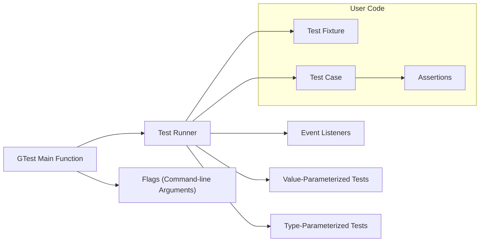

## Project Design Document: Google Test Framework

**Project Link:** [https://github.com/google/googletest](https://github.com/google/googletest)

**1. Introduction**

This document outlines the design of the Google Test framework, a popular C++ testing framework. This document serves as a foundation for subsequent threat modeling activities. It describes the key components, their interactions, and the overall architecture of the framework.

**2. Goals**

*   Provide a comprehensive overview of the Google Test framework's architecture.
*   Identify key components and their responsibilities.
*   Illustrate the interaction between different parts of the framework.
*   Establish a basis for identifying potential security vulnerabilities during threat modeling.

**3. Target Audience**

*   Security engineers performing threat modeling.
*   Developers contributing to or using the Google Test framework.
*   Architects designing systems that integrate with Google Test.

**4. System Overview**

Google Test is a library used by developers to write and run unit tests in C++. It provides a rich set of assertions, test organization features, and reporting capabilities. The framework is designed to be extensible and portable across different platforms.

**5. Key Components**

*   **Test Fixture:**
    *   Provides a common environment for running multiple tests.
    *   Includes `SetUp()` and `TearDown()` methods for initialization and cleanup.
*   **Test Case:**
    *   Represents an individual unit test.
    *   Contains one or more assertions to verify specific behavior.
    *   Defined using the `TEST()` macro.
*   **Assertions:**
    *   Macros used within test cases to check conditions.
    *   Examples include `ASSERT_TRUE`, `EXPECT_EQ`, `ASSERT_NE`.
    *   Assertions can be fatal (stopping the test) or non-fatal.
*   **Test Runner:**
    *   Executes the defined test cases.
    *   Manages the test execution lifecycle (setup, run, teardown).
    *   Provides options for filtering and running specific tests.
*   **Event Listeners:**
    *   Allow users to hook into the test execution process.
    *   Receive notifications about test start, end, and results.
    *   Enable custom reporting and logging.
*   **Value-Parameterized Tests:**
    *   Allows running the same test logic with different input values.
    *   Reduces code duplication for testing various scenarios.
*   **Type-Parameterized Tests:**
    *   Enables testing generic code with different types.
*   **Flags (Command-line Arguments):**
    *   Provide control over test execution behavior.
    *   Examples include filtering tests, specifying output format, and controlling verbosity.
*   **GTest Main Function:**
    *   The entry point for running tests.
    *   Initializes the Google Test framework and runs the discovered tests.

**6. Architectural Diagram**

**7. Component Interaction**

The typical workflow of Google Test involves the following interactions:

*   The user writes test cases within test fixtures, utilizing assertions to verify expected outcomes.
*   The `GTest Main Function` is invoked, which parses command-line flags.
*   The `Test Runner` discovers and manages the execution of test cases.
*   For each test case:
    *   The associated test fixture's `SetUp()` method is executed.
    *   The test case logic is executed.
    *   Assertions within the test case are evaluated.
    *   The test fixture's `TearDown()` method is executed.
*   `Event Listeners` are notified of various test execution events.
*   Results are reported based on the configured output format.
*   Parameterized tests (value and type) iterate through the provided parameters, running the test logic for each parameter set.

**8. Data Flow**

The primary data flow within Google Test involves:

*   **Test Code:** The source code of the test fixtures and test cases written by the user.
*   **Test Results:** The outcome of each assertion and test case (pass, fail, skipped).
*   **Configuration Data:**  Command-line flags and environment variables that influence test execution.
*   **Event Notifications:** Data passed to event listeners about test progress and results.

**9. External Interfaces**

*   **Command Line:**  Users interact with Google Test through command-line arguments to control test execution.
*   **Standard Output/Error:** Google Test outputs test results and error messages to the console.
*   **File System (Optional):**  Event listeners can write reports to files.
*   **Operating System:** Google Test relies on OS functionalities for process execution and resource management.

**10. Security Considerations (Initial Thoughts for Threat Modeling)**

This section provides initial thoughts on potential security considerations. A more detailed threat model will be developed based on this design document.

*   **Malicious Test Code:**  A compromised or malicious test case could potentially execute arbitrary code or consume excessive resources.
*   **Command-Line Injection:**  If the test runner or event listeners process command-line arguments without proper sanitization, it could lead to command injection vulnerabilities.
*   **Denial of Service:**  Crafted test cases or command-line flags could potentially cause the test runner to consume excessive resources, leading to a denial of service.
*   **Information Disclosure:**  Event listeners or reporting mechanisms might inadvertently expose sensitive information.
*   **Dependency Vulnerabilities:**  If Google Test relies on vulnerable external libraries, it could inherit those vulnerabilities.

**11. Future Considerations**

*   Further breakdown of the `Test Runner` component into sub-modules for more granular analysis.
*   Detailed examination of the implementation of event listeners and their potential security implications.
*   Analysis of the parsing and handling of command-line flags.

This document provides a foundational understanding of the Google Test framework's design. It will serve as a valuable input for conducting a thorough threat model to identify and mitigate potential security risks.
