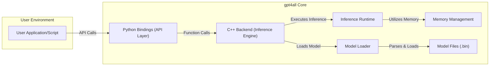

## Project Design Document: gpt4all (Improved)

**Project Link:** https://github.com/nomic-ai/gpt4all

**Document Version:** 1.1
**Date:** October 26, 2023
**Author:** AI Design Expert

### 1. Introduction

This document provides an enhanced and more detailed design overview of the gpt4all project, an open-source ecosystem to train and deploy powerful large language models. This revised document is specifically tailored to serve as a robust foundation for subsequent threat modeling activities. It elaborates on the key components, data flows, and interactions within the gpt4all system, providing a deeper understanding of potential attack surfaces.

### 2. Project Goals

*   Provide an accessible and open-source platform for training and running large language models on consumer hardware.
*   Enable efficient CPU-based inference for large language models.
*   Foster a collaborative community around open-source language model development, sharing, and deployment.
*   Offer a collection of pre-trained models and tools facilitating fine-tuning and experimentation by a broad range of users.

### 3. Scope

This design document focuses on the core components and functionalities of the gpt4all project that are directly relevant to threat modeling. It provides a comprehensive view of:

*   The detailed architecture of the system, including sub-components.
*   Specific responsibilities and internal workings of key components.
*   Detailed data flow diagrams, highlighting sensitive data and transformation points.
*   User interactions with the system, including different user roles (if applicable).
*   Deployment considerations and potential environmental vulnerabilities.

This document explicitly excludes:

*   In-depth mathematical details of the training algorithms or specific nuances of model architectures.
*   Micro-level implementation details within individual third-party libraries or operating system functionalities.
*   Precise performance metrics, benchmarking results, or low-level optimization techniques.

### 4. High-Level Architecture

The gpt4all ecosystem comprises the following interconnected components:



**Components:**

*   **User Application/Script:**  The user's code, typically written in Python, that leverages the gpt4all library to interact with and utilize language models. This could range from simple scripts to more complex applications.
*   **Python Bindings (API Layer):** This component provides a Pythonic interface to the underlying C++ backend. It acts as an abstraction layer, simplifying interaction for Python developers.
*   **C++ Backend (Inference Engine):** The core of gpt4all, responsible for the heavy lifting of model loading, inference execution, and resource management.
*   **Model Loader:** A sub-component within the C++ backend responsible for reading, parsing, and loading the model weights and configurations from the `.bin` files into memory.
*   **Inference Runtime:** The part of the C++ backend that performs the actual computations required to generate text or process input based on the loaded model.
*   **Memory Management:**  A crucial sub-component within the C++ backend that handles the allocation and deallocation of memory for model weights, intermediate calculations, and input/output data.
*   **Model Files (.bin):**  Binary files containing the pre-trained or fine-tuned weights and potentially the architecture definition of the language model.

### 5. Component Details

#### 5.1. User Application/Script

*   **Purpose:** To utilize the gpt4all library for various natural language processing tasks.
*   **Functionality:**
    *   Imports the `gpt4all` Python library.
    *   Specifies the path to a model file for loading.
    *   Provides input prompts (strings) to the loaded model.
    *   Receives and processes the generated output (strings) from the model.
    *   May configure inference parameters (e.g., temperature, top-p).
*   **Technology:** Primarily Python.
*   **Security Considerations:**
    *   Susceptible to supply chain attacks if malicious Python packages are installed.
    *   User-provided input prompts are a direct attack vector if the model or application is vulnerable to prompt injection.
    *   Improper handling of model output could lead to information disclosure or other security issues.

#### 5.2. Python Bindings (API Layer)

*   **Purpose:** To expose the functionality of the C++ backend to Python users in a convenient and idiomatic way.
*   **Functionality:**
    *   Uses libraries like `pybind11` or similar to create a bridge between Python and C++.
    *   Marshals data (input prompts, output text, parameters) between Python objects and C++ data structures.
    *   Handles error propagation between the two languages.
*   **Technology:** Python, C++, `pybind11` (or similar).
*   **Security Considerations:**
    *   Vulnerabilities in the binding code itself could allow attackers to bypass Python safeguards and directly interact with the C++ backend in unintended ways.
    *   Incorrect data marshalling could lead to buffer overflows or other memory corruption issues in the C++ layer.

#### 5.3. C++ Backend (Inference Engine)

*   **Purpose:** To efficiently load and execute language models on CPU hardware.
*   **Functionality:**
    *   Orchestrates the model loading process using the `Model Loader`.
    *   Manages the model's state and weights in memory.
    *   Implements the core inference logic, performing the necessary mathematical operations.
    *   Utilizes the `Memory Management` component for memory allocation and deallocation.
*   **Technology:** C++.
*   **Security Considerations:**
    *   Memory safety vulnerabilities (e.g., buffer overflows, use-after-free) are a significant concern due to manual memory management in C++.
    *   Bugs in the inference logic could lead to unexpected behavior or even exploitable conditions.
    *   Dependencies on other C++ libraries could introduce vulnerabilities.

#### 5.4. Model Loader

*   **Purpose:** To securely and correctly load model data from the `.bin` files.
*   **Functionality:**
    *   Reads the `.bin` file from the specified path.
    *   Parses the file format to extract model weights, biases, and architecture information.
    *   Performs validation checks on the model file format and content.
    *   Loads the model data into memory managed by the `Memory Management` component.
*   **Technology:** C++.
*   **Security Considerations:**
    *   Vulnerabilities in the parsing logic could allow malicious model files to trigger buffer overflows or other memory corruption issues.
    *   Lack of proper validation could allow loading of corrupted or malicious model files.
    *   The process of reading the file from disk could be vulnerable to path traversal attacks if not handled carefully.

#### 5.5. Inference Runtime

*   **Purpose:** To execute the forward pass of the neural network, generating output based on the input prompt and loaded model.
*   **Functionality:**
    *   Takes the input prompt and processes it according to the model's architecture.
    *   Performs matrix multiplications, activation function calculations, and other necessary operations.
    *   Generates the output sequence of tokens.
*   **Technology:** C++.
*   **Security Considerations:**
    *   Bugs in the implementation of the neural network operations could lead to incorrect or unpredictable behavior.
    *   Numerical instability or edge cases in the calculations could potentially be exploited.

#### 5.6. Memory Management

*   **Purpose:** To efficiently and safely manage the memory used by the gpt4all C++ backend.
*   **Functionality:**
    *   Allocates memory for model weights, intermediate calculations, and input/output data.
    *   Deallocates memory when it is no longer needed.
    *   May involve custom memory allocators or wrappers around standard allocation functions.
*   **Technology:** C++.
*   **Security Considerations:**
    *   Memory leaks can lead to resource exhaustion and denial of service.
    *   Buffer overflows and use-after-free vulnerabilities are common in manual memory management and can be exploited for arbitrary code execution.

#### 5.7. Model Files (.bin)

*   **Purpose:** To persistently store the trained parameters of the language model.
*   **Functionality:**
    *   Contains numerical representations of the model's weights and biases.
    *   May include metadata about the model architecture and training process.
*   **Technology:** Custom binary format.
*   **Security Considerations:**
    *   Model files are a prime target for tampering. A compromised model file could lead to the model generating biased, incorrect, or even harmful output.
    *   Lack of integrity checks (e.g., digital signatures) makes it difficult to verify the authenticity of model files.
    *   The format itself could have vulnerabilities if not designed carefully.

### 6. Data Flow (Detailed)

The following diagram illustrates a more granular view of the data flow during a typical inference operation:

```mermaid
graph LR
    A["User Application/Script"] --> B["Python Bindings"]: "Input Prompt (String)"
    B --> C["C++ Backend"]: "Marshalled Input Prompt"
    C --> D["Model Loader"]: "Request to Load Model"
    D --> G["Model Files"]: "Read Model Data"
    G --> D: "Model Weights & Config"
    D --> F["Memory Management"]: "Allocate Memory for Model"
    F --> C: "Memory Allocation Success"
    D --> C: "Loaded Model Data Pointer"
    C --> E["Inference Runtime"]: "Input Prompt, Model Data"
    E --> F: "Allocate Memory for Intermediate Results"
    E --> E: "Perform Inference Computations"
    F --> E: "Memory Access"
    E --> C: "Generated Output (String)"
    C --> B: "Marshalled Output Text"
    B --> A: "Output Text (String)"
```

**Data Elements:**

*   **Input Prompt (String):** The textual input provided by the user.
*   **Marshalled Input Prompt:** The input prompt converted into a format suitable for the C++ backend.
*   **Request to Load Model:** A signal to the Model Loader to initiate the loading process.
*   **Read Model Data:** The raw bytes read from the model file.
*   **Model Weights & Config:** The parsed model parameters and architecture information.
*   **Allocate Memory for Model:** A request to the Memory Management component.
*   **Memory Allocation Success:** Confirmation that memory has been allocated.
*   **Loaded Model Data Pointer:** A pointer to the memory location of the loaded model.
*   **Generated Output (String):** The textual output produced by the model.
*   **Marshalled Output Text:** The output text converted back into a Python string.

### 7. User Interactions

Users interact with gpt4all primarily through the Python API. Key interactions include:

*   **Model Loading:**
    *   Providing the file path to a `.bin` model file.
    *   Potentially specifying model-specific configurations.
*   **Text Generation (Inference):**
    *   Providing a text prompt as input.
    *   Setting inference parameters such as:
        *   `temperature`: Controls the randomness of the output.
        *   `top_p`: Nucleus sampling parameter.
        *   `top_k`: Limits the number of considered tokens.
        *   `max_tokens`: Maximum length of the generated output.
*   **Model Information Retrieval:**
    *   Querying the loaded model for metadata or statistics.

### 8. Deployment Model

gpt4all is designed for local execution on user machines. The typical deployment involves:

*   **Installation:**
    *   Installing the `gpt4all` Python package using `pip`.
    *   No separate server or daemon processes are typically required.
*   **Model Acquisition:**
    *   Downloading pre-trained `.bin` model files from trusted sources.
    *   Potentially training or fine-tuning models independently.
*   **Execution:**
    *   Running Python scripts that import the `gpt4all` library and interact with the loaded models.

**Supported Platforms:**

*   Windows
*   macOS
*   Linux

### 9. Security Considerations (Detailed)

Expanding on the initial thoughts, here are more detailed security considerations:

*   **Model File Vulnerabilities:**
    *   **Malicious Model Injection:** Attackers could distribute tampered model files containing malicious code that gets executed during the loading process.
    *   **Backdoor Insertion:** Models could be subtly modified to introduce backdoors that allow for specific outputs given certain inputs.
    *   **Data Poisoning:** If users train their own models, their training data could be poisoned, leading to biased or harmful model behavior.
    *   **Lack of Integrity Verification:** The absence of digital signatures or checksums makes it difficult to verify the authenticity and integrity of downloaded model files.
*   **Input Prompt Injection:**
    *   Maliciously crafted input prompts could manipulate the model into performing unintended actions or revealing sensitive information.
    *   This is particularly relevant if the model's output is used in further processing or displayed to other users.
*   **Memory Management Issues:**
    *   **Buffer Overflows:**  Exploitable vulnerabilities could arise in the C++ backend if input prompts or model data exceed allocated buffer sizes.
    *   **Use-After-Free:**  Improper handling of memory deallocation could lead to dangling pointers and potential code execution.
    *   **Memory Leaks:** While not directly exploitable for code execution, memory leaks can lead to denial of service by exhausting system resources.
*   **Supply Chain Attacks:**
    *   Compromised dependencies in the Python package (e.g., `pybind11`) could introduce vulnerabilities.
    *   Malicious actors could upload poisoned `gpt4all` packages to public repositories.
*   **Local Access Control:**
    *   Since gpt4all runs locally, the security of the host machine is paramount. An attacker with access to the machine could tamper with model files, intercept communication, or modify the gpt4all installation.
*   **Information Disclosure:**
    *   Model output might inadvertently reveal sensitive information if the model was trained on such data or if the prompts are crafted to elicit such information.
*   **Side-Channel Attacks:**
    *   Although less likely in a CPU-based inference scenario, potential side-channel attacks (e.g., timing attacks) could theoretically leak information about the model or input data.

### 10. Future Considerations (Out of Scope for this Document)

*   Exploration of hardware acceleration (GPU support).
*   Development of a centralized model repository with trust and verification mechanisms.
*   Integration with secure enclaves or trusted execution environments.
*   Formal security audits and penetration testing of the codebase.

This improved design document provides a more detailed and nuanced understanding of the gpt4all project, specifically tailored for effective threat modeling. The added granularity in component descriptions, data flow, and security considerations should enable a more comprehensive identification and mitigation of potential risks.
