# Project Design Document: gRPC (Improved)

**1. Introduction**

This document provides an enhanced architectural overview of the gRPC framework, focusing on aspects relevant to security analysis and threat modeling. It details the key components, their interactions, and the underlying technologies, providing a solid foundation for identifying potential security vulnerabilities within the gRPC ecosystem. This document is intended to be a living document, updated as the gRPC project evolves.

**2. Goals and Objectives**

*   Provide a clear, concise, and technically accurate description of the gRPC architecture, emphasizing security-relevant aspects.
*   Identify and describe the major components of gRPC, detailing their responsibilities and potential security implications.
*   Illustrate the data flow within various gRPC interaction patterns, highlighting points of potential vulnerability.
*   Elaborate on key security considerations inherent in the gRPC design and its common usage patterns.
*   Serve as a primary reference point for subsequent threat modeling exercises, enabling a systematic approach to security analysis.

**3. High-Level Architecture**

gRPC facilitates communication between client and server applications across various environments. It leverages Protocol Buffers for message serialization and HTTP/2 as its transport protocol. The architecture is designed for high performance and efficiency.

```mermaid
graph LR
    subgraph "Client Application Environment"
        A["Client Application Logic"]
    end
    subgraph "gRPC Client Stack"
        B["Client Stub (Generated)"]
        C["Client Interceptor(s)"]
        D["gRPC Channel"]
        E["Message Serializer (Protocol Buffers)"]
    end
    subgraph "Network Layer"
        F["HTTP/2 Transport"]
    end
    subgraph "gRPC Server Stack"
        G["Message Deserializer (Protocol Buffers)"]
        H["Server Interceptor(s)"]
        I["gRPC Server"]
        J["Service Implementation Logic"]
    end
    subgraph "Server Application Environment"
        K["Business Logic"]
    end

    A --> B
    B --> C
    C --> D
    D --> E
    E --> F
    F --> G
    G --> H
    H --> I
    I --> J
    J --> K
    style A fill:#ccf,stroke:#333,stroke-width:2px
    style K fill:#ccf,stroke:#333,stroke-width:2px
    style F fill:#f9f,stroke:#333,stroke-width:2px
```



**4. Detailed Component Description**

This section provides a more in-depth look at the key components, highlighting their roles and security considerations.

*   **Client Side:**
    *   **Client Application Logic:** The user-written code that initiates gRPC calls. Potential vulnerabilities here include improper handling of sensitive data before sending or after receiving.
    *   **Client Stub (Generated):** Code generated from Protocol Buffer definitions. Security considerations include ensuring the generation process is secure and that the generated code doesn't introduce vulnerabilities.
    *   **Client Interceptor(s):** Middleware for tasks like authentication, logging, and metrics. Security implications involve ensuring interceptors are correctly implemented and don't introduce vulnerabilities (e.g., leaking credentials).
    *   **gRPC Channel:** Manages the connection to the server, including connection pooling and security negotiation (TLS). Security is paramount here, ensuring proper TLS configuration and certificate validation.
    *   **Message Serializer (Protocol Buffers):** Responsible for converting data into a byte stream. Potential vulnerabilities include serialization/deserialization flaws that could lead to code execution or information disclosure.

*   **Network Layer:**
    *   **HTTP/2 Transport:** Provides the underlying communication protocol. Security relies on the correct implementation and configuration of HTTP/2, including protection against known HTTP/2 vulnerabilities.

*   **Server Side:**
    *   **Message Deserializer (Protocol Buffers):** Converts the received byte stream back into data structures. Similar security concerns as the client-side serializer.
    *   **Server Interceptor(s):** Middleware for authentication, authorization, logging, etc. Crucial for enforcing security policies on the server side. Vulnerabilities here can lead to unauthorized access or data breaches.
    *   **gRPC Server:** Listens for incoming requests and manages the lifecycle of gRPC calls. Security involves proper configuration to prevent unauthorized access and resource exhaustion.
    *   **Service Implementation Logic:** The code that implements the business logic of the gRPC service. This is where most application-specific vulnerabilities reside, such as injection flaws or business logic errors.
    *   **Business Logic:** The core functionality of the server application. Security here depends on secure coding practices and proper handling of sensitive data.

**5. Data Flow (Detailed)**

This section elaborates on the data flow for different gRPC interaction patterns.

*   **Unary RPC:** A single request and a single response.
    ```mermaid
    sequenceDiagram
        participant "Client App" as CA
        participant "Client Stub" as CS
        participant "Client Interceptors" as CI
        participant "gRPC Channel" as GC
        participant "HTTP/2" as H2
        participant "gRPC Server" as GS
        participant "Server Interceptors" as SI
        participant "Service Impl" as SIM

        CA->>CS: Call Method (Request)
        CS->>CI: Interceptor Processing (Client)
        CI->>GC: Serialize Request
        GC->>H2: Send Request
        H2->>GS: Receive Request
        GS->>SI: Interceptor Processing (Server)
        SI->>SIM: Deserialize Request
        SIM->>SIM: Execute Business Logic
        SIM->>SI: Serialize Response
        SI->>GS: Send Response
        GS->>H2: Send Response
        H2->>GC: Receive Response
        GC->>CI: Interceptor Processing (Client Response)
        CI->>CS: Deserialize Response
        CS->>CA: Return Response
    ```
*   **Server Streaming RPC:** A single request followed by a stream of responses. Threats include potential for resource exhaustion if the server streams indefinitely or sends excessive data.
*   **Client Streaming RPC:** A stream of requests followed by a single response. Security considerations involve validating each incoming request in the stream and handling potential denial-of-service attacks from malicious client streams.
*   **Bidirectional Streaming RPC:** A stream of requests and responses flowing in both directions. This introduces complexities in managing state and potential race conditions, requiring careful security considerations for both client and server streams.

**6. Key Architectural Characteristics (Security Focused)**

*   **Protocol Buffers Security:** While efficient, vulnerabilities can arise from improper handling of Protobuf messages, including deserialization bombs or type confusion issues. Secure coding practices and up-to-date Protobuf libraries are crucial.
*   **HTTP/2 Security:**  Leveraging HTTP/2 brings its own set of security considerations, such as protection against HPACK bombing and other HTTP/2 specific attacks. TLS is essential for securing HTTP/2 connections.
*   **Code Generation Security:** The process of generating client and server stubs needs to be secure. Maliciously crafted `.proto` files could potentially lead to vulnerabilities in the generated code.
*   **Interceptor-Based Security:** Interceptors are a powerful mechanism for implementing security features, but vulnerabilities in interceptor logic can bypass security controls. Proper testing and auditing of interceptors are necessary.
*   **Metadata Security:** gRPC allows sending metadata with requests and responses. This metadata can contain sensitive information and needs to be protected from tampering and eavesdropping.

**7. Deployment Considerations (Security Implications)**

The deployment environment significantly impacts the security posture of gRPC applications.

*   **Standalone Servers:** Requires careful configuration of the operating system and network to secure the gRPC endpoint. Firewall rules and intrusion detection systems are important.
*   **Containerized Environments (Docker, Kubernetes):** Security considerations include securing the container images, managing container network policies, and implementing proper resource limits. Kubernetes security features like Network Policies and RBAC are crucial.
*   **Service Mesh (Istio, Linkerd):** Service meshes can enhance security by providing features like mutual TLS (mTLS), authentication, and authorization. However, misconfiguration of the service mesh can introduce new vulnerabilities.
*   **Cloud Platforms (AWS, GCP, Azure):** Leveraging cloud-managed services can simplify security management, but it's essential to understand the shared responsibility model and properly configure cloud security features.

**8. Security Considerations (Expanded)**

This section expands on the initial security overview, providing more specific details.

*   **Transport Layer Security (TLS):** Mandatory for production environments. Proper certificate management, secure key storage, and using strong cipher suites are essential. Mutual TLS (mTLS) provides stronger authentication by verifying both client and server identities.
*   **Authentication Mechanisms:**
    *   **TLS Client Certificates:** Provides strong client authentication but requires a robust certificate management infrastructure.
    *   **API Keys:** Simpler to implement but require secure storage and transmission. Susceptible to leakage if not handled properly.
    *   **OAuth 2.0 and OpenID Connect:** Industry-standard protocols for authorization and authentication. Requires careful implementation and integration with identity providers.
    *   **Token-Based Authentication (JWT):** Stateless authentication using signed tokens. Requires secure key management and validation.
    *   **Custom Authentication:** Offers flexibility but requires careful design and implementation to avoid security flaws.
*   **Authorization and Access Control:** Implementing fine-grained authorization based on user roles or permissions is crucial. This can be done using interceptors or within the service implementation logic.
*   **Input Validation and Sanitization:** Rigorous validation of all incoming data is essential to prevent injection attacks (e.g., SQL injection, command injection). Sanitization can help mitigate cross-site scripting (XSS) risks if gRPC is used in a web context (though less common).
*   **Denial of Service (DoS) and Distributed Denial of Service (DDoS) Mitigation:** Implementing rate limiting, request size limits, and connection limits can help protect against resource exhaustion attacks. Consider using load balancers with DDoS protection capabilities.
*   **Dependency Management and Supply Chain Security:** Regularly audit and update dependencies to patch known vulnerabilities. Use tools to scan for vulnerabilities in third-party libraries.
*   **Logging and Auditing:** Comprehensive logging of requests, responses, and security-related events is crucial for monitoring and incident response. Ensure logs are securely stored and access is controlled.
*   **Error Handling:** Avoid leaking sensitive information in error messages. Provide generic error responses to clients while logging detailed error information securely on the server.
*   **Rate Limiting and Throttling:** Implement mechanisms to limit the number of requests from a single client or source to prevent abuse and resource exhaustion.

**9. Technologies Used**

*   **Protocol Buffers (protobuf):**  Interface Definition Language and efficient serialization library.
*   **HTTP/2:**  The underlying network transport protocol providing features like multiplexing and header compression.
*   **Various Programming Languages:**  gRPC supports a wide range of languages, each with its own specific gRPC library implementation (e.g., grpc-java, grpc-go, grpc-python).
*   **gRPC Core:** The core C-based implementation of gRPC that language-specific libraries often wrap.
*   **Build Tools:**  `protoc` (the Protocol Buffer compiler), language-specific build systems (e.g., Maven, Gradle, Go modules).
*   **Security Libraries:**  OpenSSL/BoringSSL (for TLS), language-specific cryptography libraries.

**10. Future Considerations (Security)**

*   Exploration of advanced authentication and authorization patterns in gRPC.
*   Analysis of security implications of different gRPC streaming modes.
*   Detailed threat modeling of specific gRPC services and deployments.
*   Investigation of security best practices for managing gRPC metadata.
*   Continuous monitoring of emerging security threats and vulnerabilities related to gRPC and its dependencies.

This improved design document provides a more detailed and security-focused overview of the gRPC architecture, serving as a valuable resource for threat modeling and security analysis. The expanded sections on components, data flow, and security considerations offer a deeper understanding of potential vulnerabilities and mitigation strategies.
