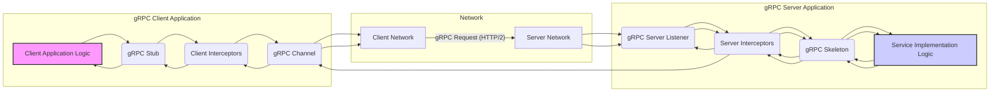

# Project Design Document: gRPC

**Version:** 1.1
**Date:** October 26, 2023
**Author:** AI Software Architect

## 1. Introduction

This document provides an enhanced and more detailed design overview of the gRPC project, as represented by the codebase at [https://github.com/grpc/grpc](https://github.com/grpc/grpc). Building upon the previous version, this document further elaborates on the key architectural components, data flows, and security considerations critical for comprehensive threat modeling. gRPC is a high-performance, open-source universal RPC framework designed to efficiently connect services, particularly in microservices architectures. Its foundation lies in Protocol Buffers for defining service contracts and typically utilizes HTTP/2 for its transport layer, enabling features like multiplexing and header compression.

## 2. Goals and Objectives

The primary goals of gRPC are to:

*   **Enable efficient and reliable communication between services:**  Facilitating low-latency and high-throughput interactions.
*   **Provide a strongly-typed contract between client and server through Protocol Buffers:** Ensuring interface consistency and simplifying code generation. This contract defines the structure of data exchanged and the available remote procedures.
*   **Support polyglot environments:** Enabling interoperability between services written in different programming languages.
*   **Offer built-in mechanisms for security, monitoring, and health checking:** Simplifying the implementation of these cross-cutting concerns.
*   **Achieve optimal performance by leveraging HTTP/2 features:** Including connection multiplexing, header compression, and bidirectional streaming.

## 3. Architectural Overview

gRPC employs a client-server model where clients invoke remote methods on servers as if they were local functions. The gRPC framework handles the underlying complexities of network communication, data serialization, and deserialization, abstracting these details from the application logic.

### 3.1. Key Components

*   **gRPC Client:** The entity that initiates remote procedure calls. It utilizes a generated *stub* to interact with the remote server. The client manages connections, handles retries, and can implement client-side interceptors.
*   **gRPC Server:** The entity that exposes services and listens for incoming requests from gRPC clients. It implements the service interface defined in the `.proto` file and utilizes a *skeleton* to dispatch calls to the service implementation.
*   **Protocol Buffers (protobuf):** The core Interface Definition Language (IDL) used by gRPC. `.proto` files define the structure of service methods (including request and response types) and the format of data messages. This ensures a clear and language-agnostic contract.
*   **gRPC Stub/Skeleton:** Code generated from the `.proto` definition, facilitating seamless interaction between client and server.
    *   **Stub (Client-side):** Provides a concrete, client-facing interface mirroring the server's methods. It handles the serialization of request messages and the unmarshalling of response messages.
    *   **Skeleton (Server-side):** An abstract class or interface that the server-side service implementation must extend or implement. It manages the deserialization of incoming requests and dispatches them to the appropriate service method.
*   **gRPC Channel:** An abstraction representing a persistent connection to a gRPC server. It manages the underlying transport (typically HTTP/2), connection pooling, and can incorporate features like load balancing and security credentials.
*   **Interceptors:** Middleware components that can intercept and augment gRPC calls at various stages. They provide a mechanism for implementing cross-cutting concerns without modifying the core service logic.
    *   **Client Interceptors:** Executed on the client-side *before* a request is sent and *after* a response is received. They can be used for logging, authentication token injection, metrics collection, etc.
    *   **Server Interceptors:** Executed on the server-side *before* a request is processed and *after* a response is generated. They can handle authentication, authorization, logging, error handling, etc.
*   **Transport Layer (Primarily HTTP/2):** gRPC's default transport protocol, offering significant performance advantages through features like:
    *   **Multiplexing:** Allowing multiple requests and responses to be sent over a single TCP connection.
    *   **Header Compression (HPACK):** Reducing overhead by compressing HTTP headers.
    *   **Bidirectional Streaming:** Enabling both the client and server to send a stream of messages.
    *   **Server Push:** Although less commonly used in typical gRPC scenarios.
*   **Name Resolution:** The process by which a gRPC client locates the network address(es) of the target gRPC server. This can involve:
    *   **DNS Lookups:** Standard DNS resolution.
    *   **Service Discovery Systems:**  Integration with tools like Consul, etcd, or Kubernetes DNS.
    *   **Static Configuration:**  Hardcoded server addresses.
*   **Load Balancing:** Techniques to distribute client requests across multiple instances of a gRPC server to improve performance, availability, and fault tolerance. Common strategies include:
    *   **Client-side Load Balancing:** The client selects a server instance.
    *   **Lookaside Load Balancing:** A separate load balancer service is consulted.
    *   **Proxy-based Load Balancing:** A proxy (like Envoy or Nginx) distributes requests.

### 3.2. Component Interactions

**Detailed Interaction Flow:**

1. The **"Client Application Logic"** initiates a remote procedure call by invoking a method on the **"gRPC Stub"**.
2. The **"gRPC Stub"** marshals (serializes) the request message into a binary format using Protocol Buffers.
3. **"Client Interceptors"** intercept the outgoing request, potentially performing actions like adding authentication headers, logging the request, or collecting metrics.
4. The request is passed to the **"gRPC Channel"**, which manages the connection to the server.
5. The **"gRPC Channel"** sends the serialized request over the **"Client Network"** using HTTP/2. This involves establishing a TCP connection (if one doesn't exist) and sending the request within an HTTP/2 data frame.
6. The request traverses the **"Server Network"**.
7. The **"gRPC Server Listener"** receives the incoming request on the server.
8. **"Server Interceptors"** intercept the incoming request, potentially performing actions like authentication, authorization, logging, or request validation.
9. The request is passed to the **"gRPC Skeleton"**.
10. The **"gRPC Skeleton"** unmarshals (deserializes) the binary request message back into an object.
11. The **"gRPC Skeleton"** dispatches the call to the appropriate method in the **"Service Implementation Logic"**.
12. The **"Service Implementation Logic"** processes the request and generates a response message.
13. The response message is passed back to the **"gRPC Skeleton"**.
14. The **"gRPC Skeleton"** marshals (serializes) the response message.
15. **"Server Interceptors"** intercept the outgoing response, potentially performing actions like logging or adding response headers.
16. The response is sent back through the **"gRPC Server Listener"** and over the network.
17. The response traverses the **"Server Network"** and **"Client Network"**.
18. The **"gRPC Channel"** on the client-side receives the response.
19. **"Client Interceptors"** intercept the incoming response, potentially performing actions like logging or metrics collection.
20. The **"gRPC Stub"** unmarshals (deserializes) the binary response message.
21. The **"gRPC Stub"** returns the response to the **"Client Application Logic"**.

## 4. Data Flow

The fundamental data flow in gRPC revolves around the exchange of structured messages defined by Protocol Buffers. gRPC supports different types of calls which influence the data flow:

*   **Unary RPC:** A single request is sent by the client, and a single response is returned by the server. This is the most basic form of gRPC call.
*   **Server Streaming RPC:** The client sends a single request, and the server responds with a stream of messages.
*   **Client Streaming RPC:** The client sends a stream of messages to the server, and the server responds with a single message.
*   **Bidirectional Streaming RPC:** Both the client and the server can send a stream of messages to each other.

**General Data Flow:**

*   **Request Flow:**
    *   The client application constructs a request message object based on the `.proto` definition.
    *   The client stub serializes this message into a binary format using the Protocol Buffers library.
    *   The serialized binary data is encapsulated within an HTTP/2 data frame and sent over the network.
    *   The server receives the HTTP/2 data frame containing the binary data.
    *   The server skeleton deserializes the binary data back into a request message object.
    *   The deserialized request message object is passed to the appropriate method in the service implementation.
*   **Response Flow:**
    *   The service implementation processes the request and creates a response message object.
    *   The server skeleton serializes the response message into a binary format.
    *   The serialized binary data is encapsulated within an HTTP/2 data frame and sent back over the network.
    *   The client receives the HTTP/2 data frame containing the binary data.
    *   The client stub deserializes the binary data back into a response message object.
    *   The deserialized response message object is returned to the client application.

## 5. Security Considerations

Security is a paramount concern in gRPC. Here are key security considerations:

*   **Transport Layer Security (TLS):**  Essential for encrypting communication and ensuring data confidentiality and integrity in transit. gRPC strongly recommends and often defaults to using TLS, involving the standard TLS handshake for secure connection establishment.
    *   **Threat:** Man-in-the-middle attacks, eavesdropping.
    *   **Mitigation:** Enforce TLS usage, proper certificate management, and potentially mutual TLS (mTLS) for stronger authentication.
*   **Authentication:** Verifying the identity of the client making the request. gRPC supports various mechanisms:
    *   **SSL/TLS Certificates (Mutual TLS):** Clients present certificates to the server for authentication.
        *   **Threat:** Unauthorized access if client certificates are compromised.
        *   **Mitigation:** Secure storage and management of client certificates, certificate revocation mechanisms.
    *   **Token-Based Authentication (e.g., OAuth 2.0, JWT):** Clients provide access tokens in request metadata.
        *   **Threat:** Token theft, replay attacks, token forgery.
        *   **Mitigation:** Secure token issuance and storage, token validation on the server, short-lived tokens, proper handling of refresh tokens.
    *   **API Keys:** Simple keys passed in request metadata.
        *   **Threat:** Key leakage, unauthorized access if keys are compromised.
        *   **Mitigation:** Secure key management, key rotation, limiting the scope of API keys.
    *   **Custom Authentication:** Interceptors can implement custom authentication logic.
        *   **Threat:** Vulnerabilities in custom implementation.
        *   **Mitigation:** Thorough security review and testing of custom authentication logic.
*   **Authorization:** Determining what resources or methods an authenticated client is permitted to access. Typically implemented within the service implementation or through server interceptors.
    *   **Threat:** Privilege escalation, unauthorized access to sensitive data or operations.
    *   **Mitigation:** Implement robust role-based access control (RBAC) or attribute-based access control (ABAC), regularly review and update authorization policies.
*   **Input Validation:** Crucial on both the client and server sides to prevent injection attacks and ensure data integrity. Validate the structure and content of protobuf messages.
    *   **Threat:** Injection attacks (e.g., SQL injection if data is used in database queries, command injection if used in system commands), buffer overflows.
    *   **Mitigation:** Implement strict input validation rules based on the `.proto` definitions, sanitize input data, use parameterized queries.
*   **Denial of Service (DoS) Protection:** Measures to prevent attackers from overwhelming the server with requests.
    *   **Threat:** Service unavailability, resource exhaustion.
    *   **Mitigation:** Implement rate limiting, request size limits, connection limits, timeouts, and potentially employ techniques like SYN cookies.
*   **Logging and Auditing:**  Essential for security monitoring, incident response, and compliance. Log authentication attempts, authorization decisions, and significant events.
    *   **Threat:** Difficulty in detecting and responding to security incidents, lack of accountability.
    *   **Mitigation:** Implement comprehensive logging, secure log storage, regular log analysis, and alerting mechanisms.
*   **Dependency Management:** Regularly review and update dependencies to patch known vulnerabilities in third-party libraries.
    *   **Threat:** Exploitation of known vulnerabilities in dependencies.
    *   **Mitigation:** Use dependency scanning tools, keep dependencies up-to-date, and follow security best practices for dependency management.
*   **Code Generation Security:** Ensure the generated stub and skeleton code does not introduce security vulnerabilities. Regularly update the gRPC and protobuf libraries.
    *   **Threat:** Potential vulnerabilities in generated code that could be exploited.
    *   **Mitigation:** Use the latest stable versions of gRPC and protobuf, follow secure coding practices.

## 6. Deployment Considerations

gRPC applications exhibit flexibility in deployment environments:

*   **Cloud Environments (e.g., AWS, Google Cloud Platform, Microsoft Azure):** Commonly deployed within containerized environments (e.g., Docker) and orchestrated using platforms like Kubernetes. Cloud providers offer managed services like load balancers (e.g., AWS Network Load Balancer with TLS termination, Google Cloud Load Balancing with gRPC support, Azure Load Balancer) that are gRPC-aware.
*   **On-Premise Data Centers:** Deployed on physical or virtual machines, requiring careful configuration of networking and load balancing infrastructure.
*   **Microservices Architectures:** gRPC is a natural fit for inter-service communication in microservices due to its efficiency, strong contracts, and built-in features. Service discovery mechanisms are crucial in these environments.
*   **Mobile and Web Applications:** gRPC-Web enables web browsers and mobile applications to communicate with gRPC services. This typically involves a proxy (like Envoy) to translate HTTP/1.1 or HTTP/2 requests to gRPC.

## 7. Technologies Used

*   **Protocol Buffers (protobuf):** For defining service contracts and message serialization.
*   **HTTP/2:** The primary transport protocol, offering performance benefits.
*   **TCP:** The underlying transport layer protocol for HTTP/2.
*   **Various Programming Languages:** gRPC supports a wide range of languages including C++, Java, Python, Go, C#, Node.js, Ruby, Objective-C, and PHP.
*   **Build Tools:** Language-specific build tools such as CMake (for C++), Maven (for Java), pip (for Python), and Go modules are used for building gRPC applications.
*   **Testing Frameworks:** Standard testing frameworks for each supported language are used to develop unit, integration, and end-to-end tests for gRPC services and clients.

## 8. Future Considerations

*   **Advancements in gRPC-Web:** Continued development and wider adoption to facilitate direct communication between web browsers and gRPC services.
*   **Seamless Service Mesh Integration:** Deeper integration with service mesh technologies like Istio, Linkerd, and Consul Connect to enhance security (e.g., mTLS), observability, and traffic management without requiring significant changes to application code.
*   **Performance Optimizations:** Ongoing efforts within the gRPC project to further improve performance, reduce resource consumption, and optimize for various network conditions.
*   **Enhanced Security Features:** Exploration and implementation of new security features, such as more granular authorization mechanisms, improved handling of security credentials, and advancements in secure communication patterns.

This enhanced design document provides a more comprehensive understanding of the gRPC project's architecture, data flow, and security considerations. This detailed information is crucial for conducting a thorough and effective threat model, enabling the identification of potential vulnerabilities and the development of appropriate mitigation strategies to ensure the security and resilience of gRPC-based systems.