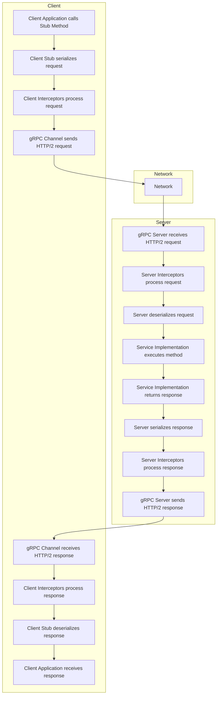
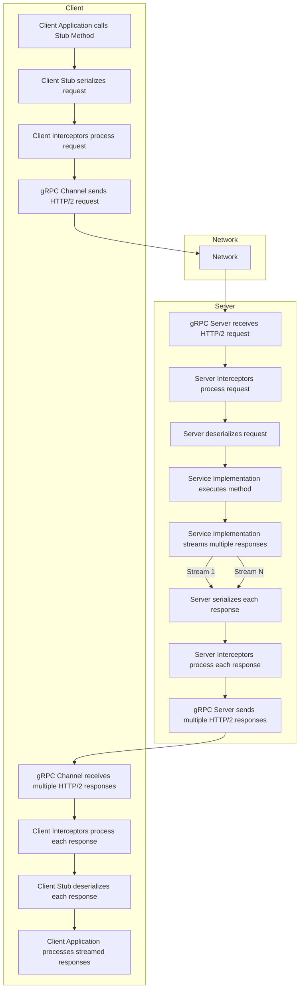
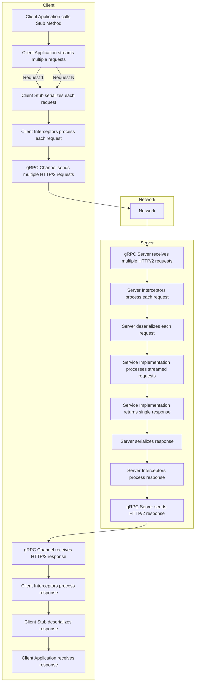

# Project Design Document: gRPC Framework

**Version:** 1.1
**Date:** October 26, 2023
**Author:** AI Software Architect

## 1. Introduction

This document provides an enhanced architectural design of the gRPC framework, an open-source remote procedure call (RPC) system. This revised document builds upon the previous version, offering more detail and clarity, particularly in areas relevant to threat modeling. It continues to serve as a foundation for subsequent security analysis and risk assessment.

## 2. Goals

The primary goals of this enhanced design document are:

*   Provide a more granular and detailed articulation of the gRPC framework's architecture and components.
*   Offer a clearer and more comprehensive description of the data flow within various gRPC communication patterns.
*   Sharpen the focus on key areas and components that are critical for security considerations and threat modeling.
*   Present a refined and more structured overview suitable for in-depth security analysis and risk assessment.

## 3. Architectural Overview

gRPC facilitates communication between client and server applications, enabling clients to invoke methods on remote servers as if they were local. It utilizes Protocol Buffers for interface definition and message serialization, and HTTP/2 as its underlying transport protocol, leveraging its features for efficient communication.

```mermaid
graph LR
    subgraph "Client Application"
        A["Client Application"]
    end
    subgraph "gRPC Client"
        B["Client Stub / Generated Code"]
        C["gRPC Channel"]
        D["Client Interceptors"]
        E["Message Serializer (ProtoBuf)"]
        F["HTTP/2 Client"]
    end
    subgraph "Network"
        G["Network"]
    end
    subgraph "gRPC Server"
        H["HTTP/2 Server"]
        I["Message Deserializer (ProtoBuf)"]
        J["Server Interceptors"]
        K["gRPC Server Core"]
    end
    subgraph "Server Application"
        L["Service Implementation"]
    end

    A -- "Method Call" --> B
    B -- "RPC Invocation" --> C
    C -- "Process Request" --> D
    D -- "Serialize Message" --> E
    E -- "HTTP/2 Request" --> F
    F -- "Network Communication" --> G
    G -- "Network Communication" --> H
    H -- "Receive Request" --> I
    I -- "Deserialize Message" --> J
    J -- "Process Request" --> K
    K -- "Dispatch to Service" --> L
    L -- "Return Response" --> K
    K -- "Process Response" --> J
    J -- "Serialize Message" --> I
    I -- "HTTP/2 Response" --> H
    H -- "Network Communication" --> G
    G -- "Network Communication" --> F
    F -- "Receive Response" --> E
    E -- "Deserialize Message" --> D
    D -- "Process Response" --> C
    C -- "Return Response" --> B
    B -- "Return Result" --> A
```

## 4. Key Components

This section provides a more detailed breakdown of the components involved in a gRPC interaction.

### 4.1. Client-Side Components

*   **Client Application:** The application initiating the remote procedure call.
*   **Client Stub / Generated Code:** Code generated from the Protocol Buffer service definition, providing a type-safe API for invoking server methods. This handles the underlying RPC mechanics.
*   **gRPC Channel:**  A higher-level abstraction over an HTTP/2 connection to the server. It manages connection establishment, pooling, and multiplexing of requests.
*   **Client Interceptors:**  Middleware components that can intercept and modify outgoing requests and incoming responses. These can be used for cross-cutting concerns like:
    *   **Unary Interceptors:**  Process individual request/response cycles.
    *   **Streaming Interceptors:** Process individual messages within a streaming RPC.
*   **Message Serializer (Protocol Buffers):** Responsible for converting client method arguments into the binary Protocol Buffer format for transmission.
*   **HTTP/2 Client:** The underlying HTTP/2 implementation within the gRPC client library, handling the details of the HTTP/2 protocol.

### 4.2. Server-Side Components

*   **HTTP/2 Server:** The HTTP/2 implementation within the gRPC server library, responsible for handling incoming HTTP/2 connections and requests.
*   **Message Deserializer (Protocol Buffers):** Responsible for converting the received binary Protocol Buffer data back into method arguments for the service implementation.
*   **Server Interceptors:** Middleware components that can intercept and modify incoming requests and outgoing responses on the server side. Similar to client interceptors, these can be:
    *   **Unary Interceptors:** Process individual request/response cycles.
    *   **Streaming Interceptors:** Process individual messages within a streaming RPC.
*   **gRPC Server Core:** The core logic of the gRPC server, responsible for:
    *   Receiving and dispatching requests to the appropriate service implementation.
    *   Managing server-side channels and connections.
    *   Handling error conditions and responses.
*   **Service Implementation:** The application code that implements the business logic for the methods defined in the Protocol Buffer service definition.

### 4.3. Core Infrastructure Components

*   **Protocol Buffers (protobuf):** The interface definition language and serialization format used by gRPC. It defines the structure of messages and services.
*   **HTTP/2:** The transport layer protocol providing features like multiplexing, header compression, and server push, enhancing performance and efficiency.
*   **Name Resolution:** The process by which the client determines the network address of the gRPC server. This can involve DNS, service discovery systems (e.g., Consul, etcd), or static configuration.
*   **Load Balancing:** Mechanisms for distributing client requests across multiple server instances to improve scalability and resilience. This can be implemented at various levels:
    *   **Client-side load balancing:** The client chooses which server to connect to.
    *   **Lookaside load balancing:** A separate load balancer service directs client requests.
    *   **Service mesh integration:** Load balancing handled by a service mesh infrastructure.

## 5. Data Flow

This section details the data flow for different types of RPC calls in gRPC.

### 5.1. Unary RPC

### 5.2. Server Streaming RPC

### 5.3. Client Streaming RPC

### 5.4. Bidirectional Streaming RPC

(Diagram omitted for brevity, but involves both client and server sending multiple streams of messages)

## 6. Security Considerations

This section provides a more structured and detailed overview of security considerations relevant to gRPC.

*   **Authentication:** Verifying the identity of the client and server.
    *   **TLS/SSL:**  Essential for transport security and can provide mutual authentication using client certificates. Proper certificate management is critical.
    *   **Token-Based Authentication (e.g., OAuth 2.0, JWT):** Clients provide a token that the server validates. Secure storage and transmission of tokens are important.
    *   **API Keys:** Simpler form of authentication, but less secure than other methods.
    *   **Custom Authentication via Interceptors:** Allows for implementing specific authentication schemes, but requires careful design and implementation to avoid vulnerabilities.
*   **Authorization:** Controlling access to resources and methods based on the authenticated identity.
    *   **Role-Based Access Control (RBAC):** Assigning roles to users and granting permissions based on those roles.
    *   **Attribute-Based Access Control (ABAC):**  Granting access based on attributes of the user, resource, and environment.
    *   **Policy Enforcement Points (PEPs):** Interceptors can act as PEPs to enforce authorization policies.
*   **Transport Security (TLS/SSL):** Protecting data in transit.
    *   **Enforce TLS:** Ensure all gRPC communication uses TLS.
    *   **Strong Cipher Suites:** Configure the server and client to use strong and up-to-date cipher suites.
    *   **Certificate Pinning:**  For mobile or desktop clients, pinning server certificates can prevent man-in-the-middle attacks.
*   **Data Integrity:** Ensuring that data is not tampered with during transmission.
    *   **Protocol Buffers:** Includes mechanisms for ensuring data integrity.
    *   **TLS/SSL:** Provides integrity checks for data in transit.
*   **Denial of Service (DoS) Prevention:** Protecting the server from being overwhelmed.
    *   **Rate Limiting:** Limiting the number of requests from a single client or source.
    *   **Request Size Limits:** Restricting the maximum size of incoming requests.
    *   **Connection Limits:** Limiting the number of concurrent connections.
    *   **Timeouts:** Setting appropriate timeouts for requests to prevent resources from being held indefinitely.
*   **Input Validation:**  Sanitizing and validating all data received from clients.
    *   **Server-Side Validation:**  Crucial to prevent injection attacks (e.g., SQL injection, command injection) and other vulnerabilities.
    *   **Schema Validation:**  Leveraging Protocol Buffer definitions for basic input validation.
*   **Interceptor Security:** Ensuring the security of custom interceptors.
    *   **Secure Coding Practices:**  Follow secure coding guidelines when developing interceptors.
    *   **Regular Security Audits:**  Review interceptor code for potential vulnerabilities.
*   **Dependency Management:** Keeping gRPC libraries and their dependencies up-to-date.
    *   **Vulnerability Scanning:** Regularly scan dependencies for known vulnerabilities.
    *   **Automated Updates:** Implement a process for updating dependencies promptly.
*   **Code Generation Security:**  Trusting the source of Protocol Buffer definitions and the code generation process.
*   **Metadata Security:**  Treating metadata with caution, as it can be a vector for attacks if not handled securely. Avoid including sensitive information in metadata.
*   **Error Handling:**  Implementing secure error handling to avoid leaking sensitive information in error messages. Provide generic error messages to clients while logging detailed errors securely on the server.

## 7. Conclusion

This enhanced design document provides a more detailed and structured understanding of the gRPC framework, crucial for comprehensive threat modeling. By elaborating on the components, data flows, and security considerations, this document aims to facilitate a more thorough security analysis and the development of robust mitigation strategies for systems utilizing gRPC. This document serves as a valuable and improved resource for security professionals involved in assessing and securing gRPC-based applications.