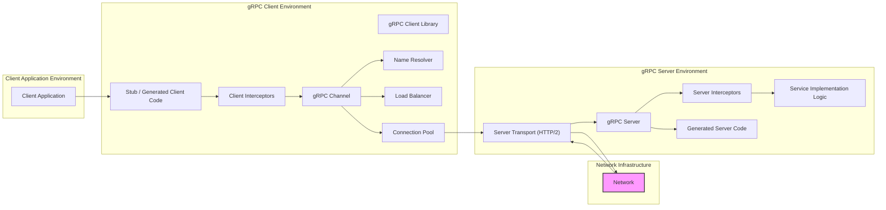
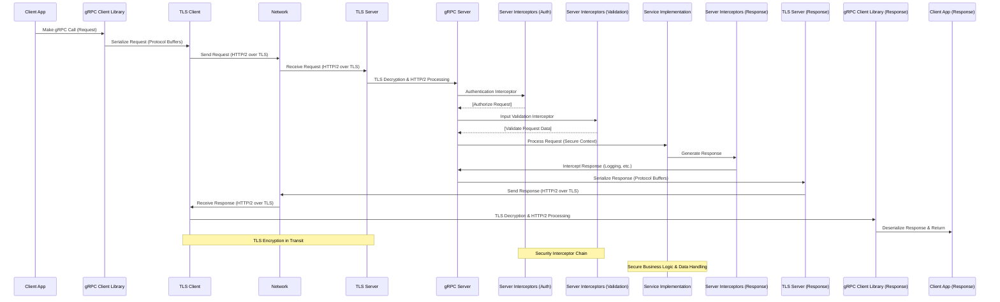

# Project Design Document: gRPC Framework for Threat Modeling (Improved)

**Project Name:** gRPC Framework

**Project Repository:** [https://github.com/grpc/grpc](https://github.com/grpc/grpc)

**Document Version:** 1.1
**Date:** 2023-10-27
**Author:** AI Expert

## 1. Introduction

This document provides an enhanced design overview of the gRPC framework, an open-source, high-performance Remote Procedure Call (RPC) framework, specifically tailored for threat modeling. It builds upon the initial design document to offer greater clarity, detail, and actionable insights for security analysis. This document serves as a comprehensive resource for security professionals and developers to understand the gRPC architecture, identify potential threat vectors, and implement appropriate security mitigations. It focuses on the architecture, components, data flow, and security considerations of gRPC to facilitate robust threat modeling activities.

## 2. Project Overview

gRPC is a modern, open-source, high-performance RPC framework designed for building distributed applications and microservices. It excels at connecting services within and across data centers, offering pluggable support for essential functionalities like load balancing, distributed tracing, health checking, and robust authentication. gRPC leverages Protocol Buffers as its Interface Definition Language (IDL) and for efficient message serialization. It utilizes HTTP/2 as the underlying transport protocol, benefiting from features such as connection multiplexing, header compression, and bidirectional streaming capabilities.

**Key Features:**

*   **Exceptional Performance:** Optimized for speed and efficiency, leveraging the performance benefits of HTTP/2 and the compact serialization of Protocol Buffers.
*   **Cross-Language Compatibility:** Supports a wide range of programming languages for both client and server implementations, fostering interoperability in polyglot environments.
*   **Strictly Defined Interfaces:** Employs Protocol Buffers to define service contracts, ensuring strong type safety, clear communication protocols, and facilitating contract-based development.
*   **Versatile Streaming Modes:** Supports unary (request-response), server streaming (server sends multiple responses), client streaming (client sends multiple requests), and bidirectional streaming RPCs, catering to diverse communication patterns.
*   **Extensible and Customizable:** Offers a pluggable architecture through interceptors for request/response processing, name resolvers for service discovery, and load balancers for distributing traffic.
*   **Integrated Security Features:** Includes built-in mechanisms for authentication (e.g., TLS, token-based), authorization (via interceptors), and secure communication channels.

## 3. Architecture Overview

The gRPC architecture is modular and layered, comprising distinct components that interact to enable efficient and reliable RPC communication. The following diagram illustrates the high-level architecture of gRPC:

**Components (Detailed):**

*   **Client Application:** The initiating application that makes requests to gRPC services. Responsible for user interaction and business logic on the client side.
*   **gRPC Client Library:** Provides the core API for client-side gRPC operations in various programming languages. Manages request serialization, transport, and response handling.
*   **Stub / Generated Client Code:** Language-specific client code automatically generated from Protocol Buffer service definitions (`.proto` files). Provides convenient, type-safe functions for invoking remote gRPC methods.
*   **Client Interceptors:** Middleware components that intercept and process client-side requests and responses. Used for cross-cutting concerns like authentication, logging, metrics collection, and request modification before transmission.
*   **gRPC Channel:** Represents a logical connection to a gRPC server. Manages underlying connections, connection pooling, name resolution, load balancing, and transport-level security (TLS).
*   **Name Resolver:** Responsible for resolving service names (logical addresses) into physical server addresses. Enables dynamic service discovery using mechanisms like DNS, service registries (e.g., Consul, Kubernetes DNS).
*   **Load Balancer:** Distributes client requests across multiple server instances to enhance performance, availability, and fault tolerance. Employs various load balancing algorithms (e.g., round-robin, least connection, consistent hashing).
*   **Connection Pool:** Manages a pool of persistent connections to the server, optimizing connection reuse and reducing connection establishment overhead.
*   **Network:** The underlying network infrastructure (LAN, WAN, Internet) facilitating communication between gRPC clients and servers.
*   **gRPC Server:** The server-side component that hosts gRPC services and listens for incoming client requests. Manages request reception, dispatching, and response transmission.
*   **Server Transport (HTTP/2):** Handles the HTTP/2 protocol on the server side, managing incoming connections, request parsing, and response formatting.
*   **Server Interceptors:** Middleware components that intercept and process server-side requests and responses. Used for authentication, authorization, logging, metrics, and request/response manipulation on the server side.
*   **Service Implementation Logic:** Contains the actual business logic and functionality of the gRPC service. Implements the methods defined in the `.proto` service definition.
*   **Generated Server Code:** Language-specific server code generated from Protocol Buffer service definitions. Provides the framework for service implementation, request dispatching, and response handling.

## 4. Component Details (Security Focused)

This section delves into the security aspects of each gRPC component, highlighting potential vulnerabilities and security best practices.

### 4.1. Client Application (Security)

*   **Description:** The application initiating gRPC calls. Security here focuses on protecting client-side secrets and ensuring secure interaction with the gRPC client library.
*   **Security Considerations:**
    *   **Secure Credential Storage:**  Employ secure storage mechanisms (e.g., OS-level keystores, hardware security modules) for sensitive credentials like API keys, OAuth tokens, and TLS client certificates. Avoid hardcoding credentials in the application.
    *   **Input Sanitization (Client-Side):** While gRPC uses typed messages, perform basic client-side input validation to catch obvious errors and prevent accidental transmission of malformed data.
    *   **Secure Dependency Management:** Regularly audit and update client application dependencies, including gRPC client libraries and other third-party libraries, to patch known vulnerabilities. Use dependency scanning tools.
    *   **Logging and Error Handling (Client-Side):** Implement client-side logging to track gRPC call attempts and errors. Handle errors gracefully without exposing sensitive information in error messages.

### 4.2. gRPC Client Library (Security)

*   **Description:** The core client-side library. Security here is about ensuring the library itself is secure and provides secure defaults and configuration options.
*   **Security Considerations:**
    *   **Regular Security Audits and Updates:** The gRPC project should undergo regular security audits and promptly release security updates to address discovered vulnerabilities. Users should stay updated with the latest versions.
    *   **Secure Defaults (TLS Enabled):** The library should default to secure configurations, such as enabling TLS for communication by default.
    *   **Robust TLS Configuration Options:** Provide comprehensive and easily configurable TLS options, including cipher suite selection, certificate verification modes, and protocol version control.
    *   **Protection Against DoS Attacks:** Implement mechanisms within the library to mitigate client-side DoS attacks, such as connection timeouts and resource limits.

### 4.3. Stub / Generated Client Code (Security)

*   **Description:** Generated code providing the API for making gRPC calls. Security concerns are related to the code generation process and potential vulnerabilities introduced during generation.
*   **Security Considerations:**
    *   **Secure Code Generation Process:** Ensure the code generation tools and processes are secure and do not introduce vulnerabilities into the generated code.
    *   **Schema Validation Enforcement:** The generated code should strictly enforce the Protocol Buffer schema, preventing the transmission of messages that deviate from the defined structure.
    *   **Limited Attack Surface:** The generated code should be focused on RPC invocation and minimize unnecessary functionality that could expand the attack surface.

### 4.4. Client Interceptors (Security)

*   **Description:** Client-side middleware for request/response processing. Security risks arise from vulnerabilities in interceptor implementations and potential bypass scenarios.
*   **Security Considerations:**
    *   **Interceptor Code Review and Testing:** Thoroughly review and test custom client interceptor code for vulnerabilities (e.g., logic errors, resource leaks).
    *   **Secure Interceptor Chaining:** If using multiple interceptors, ensure they are chained and configured securely to avoid bypassing security checks or introducing vulnerabilities through interaction.
    *   **Preventing Interceptor Bypass:** Design the gRPC client configuration to prevent malicious clients from bypassing interceptors.
    *   **Performance Impact Monitoring:** Monitor the performance impact of interceptors to prevent them from becoming a DoS vector.

### 4.5. gRPC Channel (Security)

*   **Description:** Manages connections to the gRPC server. Channel security is paramount for establishing secure communication channels.
*   **Security Considerations:**
    *   **Mandatory TLS Enforcement:** Enforce TLS for all gRPC channels in production environments.
    *   **Strong TLS Configuration:** Configure TLS with strong cipher suites, up-to-date TLS protocol versions (TLS 1.3 recommended), and proper certificate validation (e.g., hostname verification).
    *   **Secure Credential Handling (for mTLS):** If using mutual TLS (mTLS), securely manage and provide client certificates to the channel.
    *   **Connection Pool Security:** Ensure the connection pool implementation is resistant to resource exhaustion attacks and connection hijacking.

### 4.6. Name Resolver (Security)

*   **Description:** Resolves service names to server addresses. Security here focuses on preventing malicious redirection and ensuring resolution integrity.
*   **Security Considerations:**
    *   **DNSSEC for DNS Resolution:** If using DNS for name resolution, implement DNSSEC to protect against DNS spoofing and cache poisoning attacks.
    *   **Secure Service Discovery Mechanisms:** If using service discovery systems, ensure they are secured with authentication and authorization to prevent unauthorized modification or access to service endpoint information.
    *   **Preventing Man-in-the-Middle Attacks:** Ensure the name resolution process itself is secure and resistant to man-in-the-middle attacks that could redirect clients to malicious servers.

### 4.7. Load Balancer (Security)

*   **Description:** Distributes requests across servers. Load balancer security is crucial for preventing uneven load distribution and ensuring the load balancer itself is not a vulnerability point.
*   **Security Considerations:**
    *   **Load Balancer Hardening:** Harden the load balancer infrastructure itself, ensuring it is securely configured and protected from attacks.
    *   **Secure Load Balancing Algorithms:** Choose load balancing algorithms that are resistant to bias and DoS attacks.
    *   **Session Affinity Security:** If using session affinity (sticky sessions), implement it securely to prevent session hijacking or other session-related vulnerabilities.
    *   **Health Check Security:** Secure health check mechanisms to prevent malicious actors from manipulating health status and disrupting load balancing.

### 4.8. Connection Pool (Security)

*   **Description:** Manages a pool of connections. Security concerns relate to resource exhaustion and connection management vulnerabilities.
*   **Security Considerations:**
    *   **Connection Pool Limits:** Configure appropriate connection pool limits to prevent resource exhaustion and DoS attacks.
    *   **Connection Leak Prevention:** Implement robust connection management to prevent connection leaks, which can lead to resource depletion and service degradation.
    *   **Stale Connection Handling:** Implement mechanisms to detect and gracefully handle stale or broken connections, preventing errors and potential security issues.

### 4.9. Network (Security)

*   **Description:** The underlying network. Network security is fundamental for protecting gRPC traffic and infrastructure.
*   **Security Considerations:**
    *   **Network Segmentation:** Implement network segmentation to isolate gRPC traffic and limit the blast radius of potential security breaches.
    *   **Firewall Rules:** Configure firewalls to restrict access to gRPC servers and clients to authorized networks and ports. Follow the principle of least privilege.
    *   **Intrusion Detection and Prevention Systems (IDS/IPS):** Deploy IDS/IPS to monitor network traffic for malicious activity and automatically block or alert on suspicious patterns.
    *   **Network Encryption (Beyond TLS):** Consider network-level encryption (e.g., VPNs, IPsec) in addition to TLS for enhanced security, especially in untrusted network environments.

### 4.10. gRPC Server (Security)

*   **Description:** The server-side component hosting gRPC services. Server security is paramount for protecting services and backend systems.
*   **Security Considerations:**
    *   **Robust Authentication and Authorization:** Implement strong authentication (e.g., mTLS, token-based) and authorization mechanisms to verify client identities and control access to gRPC services and methods.
    *   **Strict Input Validation (Server-Side):** Perform thorough server-side input validation on all incoming requests to prevent injection attacks (e.g., SQL injection, command injection, cross-site scripting), data corruption, and unexpected behavior.
    *   **Secure Error Handling (Server-Side):** Implement secure error handling that provides informative error messages to clients without revealing sensitive internal details or stack traces.
    *   **Resource Limits and Quotas (Server-Side):** Configure resource limits (e.g., request size limits, concurrency limits, timeouts, memory limits) to prevent DoS attacks and resource exhaustion.
    *   **Regular Security Audits and Penetration Testing:** Conduct regular security audits and penetration testing of gRPC server deployments to identify and remediate vulnerabilities.
    *   **Secure Server Configuration:** Harden the gRPC server configuration, disabling unnecessary features, using secure defaults, and following security best practices for the operating system and server environment.
    *   **Logging and Monitoring (Server-Side):** Implement comprehensive server-side logging and monitoring to detect security incidents, track access attempts, and audit security-related events.

### 4.11. Server Transport (HTTP/2) (Security)

*   **Description:** Handles the HTTP/2 protocol on the server. Security concerns relate to HTTP/2 specific vulnerabilities and secure configuration of the transport layer.
*   **Security Considerations:**
    *   **HTTP/2 Vulnerability Patching:** Stay informed about known HTTP/2 vulnerabilities and ensure the server transport implementation is patched and up-to-date.
    *   **TLS Enforcement and Configuration (Server-Side):** Enforce TLS for all gRPC server endpoints and configure TLS securely with strong cipher suites and up-to-date protocol versions.
    *   **DoS Mitigation (HTTP/2 Specific):** Implement mitigations for HTTP/2 specific DoS attacks, such as stream multiplexing abuse. Configure connection limits, stream limits, and flow control mechanisms.

### 4.12. Server Interceptors (Security)

*   **Description:** Server-side middleware for request/response processing. Security risks are similar to client interceptors, focusing on interceptor implementation vulnerabilities and bypass risks.
*   **Security Considerations:**
    *   **Interceptor Code Review and Testing (Server-Side):** Thoroughly review and test custom server interceptor code for vulnerabilities. Pay special attention to authorization logic and data handling within interceptors.
    *   **Secure Interceptor Chaining (Server-Side):** Ensure secure chaining of server interceptors to prevent bypasses and ensure consistent security policy enforcement.
    *   **Authorization Enforcement in Interceptors:** If using interceptors for authorization, ensure the authorization logic is correctly implemented, comprehensive, and effectively prevents unauthorized access.
    *   **Performance Impact Monitoring (Server-Side):** Monitor the performance impact of server interceptors to prevent them from becoming a performance bottleneck or DoS vector.

### 4.13. Service Implementation Logic (Security)

*   **Description:** The core business logic of the gRPC service. Security here is about secure coding practices and protecting sensitive data within the service implementation.
*   **Security Considerations:**
    *   **Secure Coding Practices:** Apply secure coding practices throughout the service implementation code to prevent common vulnerabilities like injection flaws, buffer overflows, and race conditions.
    *   **Data Validation and Sanitization (Service Logic):** Implement data validation and sanitization within the service logic to ensure data integrity and prevent injection attacks, especially when interacting with databases or external systems.
    *   **Sensitive Data Handling:** Securely handle sensitive data within the service implementation, including encryption at rest and in transit (within the service if necessary), access control, and proper data masking or redaction when logging or displaying data.
    *   **Dependency Management (Service Dependencies):** Manage dependencies of the service implementation, regularly scanning for vulnerabilities and updating to secure versions.

### 4.14. Generated Server Code (Security)

*   **Description:** Generated server-side framework code. Security concerns are similar to client-side generated code, focusing on the code generation process and potential framework vulnerabilities.
*   **Security Considerations:**
    *   **Secure Code Generation Process (Server-Side):** Ensure the server-side code generation process is secure and does not introduce vulnerabilities into the generated framework code.
    *   **Schema Validation Enforcement (Server-Side):** The generated server code should enforce Protocol Buffer schema validation to ensure only valid requests are processed by the service implementation.
    *   **Framework Vulnerability Monitoring:** Monitor for vulnerabilities in the generated server code framework and update gRPC and Protocol Buffer libraries regularly to patch any discovered issues.

## 5. Data Flow (Detailed Security Perspective)

The following sequence diagram illustrates a unary gRPC call with a focus on security checkpoints and data handling:

**Data Flow Security Highlights:**

1.  **TLS Encryption:** All communication over the network is secured using TLS, protecting data in transit from eavesdropping and tampering.
2.  **Authentication Interceptor:** A server interceptor is responsible for authenticating the client's identity before the request reaches the service logic.
3.  **Input Validation Interceptor:** Another interceptor validates the incoming request data to prevent injection attacks and ensure data integrity before processing.
4.  **Secure Context for Service Implementation:** The service implementation operates within a secure context, assuming authentication and validation have been performed by interceptors.
5.  **Response Interceptors:** Response interceptors can be used for security logging, response modification, or other security-related post-processing.

## 6. Security Considerations (Actionable Recommendations)

This section provides actionable security recommendations for gRPC deployments.

*   **Authentication:**
    *   **Recommendation:** **Prioritize Mutual TLS (mTLS) for production environments.** mTLS provides the strongest form of authentication by verifying both client and server identities using certificates.
    *   **Recommendation:** **Implement API Keys or Tokens for simpler authentication scenarios or when mTLS is not feasible.** Securely generate, distribute, and validate API keys or tokens.
    *   **Recommendation:** **Integrate with OAuth 2.0/OpenID Connect for delegated authorization and user authentication in user-facing applications.** Use established and secure OAuth 2.0 flows.
    *   **Recommendation:** **For custom authentication, develop and thoroughly test custom authentication interceptors.** Ensure custom mechanisms are robust and resistant to bypass attacks.

*   **Authorization:**
    *   **Recommendation:** **Implement Role-Based Access Control (RBAC) or Attribute-Based Access Control (ABAC) using server interceptors.** Define clear authorization policies and enforce them consistently.
    *   **Recommendation:** **Use a dedicated Policy Decision Point (PDP) if authorization logic is complex or needs to be centralized.** Integrate the PDP with gRPC interceptors for policy enforcement.
    *   **Recommendation:** **Regularly review and update authorization policies to reflect changes in roles, permissions, and service functionality.**

*   **Encryption (TLS):**
    *   **Recommendation:** **Mandatory TLS Enforcement:** **Enforce TLS for all gRPC communication in production.** Disable non-TLS listeners.
    *   **Recommendation:** **Configure Strong Cipher Suites:** **Select and configure strong cipher suites for TLS that are resistant to known attacks.** Disable weak or obsolete cipher suites.
    *   **Recommendation:** **Regular Certificate Management:** **Implement a robust certificate management process, including automated certificate generation, rotation, and revocation.** Use short-lived certificates where possible.

*   **Input Validation:**
    *   **Recommendation:** **Mandatory Server-Side Input Validation:** **Implement comprehensive server-side input validation in interceptors or within the service implementation itself.** Validate all request data against expected formats, ranges, and business rules.
    *   **Recommendation:** **Leverage Protocol Buffer Schema Validation:** **Utilize Protocol Buffer schema validation as a first line of defense, but do not rely on it solely for security.**
    *   **Recommendation:** **Sanitize User Inputs:** **Sanitize user inputs before using them in operations that interact with external systems (e.g., databases, command execution) to prevent injection attacks.**

*   **Denial of Service (DoS) Protection:**
    *   **Recommendation:** **Implement Rate Limiting at the gRPC server or load balancer level.** Configure rate limits based on expected traffic patterns and service capacity.
    *   **Recommendation:** **Set Request Size Limits:** **Enforce limits on request message sizes to prevent excessively large requests from consuming excessive resources.**
    *   **Recommendation:** **Configure Connection Limits and Timeouts:** **Limit the number of concurrent connections and set appropriate timeouts for requests and connections to prevent resource exhaustion and long-running attacks.**
    *   **Recommendation:** **Deploy a Web Application Firewall (WAF) if gRPC services are exposed to the public internet.** WAFs can provide protection against common web-based DoS attacks.

*   **Dependency Management:**
    *   **Recommendation:** **Automate Dependency Scanning:** **Use automated dependency scanning tools to regularly scan gRPC client and server library dependencies for known vulnerabilities.**
    *   **Recommendation:** **Implement a Patch Management Process:** **Establish a process for promptly applying security patches and updates to gRPC libraries and dependencies.**
    *   **Recommendation:** **Consider Dependency Isolation:** **Use containerization or other dependency isolation techniques to limit the impact of vulnerabilities in dependencies.**

*   **Logging and Monitoring:**
    *   **Recommendation:** **Centralized Security Logging:** **Implement centralized security logging to collect and analyze security-related events from gRPC clients and servers.**
    *   **Recommendation:** **Real-time Security Monitoring and Alerting:** **Set up real-time monitoring and alerting for security metrics and anomalies to detect and respond to security incidents promptly.**
    *   **Recommendation:** **Audit Logging for Security Events:** **Log security-relevant events such as authentication failures, authorization denials, access control changes, and suspicious activity.**

## 7. Using this Document for Threat Modeling

This design document is structured to facilitate effective threat modeling of gRPC-based systems. Here's how to use it:

1.  **Component-Based Threat Identification:** For each component described in Section 4, consider potential threats specific to that component. Use the "Security Considerations" listed under each component as a starting point.
2.  **Data Flow Analysis:** Analyze the data flow diagram in Section 5. Identify sensitive data paths and potential points of interception or manipulation along the data flow. Consider threats at each stage of the data flow.
3.  **STRIDE Methodology:** Apply the STRIDE threat modeling methodology (Spoofing, Tampering, Repudiation, Information Disclosure, Denial of Service, Elevation of Privilege) to each component and data flow stage.
4.  **Attack Tree Construction:** Create attack trees based on the identified threats. Map out potential attack paths and vulnerabilities that could be exploited.
5.  **Mitigation Planning:** For each identified threat, brainstorm and document potential mitigation strategies. Refer to the "Security Considerations" and "Actionable Recommendations" sections for mitigation ideas.
6.  **Security Requirements Definition:** Based on the threat modeling exercise, define specific security requirements for the gRPC system. These requirements should guide the design, development, and deployment of the system.
7.  **Regular Threat Modeling Reviews:** Threat modeling should be an ongoing process. Revisit and update the threat model regularly as the gRPC system evolves, new threats emerge, or vulnerabilities are discovered.

## 8. Deployment Scenarios and Security Implications (Expanded)

This section expands on deployment scenarios and their specific security implications.

*   **Cloud Environments (Public Internet Exposure):**
    *   **Security Implications:** Highest risk due to direct exposure to public internet threats. Requires a defense-in-depth approach.
    *   **Recommendations:** **Mandatory mTLS, WAF deployment, robust API Gateway for traffic management and security policies, comprehensive DoS protection (WAF, rate limiting, cloud provider DoS services), regular vulnerability scanning and penetration testing, strong incident response plan.**

*   **On-Premise Datacenters (Internal Network):**
    *   **Security Implications:** Lower risk than public internet exposure, but internal threats (malicious insiders, compromised internal systems, lateral movement) are still significant.
    *   **Recommendations:** **Enforce TLS for all internal gRPC communication, network segmentation to isolate gRPC services, implement Zero Trust principles, strong internal authentication and authorization, internal IDS/IPS, regular security awareness training for employees.**

*   **Mobile Devices (Unreliable and Untrusted Networks):**
    *   **Security Implications:** Mobile devices operate in inherently untrusted networks and are susceptible to device compromise. Data loss and interception risks are higher.
    *   **Recommendations:** **TLS for all mobile-to-server communication, API Keys or OAuth 2.0 for authentication, minimize sensitive data stored on mobile devices, implement mobile device management (MDM) if applicable, application-level encryption for sensitive data at rest on the device, robust error handling for unreliable networks, regular security updates for mobile apps and gRPC client libraries.**

## 9. Conclusion

This improved design document provides a more detailed and security-focused overview of the gRPC framework. It is intended to be a valuable resource for threat modeling, security assessments, and secure development practices for gRPC-based applications. By leveraging this document and continuously focusing on security throughout the gRPC system lifecycle, organizations can build more resilient and secure distributed systems. This document should be treated as a living document and updated regularly to reflect the evolving security landscape and advancements in gRPC security best practices.