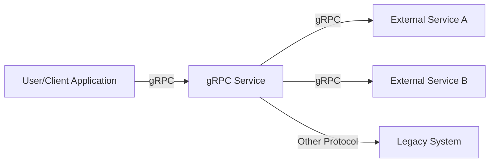
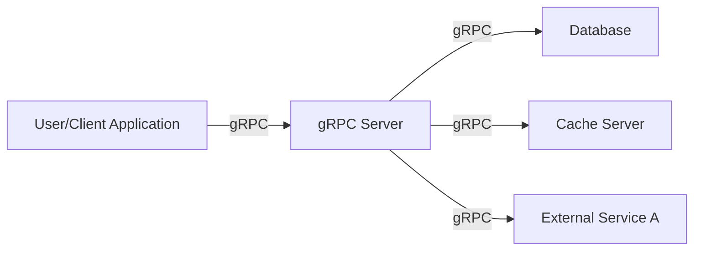
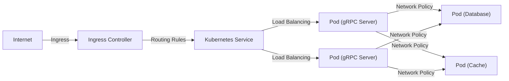
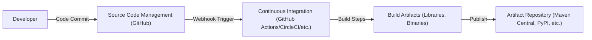

Okay, let's create a design document for the gRPC project, focusing on aspects relevant for threat modeling.

# BUSINESS POSTURE

gRPC is a high-performance, open-source universal RPC framework, initially developed by Google.  It's designed to connect services in and across data centers, and it supports pluggable support for load balancing, tracing, health checking, and authentication.  It's used in a wide variety of environments, from small startups to large enterprises.  Given its widespread use and critical role in many systems, the business posture focuses on reliability, performance, and broad adoption.

Priorities:

*   Maintain high performance and efficiency for inter-service communication.
*   Ensure cross-platform and cross-language compatibility.
*   Provide a robust and reliable framework for building distributed systems.
*   Foster a large and active open-source community.
*   Support a wide range of use cases, from mobile apps to large-scale microservices.
*   Maintain backward compatibility where possible.

Goals:

*   Be the leading RPC framework for cloud-native applications.
*   Enable developers to easily build and deploy scalable and resilient services.
*   Provide a secure and reliable communication channel for sensitive data.

Business Risks:

*   Security vulnerabilities that could lead to data breaches or service disruptions.
*   Performance bottlenecks that could impact application responsiveness.
*   Compatibility issues that could limit adoption or create integration challenges.
*   Lack of community support or contributions that could slow down development.
*   Failure to keep up with evolving industry standards and best practices.
*   Reputational damage due to security incidents or major outages.

# SECURITY POSTURE

gRPC has a number of built-in security features and supports integration with various security mechanisms.  However, as with any complex system, there are potential risks and areas for improvement.

Existing Security Controls:

*   security control: TLS/SSL encryption for secure communication. Described in [https://github.com/grpc/grpc/blob/master/doc/ssl.md](https://github.com/grpc/grpc/blob/master/doc/ssl.md)
*   security control: Support for various authentication mechanisms, including Google's Application Default Credentials (ADC), OAuth2, and custom authentication providers. Described in [https://github.com/grpc/grpc/blob/master/doc/auth.md](https://github.com/grpc/grpc/blob/master/doc/auth.md)
*   security control: Channel credentials and call credentials for fine-grained access control. Described in [https://grpc.io/docs/guides/auth/](https://grpc.io/docs/guides/auth/)
*   security control: Interceptors for implementing custom security logic, such as authorization checks. Described in multiple language specific implementation, e.g. [https://github.com/grpc/grpc-java/blob/master/SECURITY.md](https://github.com/grpc/grpc-java/blob/master/SECURITY.md)
*   security control: Regular security audits and penetration testing (though specifics are not publicly detailed, this is implied by Google's involvement and the project's maturity).
*   security control: Fuzz testing to identify potential vulnerabilities. Described in [https://github.com/grpc/grpc/blob/master/doc/fuzzing.md](https://github.com/grpc/grpc/blob/master/doc/fuzzing.md)
*   security control: Use of secure coding practices and code reviews.
*   security control: Support for network policies and firewalls to restrict access to gRPC services.

Accepted Risks:

*   accepted risk: Reliance on third-party libraries (e.g., OpenSSL) that may have their own vulnerabilities.
*   accepted risk: Complexity of configuration, which could lead to misconfigurations and security gaps.
*   accepted risk: Potential for denial-of-service attacks if not properly configured with resource limits and rate limiting.
*   accepted risk: The need for users to properly implement and configure security features; gRPC provides the tools, but security is ultimately the responsibility of the user.

Recommended Security Controls:

*   Implement robust input validation and sanitization to prevent injection attacks.
*   Enforce strong authentication and authorization policies for all gRPC services.
*   Regularly update dependencies to address known vulnerabilities.
*   Implement comprehensive monitoring and logging to detect and respond to security incidents.
*   Consider using a service mesh for advanced security features like mutual TLS (mTLS) and fine-grained access control.

Security Requirements:

*   Authentication: All gRPC services must authenticate clients before granting access to resources. Supported mechanisms include TLS client certificates, OAuth 2.0 tokens, and custom authentication tokens.
*   Authorization: Access to gRPC methods and data must be controlled based on the client's identity and role. This can be implemented using interceptors or external authorization services.
*   Input Validation: All input data received by gRPC services must be validated to ensure it conforms to expected formats and constraints. This helps prevent injection attacks and other vulnerabilities.
*   Cryptography: All communication between gRPC clients and servers must be encrypted using TLS 1.2 or higher. Sensitive data stored at rest should also be encrypted.

# DESIGN

## C4 CONTEXT

Element List:

*   Element:
    *   Name: User/Client Application
    *   Type: External System (Client)
    *   Description: An application or service that initiates communication with the gRPC Service.
    *   Responsibilities: Sending requests to the gRPC Service, handling responses, managing user interactions.
    *   Security controls: TLS/SSL encryption, authentication credentials, input validation.

*   Element:
    *   Name: gRPC Service
    *   Type: Internal System (Project)
    *   Description: The core gRPC service being designed and analyzed.
    *   Responsibilities: Handling incoming gRPC requests, processing data, interacting with external services, returning responses.
    *   Security controls: TLS/SSL encryption, authentication, authorization, input validation, rate limiting, auditing.

*   Element:
    *   Name: External Service A
    *   Type: External System
    *   Description: An external service that the gRPC Service interacts with using gRPC.
    *   Responsibilities: Providing specific functionality or data to the gRPC Service.
    *   Security controls: Dependent on the external service's implementation (ideally, similar to the gRPC Service).

*   Element:
    *   Name: External Service B
    *   Type: External System
    *   Description: Another external service that the gRPC Service interacts with using gRPC.
    *   Responsibilities: Providing specific functionality or data to the gRPC Service.
    *   Security controls: Dependent on the external service's implementation.

*   Element:
    *   Name: Legacy System
    *   Type: External System
    *   Description: A legacy system that the gRPC Service interacts with using a protocol other than gRPC.
    *   Responsibilities: Providing specific functionality or data, potentially using older protocols.
    *   Security controls: May have limited or outdated security controls; requires careful consideration of integration security.

## C4 CONTAINER

Element List:

*   Element:
    *   Name: User/Client Application
    *   Type: External System (Client)
    *   Description: An application or service that initiates communication with the gRPC Service.
    *   Responsibilities: Sending requests to the gRPC Service, handling responses, managing user interactions.
    *   Security controls: TLS/SSL encryption, authentication credentials, input validation.

*   Element:
    *   Name: gRPC Server
    *   Type: Container
    *   Description: The server component that hosts and executes the gRPC service logic.
    *   Responsibilities: Listening for incoming gRPC requests, routing requests to appropriate handlers, executing service logic, managing connections.
    *   Security controls: TLS/SSL termination, authentication, authorization, request validation, connection management, resource limits.

*   Element:
    *   Name: Database
    *   Type: Container
    *   Description: A database used by the gRPC Service to store and retrieve data.
    *   Responsibilities: Storing and managing persistent data, providing data access to the gRPC Server.
    *   Security controls: Access control, encryption at rest, auditing, input validation (at the database level).

*   Element:
    *   Name: Cache Server
    *   Type: Container
    *   Description: A caching server (e.g., Redis, Memcached) used to improve performance.
    *   Responsibilities: Storing frequently accessed data in memory for faster retrieval.
    *   Security controls: Access control, potentially encryption of cached data.

*   Element:
    *   Name: External Service A
    *   Type: External System
    *   Description: An external service that the gRPC Service interacts with using gRPC.
    *   Responsibilities: Providing specific functionality or data to the gRPC Service.
    *   Security controls: Dependent on the external service's implementation (ideally, similar to the gRPC Service).

## DEPLOYMENT

gRPC services can be deployed in various environments, including:

1.  Bare-metal servers
2.  Virtual machines (VMs)
3.  Containers (e.g., Docker)
4.  Container orchestration platforms (e.g., Kubernetes)
5.  Serverless platforms (e.g., Google Cloud Run, AWS Lambda)

We'll describe deployment using Kubernetes, as it's a common and complex scenario.

Element List:

*   Element:
    *   Name: Internet
    *   Type: External
    *   Description: The public internet.
    *   Responsibilities: Source of external traffic.
    *   Security controls: External firewalls, DDoS protection.

*   Element:
    *   Name: Ingress Controller
    *   Type: Infrastructure Node
    *   Description: A Kubernetes Ingress controller (e.g., Nginx, Traefik) that manages external access to services.
    *   Responsibilities: Routing incoming traffic to the appropriate Kubernetes Service, TLS termination.
    *   Security controls: TLS configuration, access control rules, rate limiting.

*   Element:
    *   Name: Kubernetes Service
    *   Type: Logical Node
    *   Description: A Kubernetes Service that provides a stable endpoint for accessing the gRPC server pods.
    *   Responsibilities: Load balancing traffic across multiple gRPC server pods.
    *   Security controls: Service-level network policies.

*   Element:
    *   Name: Pod (gRPC Server)
    *   Type: Container Instance
    *   Description: A Kubernetes Pod running an instance of the gRPC server container.
    *   Responsibilities: Handling gRPC requests.
    *   Security controls: Container image security, resource limits, network policies.

*   Element:
    *   Name: Pod (Database)
    *   Type: Container Instance
    *   Description: A Kubernetes Pod running an instance of the database.
    *   Responsibilities: Storing and managing data.
    *   Security controls: Database security configuration, network policies.

*   Element:
    *   Name: Pod (Cache)
    *   Type: Container Instance
    *   Description: A Kubernetes Pod running an instance of the cache server.
    *   Responsibilities: Providing caching services.
    *   Security controls: Cache server security configuration, network policies.

## BUILD

gRPC uses a multi-language, multi-platform build system. The core library is primarily written in C++, with bindings for various languages (Java, Python, Go, C#, Ruby, etc.).  The build process is complex and varies slightly depending on the language and platform.  We'll describe a generalized process, focusing on security aspects.

Build process description:

1.  **Code Commit:** Developers commit code changes to the gRPC repository on GitHub.
2.  **Webhook Trigger:** GitHub triggers a webhook to the CI system (e.g., GitHub Actions, CircleCI).
3.  **Continuous Integration:** The CI system starts a build pipeline.
4.  **Build Steps:**
    *   **Checkout Code:** The CI system checks out the source code from the repository.
    *   **Dependency Management:** Dependencies are downloaded and managed (using tools like Bazel, CMake, Maven, Gradle, pip, etc., depending on the language).
    *   **Compilation:** The source code is compiled into libraries and binaries.
    *   **Static Analysis:** Static analysis tools (SAST) are run to identify potential security vulnerabilities and code quality issues. Examples include linters, code formatters, and dedicated security scanners.
    *   **Unit Testing:** Unit tests are executed to verify the functionality of individual components.
    *   **Integration Testing:** Integration tests are run to verify the interaction between different components.
    *   **Fuzz Testing:** Fuzz tests are performed to discover edge cases and potential vulnerabilities by providing invalid or unexpected inputs.
    *   **Artifact Creation:** Build artifacts (libraries, binaries, packages) are created.
5.  **Publish:** Build artifacts are published to artifact repositories (e.g., Maven Central for Java, PyPI for Python, etc.).

Security Controls in Build Process:

*   security control: Use of signed commits to verify the integrity of code changes.
*   security control: Dependency management tools that track and manage dependencies, including checking for known vulnerabilities.
*   security control: Static analysis (SAST) tools to identify potential security vulnerabilities in the code.
*   security control: Fuzz testing to discover edge cases and vulnerabilities.
*   security control: Automated build pipelines to ensure consistency and repeatability.
*   security control: Use of secure artifact repositories with access controls.
*   security control: Code reviews to ensure code quality and security.

# RISK ASSESSMENT

Critical Business Processes:

*   Inter-service communication: gRPC is often used for critical communication between microservices, and its failure can disrupt entire applications.
*   Data transfer: gRPC may be used to transfer sensitive data, making its security paramount.
*   Remote procedure calls: gRPC facilitates remote procedure calls, which are fundamental to distributed systems.

Data Sensitivity:

*   gRPC can handle data of varying sensitivity levels, from public information to highly confidential data (e.g., financial transactions, personal health information). The sensitivity depends on the specific application using gRPC.
*   Data in transit is protected by TLS/SSL encryption.
*   Data at rest protection is the responsibility of the services using gRPC and the underlying storage systems.

# QUESTIONS & ASSUMPTIONS

Questions:

*   What are the specific threat models used by the gRPC security team?
*   What are the details of the regular security audits and penetration testing performed on gRPC?
*   What are the specific criteria for accepting or rejecting contributions to the gRPC codebase?
*   What is the process for reporting and handling security vulnerabilities in gRPC?
*   Are there any plans to integrate gRPC with service meshes for enhanced security features?
*   What specific static analysis tools are used in the build process for each language?
*   What is the frequency of dependency updates and vulnerability scanning?

Assumptions:

*   BUSINESS POSTURE: We assume that Google and the gRPC community prioritize security and are committed to maintaining a secure framework.
*   SECURITY POSTURE: We assume that users of gRPC will properly implement and configure security features. We assume that known vulnerabilities in gRPC and its dependencies are addressed promptly.
*   DESIGN: We assume that the deployment environment (e.g., Kubernetes) is properly configured and secured. We assume that external services interacting with gRPC have their own appropriate security controls.