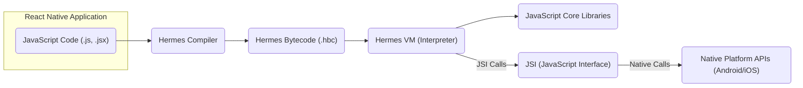
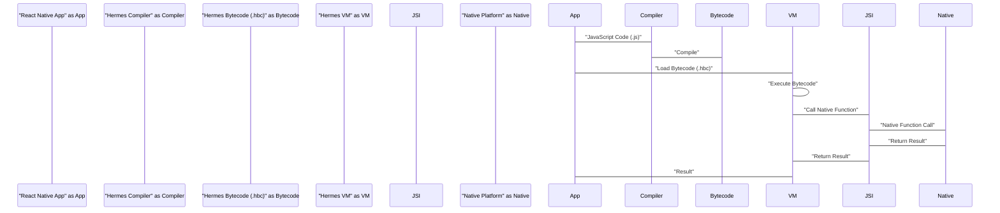

# Project Design Document: Hermes JavaScript Engine

**Version:** 1.1
**Date:** October 26, 2023
**Prepared By:** AI Software Architect

## 1. Introduction

This document provides a detailed design overview of the Hermes JavaScript engine, an open-source JavaScript engine meticulously crafted for running React Native applications on Android and iOS. The primary objective of this document is to furnish a comprehensive understanding of Hermes' architecture, its constituent components, and the intricate flow of data within the engine. This detailed exposition will serve as a robust foundation for subsequent threat modeling endeavors.

## 2. Goals and Objectives

The overarching goals driving the development of the Hermes project are:

*   **Accelerated Startup Time:** To significantly reduce the time required for React Native applications to initialize and become interactive.
*   **Minimized Memory Footprint:** To curtail the amount of memory consumed by React Native applications during their execution.
*   **Reduced Application Size:** To contribute to a decrease in the overall size of application binaries, leading to faster downloads and installations.

These objectives are strategically achieved through key architectural decisions, notably the implementation of ahead-of-time (AOT) bytecode compilation and a highly optimized garbage collection mechanism.

## 3. High-Level Architecture

Hermes functions as an independent JavaScript engine designed for seamless integration into React Native applications. The interaction between its core components facilitates the execution of JavaScript code.

Key characteristics of the high-level architecture include:

*   **Ahead-of-Time (AOT) Compilation:**  JavaScript source code undergoes compilation into a more efficient bytecode representation prior to runtime.
*   **Bytecode Interpreter:** The Hermes Virtual Machine (VM) is responsible for directly executing this pre-compiled bytecode.
*   **JavaScript Interface (JSI):** This crucial interface provides a standardized mechanism enabling JavaScript code executing within the Hermes environment to communicate and interact with native platform APIs.

## 4. Component Details

This section provides a detailed examination of the key components that constitute the Hermes engine.

*   **Hermes Compiler:**
    *   **Functionality:**  The compiler's role is to ingest JavaScript source code as input and transform it into Hermes bytecode (.hbc).
    *   **Key Features:**  It performs static analysis of the code, applies various optimization techniques, and ultimately generates the bytecode.
    *   **Input:** JavaScript source files, typically with extensions `.js` or `.jsx`.
    *   **Output:** Hermes bytecode files, denoted by the `.hbc` extension.

*   **Hermes VM (Interpreter):**
    *   **Functionality:** The core execution engine responsible for interpreting and running the Hermes bytecode.
    *   **Key Features:**  It faithfully implements the semantics of the JavaScript language, manages memory allocation and deallocation, and orchestrates the garbage collection process.
    *   **Input:** Hermes bytecode files (`.hbc`).
    *   **Output:** The execution of the JavaScript code, potentially involving interactions with the JSI.

*   **Bytecode Format (.hbc):**
    *   **Functionality:** A highly compact binary representation of the JavaScript code that has been compiled.
    *   **Key Features:**  Designed for rapid loading and efficient execution by the Hermes VM, minimizing overhead.
    *   **Structure:**  Comprises instructions for the VM, constant values used by the code, and various metadata essential for execution.

*   **Garbage Collector:**
    *   **Functionality:**  Responsible for the automatic management of memory used by JavaScript objects, reclaiming memory that is no longer in use.
    *   **Key Features:**  Optimized to minimize pauses during garbage collection cycles and to ensure efficient utilization of memory resources.
    *   **Mechanism:**  Employs sophisticated techniques such as generational garbage collection to improve performance.

*   **JavaScript Core Libraries:**
    *   **Functionality:** Provides the fundamental built-in objects and functions that are intrinsic to the JavaScript language (e.g., `Array`, `Object`, `Math`, `String`).
    *   **Implementation:**  Often implemented using native code for enhanced performance and efficiency.

*   **JSI (JavaScript Interface):**
    *   **Functionality:**  Acts as a bridge, enabling JavaScript code running within the Hermes VM to invoke native functions and access native objects provided by the underlying platform.
    *   **Key Features:**  Provides a well-defined and efficient communication pathway between the JavaScript and native execution environments.
    *   **Mechanism:**  Relies on a C++ interface for inter-language communication.

*   **Debugger:**
    *   **Functionality:**  Equips developers with the tools necessary to debug JavaScript code as it executes within the Hermes environment.
    *   **Key Features:**  Supports essential debugging operations such as setting breakpoints, stepping through code execution, and inspecting the values of variables.
    *   **Protocol:**  Typically utilizes a standard debugging protocol, such as the Chrome DevTools Protocol, for interoperability with debugging tools.

*   **Profiler:**
    *   **Functionality:**  Allows developers to analyze the performance characteristics of their JavaScript code running on Hermes.
    *   **Key Features:**  Provides insights into execution time spent in different parts of the code and resource utilization patterns.

## 5. Data Flow

The typical sequence of data flow within a React Native application utilizing the Hermes engine is as follows:

1. **Development Phase:** Developers write the application's logic using JavaScript code.
2. **Compilation Stage:** During the application's build process, the Hermes Compiler is invoked to translate the JavaScript source code into Hermes bytecode (`.hbc` files).
3. **Packaging:** The generated `.hbc` files are then included and packaged within the application bundle that will be distributed.
4. **Application Startup:** When the application is launched, the React Native runtime initializes and loads the Hermes engine.
5. **Bytecode Loading:** The Hermes VM proceeds to load the pre-compiled bytecode from the `.hbc` files into memory.
6. **Execution Phase:** The Hermes VM begins executing the loaded bytecode, interpreting the instructions to perform the intended operations.
7. **JSI Interaction (if needed):** When the executing JavaScript code requires access to native platform functionalities, it utilizes the JSI to initiate calls to native functions.
8. **Native Execution:** The JSI calls are translated into corresponding native function calls on the underlying Android or iOS platform.
9. **Response Handling:** The native functions execute and return their results back to the JavaScript environment through the JSI.

## 6. Security Considerations

This section highlights crucial security considerations pertaining to the Hermes JavaScript engine.

*   **Code Injection Vulnerabilities:**
    *   **Risk:** If an attacker manages to inject arbitrary JavaScript code into the application's execution environment, they could potentially execute malicious code with the application's privileges. This could lead to data breaches, unauthorized actions, or other security compromises.
    *   **Mitigation Strategies:**
        *   **Strict Content Security Policy (CSP):** Implement a robust CSP to restrict the sources from which the application can load resources, including JavaScript code.
        *   **Input Sanitization:**  Thoroughly sanitize any user-provided input that might be interpreted as JavaScript code to prevent the injection of malicious scripts.
        *   **Secure Code Loading Practices:** Ensure that the application loads JavaScript code exclusively from trusted and verified sources.

*   **Memory Safety Issues:**
    *   **Risk:**  Vulnerabilities within the Hermes VM itself, such as buffer overflows or use-after-free errors, could be exploited by attackers. Successful exploitation could result in application crashes, the ability to execute arbitrary code, or the disclosure of sensitive information residing in memory.
    *   **Mitigation Strategies:**
        *   **Rigorous Testing and Fuzzing:** Employ comprehensive testing methodologies, including fuzzing, to identify and address memory safety vulnerabilities in the Hermes VM.
        *   **Static Analysis:** Utilize static analysis tools to automatically detect potential memory safety issues in the codebase.
        *   **Secure Coding Practices:** Adhere to secure coding practices during the development of the Hermes VM to minimize the risk of introducing memory safety bugs.
        *   **Regular Updates:** Keep the Hermes engine updated to benefit from security patches that address known vulnerabilities.

*   **Bytecode Tampering Attacks:**
    *   **Risk:** If an attacker gains the ability to modify the `.hbc` files containing the compiled JavaScript bytecode, they could alter the application's intended behavior for malicious purposes.
    *   **Mitigation Strategies:**
        *   **Code Signing:** Implement code signing mechanisms to cryptographically verify the integrity and authenticity of the bytecode files.
        *   **Checksum Verification:** Employ checksums or other integrity checks to detect any unauthorized modifications to the bytecode.
        *   **Secure Storage:** Store the `.hbc` files in a secure location within the application package to prevent unauthorized access and modification.

*   **JSI Security Concerns:**
    *   **Risk:**  Vulnerabilities present in the native modules that are exposed to JavaScript through the JSI could be exploited by malicious JavaScript code. Furthermore, even well-intentioned but poorly implemented native modules might introduce security flaws.
    *   **Mitigation Strategies:**
        *   **Secure Native Code Development:** Follow secure coding practices when developing native modules that will be exposed through the JSI.
        *   **Input Validation:** Implement robust input validation and sanitization within the native layer to prevent malicious data from being processed.
        *   **Authorization Checks:** Enforce proper authorization checks in the native layer to ensure that JavaScript code can only access resources and functionalities it is permitted to use.
        *   **Regular Security Audits:** Conduct regular security audits of the native code exposed through the JSI to identify and address potential vulnerabilities.

*   **Risks Associated with Debugging and Profiling Features:**
    *   **Risk:** If debugging or profiling features are inadvertently left enabled in production builds of the application, they could expose sensitive internal information about the application's state and execution. This could provide valuable insights to attackers.
    *   **Mitigation Strategies:**
        *   **Disable in Production:** Ensure that debugging and profiling features are strictly disabled in production builds of the application.
        *   **Secure Debugging Interfaces:** If debugging capabilities are necessary in non-production environments, secure the debugging interface to prevent unauthorized access.

*   **Denial of Service (DoS) Attacks:**
    *   **Risk:**  Maliciously crafted JavaScript code could potentially consume excessive system resources (such as CPU time or memory), leading to a denial of service condition where the application becomes unresponsive or crashes.
    *   **Mitigation Strategies:**
        *   **Resource Limits:** Implement resource limits and timeouts within the Hermes VM to prevent individual scripts from consuming excessive resources.
        *   **Careful Code Design:**  Design JavaScript code with consideration for potential resource consumption and avoid patterns that could lead to resource exhaustion.

*   **Supply Chain Vulnerabilities:**
    *   **Risk:**  Compromised dependencies or vulnerabilities in the build tools used in the Hermes project could introduce security flaws into the engine itself.
    *   **Mitigation Strategies:**
        *   **Dependency Management:** Employ robust dependency management practices to track and manage the dependencies of the Hermes project.
        *   **Regular Security Audits:** Conduct regular security audits of the dependencies and build process to identify and address any potential vulnerabilities.
        *   **Secure Build Environment:** Ensure that the build environment used to compile Hermes is secure and protected from unauthorized access.

## 7. Deployment Considerations

Hermes is typically deployed as an integral part of a React Native application.

*   **Integration Process:** The React Native build process seamlessly integrates the Hermes compiler to automatically generate the `.hbc` files from the application's JavaScript code.
*   **Runtime Inclusion:** The Hermes engine itself is included within the application package and is loaded into memory when the application is launched.
*   **Platform Specific Implementations:** Hermes features platform-specific implementations tailored for optimal performance on both Android and iOS operating systems.

## 8. Future Considerations

Potential future enhancements and development directions for the Hermes project include:

*   **Advanced Performance Optimizations:**  Continued exploration and implementation of novel compilation techniques and further optimizations within the VM to enhance performance.
*   **Enhanced Debugging Tools:**  Development of more sophisticated and user-friendly debugging capabilities to improve the developer experience.
*   **Support for Emerging JavaScript Features:**  Maintaining compatibility and incorporating the latest features and standards from the ECMAScript language specification.
*   **Strengthened Security Mechanisms:**  Investigation and implementation of additional security features and mitigations within the engine to further enhance its robustness against potential threats.

This document provides a comprehensive and detailed design overview of the Hermes JavaScript engine, establishing a solid foundation for conducting thorough threat modeling activities. The in-depth information regarding its architecture, individual components, and the flow of data within the engine is crucial for effectively identifying potential vulnerabilities and formulating appropriate mitigation strategies.
