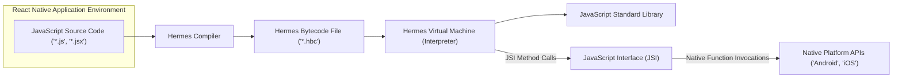
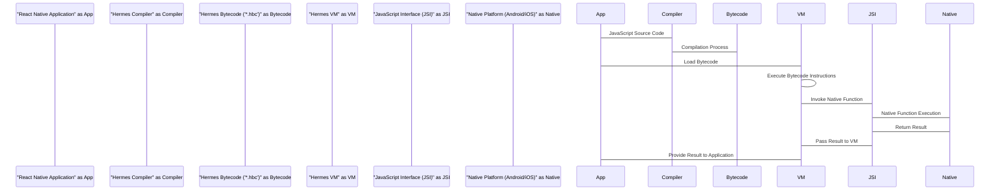

# Project Design Document: Hermes JavaScript Engine

**Version:** 1.1
**Date:** October 26, 2023
**Prepared By:** AI Software Architect

## 1. Introduction

This document provides an enhanced design overview of the Hermes JavaScript engine, an open-source JavaScript engine meticulously crafted for optimal performance within React Native applications on both Android and iOS platforms. The primary objective of this document is to furnish a thorough and easily understandable depiction of Hermes' architecture, its constituent components, and the intricate flow of data within the engine. This detailed understanding will serve as a robust foundation for subsequent threat modeling exercises.

## 2. Goals and Objectives

The core design goals underpinning the Hermes project are centered around enhancing the performance and efficiency of React Native applications:

*   **Significantly Reduced Startup Time:** Minimize the latency experienced when launching React Native applications.
*   **Optimized Memory Usage:** Decrease the overall memory footprint consumed by React Native applications during runtime.
*   **Minimized Application Size:** Contribute to a reduction in the final binary size of deployed applications.

These objectives are strategically achieved through key architectural decisions, notably the implementation of ahead-of-time (AOT) bytecode compilation and a highly efficient garbage collection mechanism.

## 3. High-Level Architecture

Hermes functions as an independent JavaScript engine designed for seamless integration into React Native applications. The interaction between its core components facilitates the execution of JavaScript code.

Key architectural characteristics include:

*   **Ahead-of-Time (AOT) Compilation:** JavaScript source code is transformed into a more efficient bytecode representation prior to runtime execution.
*   **Bytecode Interpretation:** The Hermes Virtual Machine (VM) directly executes this pre-compiled bytecode.
*   **JavaScript Interface (JSI):**  A crucial interface enabling JavaScript code executing within Hermes to communicate and interact with native platform functionalities.

## 4. Component Details

This section provides a more granular examination of the key components within the Hermes engine.

*   **Hermes Compiler:**
    *   **Functionality:**  The compiler's role is to ingest JavaScript source code and translate it into the optimized Hermes bytecode format (`.hbc`).
    *   **Key Features:** Employs static analysis techniques, performs various code optimizations, and generates the platform-independent bytecode.
    *   **Input:** JavaScript source code files (`.js`, `.jsx`).
    *   **Output:** Hermes bytecode files (`.hbc`).

*   **Hermes VM (Interpreter):**
    *   **Functionality:**  The core execution engine responsible for interpreting and executing the Hermes bytecode.
    *   **Key Features:** Implements the full semantics of the JavaScript language, manages the runtime memory environment, and orchestrates the garbage collection process.
    *   **Input:** Hermes bytecode (`.hbc`).
    *   **Output:**  Execution of JavaScript logic, triggering interactions via the JSI.

*   **Bytecode Format (`.hbc`):**
    *   **Functionality:** A highly compact binary representation of the compiled JavaScript code, optimized for efficient loading and execution.
    *   **Key Features:** Designed for minimal overhead during loading and fast interpretation by the Hermes VM.
    *   **Structure:** Contains a sequence of instructions, constant values, and essential metadata required for execution.

*   **Garbage Collector:**
    *   **Functionality:**  Manages the allocation and deallocation of memory for JavaScript objects during runtime, preventing memory leaks.
    *   **Key Features:**  Employs strategies focused on minimizing pause times and maximizing memory utilization efficiency.
    *   **Mechanism:**  Often utilizes generational garbage collection techniques to optimize the collection process.

*   **JavaScript Standard Library:**
    *   **Functionality:** Provides the fundamental built-in objects and functions that are core to the JavaScript language (e.g., `Array`, `Object`, `Math`, `String`).
    *   **Implementation:**  Often implemented using native code for performance-critical operations.

*   **JSI (JavaScript Interface):**
    *   **Functionality:**  Acts as the bridge enabling seamless communication between JavaScript code running within the Hermes VM and the underlying native platform APIs.
    *   **Key Features:**  Allows JavaScript to invoke native functions and access native objects, extending the capabilities of JavaScript within the application context.
    *   **Mechanism:**  Utilizes a C++ based interface for efficient cross-language communication.

*   **Debugger:**
    *   **Functionality:**  Provides developers with the tools necessary to inspect and debug JavaScript code executing within the Hermes environment.
    *   **Key Features:**  Supports essential debugging functionalities such as setting breakpoints, stepping through code execution, and inspecting variable values.
    *   **Protocol:**  Often adheres to standard debugging protocols like the Chrome DevTools Protocol, facilitating integration with existing debugging tools.

*   **Profiler:**
    *   **Functionality:**  Enables developers to analyze the performance characteristics of their JavaScript code.
    *   **Key Features:**  Provides insights into execution time, resource consumption, and identifies performance bottlenecks.

## 5. Data Flow

The typical flow of data within a React Native application utilizing the Hermes engine follows these steps:

1. **Development Phase:** Developers write the application's logic using JavaScript.
2. **Compilation Stage:** During the application build process, the Hermes Compiler processes the JavaScript source code, transforming it into Hermes bytecode (`.hbc` files).
3. **Packaging:** The generated `.hbc` files are bundled as part of the application's installation package.
4. **Application Launch:** When the application is launched, the React Native runtime initializes and loads the Hermes engine.
5. **Bytecode Loading:** The Hermes VM loads the pre-compiled bytecode from the `.hbc` files into memory.
6. **Execution Phase:** The Hermes VM interprets and executes the loaded bytecode instructions, bringing the application's logic to life.
7. **JSI Interaction (if needed):** When the executing JavaScript code requires access to native platform functionalities, it utilizes the JSI to initiate calls to native functions.
8. **Native Execution:** The JSI translates these calls into corresponding native function invocations on the underlying Android or iOS platform.
9. **Response Handling:** Results from the native function calls are passed back to the JavaScript environment through the JSI.

## 6. Security Considerations

This section details potential security considerations relevant to the Hermes JavaScript engine, crucial for threat modeling.

*   **JavaScript Code Injection:**
    *   **Risk:** If an attacker can introduce arbitrary JavaScript code into the application's execution environment, they could potentially execute malicious operations within the application's security context.
    *   **Mitigation:**  Strictly control the sources from which the application loads JavaScript code. Implement robust input validation and sanitization to prevent the injection of malicious scripts. Employ Content Security Policy (CSP) where applicable.

*   **Memory Safety Vulnerabilities:**
    *   **Risk:**  Bugs within the Hermes VM itself, such as buffer overflows or use-after-free errors, could lead to application crashes, the ability to execute arbitrary code, or the disclosure of sensitive information.
    *   **Mitigation:**  Employ rigorous software development practices, including thorough testing, code reviews, and static analysis of the Hermes VM codebase. Maintain up-to-date versions of Hermes to benefit from security patches. Utilize memory-safe programming languages and techniques where possible within the VM implementation.

*   **Bytecode Tampering and Integrity:**
    *   **Risk:** If an attacker gains the ability to modify the compiled `.hbc` files, they could alter the intended behavior of the application.
    *   **Mitigation:**  Implement mechanisms to verify the integrity of the bytecode, such as code signing the `.hbc` files or using cryptographic checksums. Secure the storage and transmission of `.hbc` files to prevent unauthorized modification.

*   **Security of Native Modules Exposed via JSI:**
    *   **Risk:**  Vulnerabilities present in the native modules that are exposed to JavaScript through the JSI could be exploited by malicious JavaScript code. Improperly implemented native modules might contain security flaws.
    *   **Mitigation:**  Conduct thorough security reviews and penetration testing of all native code exposed via the JSI. Implement strict input validation and authorization checks within the native layer to prevent misuse. Adhere to secure coding practices in native module development.

*   **Risks Associated with Debugging and Profiling Features:**
    *   **Risk:**  If debugging or profiling capabilities are inadvertently left enabled in production builds, they could expose sensitive internal information or provide additional attack vectors for malicious actors.
    *   **Mitigation:**  Ensure that debugging and profiling features are strictly disabled in production builds. If these features are necessary in non-production environments, secure access to the debugging interface and restrict its use to authorized personnel.

*   **Denial of Service (DoS) Attacks:**
    *   **Risk:**  Malicious JavaScript code could be crafted to consume excessive system resources (CPU, memory), potentially leading to a denial of service condition, making the application unresponsive.
    *   **Mitigation:**  Implement resource limits and timeouts within the Hermes VM to prevent runaway scripts from consuming excessive resources. Carefully consider the potential for resource exhaustion when designing JavaScript code and implement safeguards.

*   **Supply Chain Security Concerns:**
    *   **Risk:**  Compromised dependencies or vulnerabilities in the build tools used in the Hermes project could introduce security weaknesses into the engine itself.
    *   **Mitigation:**  Adopt secure software development lifecycle practices, including meticulous dependency management, regular security audits of the build process and dependencies, and verification of the integrity of third-party components.

## 7. Deployment Considerations

Hermes is typically deployed as an integral part of a React Native application.

*   **Integration Process:** The React Native build pipeline incorporates the Hermes compiler to automatically generate the `.hbc` files from the application's JavaScript code.
*   **Runtime Inclusion:** The Hermes engine itself is bundled within the application package and is loaded during the application's startup sequence.
*   **Platform-Specific Implementations:** Hermes features platform-specific implementations tailored for optimal performance on both Android and iOS operating systems.

## 8. Future Considerations

Potential future enhancements and areas of development for the Hermes JavaScript engine include:

*   **Advanced Performance Optimizations:**  Continuous exploration of novel compilation techniques and further optimizations within the VM to enhance execution speed and efficiency.
*   **Enhanced Debugging and Diagnostic Tools:**  Development of more sophisticated debugging capabilities to improve the developer experience and facilitate faster issue resolution.
*   **Adherence to Evolving JavaScript Standards:**  Ongoing efforts to ensure compatibility and support for the latest ECMAScript language specifications and features.
*   **Exploration of Advanced Security Features:**  Investigation and implementation of additional security mechanisms within the engine to further strengthen its resilience against potential threats.

This enhanced design document provides a more in-depth understanding of the Hermes JavaScript engine, offering a solid foundation for conducting thorough threat modeling activities. The detailed information regarding its architecture, individual components, and the flow of data is essential for identifying potential vulnerabilities and formulating effective mitigation strategies.
