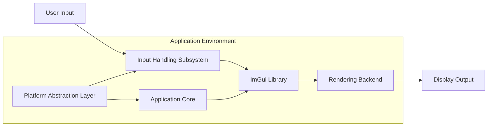
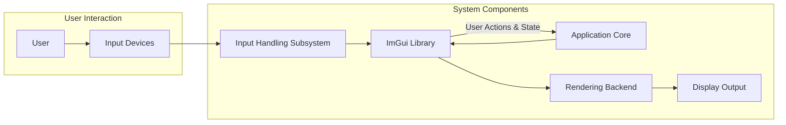

# Project Design Document: Dear ImGui Integration and Usage

**Version:** 1.1
**Date:** October 26, 2023
**Author:** AI Software Architect

## 1. Introduction

This document details the design of a system integrating and utilizing the Dear ImGui library (https://github.com/ocornut/imgui). Dear ImGui is a portable, renderer-agnostic, immediate-mode graphical user interface library for C++. It generates optimized vertex and index buffers that can be rendered within a 3D application's existing rendering pipeline. This document aims to provide a clear understanding of the system's architecture, facilitating future threat modeling activities. It outlines key components, their interactions, and data flow.

## 2. Goals and Objectives

*   Provide a detailed architectural overview of a system incorporating Dear ImGui.
*   Clearly identify and describe the responsibilities of each system component.
*   Illustrate the flow of data and control within the ImGui integration.
*   Explicitly highlight potential security considerations relevant for subsequent threat modeling exercises.
*   Serve as a comprehensive reference for developers, security analysts, and other stakeholders.

## 3. System Architecture

The system architecture for utilizing Dear ImGui comprises the following distinct components:

*   **Application Core:**  The central part of the software, encompassing the primary application logic, data management, and core functionalities. This is where ImGui is integrated to provide a user interface.
*   **ImGui Library:** The Dear ImGui library itself, responsible for managing UI state, processing user input, and generating low-level rendering commands (vertex and index buffers).
*   **Rendering Backend:**  The component responsible for taking the vertex and index buffer data produced by ImGui and rendering it to the display using a specific graphics API (e.g., OpenGL, DirectX, Vulkan). This acts as the bridge between ImGui's output and the visual representation.
*   **Input Handling Subsystem:** This subsystem captures raw user input events (keyboard, mouse, touch, etc.) from the operating system and translates them into a format that the ImGui library can understand.
*   **Platform Abstraction Layer:** This layer provides an abstraction over platform-specific functionalities, such as window creation, event management, and operating system interactions. It ensures portability across different platforms.

## 4. Component Details

### 4.1. Application Core

*   **Responsibilities:**
    *   Manages the application's core data structures and business logic.
    *   Integrates with the ImGui library to define and update the user interface elements.
    *   Handles user interactions received through the ImGui interface, triggering corresponding application actions.
    *   Provides data to be displayed within the ImGui UI (e.g., application state, variables).
    *   Receives user input and actions from the UI to modify the application's state or trigger functions.
*   **Implementation Details:**
    *   Typically implemented in C++ due to ImGui's C++ API.
    *   Contains the main application loop, driving the application's execution.
    *   Holds the application's data model and business rules.
    *   Responsible for initializing and managing the ImGui context.

### 4.2. ImGui Library

*   **Responsibilities:**
    *   Provides the API for creating and managing various UI elements (windows, buttons, sliders, text inputs, etc.).
    *   Manages the internal state of UI elements and their interactions.
    *   Processes user input events to determine which UI elements are being interacted with.
    *   Generates optimized vertex and index buffers representing the UI's visual appearance.
    *   Offers extensive customization options for styling, layout, and behavior of UI elements.
*   **Implementation Details:**
    *   Primarily a header-only library, simplifying integration into projects.
    *   Requires integration with a rendering backend to visualize the generated UI.
    *   Operates on an immediate-mode paradigm, meaning the UI is rebuilt and rendered every frame based on the current application state.

### 4.3. Rendering Backend

*   **Responsibilities:**
    *   Receives the vertex and index buffers generated by the ImGui library.
    *   Configures the rendering pipeline, including setting up shaders, textures, and render states.
    *   Draws the UI elements to the screen using the chosen graphics API (e.g., OpenGL, DirectX, Vulkan).
    *   Manages resources required for rendering ImGui elements, such as font textures and glyph data.
    *   Handles platform-specific rendering setup and integration.
*   **Implementation Details:**
    *   Implementation is specific to the target graphics API (e.g., `imgui_impl_opengl3.cpp`, `imgui_impl_dx12.cpp`).
    *   Requires a good understanding of the underlying graphics API's rendering mechanisms.
    *   Often involves setting up blend states, scissor rectangles, and other rendering parameters.

### 4.4. Input Handling Subsystem

*   **Responsibilities:**
    *   Captures raw input events from the operating system (e.g., key presses, mouse movements, button clicks, touch events).
    *   Translates these raw input events into a standardized format that ImGui can process (e.g., key codes, mouse coordinates, button states).
    *   Passes the processed input events to the ImGui library for handling.
    *   May involve polling input devices or using event-driven mechanisms provided by the operating system.
*   **Implementation Details:**
    *   Often tightly coupled with the platform abstraction layer.
    *   May utilize platform-specific APIs for input handling (e.g., Win32 API for Windows, GLFW, SDL).
    *   Needs to handle different input modalities and devices.

### 4.5. Platform Abstraction Layer

*   **Responsibilities:**
    *   Provides an abstraction layer over platform-specific functionalities, promoting code portability.
    *   Handles window creation and management (e.g., creating and destroying application windows).
    *   Manages the application's event loop and message processing, dispatching events to relevant components.
    *   May provide platform-independent interfaces for input handling, file system access, and other OS-level services.
    *   Sets up the necessary context for the application to run on the target platform.
*   **Implementation Details:**
    *   Implementation is platform-specific (e.g., using Win32 API on Windows, Xlib/Wayland on Linux, Cocoa on macOS).
    *   May utilize cross-platform libraries like GLFW or SDL to simplify platform abstraction.

## 5. Data Flow

The typical flow of data and control within the system when using Dear ImGui is as follows:

1. **User Interaction:** The user interacts with the application through input devices such as the keyboard and mouse.
2. **Input Capture:** The "Input Handling Subsystem" captures these raw input events from the operating system.
3. **Input Processing and Translation:** The "Input Handling Subsystem" translates the raw input into a format that the ImGui library understands (e.g., key codes, mouse positions).
4. **ImGui Input Update:** The processed input is passed to the "ImGui Library" via its input update functions.
5. **Application Logic and UI Definition:** The "Application Core" executes its logic and defines the structure and content of the UI using ImGui's API in the current frame. This includes setting up windows, buttons, text fields, and other UI elements.
6. **ImGui UI State Update:** The "ImGui Library" updates its internal UI state based on the provided input and the application's UI definitions.
7. **Rendering Command Generation:** The "ImGui Library" generates optimized vertex and index buffers representing the UI elements that need to be rendered in the current frame.
8. **Rendering Backend Processing:** The generated vertex and index buffers are passed to the "Rendering Backend".
9. **UI Rendering:** The "Rendering Backend" uses the graphics API to draw the UI elements to the "Display Output".
10. **User Action Handling:** If user interactions within the ImGui interface trigger actions (e.g., button clicks), ImGui provides mechanisms (e.g., callbacks, state changes) for the "Application Core" to respond to these actions and update the application's state accordingly.

## 6. Security Considerations (For Future Threat Modeling)

While Dear ImGui itself focuses on UI rendering and doesn't inherently handle sensitive data or network communication, its integration and usage can introduce potential security concerns:

*   **Insufficient Input Validation:** The "Application Core" must rigorously validate any user input received through the ImGui interface. Failure to do so can lead to vulnerabilities such as command injection, cross-site scripting (if the application renders web content), or buffer overflows in backend systems if UI inputs are directly passed without sanitization.
*   **State Manipulation Vulnerabilities:** Improper management of the application's state based on user interactions within the ImGui interface can lead to inconsistent or insecure states. For example, allowing users to bypass security checks or access restricted functionalities through UI manipulation.
*   **Exploitation through Native Code Integration:** ImGui is often integrated into applications with native code (C++). Vulnerabilities in the "Application Core" or other native components can be exposed or triggered through carefully crafted UI interactions.
*   **Rendering Backend Exploits:** Although less common, vulnerabilities in the "Rendering Backend" could potentially be exploited if ImGui is used to render specially crafted or malicious content. This could involve issues with shader compilation or resource handling within the graphics API.
*   **Dependency Chain Vulnerabilities:** While ImGui has minimal direct dependencies, the "Rendering Backend" and "Platform Abstraction Layer" rely on external libraries and system components. Vulnerabilities in these dependencies could indirectly affect the security of the ImGui integration. Regularly updating dependencies is crucial.
*   **Information Disclosure through UI:** Care must be taken to avoid displaying sensitive information in the UI that could be exposed to unauthorized users. This includes logging sensitive data to UI elements or displaying credentials.
*   **Denial of Service through UI Overload:** While less likely with ImGui's optimized rendering, poorly designed or excessively complex UI elements could potentially lead to performance issues or denial of service if they consume excessive resources.
*   **Security of Third-Party ImGui Extensions:** If the application utilizes third-party extensions or modifications to the ImGui library, their security should be thoroughly evaluated as they could introduce vulnerabilities.
*   **Clipboard Interaction:** If the application uses ImGui's clipboard functionality, potential vulnerabilities related to clipboard manipulation (e.g., injecting malicious content) should be considered.

## 7. Deployment Considerations

*   Dear ImGui is typically integrated directly into the application's source code as a library.
*   No separate installation of ImGui is generally required on the target system.
*   The "Rendering Backend" needs to be correctly configured and initialized for the specific target platform and graphics API.
*   Distribution involves including the ImGui source files (or pre-compiled libraries if preferred) along with the application's source code or binaries.
*   Consider the licensing terms of ImGui (typically the MIT License) when distributing the application.

## 8. Future Considerations

*   Exploring advanced ImGui features such as docking, viewports, and custom widgets for enhanced UI capabilities.
*   Investigating advanced styling and theming options to improve the visual appearance and user experience.
*   Considering accessibility guidelines and how they can be effectively implemented within an ImGui-based UI.
*   Conducting further in-depth security analysis of specific UI workflows and potential attack vectors.
*   Evaluating the performance implications of complex UI layouts and interactions.

This improved design document provides a more detailed and comprehensive overview of a system integrating Dear ImGui. It clarifies the responsibilities of each component, elaborates on the data flow, and expands on the security considerations relevant for future threat modeling activities.
