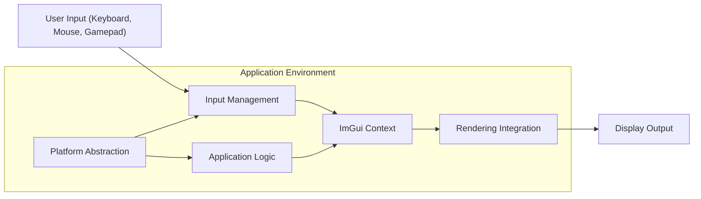
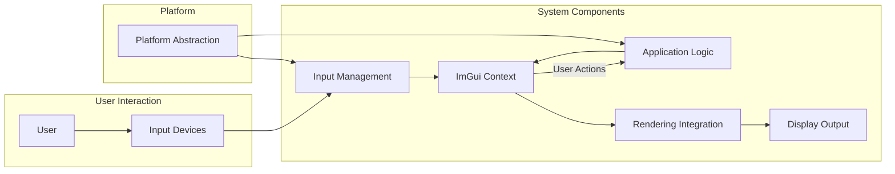

# Project Design Document: Dear ImGui Integration and Usage

**Version:** 1.1
**Date:** October 26, 2023
**Author:** AI Software Architect

## 1. Introduction

This document details the design of a system integrating and utilizing the Dear ImGui library (https://github.com/ocornut/imgui). Dear ImGui is a C++ immediate-mode graphical user interface library. It focuses on simplicity and enables developers to create user interfaces by describing their layout and behavior on each frame. ImGui outputs optimized vertex buffers for rendering within a 3D application or any graphical context. This document aims to provide a clear understanding of the system's architecture, facilitating future threat modeling activities.

## 2. Goals and Objectives

*   Provide a detailed architectural overview of a system incorporating Dear ImGui.
*   Clearly define the roles and responsibilities of each system component.
*   Illustrate the flow of data and control within the system.
*   Identify potential security vulnerabilities and attack vectors relevant to ImGui integration.
*   Serve as a comprehensive reference for development, security analysis, and maintenance.

## 3. System Architecture

The system integrating Dear ImGui comprises the following key components:

*   **Application Logic:**  The core of the application, encompassing business logic, data management, and interactions with external systems.
*   **ImGui Context:** The central object provided by the ImGui library, managing UI state, input, and rendering data.
*   **Rendering Integration:** The code responsible for taking ImGui's output (vertex and index buffers) and rendering it using a specific graphics API.
*   **Input Management:**  The module that captures and translates user input events for ImGui.
*   **Platform Abstraction:**  A layer that handles platform-specific functionalities like window creation and event handling.

## 4. Component Details

### 4.1. Application Logic

*   **Responsibilities:**
    *   Manages the application's core functionality and data.
    *   Provides data to be displayed and interacted with through the ImGui interface.
    *   Reacts to user input and events originating from the ImGui interface.
    *   Orchestrates the interaction between different parts of the application.
*   **Implementation Details:**
    *   Typically implemented in C++ alongside ImGui.
    *   Contains the main application loop and event handling mechanisms.
    *   Holds the application's data models and business rules.
    *   Examples: Game engine logic, data processing pipelines, configuration management.

### 4.2. ImGui Context

*   **Responsibilities:**
    *   Maintains the internal state of the ImGui interface (e.g., window positions, widget states).
    *   Processes user input and updates the UI state accordingly.
    *   Generates the necessary vertex and index buffers for rendering the UI elements.
    *   Provides APIs for creating and managing UI elements (windows, buttons, sliders, etc.).
*   **Implementation Details:**
    *   Managed through the `ImGuiContext` object.
    *   Requires initialization and frame updates within the application loop.
    *   Customization options for styling, fonts, and input mapping.

### 4.3. Rendering Integration

*   **Responsibilities:**
    *   Receives vertex and index buffer data from the ImGui Context.
    *   Configures and executes the rendering pipeline using a specific graphics API (e.g., OpenGL, DirectX, Vulkan).
    *   Manages resources required for rendering ImGui elements (e.g., textures for fonts and icons, shaders).
    *   Handles drawing calls to the graphics API to display the ImGui interface.
*   **Implementation Details:**
    *   Typically involves platform-specific implementations (e.g., `imgui_impl_opengl3.cpp`, `imgui_impl_dx12.cpp`).
    *   Requires setting up shaders, vertex layouts, and render states compatible with ImGui's output.
    *   Needs to handle texture loading and management for ImGui's font atlas.

### 4.4. Input Management

*   **Responsibilities:**
    *   Captures raw input events from the operating system or platform layer (e.g., keyboard presses, mouse movements, gamepad inputs).
    *   Translates these raw events into a format that ImGui can understand (key codes, mouse coordinates, button states).
    *   Feeds the processed input data to the ImGui Context.
*   **Implementation Details:**
    *   Often tightly coupled with the platform abstraction layer.
    *   May involve polling input devices or using event-driven mechanisms.
    *   Needs to handle different input modalities and their respective data formats.

### 4.5. Platform Abstraction

*   **Responsibilities:**
    *   Provides an abstraction layer over the underlying operating system and windowing system.
    *   Handles window creation, management, and destruction.
    *   Manages the application's event loop and message processing.
    *   May provide platform-specific input and rendering context initialization.
*   **Implementation Details:**
    *   Implemented using platform-specific APIs (e.g., Win32 API, Xlib, Cocoa).
    *   Provides a consistent interface for other components to interact with the platform.
    *   Examples: Creating a window, handling window resize events, managing application lifecycle.

## 5. Data Flow

The interaction between the components follows this general data flow:

1. **User Interaction:** The user interacts with input devices.
2. **Input Capture:** The "Input Management" component captures these raw input events.
3. **Input Translation:** "Input Management" translates the raw input into ImGui-compatible data.
4. **ImGui Input Processing:** The translated input is passed to the "ImGui Context".
5. **Application Data Update:** The "Application Logic" provides data to the "ImGui Context" to reflect the application state in the UI.
6. **UI State Update:** The "ImGui Context" updates its internal state based on input and application data.
7. **Rendering Command Generation:** The "ImGui Context" generates vertex and index buffers representing the UI.
8. **Rendering Execution:** The "Rendering Integration" component takes the generated buffers and uses the graphics API to draw the UI to the "Display Output".
9. **Event Handling:** User interactions within the ImGui interface trigger events or callbacks that are processed by the "Application Logic", potentially modifying the application's state.

## 6. Security Considerations (For Future Threat Modeling)

While Dear ImGui is primarily a UI rendering library and doesn't inherently possess network capabilities or direct access to sensitive data, its integration and usage can introduce potential security concerns:

*   **Insufficient Input Validation in Application Logic:**  The application must validate any data received from user interactions within the ImGui interface. Failure to do so can lead to vulnerabilities like command injection or cross-site scripting (if the application renders web content).
*   **State Manipulation Vulnerabilities:** If the application logic doesn't properly handle state changes triggered by ImGui interactions, it could lead to inconsistent or insecure states. For example, enabling privileged actions through a manipulated UI state.
*   **Vulnerabilities in Rendering Integration:** Bugs or security flaws in the rendering backend (e.g., shader vulnerabilities, buffer overflows in drawing calls) could be exploited if ImGui is used to render crafted or malicious UI elements. While less likely with ImGui's output, it's a consideration for the integration point.
*   **Dependencies of Rendering and Platform Layers:**  The security of the rendering backend and platform abstraction layers, including their dependencies, is crucial. Vulnerabilities in these underlying components can indirectly affect the security of the ImGui integration.
*   **Information Disclosure through UI:**  Care must be taken to avoid displaying sensitive information in the UI that could be exposed to unauthorized users through screenshots or screen sharing.
*   **Denial of Service through Excessive UI Elements:**  While less common, a malicious actor could potentially trigger the creation of an excessive number of UI elements, leading to performance degradation or denial of service.
*   **Third-Party ImGui Extensions and Styles:**  If using external ImGui extensions or custom styles, their security should be carefully reviewed as they might introduce vulnerabilities.
*   **Clipboard Interaction:** If the application uses ImGui's clipboard functionality, potential vulnerabilities related to clipboard manipulation should be considered.
*   **Font Loading Vulnerabilities:** If custom fonts are loaded, vulnerabilities in the font parsing or rendering libraries could be a concern.

## 7. Deployment Considerations

*   Dear ImGui is typically integrated directly into the application's source code as a library.
*   No separate installation of ImGui is usually required on the target system.
*   The rendering backend implementation needs to be chosen and configured based on the target platform and graphics API.
*   Distribution involves compiling the ImGui source code along with the application's source code.
*   Consider the licensing terms of Dear ImGui (typically the MIT License).
*   Ensure that the necessary runtime libraries for the chosen rendering API are available on the target system.

## 8. Future Considerations

*   Exploring advanced ImGui features like docking, viewports, and custom widgets.
*   Investigating integration with accessibility tools and frameworks.
*   Analyzing the performance implications of complex UI layouts and interactions.
*   Developing automated tests for UI functionality built with ImGui.
*   Further research into security best practices for immediate-mode GUI libraries.

This improved design document provides a more detailed and structured overview of a system integrating Dear ImGui. It clarifies the responsibilities of each component and elaborates on potential security considerations, making it a more effective foundation for future threat modeling activities.
