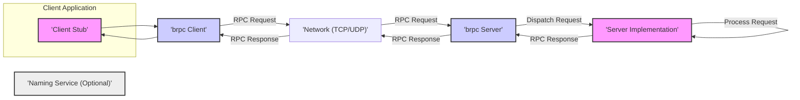

# Project Design Document: Apache brpc

**Version:** 1.1
**Date:** October 26, 2023
**Prepared By:** AI Software Architect

## 1. Introduction

This document provides an enhanced and detailed architectural design of the Apache brpc (incubator) project. Building upon the previous version, this iteration aims for greater clarity and depth in describing the system's components, interactions, and data flow. This refined document will serve as a robust foundation for subsequent threat modeling activities, facilitating a more thorough analysis of potential security vulnerabilities.

## 2. Project Overview

Apache brpc is a production-ready, high-performance Remote Procedure Call (RPC) framework written in C++, emphasizing industrial-grade stability, rich features, and ease of use. It is engineered to handle massive concurrency and demanding low-latency requirements, making it exceptionally well-suited for constructing large-scale distributed systems and microservices architectures. brpc's versatility is highlighted by its support for a diverse range of protocols, including HTTP/2, gRPC, and its own proprietary protocols (like Baidu RPC), offering significant flexibility for integration with heterogeneous systems.

## 3. Goals

*   Present a clear, concise, and in-depth description of the brpc architecture.
*   Thoroughly identify key components, detailing their responsibilities and interactions.
*   Elaborate on the data flow within the system, including specific steps and transformations.
*   Serve as a comprehensive and accurate basis for identifying potential security threats and vulnerabilities during threat modeling.

## 4. Target Audience

This document is intended for a technical audience, including:

*   Security engineers responsible for threat modeling, security assessments, and penetration testing.
*   Software developers actively working with or integrating the brpc framework into their applications.
*   System architects designing and planning distributed systems that leverage brpc.
*   Operations engineers responsible for deploying and maintaining brpc-based services.

## 5. System Architecture

### 5.1. High-Level Architecture Diagram

### 5.2. Component Description

*   **Client Application:** This is the initiating application that requires a remote procedure to be executed. It interacts with the brpc framework through the generated or manually created client stub.
*   **Client Stub:** This component acts as a proxy for the remote service. It provides a type-safe and convenient interface for the client application to invoke remote methods. Key responsibilities include:
    *   **Marshalling (Serialization):** Converting the method arguments into a network-transmittable format (e.g., Protocol Buffers).
    *   **Unmarshalling (Deserialization):** Converting the response message received from the server back into usable data structures.
    *   **Hiding Network Complexity:** Abstracting away the underlying network communication details from the client application.
*   **brpc Client:** This is the core client-side component of the brpc framework, responsible for managing the communication with the server. Its key functionalities include:
    *   **Connection Management:** Establishing, maintaining, and pooling connections to the server(s). This includes handling connection failures and retries.
    *   **Load Balancing:** Distributing requests across multiple available server instances based on configured policies (e.g., round-robin, consistent hashing).
    *   **Service Discovery:** Resolving the network addresses of server instances, often by querying a separate naming service.
    *   **Request Sending and Response Handling:**  Transmitting serialized requests to the server and receiving and processing responses.
    *   **Protocol Handling:** Implementing the logic for the chosen communication protocol (e.g., framing, header management for HTTP/2).
    *   **Asynchronous and Synchronous Invocation:** Supporting both modes of operation for invoking remote methods.
    *   **Interceptors/Middleware:** Providing mechanisms to intercept and modify requests and responses for cross-cutting concerns like logging, monitoring, and authentication.
*   **Network (TCP/UDP):** This represents the underlying transport layer protocols used for communication between the client and server. brpc primarily leverages TCP for reliable communication but can also utilize UDP for specific protocols or scenarios where lower latency is prioritized over guaranteed delivery.
*   **brpc Server:** This is the core server-side component of the brpc framework, responsible for listening for incoming requests and dispatching them for processing. Its key functionalities include:
    *   **Listening and Accepting Connections:**  Binding to a specific port and accepting incoming client connections.
    *   **Request Demultiplexing:** Identifying the target service and method based on the incoming request.
    *   **Request Dispatching:**  Routing the incoming request to the appropriate service implementation for processing.
    *   **Response Marshalling:**  Serializing the response data returned by the service implementation.
    *   **Protocol Handling:** Implementing the server-side logic for the chosen communication protocol.
    *   **Thread Management:** Managing threads or processes to handle concurrent client requests efficiently. This often involves thread pools or asynchronous I/O models.
    *   **Interceptors/Middleware:** Providing mechanisms to intercept and modify requests and responses on the server-side for tasks like authentication, authorization, and logging.
*   **Server Implementation:** This is where the actual business logic of the service resides. It contains the concrete implementations of the methods exposed through the RPC interface.
*   **Naming Service (Optional):** This is an external service (e.g., ZooKeeper, Consul, etcd, Nacos) used for dynamic service discovery. Servers register their availability with the naming service, and clients query it to find available server instances. This enables loose coupling and dynamic scaling of services.

### 5.3. Data Flow

The detailed data flow for a typical synchronous RPC call in brpc is as follows:

1. The **Client Application** initiates an RPC call by invoking a method on the **Client Stub**.
2. The **Client Stub** marshals (serializes) the method arguments into a request message. The serialization format is typically defined by a protocol like Protocol Buffers.
3. The **brpc Client** consults its configured service discovery mechanism. If a **Naming Service** is in use, the client queries it to obtain the network address of an available server instance.
4. The **brpc Client** establishes a connection (or reuses an existing connection from its connection pool) to the target **brpc Server** over the **Network** (typically TCP).
5. The **brpc Client** sends the serialized request message to the **brpc Server**. This involves protocol-specific framing and header information.
6. The **brpc Server** receives the request message.
7. The **brpc Server** demultiplexes the request to identify the target service and method.
8. The **brpc Server** unmarshals (deserializes) the request message to extract the method arguments.
9. The **brpc Server** dispatches the request to the corresponding method in the **Server Implementation**.
10. The **Server Implementation** processes the request and generates a response.
11. The **brpc Server** marshals (serializes) the response data.
12. The **brpc Server** sends the serialized response message back to the **brpc Client** over the **Network**.
13. The **brpc Client** receives the response message.
14. The **brpc Client** unmarshals (deserializes) the response message.
15. The **Client Stub** returns the result to the **Client Application**.

## 6. Security Considerations (Detailed)

This section expands upon the initial security considerations, providing more specific examples of potential threats and vulnerabilities.

*   **Network Security:**
    *   **Confidentiality:**  RPC communication often involves sensitive data. Without encryption, eavesdroppers can intercept and read this data. **Threat:** Man-in-the-middle attacks, passive eavesdropping. **Mitigation:** Implement TLS/SSL encryption for all network communication. Consider mutual TLS (mTLS) for stronger authentication.
    *   **Integrity:**  Ensuring that the transmitted data is not altered in transit. **Threat:** Man-in-the-middle attacks modifying request or response data. **Mitigation:** TLS/SSL provides integrity checks.
    *   **Authentication:** Verifying the identity of both the client and the server. **Threat:** Unauthorized clients accessing services, clients connecting to rogue servers. **Mitigation:** Implement TLS/SSL certificate verification. Consider mTLS for client-side certificate authentication.
*   **Authentication and Authorization:**
    *   **Client Authentication:** How the server verifies the identity of the client. **Threat:** Anonymous access to sensitive operations. **Mitigation:** Implement authentication mechanisms like API keys, OAuth 2.0, or custom authentication protocols.
    *   **Authorization:**  Controlling what actions an authenticated client is permitted to perform. **Threat:** Privilege escalation, unauthorized access to resources. **Mitigation:** Implement role-based access control (RBAC) or attribute-based access control (ABAC). Enforce authorization checks at the server-side before executing any sensitive operation.
*   **Input Validation:**
    *   **Server-side Validation:**  Crucial for preventing various attacks. **Threat:** Injection attacks (SQL injection, command injection), cross-site scripting (if the response is used in a web context), buffer overflows. **Mitigation:** Implement robust input validation on the server-side for all incoming requests. Sanitize and validate data based on expected types and formats.
    *   **Client-side Validation:** While not a primary security concern for the brpc framework itself, it can improve the user experience and reduce unnecessary network traffic.
*   **Denial of Service (DoS):**
    *   **Resource Exhaustion:** Malicious clients can overwhelm the server with requests, consuming resources and making the service unavailable. **Threat:** Distributed Denial of Service (DDoS) attacks, single client overwhelming the server. **Mitigation:** Implement rate limiting, connection limits, request size limits. Consider using load balancers to distribute traffic. Employ techniques like SYN cookies to mitigate SYN flood attacks.
    *   **Amplification Attacks:** Exploiting vulnerabilities to send a small request that triggers a large response, overwhelming the network. **Mitigation:** Properly configure network devices and services to prevent amplification.
*   **Serialization/Deserialization Vulnerabilities:**
    *   **Deserialization of Untrusted Data:**  If the server deserializes data from untrusted sources without proper safeguards, it can lead to remote code execution. **Threat:** Exploiting vulnerabilities in the serialization library (e.g., insecure deserialization in older Protocol Buffers versions). **Mitigation:** Use secure serialization libraries and keep them updated. Avoid deserializing data from completely untrusted sources. Implement integrity checks on serialized data.
*   **Naming Service Security:**
    *   If a naming service is compromised, attackers can redirect clients to malicious servers. **Threat:** Clients connecting to fake servers, leading to data breaches or further attacks. **Mitigation:** Secure the naming service itself with authentication and authorization. Use secure communication channels between brpc clients/servers and the naming service.
*   **Protocol-Specific Vulnerabilities:**
    *   Each protocol has its own potential weaknesses. **Threat:** Exploiting vulnerabilities in HTTP/2 implementations, gRPC implementations, or custom protocols. **Mitigation:** Stay updated with security advisories for the used protocols. Follow security best practices for each protocol.
*   **Dependency Management:**
    *   Using vulnerable dependencies can introduce security risks. **Threat:** Exploiting known vulnerabilities in libraries used by brpc. **Mitigation:** Regularly scan dependencies for vulnerabilities and update them. Use dependency management tools to track and manage dependencies.

## 7. Deployment Considerations

The security posture of a brpc deployment is significantly influenced by the environment in which it is deployed.

*   **Cloud Environments (AWS, Azure, GCP):**
    *   **Security Groups/Firewalls:** Utilize cloud provider firewalls to restrict network access to brpc services.
    *   **Identity and Access Management (IAM):** Leverage cloud IAM roles and policies to control access to resources and services.
    *   **Encryption:** Utilize cloud-provided encryption services for data at rest and in transit.
    *   **Monitoring and Logging:** Integrate with cloud monitoring and logging services for security auditing and incident response.
*   **On-Premise Data Centers:**
    *   **Network Segmentation:** Isolate brpc services within secure network segments.
    *   **Firewalls and Intrusion Detection/Prevention Systems (IDS/IPS):** Implement network security devices to protect brpc services.
    *   **Physical Security:** Secure the physical infrastructure hosting the brpc services.
*   **Containerized Environments (Docker, Kubernetes):**
    *   **Container Image Security:** Scan container images for vulnerabilities.
    *   **Network Policies:** Use Kubernetes network policies to control traffic between containers.
    *   **Secrets Management:** Securely manage secrets (e.g., API keys, certificates) used by brpc services.
    *   **Resource Quotas and Limits:** Prevent resource exhaustion attacks by setting appropriate resource limits for containers.

## 8. Future Considerations

*   **Enhanced Security Features:** Explore and implement more advanced security features directly within the brpc framework, such as built-in support for mTLS configuration and integration with security policy engines.
*   **Comprehensive Auditing and Logging:** Implement more granular and configurable auditing and logging mechanisms to track all significant events, including authentication attempts, authorization decisions, and data access.
*   **Security Best Practices Documentation and Tooling:** Develop comprehensive documentation and potentially tooling to guide developers in building secure applications using brpc. This could include linters or static analysis tools to identify potential security flaws.
*   **Integration with Security Information and Event Management (SIEM) Systems:**  Provide mechanisms for brpc services to easily integrate with SIEM systems for centralized security monitoring and analysis.

## 9. Conclusion

This enhanced design document provides a more detailed and comprehensive understanding of the Apache brpc architecture, its components, and the intricacies of its data flow. The expanded security considerations section offers a more thorough overview of potential threats and vulnerabilities. This document serves as a valuable and improved resource for security engineers, developers, and architects involved in building and securing distributed systems with brpc. The information presented here is crucial for conducting effective threat modeling and implementing appropriate security measures.
