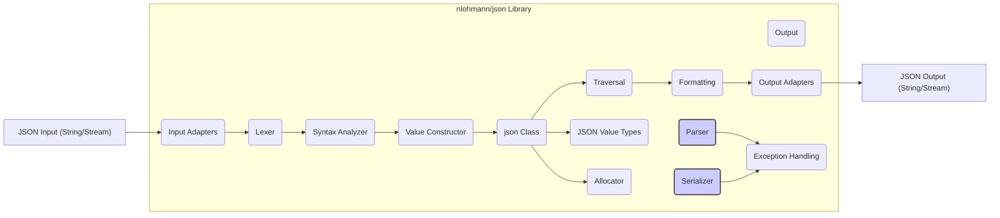
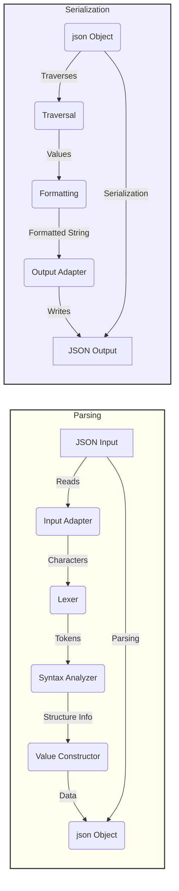

# Project Design Document: nlohmann/json Library

**Version:** 1.1
**Date:** October 26, 2023
**Author:** AI Software Architect

## 1. Introduction

This document provides an enhanced and more detailed design overview of the `nlohmann/json` library, a widely used C++ library for working with JSON (JavaScript Object Notation). Building upon the previous version, this document offers a deeper understanding of the library's architecture, components, and data flow, specifically tailored for effective threat modeling.

## 2. Goals and Objectives

The core goals of the `nlohmann/json` library remain:

* To offer a straightforward and intuitive API for manipulating JSON data within C++ applications.
* To achieve high performance in common JSON operations, particularly parsing and serialization.
* To maintain its status as a header-only library, simplifying integration into C++ projects without complex build processes.
* To provide comprehensive support for the JSON specification, encompassing various data types and structures.
* To be well-documented, promoting ease of use and understanding for developers.

This revised design document aims to provide a granular view of the library's internal workings and its interactions with external entities, thereby strengthening its utility for threat modeling exercises.

## 3. System Architecture

The `nlohmann/json` library's architecture is centered around its header-only nature. Understanding its key components and their interactions is crucial for identifying potential threat vectors.

### 3.1. Key Components (Detailed)

* **`json` Class:** The fundamental building block, representing a JSON value. It internally manages the storage and manipulation of JSON data, supporting types like:
    * Objects (key-value pairs)
    * Arrays (ordered lists of values)
    * Strings (Unicode text)
    * Numbers (integers and floating-point)
    * Booleans (`true` or `false`)
    * Null
    The `json` class provides methods for accessing, modifying, and querying JSON data.
* **Parser:**  Responsible for the process of converting a textual JSON representation (string or input stream) into an in-memory `json` object. This involves:
    * **Lexer (Scanner):**  Breaks the input stream into a sequence of tokens (e.g., `{`, `}`, `:`, `,`, string literals, number literals).
    * **Syntax Analyzer:**  Verifies the order and structure of the tokens according to JSON grammar rules, ensuring the input is valid JSON.
    * **Value Constructor:** Creates the `json` object and populates it with the parsed values based on the token stream.
* **Serializer:** The counterpart to the parser, responsible for transforming a `json` object back into a JSON string or writing it to an output stream. This includes:
    * **Traversal:** Iterating through the internal structure of the `json` object.
    * **Formatting:** Converting each JSON value into its string representation according to JSON syntax (e.g., adding quotes around strings, handling special characters).
    * **Output:** Writing the formatted string to the specified output.
* **Input Adapters:**  Provide an abstraction layer for reading JSON data from various sources. Examples include:
    * Reading from `std::string`.
    * Reading from `std::istream` (e.g., files, network sockets).
    * Potentially custom adapters for specific input formats.
* **Output Adapters:**  Provide an abstraction layer for writing JSON data to different destinations. Examples include:
    * Writing to `std::string`.
    * Writing to `std::ostream` (e.g., files, network sockets).
    * Potentially custom adapters for specific output formats.
* **JSON Value Types (Internal Representation):**  The library uses internal data structures to represent the different JSON value types efficiently. This might involve:
    * `std::map` for JSON objects.
    * `std::vector` for JSON arrays.
    * `std::string` for JSON strings.
    * Numerical types (e.g., `int`, `double`) for JSON numbers.
    * `bool` for JSON booleans.
* **Exception Handling:**  The library employs exceptions to signal errors during parsing, serialization, or when accessing non-existent elements. This allows for robust error management. Specific exception types might indicate different error conditions (e.g., parse error, out-of-range access).
* **Allocator:**  Allows for customization of the memory allocation strategy used by the `json` object. By default, it uses the standard C++ allocator.

### 3.2. Component Diagram (Mermaid)

### 3.3. Data Flow (Detailed)

The data flow within the library can be broken down into more granular steps for both parsing and serialization.

#### 3.3.1. Parsing (Detailed)

1. **JSON Input Acquisition:** The process begins with a JSON string or an input stream being provided to a parsing function (e.g., `json::parse()`).
2. **Input Adaptation:** The appropriate input adapter is selected based on the input type (string or stream). This adapter reads chunks of data from the source.
3. **Lexical Analysis (Tokenization):** The lexer analyzes the input stream character by character, grouping them into meaningful tokens according to JSON syntax (e.g., identifying keywords like `true`, `false`, `null`, delimiters like `{`, `}`, `[`, `]`, `:`, `,`, and literals for strings and numbers).
4. **Syntax Analysis (Parsing):** The syntax analyzer takes the stream of tokens from the lexer and verifies if they conform to the grammar rules of JSON. This stage builds an abstract syntax tree (implicitly or explicitly) representing the JSON structure.
5. **`json` Object Construction:** Based on the validated structure and the identified values, the value constructor creates an instance of the `json` class. It populates the internal data structures (e.g., `std::map`, `std::vector`) with the parsed JSON values, respecting the hierarchy and data types.
6. **Output:** The function returns a fully constructed `json` object representing the parsed JSON data. If parsing fails at any stage, an exception is typically thrown.

#### 3.3.2. Serialization (Detailed)

1. **`json` Object Input:** The serialization process starts with a `json` object that needs to be converted back into its textual representation.
2. **Traversal:** The serializer begins traversing the internal structure of the `json` object, starting from the root. This involves visiting each element (key-value pair in objects, elements in arrays) recursively.
3. **Value Formatting:** For each JSON value encountered during traversal, the serializer formats it into its corresponding JSON string representation:
    * Strings are enclosed in double quotes, with special characters escaped.
    * Numbers are converted to their string representation.
    * Booleans are converted to `"true"` or `"false"`.
    * `null` is converted to `"null"`.
    * Nested objects and arrays are recursively formatted.
4. **Structure Formatting:** The serializer adds the necessary structural elements (e.g., `{`, `}`, `[`, `]`, `:`, `,`) to create a valid JSON string. Indentation and whitespace might be added for readability, depending on the formatting options.
5. **Output Adaptation:** The formatted JSON string is passed to the selected output adapter.
6. **JSON Output Generation:** The output adapter writes the JSON string to the specified destination (string or output stream).

### 3.4. Data Flow Diagram (Mermaid)

## 4. Security Considerations (Enhanced)

A deeper look into potential security vulnerabilities is crucial for threat modeling.

* **Input Validation Vulnerabilities:**
    * **Malformed JSON Exploits:**  Crafted invalid JSON inputs could potentially crash the parser, lead to infinite loops, or cause unexpected behavior due to incomplete or incorrect parsing logic.
    * **Excessive Nesting:** Deeply nested JSON structures could lead to stack overflow errors due to recursive parsing, potentially causing denial of service.
    * **Large Input Strings:** Extremely large JSON strings could exhaust available memory, leading to crashes or denial of service. The library needs to handle memory allocation limits gracefully.
    * **Integer Overflow in Number Parsing:** Parsing very large numerical values could lead to integer overflows if not handled carefully, potentially leading to incorrect data representation or unexpected behavior in subsequent calculations.
    * **Unicode Handling Issues:** Incorrect handling of Unicode characters in JSON strings could lead to vulnerabilities if the application relies on specific character encodings or performs security-sensitive operations on the parsed strings.
* **Resource Exhaustion Attacks:**
    * **CPU Exhaustion:**  Complex or deeply nested JSON structures might require significant CPU time to parse, potentially leading to denial of service.
    * **Memory Exhaustion:**  Parsing very large JSON documents or documents with a large number of unique keys could consume excessive memory.
* **String Handling Vulnerabilities:**
    * **Buffer Overflows:** Although less likely in modern C++ with `std::string`, vulnerabilities could arise in internal string manipulation if not handled carefully, especially in custom allocators or extensions.
    * **Format String Bugs (Less Likely):** While the library primarily handles JSON formatting, if any logging or debugging features use format strings with external input, format string vulnerabilities could be a concern.
* **Exception Handling Issues:**
    * **Information Disclosure:**  Exception messages might inadvertently reveal sensitive information about the system or the structure of the JSON data.
    * **Unhandled Exceptions:**  Failure to properly catch and handle exceptions could lead to program termination or unpredictable behavior.
* **Allocator-Related Vulnerabilities:**
    * **Custom Allocator Weaknesses:** If a custom allocator is used, vulnerabilities in the allocator itself (e.g., double-free, use-after-free) could impact the library's security.

## 5. Dependencies

The `nlohmann/json` library strives for minimal external dependencies, primarily relying on the standard C++ library.

* **Standard C++ Library Components:**
    * **`<string>`:** For handling JSON strings (`std::string`).
    * **`<vector>`:** For representing JSON arrays (`std::vector`).
    * **`<map>`:** For representing JSON objects (`std::map`).
    * **`<stdexcept>`:** For standard exception classes.
    * **`<iostream>`:** For input/output operations (e.g., parsing from streams, serialization to streams).
    * **`<sstream>`:** For string stream operations.
    * **`<limits>`:** For numerical limits.
    * **`<cassert>`:** For assertions (primarily for internal checks).
    * **`<algorithm>`:** For various algorithms.
    * **`<cmath>`:** For mathematical functions.
    * **`<type_traits>`:** For compile-time type information.
    * **`<utility>`:** For utility templates like `std::pair`.

## 6. Deployment Considerations

The header-only nature of `nlohmann/json` simplifies deployment significantly.

* **Direct Inclusion:** Developers simply include the header files (`json.hpp`) in their C++ source code.
* **No Separate Compilation or Linking:**  The library's code is compiled along with the application code. No separate compilation step for the library itself is required, and no explicit linking is necessary.
* **Dependency Management:**  As a header-only library with minimal dependencies, managing dependencies is relatively straightforward. Ensuring the compiler supports the required C++ standard is the main consideration.
* **Usage Scenarios:** The library is used in a wide range of applications, including:
    * **Configuration File Parsing:** Reading and writing application configuration data in JSON format.
    * **Data Exchange:** Serializing and deserializing data for communication between different parts of an application or between different systems (e.g., REST APIs).
    * **Data Storage:**  Representing data structures in JSON format for storage in files or databases.
    * **Web Development (C++ Backends):** Handling JSON requests and responses in web applications.

## 7. Future Considerations

Potential future enhancements and their security implications:

* **Schema Validation Support:** Integrating JSON Schema validation could enhance security by allowing applications to enforce stricter data structures and types, mitigating vulnerabilities related to unexpected input.
* **Asynchronous Parsing/Serialization:**  Introducing asynchronous operations could improve performance but might introduce new concurrency-related security challenges if not implemented carefully.
* **Support for Binary JSON Formats (e.g., CBOR):** Adding support for binary formats could improve performance and reduce data size but might require careful consideration of potential vulnerabilities specific to those formats.
* **Security Hardening Options:** Providing options for stricter parsing rules, resource limits (e.g., maximum nesting depth, maximum string length), or sandboxing mechanisms could enhance security for applications dealing with untrusted JSON data.

## 8. Conclusion

This enhanced design document provides a more in-depth understanding of the `nlohmann/json` library's architecture, data flow, and security considerations. The detailed breakdown of components and processes, along with specific examples of potential vulnerabilities, makes this document a valuable resource for conducting thorough threat modeling activities. By understanding the inner workings of the library, developers can better assess and mitigate potential risks in their applications that utilize `nlohmann/json`.
