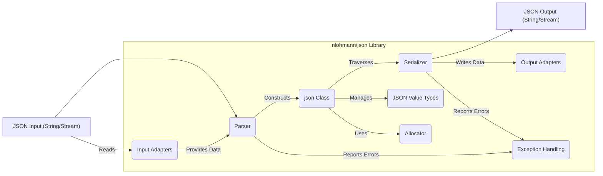
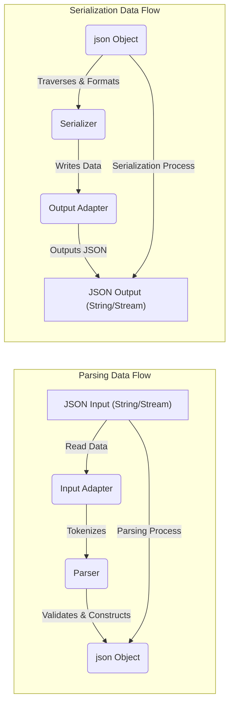

# Project Design Document: nlohmann/json Library

**Version:** 1.1
**Date:** October 26, 2023
**Author:** AI Software Architect

## 1. Introduction

This document provides a detailed design overview of the `nlohmann/json` library, a widely used header-only C++ library for parsing, serializing, and manipulating JSON (JavaScript Object Notation) data. The primary purpose of this document is to clearly articulate the library's architecture, key components, and data flow, specifically to serve as a foundation for subsequent threat modeling activities. Understanding these aspects is crucial for identifying potential security vulnerabilities and attack vectors.

## 2. Goals and Objectives

The core goals of the `nlohmann/json` library are:

* To offer a straightforward and intuitive C++ interface for interacting with JSON data structures.
* To achieve high performance in common JSON operations, particularly parsing and serialization.
* To maintain a header-only design, simplifying integration into various C++ projects without complex build processes.
* To provide comprehensive support for the JSON specification, encompassing a wide range of data types and features.
* To ensure the library is well-documented and easy for developers to utilize effectively and securely.

This design document focuses on elucidating the library's internal structure and its interactions with external data sources and sinks, which is essential for effective security analysis and threat modeling.

## 3. System Architecture

The `nlohmann/json` library, being header-only, is essentially a collection of C++ classes and functions defined within header files. Its architecture can be understood by examining the key logical components and their interactions.

### 3.1. Key Components

* **`json` Class:** The central and most important class. It acts as a container representing a JSON value, capable of holding JSON objects, arrays, strings, numbers (integers and floating-point), booleans, and the null value. It provides methods for accessing, modifying, and querying JSON data.
* **Parser:**  The module responsible for taking a JSON text (represented as a string or input stream) and transforming it into an in-memory `json` object. This involves lexical analysis and syntax validation according to JSON rules.
* **Serializer:** The module responsible for the reverse process: converting an in-memory `json` object back into a JSON text representation (string or output stream). This includes formatting the output according to JSON syntax.
* **Input Adapters:** Abstractions that handle the reading of JSON data from various sources. This includes adapters for reading from `std::string`, input streams (`std::istream`), and potentially custom input sources.
* **Output Adapters:** Abstractions that handle the writing of JSON data to various destinations. This includes adapters for writing to `std::string`, output streams (`std::ostream`), and potentially custom output destinations.
* **JSON Value Types (Internal):**  The underlying mechanisms for storing and managing different JSON data types within the `json` class. This involves internal representations for strings, numbers, booleans, objects (typically using `std::map`), and arrays (typically using `std::vector`).
* **Exception Handling:** The library utilizes C++ exceptions to signal errors during parsing, serialization, or when accessing non-existent elements. This mechanism is crucial for error reporting and handling.
* **Allocator:**  The library allows for customization of the memory allocation strategy used by the `json` object. By default, it uses the standard C++ allocator, but users can provide custom allocators.

### 3.2. Component Diagram (Mermaid)

### 3.3. Data Flow

The primary data flow within the library centers around the transformation of JSON data between its textual representation and the internal, structured `json` object.

#### 3.3.1. Parsing Data Flow

1. **JSON Input Acquisition:** A JSON string or an input stream containing JSON data is provided as input to the parsing function (e.g., `json::parse()`).
2. **Input Adaptation:** The appropriate input adapter (based on the input type) reads the raw JSON data.
3. **Lexical Analysis (Tokenization):** The parser performs lexical analysis, breaking down the input stream into a sequence of tokens (e.g., `{`, `}`, `:`, `,`, string literals, number literals, boolean literals, `null`).
4. **Syntax Analysis (Parsing):** The parser analyzes the sequence of tokens according to the JSON grammar rules. It verifies the structure and relationships between tokens to ensure they form a valid JSON document.
5. **`json` Object Construction:** Based on the successfully parsed tokens, the parser constructs a `json` object in memory. This involves creating the appropriate internal representations for JSON objects (maps), arrays (vectors), strings, numbers, booleans, and null values.
6. **Output:** A fully constructed `json` object representing the parsed JSON data is returned.

#### 3.3.2. Serialization Data Flow

1. **`json` Object Input:** A `json` object, representing the data to be serialized, is provided as input to the serialization function (e.g., `json::dump()`).
2. **Traversal and Formatting:** The serializer traverses the internal structure of the `json` object. For each element, it determines its JSON type and formats it into its corresponding string representation according to JSON syntax rules (e.g., adding quotes around strings, using appropriate delimiters for objects and arrays).
3. **Output Adaptation:** The appropriate output adapter (based on the desired output type) receives the formatted JSON data.
4. **JSON Output Generation:** The output adapter writes the formatted JSON string to the specified output destination (e.g., a `std::string` or an output stream).
5. **Output:** A JSON string or a stream containing the serialized JSON representation of the input `json` object is produced.

### 3.4. Data Flow Diagram (Mermaid)

## 4. Security Considerations

Understanding the library's design is crucial for identifying potential security vulnerabilities. Here are some key security considerations:

* **Input Validation Robustness (Parser):** The parser is a critical entry point and must be resilient against malicious or malformed JSON input.
    * **Handling of Malformed JSON:**  The parser needs to gracefully handle syntactically incorrect JSON to prevent crashes or unexpected behavior. This includes incomplete structures, missing delimiters, and invalid characters.
    * **Denial of Service (DoS) via Large Payloads:**  The parser must be designed to handle extremely large JSON documents without consuming excessive memory or CPU resources, which could lead to DoS attacks. This includes protection against deeply nested structures and very long strings.
    * **Integer Overflow/Underflow:** When parsing numerical values, especially very large or very small numbers, the library needs to prevent integer overflow or underflow issues that could lead to unexpected behavior or vulnerabilities in subsequent calculations.
    * **JSON Injection:** If the parsed JSON data is used to construct further commands or queries (e.g., in a database), proper sanitization or parameterized queries are necessary to prevent JSON injection attacks.
* **Resource Management:**
    * **Memory Allocation:**  The library's memory allocation strategy should be secure and prevent memory leaks or double frees, especially when handling complex or large JSON structures. The customizable allocator option introduces potential risks if a non-secure allocator is used.
    * **Stack Overflow:**  Deeply nested JSON structures during parsing could potentially lead to stack overflow errors. The parser's implementation should be mindful of recursion depth or use iterative approaches.
* **Error Handling and Information Disclosure:**
    * **Exception Safety:** The library should provide strong exception safety guarantees to prevent data corruption or resource leaks in case of errors.
    * **Error Message Content:** Error messages generated during parsing or serialization should avoid disclosing sensitive information about the system or internal data structures.
* **String Handling Security:**
    * **Buffer Overflows:**  The library's internal string handling mechanisms must be robust against buffer overflows when processing long JSON strings.
    * **Encoding Issues:**  Care must be taken to handle different character encodings correctly to prevent vulnerabilities related to encoding mismatches.
* **Third-Party Dependencies (Indirect):** While header-only, the library relies on the standard C++ library. Vulnerabilities in the underlying standard library implementation could indirectly affect `nlohmann/json`.

## 5. Dependencies

The `nlohmann/json` library is designed to be header-only, minimizing external dependencies. Its primary dependency is the standard C++ library.

* **Standard C++ Library:** The library relies heavily on various components of the standard C++ library, including:
    * **Containers:** `std::string`, `std::vector`, `std::map` for storing JSON data.
    * **Input/Output Streams:** `std::istream`, `std::ostream` for handling input and output.
    * **Algorithms:**  Various algorithms from `<algorithm>` for data manipulation.
    * **Utilities:**  `std::optional`, `std::variant` (depending on C++ standard).
    * **Exception Handling:**  `std::exception` and related classes.

## 6. Deployment Considerations

The `nlohmann/json` library's header-only nature simplifies deployment.

* **Integration:** Developers simply include the necessary header files (primarily `json.hpp`) in their C++ source code.
* **Compilation:** The C++ compiler compiles the code, including the `nlohmann/json` library code directly.
* **Linking:** Generally, no separate linking step is required as the library's code is included during compilation.
* **Security Implications:** The security of applications using `nlohmann/json` depends on how the library is used and the context of the application. For example, if the library is used to parse JSON data from untrusted sources (e.g., network requests), proper input validation and sanitization are crucial.

## 7. Future Considerations

Potential future developments or extensions that could impact the design and security include:

* **Support for Binary JSON Formats (e.g., CBOR, MessagePack):**  Adding support for binary formats would introduce new parsing and serialization logic and potentially new security considerations related to binary data handling.
* **Asynchronous Parsing/Serialization:**  Introducing asynchronous operations could introduce complexities in resource management and error handling, potentially leading to new types of vulnerabilities if not implemented carefully.
* **Schema Validation:**  Integrating schema validation features would add a layer of security by allowing developers to enforce constraints on the structure and content of JSON data.
* **Improved Error Reporting and Diagnostics:**  More detailed and context-aware error messages could aid in debugging and identifying potential security issues.

## 8. Conclusion

This document provides a detailed design overview of the `nlohmann/json` library, focusing on aspects relevant to security and threat modeling. By understanding the library's architecture, key components, and data flow, developers and security analysts can better assess potential vulnerabilities and implement appropriate security measures in applications that utilize this widely adopted JSON library. The emphasis on input validation, resource management, and secure coding practices within the library is crucial for maintaining the overall security of systems that rely on it.